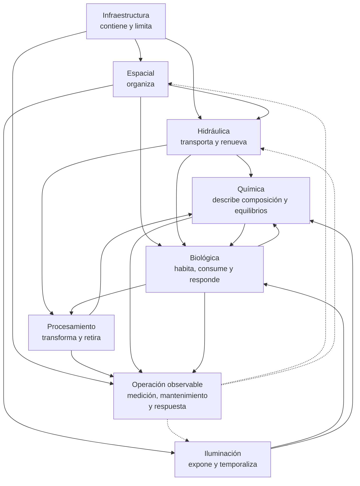

# Dimensiones arquitectónicas del acuario marino

Esta sección reúne las dimensiones arquitectónicas utilizadas para razonar sobre Veril. Este README combina el índice de la sección con el modelo común que define cómo se documentan, aplican y evalúan sus siete dimensiones. No es una especificación formal ni una validación experta del diseño.

Las dimensiones son perspectivas funcionales de un mismo sistema. Cada ficha conserva los criterios generales y la línea de diseño adoptada para Veril, mientras que la configuración concreta, el hardware, los organismos, los productos, los procedimientos pendientes y las operaciones se documentan en sus lugares correspondientes.

## Índice

- [Dimensión de infraestructura](01_infraestructura.md): concretada en un acuario AIO lateral de pequeño volumen, con display, zona técnica, acceso y seguridad
- [Dimensión espacial](02_espacial.md): concretada en la organización funcional del aquascape dentro del display
- [Dimensión hidráulica](03_hidraulica.md): movimiento, renovación, transporte y distribución del agua dentro del sistema
- [Dimensión de iluminación](04_iluminacion.md): espectro, intensidad, fotoperiodo, transiciones y luz lunar
- [Dimensión química](05_quimica.md): composición, equilibrios, transformaciones, medición y estabilidad del agua
- [Dimensión biológica](06_biologica.md): comunidades microbianas, microfauna, algas, corales, peces e invertebrados; concretada en una configuración mixta de arrecife
- [Dimensión de procesamiento](07_procesamiento.md): basada en el método Berlín, con superficie biológica, circulación, skimmer y exportación

## Qué es una dimensión

Una dimensión define qué aspecto del sistema se observa, por qué importa, qué variante se adopta en Veril, cómo se aplicará y qué evidencias permitirán comprobar su funcionamiento.

Una dimensión no es:

- Una ficha de hardware
- Una lista de organismos o productos
- Un procedimiento pendiente
- Una explicación completa de otra dimensión
- Una descripción neutral de todas las alternativas posibles

Las dimensiones combinan un marco conceptual con una línea de diseño concreta. Por tanto, no son completamente genéricas: cada una declara la variante que Veril adopta y conserva únicamente las alternativas necesarias para entender sus límites y compromisos.

## Las siete dimensiones adoptadas

| Dimensión | Pregunta principal | Variante adoptada para Veril |
| --- | --- | --- |
| [Infraestructura](01_infraestructura.md) | ¿En qué envolvente ocurre el sistema? | AIO lateral de pequeño volumen |
| [Espacial](02_espacial.md) | ¿Cómo se organiza el interior del display? | Aquascape funcional con estructura, espacio negativo, gradientes y acceso |
| [Hidráulica](03_hidraulica.md) | ¿Cómo se mueve y se renueva el agua? | Renovación efectiva y distribución real, separando retorno y circulación interna |
| [Iluminación](04_iluminacion.md) | ¿Qué régimen de luz reciben las zonas y los organismos? | LED de amplio espectro, zonificación por PPFD y régimen temporal medido |
| [Biológica](06_biologica.md) | ¿Qué comunidades y organismos se pretende mantener? | Configuración mixta de arrecife |
| [Química](05_quimica.md) | ¿Qué composición y equilibrios presenta el agua? | Interpretación relacional, tendencial y orientada a estabilidad |
| [Procesamiento](07_procesamiento.md) | ¿Cómo se transforma, retiene y retira la materia? | Método Berlín como arquitectura de referencia |

Estas siete dimensiones no son siete sistemas alternativos. Son siete preguntas sobre una única configuración de Veril.

## Cómo se relacionan

La infraestructura contiene y limita el sistema. La dimensión espacial organiza el interior del display. La hidráulica transporta y renueva el agua. La iluminación determina la exposición lumínica. La biología ocupa, consume y responde. La química describe la composición y los equilibrios del agua. El procesamiento transforma, retiene y retira materia.

El diagrama representa relaciones funcionales, no una cadena lineal ni una jerarquía de importancia. Una dimensión puede condicionar a otra sin asumir su responsabilidad. La explicación completa de cada relación pertenece a la ficha de la dimensión que la gobierna.

## Responsabilidad de cada ficha

Cada dimensión debe explicar qué debe tenerse en cuenta, por qué importa para su objeto y cómo se aplicará y evaluará en Veril.

La regla de responsabilidad es:

> Cuando una dimensión menciona otra, solo describe la consecuencia necesaria para su propio objeto. La explicación completa pertenece a la ficha responsable.

Por ejemplo:

- Infraestructura puede mencionar el retorno para definir niveles, parada y seguridad, pero la circulación pertenece a Hidráulica
- Espacial puede mencionar luz y flujo para distribuir zonas, pero sus magnitudes y regímenes pertenecen a Iluminación e Hidráulica
- Hidráulica puede mencionar detritos, gases y organismos para describir transporte y exposición, pero la retirada, la química y los requisitos biológicos pertenecen a sus dimensiones
- Iluminación puede mencionar fotosíntesis y crecimiento para explicar la respuesta a la luz, pero no define la comunidad ni los objetivos químicos
- Biológica puede mencionar espacio, luz, flujo y química para expresar compatibilidad, pero no repite su diseño ni sus valores
- Química puede mencionar biología, procesamiento e intercambio para interpretar la composición resultante, pero no sustituye sus mecanismos
- Procesamiento puede mencionar superficies, circulación, oxígeno y parámetros para explicar la transformación y la exportación, pero no redefine esas dimensiones

## Cómo se adopta una dimensión

Adoptar una dimensión significa fijar una línea de diseño y aceptar sus consecuencias. La ficha debe dejar claro:

1. Qué función organiza
2. Qué variante o referencia se adopta para Veril
3. Qué límites y compromisos introduce
4. Qué decisiones quedan fuera y dónde se documentan
5. Qué observaciones, mediciones o pruebas demostrarán que funciona

La adopción no convierte una etiqueta en una garantía. Utilizar el método Berlín, una configuración mixta o un AIO lateral no demuestra por sí solo capacidad, estabilidad, compatibilidad ni madurez.

## Estados de evaluación

La evaluación debe distinguir tres estados:

| Estado | Pregunta principal |
| --- | --- |
| Nominal | ¿Funciona en la configuración estable prevista? |
| Transición | ¿Sigue siendo interpretable y compatible mientras algo cambia? |
| Perturbación o fallo | ¿Qué margen existe y qué consecuencias produce un fallo previsible? |

En este marco:

- **Estabilidad de estado:** Las variables permanecen dentro de condiciones compatibles
- **Estabilidad funcional:** Las funciones continúan cumpliéndose durante la variación normal
- **Resiliencia:** El sistema absorbe una perturbación o recupera su función
- **Reproducibilidad:** Una configuración produce de nuevo condiciones comparables
- **Margen operativo:** Capacidad disponible antes de alcanzar un límite funcional o de seguridad

Una configuración adecuada no es la que funciona justo en su límite, sino la que conserva margen frente a las variaciones previsibles. Ningún proxy aislado —agua clara, caudal nominal, PPFD elevado, skimmate oscuro, una cifra química o una gran cantidad de roca— constituye por sí solo un criterio de aceptación.

## Operación como capa transversal

La operación no constituye una dimensión arquitectónica. Es la capa mediante la que las dimensiones se observan, miden, prueban, mantienen y modifican. Las actuaciones pendientes utilizan los criterios de las dimensiones, pero no añaden una octava arquitectura.

La temperatura tampoco constituye una dimensión independiente. Su responsabilidad se distribuye así:

- Química: Temperatura del agua como variable de estado y contexto de medición y equilibrio
- Infraestructura: Generación, evacuación y capacidad física de calentamiento o refrigeración
- Hidráulica: Distribución y homogeneización térmica
- Biológica: Compatibilidad del régimen térmico con los organismos

La [configuración de Veril](../../02_configuracion/README.md) aplica este modelo al sistema concreto. Las fichas de parámetros, biología, hardware y las actuaciones pendientes contienen el detalle ejecutable o específico de cada elemento.

## Evidencia y decisiones

Las fuentes se interpretan según su tipo y alcance: evidencia experimental, revisiones o síntesis científica, documentación técnica o de fabricante, práctica consolidada del hobby y síntesis funcional propia.

Cada dimensión debe indicar qué parte respalda una fuente y qué no permite concluir. Los principios desarrollados por esta documentación no deben presentarse como resultados experimentales. Las decisiones de Veril deben distinguirse de la evidencia externa, de las observaciones locales y de los pendientes de ejecución.

## Conflictos entre dimensiones

Las dimensiones pueden imponer requisitos incompatibles. Un aumento de la luz puede elevar el consumo químico o la demanda hidráulica; una estructura espacial puede crear refugios y, al mismo tiempo, dificultar la renovación; una mayor carga biológica puede superar la capacidad de procesamiento o el margen de infraestructura.

Cuando aparezca un conflicto, debe resolverse en este orden:

1. Identificar qué funciones y restricciones están realmente en conflicto
2. Consultar la ficha responsable de cada función, sin resolverlo mediante una regla de otra dimensión
3. Priorizar la seguridad física y el bienestar de los organismos
4. Buscar una solución que conserve margen operativo y sea observable y mantenible
5. Registrar la decisión concreta en `02_configuracion/`, en una ficha propietaria o en la actuación pendiente correspondiente

La solución no consiste en maximizar una dimensión de forma aislada, sino en encontrar una configuración conjunta compatible y demostrable.

La documentación concreta se desarrolla en la [configuración de Veril](../../02_configuracion/README.md), las fichas de hardware, parámetros y organismos, y las actuaciones pendientes. Las dimensiones conservan los criterios necesarios para diseñar, aplicar y evaluar el sistema sin repetir el detalle propietario.
