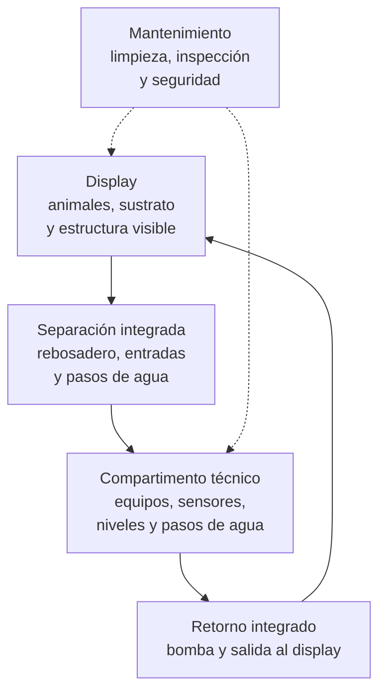

# Dimensión de infraestructura

## Qué es

Esta dimensión de infraestructura se centra en un acuario AIO (*All-in-One*), que es una urna en la que el espacio visible de exhibición y el compartimento técnico forman una única unidad física. El agua sale del display hacia una o varias cámaras integradas, atraviesa los equipos o medios previstos y retorna al display sin depender de un sump inferior externo.

Esta dimensión de infraestructura se concreta en un acuario AIO de pequeño volumen con el compartimento técnico integrado en uno de los laterales de la urna. El concepto AIO se utiliza como marco general, pero el objeto principal de esta ficha es la organización física, las ventajas y las limitaciones de la disposición lateral.

La dimensión de infraestructura define cómo se relacionan el espacio visible, la zona técnica, los límites de agua, los accesos y las superficies de soporte. No define por sí sola el procesamiento, la configuración biológica, la organización espacial del aquascape, el régimen de iluminación, el campo hidráulico ni los equipos concretos que deben instalarse.

Los criterios generales de movimiento, renovación y transporte del agua pertenecen a la [dimensión hidráulica](03_hidraulica.md). Esta dimensión de infraestructura conserva únicamente sus consecuencias sobre niveles, retorno, parada, seguridad y acceso.

La tesis de esta dimensión es:

> En un AIO de pequeño volumen, el compartimento técnico forma parte del diseño de la urna y debe evaluarse como espacio funcional, de mantenimiento y de seguridad, no como un volumen separado del acuario.

Para Veril se adopta como referencia un AIO lateral de pequeño volumen porque las condiciones físicas del sistema integran display y zona técnica en una única urna y hacen especialmente relevante la proporción entre volumen visible, espacio técnico, acceso y reserva de seguridad. Esta línea se aplicará mediante las comprobaciones de volumen funcional, niveles, paradas, accesibilidad e integridad física descritas en esta ficha y en la documentación concreta de la urna.

Dentro del modelo integrado, esta dimensión establece la envolvente, el volumen funcional, los niveles, el acceso y la zona técnica sobre los que trabajan las demás dimensiones. No decide qué organismos mantener ni cómo se comportan la luz, el agua, la química o el procesamiento.

## Principio de funcionamiento

La dimensión divide físicamente el sistema en dos zonas relacionadas:

1. El display, destinado al espacio visible y a los elementos que se alojen en él
2. El compartimento técnico, destinado a equipos, sensores, conexiones y operaciones de mantenimiento

El separador entre ambas zonas debe permitir conducir el agua y mantener aisladas las áreas de trabajo sin convertir la cámara técnica en un espacio inaccesible o imposible de limpiar.

El diagrama representa la relación espacial de las zonas, no un diseño hidráulico obligatorio. La posición de bombas, entradas, salidas, medios y sensores pertenece al diseño concreto de cada urna.

## Elementos estructurales

### Display

El display es la zona visible destinada a alojar los elementos previstos por las dimensiones biológica y espacial. Su volumen útil no debe confundirse con el volumen exterior de toda la urna: el compartimento técnico, el sustrato, la estructura y el margen libre reducen el espacio disponible para los organismos y el agua.

El display debe proporcionar:

- Volumen funcional para el uso previsto
- Superficie suficiente para aplicar la organización espacial definida en su dimensión correspondiente
- Altura y profundidad compatibles con las dimensiones de iluminación, biología, espacial y acceso
- Superficie libre suficiente para observar e intervenir en el sistema
- Margen superior para el movimiento del agua y la prevención de salpicaduras

### Compartimento técnico lateral

El compartimento técnico lateral está integrado en la urna y ocupa una parte fija de su longitud o anchura. Su función es alojar los elementos que no deben permanecer en el espacio visible o que necesitan acceso frecuente.

Puede incluir, según el diseño:

- Entrada o rebosadero desde el display
- Cámaras separadas por tabiques
- Bomba de retorno
- Calentador
- Sensores
- Espacio para los medios definidos en la [dimensión de procesamiento](07_procesamiento.md)
- Dispositivos de reposición
- Cables de alimentación y conducciones con rutas de salida protegidas

La cámara técnica no debe considerarse espacio sobrante. Cada equipo o medio que se introduzca reduce el volumen libre, modifica el acceso y puede alterar los niveles o la facilidad de limpieza. La función de procesamiento de esos elementos se documenta en la [dimensión de procesamiento](07_procesamiento.md).

### Separador integrado

El separador define la frontera física entre el display y la zona técnica. Debe permanecer estable y estanco donde corresponda, conservar su geometría y permitir únicamente los pasos de agua previstos. También debe evitar que los animales, el sustrato o los fragmentos del aquascape ocupen las cámaras de forma no controlada.

Sus perforaciones, rejillas, ranuras o pasos deben evaluarse físicamente por:

- Área efectiva de entrada y salida
- Facilidad de limpieza
- Riesgo de obstrucción
- Riesgo de atrapamiento de animales
- Accesibilidad para inspección
- Integridad y seguridad durante una parada o una variación del nivel

El efecto de esos pasos sobre el campo de flujo y la renovación del agua se documenta en la [dimensión hidráulica](03_hidraulica.md).

### Cámaras técnicas

Las cámaras pueden distribuir funciones diferentes, pero su número no define por sí solo la calidad de la arquitectura. Una separación adicional solo resulta útil si facilita el control, el mantenimiento o la seguridad.

Cada cámara debe tener una función identificable, un nivel operativo comprensible y un acceso suficiente para retirar el equipo o el material que contiene.

Cada tabique debe justificar si separa funciones, fija un nivel, dirige el recorrido hidráulico, reduce burbujas o protege un equipo. Un tabique sin una función definida consume volumen y acceso sin aportar necesariamente valor.

### Retorno integrado

El retorno devuelve el agua desde la zona técnica al display mediante una bomba o un mecanismo equivalente. Su salida debe poder mantenerse, limpiarse y protegerse frente a obstrucciones o aspiración de aire. El rendimiento hidráulico del retorno pertenece a la [dimensión hidráulica](03_hidraulica.md).

La dimensión debe prever el volumen que puede retornar por gravedad o retrosifonado cuando la bomba se detiene y garantizar que ese volumen pueda ser recibido sin desbordamiento.

En muchas configuraciones AIO, especialmente cuando el retorno ocupa la última cámara del recorrido, la arquitectura debe prever qué nivel puede variar y qué equipos dependen de él. La relación entre evaporación, retorno y renovación se documenta en la [dimensión hidráulica](03_hidraulica.md); aquí se conservan las consecuencias sobre volumen operativo, acceso y seguridad.

### Base, soporte y margen de seguridad

La urna y el soporte deben transmitir la carga de forma estable y mantener la geometría de los vidrios, separadores y uniones. La base debe permanecer nivelada y apoyada conforme a las condiciones estructurales del fabricante o del diseño.

También deben existir márgenes para:

- Desplazamiento por roca, sustrato y equipos
- Oleaje o movimiento superficial
- Volumen de retrosifonado
- Margen libre superior
- Evaporación antes de la reposición
- Salpicaduras y acumulación de sal
- Acceso a cables, tubos y conexiones
- Retirada segura de equipos

## Espacio, acceso y mantenimiento

En un AIO de pequeño volumen, el espacio técnico suele ser limitado. La colocación de un equipo puede impedir la extracción de otro, ocultar un sensor o crear una zona donde se acumule materia sin acceso suficiente.

El diseño debe evaluarse por su mantenimiento real:

- Puede retirarse cada equipo sin desmontar la urna
- Puede limpiarse cada cámara sin introducir las manos en zonas peligrosas
- Puede observarse el nivel de agua de cada zona
- Puede accederse a entradas, salidas y sensores
- Puede retirarse el material acumulado
- Puede aislarse o desconectarse un equipo durante una intervención
- Puede localizarse una obstrucción sin vaciar el sistema

La accesibilidad es una propiedad arquitectónica. No debe tratarse como una comodidad secundaria que se resolverá después de instalar todos los equipos.

## Elementos compatibles, pero no obligatorios

La arquitectura AIO admite distintos elementos, pero su presencia no define una configuración concreta de comunidad ni un método de procesamiento.

### Medios de filtración

Puede reservar espacio para medios mecánicos, químicos o biológicos si existe acceso y una función documentada. La función y la evaluación de esos medios pertenecen a la [dimensión de procesamiento](07_procesamiento.md); aquí solo se comprueban su volumen, acceso y compatibilidad física con la cámara.

### Reposición automática

Puede utilizarse para compensar la evaporación en una cámara de retorno. Su depósito, sensor y sistema de seguridad deben situarse de forma que un fallo no pueda añadir un volumen peligroso de agua ni provocar un desbordamiento. La respuesta de la salinidad se documenta en la [dimensión química](05_quimica.md).

### Sensores y control

Los sensores pueden medir temperatura, nivel, calidad del agua u otras variables. Deben colocarse en zonas representativas y mantenerse accesibles, sin confundir la capacidad de medir con la capacidad de corregir una desviación. Las variables y su interpretación pertenecen a las dimensiones correspondientes.

### Iluminación externa o suspendida

Puede colocarse sobre el display sin formar parte del compartimento técnico. La infraestructura debe soportar su instalación y permitir retirarla para acceder a la urna; su régimen y sus sombras se documentan en las [dimensiones de iluminación](04_iluminacion.md) y [espacial](02_espacial.md).

### Equipos externos

Bombas, depósitos, controladores o conducciones pueden situarse fuera de la urna. Su presencia no deja de formar parte de la instalación física, pero debe diferenciarse entre lo integrado en el AIO y lo añadido externamente.

## Variantes de referencia

La disposición lateral se compara aquí con otras configuraciones únicamente para delimitar sus consecuencias físicas.

### AIO con compartimento técnico posterior

La zona técnica ocupa una franja a lo largo de la parte trasera. Permite mantener un display frontal continuo, pero puede reducir la profundidad útil y dificultar el acceso a los equipos si la urna está próxima a una pared.

### AIO con compartimento técnico en esquina

La zona técnica ocupa una parte lateral y posterior. Puede aprovechar mejor una geometría compacta, pero concentra pasos de agua, equipos y zonas de difícil acceso.

### AIO con equipamiento externo complementario

Conserva el compartimento técnico integrado, pero añade equipos o depósitos fuera de la urna. La instalación deja de estar completamente contenida, aunque mantiene la arquitectura AIO del cuerpo principal.

## Fortalezas, debilidades y críticas

### Fortalezas conocidas

- Integra display y zona técnica en una sola unidad física
- Reduce la necesidad de un sump inferior externo
- Puede simplificar la instalación en espacios pequeños
- Oculta parte del equipamiento desde la vista principal
- Permite concentrar entradas, retornos y sensores en una zona accesible
- Reduce el número de recipientes y conexiones estructurales independientes

### Debilidades conocidas

- El compartimento técnico resta volumen útil al display y al agua
- El acceso limitado puede dificultar la limpieza y la retirada de equipos
- La evaporación puede modificar rápidamente el nivel de la cámara de retorno
- Una obstrucción puede afectar a una parte importante del sistema integrado
- El calor, el ruido y las vibraciones quedan más próximos al display
- La ampliación de equipos está limitada por el espacio disponible
- La separación física no elimina la necesidad de proteger cables, conexiones y equipos frente al agua
- La integración no garantiza que las cámaras tengan una función clara o que sean fáciles de mantener
- La cámara de retorno puede tener un volumen pequeño, por lo que la evaporación puede llevar rápidamente a aspiración de aire, ruido o pérdida de caudal si el nivel no se repone

### Críticas habituales de sus detractores

- **Menor capacidad de ampliación**: Se critica que una zona técnica integrada ofrece menos espacio para equipos y medios que un sump externo
- **Mantenimiento más incómodo**: Se señala que las cámaras estrechas pueden dificultar la extracción, limpieza e inspección
- **Volumen útil inferior**: Se considera que la dimensión exterior puede exagerar el espacio realmente disponible para animales y agua
- **Dependencia de una frontera común**: Se advierte que un problema en el separador, las entradas o el retorno puede afectar simultáneamente al display y a la zona técnica
- **Ruido y calor concentrados**: Se cuestiona que los equipos integrados queden demasiado cerca de la zona visible y de los animales

Estas críticas dependen de la geometría, la fabricación, el acceso y la instalación concretos. No todos los diseños AIO presentan el mismo grado de limitación.

### Opiniones extendidas

| Opinión extendida | Qué expresa | Lectura técnica |
| --- | --- | --- |
| «Un AIO es un acuario sin sump» | La diferencia visible frente a una urna con sump inferior | Es cierto que no necesita un sump externo, pero sí tiene una zona técnica integrada con funciones equivalentes parciales |
| «La cámara técnica es espacio perdido» | La percepción de que todo el volumen debe estar en el display | La cámara reduce el display, pero proporciona espacio para equipos, entradas, retornos y control |
| «Más cámaras siempre es mejor» | La asociación entre compartimentación y calidad | Las cámaras solo aportan valor si sus funciones, niveles y mantenimiento están definidos |
| «El AIO es más sencillo» | La reducción de conducciones y depósitos externos | Puede simplificar la instalación, pero no elimina los problemas de acceso, nivel, limpieza o seguridad |
| «Un AIO pequeño admite cualquier equipo compacto» | La confianza en reducir dimensiones sin revisar funciones | El equipo debe caber, poder retirarse, trabajar con el nivel disponible y no bloquear otros elementos |

## Perspectivas propias de la dimensión de infraestructura AIO

Los siguientes puntos son una lectura funcional de esta dimensión elaborada para esta documentación, no una síntesis directa de fuentes externas ni una lista de resultados experimentales.

### La cámara técnica como espacio de servicio

La cámara técnica no debe evaluarse solo por cuántos equipos caben en ella. Su valor depende de que permita intervenir, observar y devolver el sistema a un estado seguro después del mantenimiento.

### La frontera display-técnica como punto crítico

El separador, las entradas y el retorno concentran relaciones hidráulicas y estructurales. Deben evaluarse como una frontera común, porque una obstrucción o una variación de nivel puede afectar a ambas zonas.

### Contención frente a ampliación

La arquitectura AIO favorece una instalación contenida, pero limita el espacio de ampliación. Cada decisión de equipo debe considerar no solo su función inmediata, sino el espacio que ocupa y las intervenciones futuras que impedirá o facilitará.

### Volumen exterior frente a volumen funcional

La capacidad de un AIO no debe estimarse solo con las dimensiones exteriores. Deben distinguirse:

- Volumen geométrico bruto
- Volumen geométrico del display
- Volumen geométrico técnico
- Volumen operativo de agua
- Volumen desplazado
- Reserva hidráulica para parada

## Ventajas y compromisos frente a otras dimensiones

La comparación se limita a la organización de la infraestructura del sistema y no evalúa métodos de procesamiento o configuraciones de comunidad.

| Dimensión de infraestructura de referencia | Ventaja relativa del AIO lateral | Compromiso del AIO lateral |
| --- | --- | --- |
| Urna con sump inferior externo | Instalación más contenida y menor dependencia de un mueble técnico separado | Menos espacio técnico y menor capacidad de ampliación |
| AIO posterior | Puede ofrecer acceso lateral y conservar una mayor profundidad frontal | Reduce la longitud visible y concentra la zona técnica en un extremo |
| Urna sin compartimento técnico integrado | Permite ocultar y organizar parte del equipamiento sin recurrir necesariamente a un recipiente externo | Consume parte del volumen interno y de la longitud útil del display |

La elección depende del espacio disponible, el acceso, el volumen funcional y la necesidad de ampliación. Ninguna disposición física es superior en todos los casos.

## Aplicación en un sistema de aproximadamente 75 litros

Los 75 litros se utilizan aquí como referencia de escala, no como un umbral universal para definir un sistema pequeño. En esta escala, la arquitectura AIO lateral debe priorizar la proporción entre display, cámara técnica y acceso de mantenimiento.

### Criterios de diseño

- Mantener un display suficiente para el uso previsto
- Reservar una cámara técnica capaz de alojar y retirar los equipos necesarios
- Evitar que la instalación bloquee entradas, retornos o sensores
- Mantener un margen seguro para el agua que se desplace durante una parada
- Mantener un margen de nivel operativo que permita la función segura de los equipos, conforme a la [dimensión hidráulica](03_hidraulica.md)
- Separar los equipos que generan calor, ruido o vibración cuando sea posible
- Dejar acceso para limpiar las cámaras sin desmontar el aquascape
- Considerar el volumen de agua real y no solo el volumen exterior

### Compromisos de escala

En esta escala, una cámara técnica sobredimensionada reduce rápidamente el display, mientras que una cámara demasiado pequeña puede impedir el mantenimiento o la ampliación. La proporción no debe fijarse por una cifra universal: depende del equipo, del nivel operativo, del acceso y del uso previsto.

El bajo volumen también reduce el margen ante evaporación, parada, obstrucciones, calentamiento y errores de mantenimiento. La [dimensión hidráulica](03_hidraulica.md) documenta el comportamiento del agua; esta dimensión conserva sus consecuencias sobre la seguridad física, el acceso y la capacidad de intervención.

### Evaluación operativa

Antes de aceptar el montaje deben comprobarse:

- Recorrido físico compatible con los niveles previstos y sin desbordamientos
- Acceso a las cámaras de trabajo y a los elementos que fijan sus niveles
- Volumen suficiente para recibir el agua que vuelva durante una parada
- Prueba de arranque desde parada: comprobar que, después de una parada y del asentamiento de niveles, la bomba puede reiniciarse sin quedarse seca, generar una bolsa de aire persistente o alterar los niveles de las demás cámaras
- Extracción de cada equipo sin desmontar la urna
- Acceso a entradas, salidas, sensores y cables
- Ausencia de zonas permanentes de acumulación inaccesible
- Funcionamiento sin vibraciones o ruido excesivos atribuibles a la instalación física

## Qué no es esta dimensión

Un AIO:

- No es un método de filtración
- No define la configuración de la comunidad
- No garantiza un volumen útil concreto por sus dimensiones exteriores
- No equivale a un sump externo, aunque pueda alojar funciones técnicas similares
- No elimina la necesidad de equipos, mantenimiento o seguridad eléctrica
- No permite colocar cualquier equipo compacto sin comprobar su funcionamiento y acceso
- No resuelve por sí mismo la circulación, el intercambio gaseoso ni la estabilidad del sistema
- No convierte el compartimento técnico en un refugio, un medio biológico o una zona de exportación por su mera presencia

## Errores comunes al aplicarla

- Contar el volumen técnico como si fuera espacio de display para los animales
- Llenar la cámara hasta impedir retirar o limpiar los equipos
- No prever el agua que vuelve al compartimento técnico durante una parada
- Colocar sensores en zonas que no representan el nivel o las condiciones del sistema
- Bloquear entradas o retornos con medios, cables o fragmentos de sustrato
- Instalar equipos sin comprobar su profundidad de trabajo y su extracción
- Dejar conexiones eléctricas expuestas a salpicaduras o recorridos de agua
- Confundir más cámaras con más capacidad funcional
- No mantener acceso a las zonas de acumulación de residuos
- Diseñar el aquascape sin considerar el acceso lateral al compartimento técnico

## Función durante el montaje, el ciclado y las transiciones

La dimensión de infraestructura debe estar resuelta antes de llenar y poblar el sistema. El montaje debe permitir comprobar niveles, recorridos, paradas y mantenimiento sin depender de que los animales ya estén presentes.

Durante el ciclado y la maduración deben comprobarse:

- Evolución de los niveles en cada cámara
- Integridad y accesibilidad de entradas y retornos
- Acceso a los equipos y superficies
- Respuesta ante una parada eléctrica
- Efecto de la evaporación sobre la cámara de retorno

Una transición de equipos o medios puede cambiar el espacio libre, el nivel operativo, el calor, el ruido o la ruta del agua. Debe evaluarse como una modificación de la organización física y no como una simple sustitución de hardware.

## Cómo evaluar la dimensión en funcionamiento

### Integridad física

- Unión estable entre display y compartimento técnico
- Separadores adheridos y sin deformación o desprendimiento
- Pasos hidráulicos íntegros y libres de obstrucción
- Base y soporte nivelados
- Ausencia de fugas o deformaciones observables

### Funcionamiento espacial

- Display suficiente para su uso previsto
- Cámaras accesibles y con función identificable
- Equipos extraíbles sin desmontar la urna
- Cables y conducciones ordenados y protegidos

### Seguridad de niveles y paradas

- Entrada y retorno sin obstrucciones
- Capacidad para recibir el volumen de retrosifonado durante una parada
- Margen frente a salpicaduras y desbordamientos
- Niveles comprensibles y estables

### Mantenimiento

- Limpieza posible en todas las cámaras
- Retirada de residuos sin herramientas improvisadas
- Sensores visibles y accesibles
- Intervenciones que no obliguen a manipular innecesariamente a los animales

## Indicadores que pueden inducir a error

No demuestran por sí solos que la dimensión de infraestructura AIO esté bien resuelta:

- Que todos los equipos quepan físicamente
- Que el agua circule durante unos minutos
- Que la urna no desborde en condiciones normales
- Que la cámara técnica quede oculta desde el frente
- Que el display parezca grande por sus dimensiones exteriores
- Que una bomba funcione sin comprobar su extracción y mantenimiento
- Que no haya ruido durante una observación breve
- Que una cámara esté llena de medios o equipos

La aceptación debe basarse en pruebas de funcionamiento, mantenimiento, parada y acceso.

## Resumen funcional

| Aspecto | Función o criterio |
| --- | --- |
| Tipo de dimensión | Arquitectura física e infraestructura del sistema |
| Variante adoptada | AIO lateral de pequeño volumen |
| Unidad física | Display y zona técnica como una sola urna |
| Display | Espacio visible para los elementos previstos por las dimensiones biológica y espacial |
| Zona técnica | Entrada, cámaras, equipos, sensores y retorno |
| Frontera crítica | Separador, pasos de agua y retorno |
| Criterio principal | Volumen funcional, acceso y seguridad demostrados |
| Escala de referencia | Aproximadamente 75 litros, sin convertir la cifra en un requisito universal |
| Compromiso principal | Contención de la instalación frente a espacio técnico y ampliación |
| Riesgo principal | Pérdida de accesibilidad y volumen funcional por saturación de la zona técnica |
| Unidad de evaluación | Sistema físico completo durante uso, parada y mantenimiento |

## Apéndice: denominación y alcance

### Origen de la denominación

«AIO» procede de *All-in-One* y se utiliza en el comercio y en la acuariofilia para describir urnas que incorporan una zona técnica en el propio cuerpo del acuario. El término no constituye una norma dimensional ni define una distribución única de cámaras.

### Variación del uso

Un AIO puede tener la zona técnica detrás, en un lateral, en una esquina o en una configuración modular. La disposición lateral analizada aquí debe distinguirse de esas variantes porque modifica la longitud visible del display, la distribución del aquascape y el acceso a la zona técnica.

Las variantes posterior y en esquina sirven como referencias de comparación, pero no forman parte del objeto principal de esta ficha.

### Uso en esta documentación

«Acuario AIO lateral de pequeño volumen» designa aquí una arquitectura física, no una marca, un método de filtración ni una configuración de comunidad.

## Fuentes y límites de la evidencia

- [Red Sea, «MAX S Aquarium Flow Dynamics Overview»](https://g1.redseafish.com/wp-content/uploads/2015/11/2761-MAX-S-written-Manual_EN_DE_FR_v2019a-for-web.pdf): Manual de fabricante que documenta la relación entre display, cámara trasera, rebosadero, retorno, evaporación, reposición automática y nivel de la cámara de bomba. Describe un modelo concreto y no establece una regla universal para todos los AIO
- [Fluval, «Fluval Sea Evo 52 L Manual»](https://fluvalaquatics.com/manuals/fluval-10531-evo-aquarium13.5g-manual-eng-na.pdf): Manual de fabricante que muestra la función del compartimento de filtración trasero y advierte de no bloquear la entrada hacia él. No define criterios generales de dimensionado AIO
- [Waterbox Aquariums, «AIO Manuals»](https://help.waterboxaquariums.com/en-US/aio-manuals-311986): Índice de manuales de instalación y funcionamiento de modelos AIO. Sirve como referencia de documentación específica de fabricante, no como norma común para la arquitectura

Estas fuentes respaldan la existencia y el funcionamiento de cámaras técnicas integradas, así como la importancia de los niveles, la evaporación, los rebosaderos, el retorno y el acceso al mantenimiento. No existe una proporción universal entre display y cámara técnica ni una especificación única para todos los acuarios AIO. Las dimensiones, los equipos, los niveles y las comprobaciones deben documentarse para cada urna concreta.
