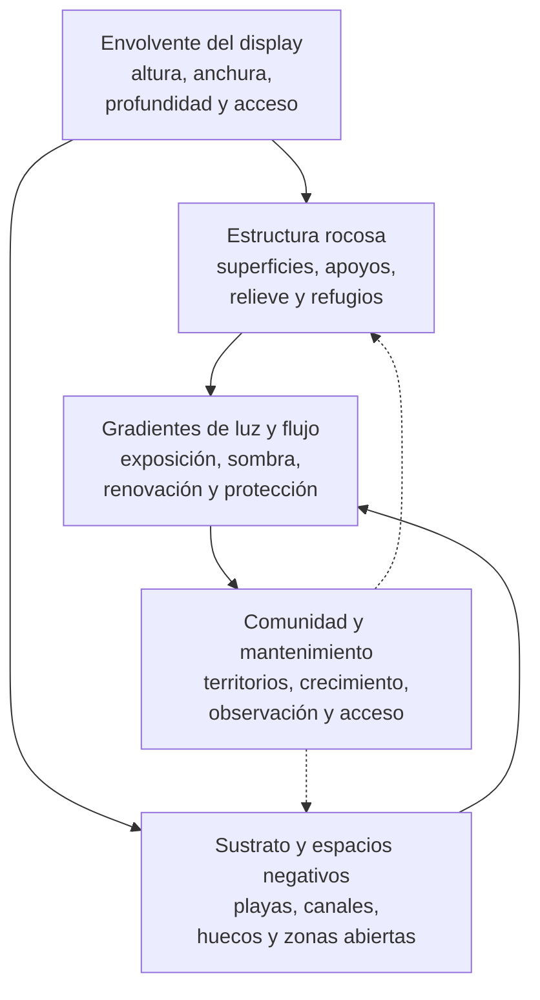

# Dimensión espacial

## Qué es

Esta dimensión espacial de un acuario de arrecife es la organización intencionada del espacio interior del display mediante roca, sustrato, superficies, huecos, refugios y zonas abiertas. En la acuariofilia marina suele describirse mediante el término *aquascape*, pero no se limita a la apariencia de la composición.

El aquascape distribuye las superficies que pueden colonizarse, los espacios de nado, los territorios, los refugios, las zonas de luz y las rutas por las que el agua puede desplazarse. También condiciona la observación, la acumulación de detritos, el crecimiento de los organismos y el acceso para el mantenimiento.

Esta dimensión no define una forma universal, una cantidad fija de roca, una granulometría concreta, una intensidad de luz ni una pauta única de circulación. Organiza relaciones espaciales que deben resolverse de acuerdo con la urna, la comunidad, el procesamiento del sistema y las condiciones de mantenimiento.

La tesis de esta dimensión es:

> El aquascape no es una decoración añadida al acuario, sino la estructura espacial que distribuye superficies, organismos, flujo, luz, refugios y acceso dentro del display.

Para Veril se adopta una organización espacial funcional basada en estructura estable, espacio negativo, gradientes, refugios utilizables, crecimiento previsible y acceso suficiente. Esta línea se elige para que el aquascape pueda sostener la configuración biológica y servir de soporte a las demás dimensiones; su aplicación concreta se comprueba mediante la ficha [espacial de Veril](../../02_veril/02_espacial.md) y las evaluaciones del sistema.

Dentro del modelo integrado, esta dimensión organiza el interior del display. La infraestructura fija sus límites; la hidráulica, la iluminación y la biología determinan cómo se utilizan y evalúan sus zonas.

## Principio de funcionamiento

Un aquascape funcional transforma un volumen abierto en un conjunto de zonas relacionadas. La estructura debe ofrecer suficiente complejidad para sostener superficies y refugios, pero conservar espacios abiertos que permitan el movimiento del agua, el comportamiento de los animales y la intervención del cuidador.

La dimensión espacial coordina varias funciones, sin sustituir a las dimensiones que describen sus efectos:

1. Proporcionar superficies estables y colonizables
2. Separar o conectar zonas de exposición y protección
3. Crear refugios, territorios y rutas de escape
4. Mantener espacios de nado y superficies de sustrato
5. Habilitar rutas potenciales para el agua y la intervención
6. Conservar acceso visual y físico para observar y modificar el sistema

El diagrama representa dependencias espaciales. No prescribe una composición estética ni sustituye al diseño concreto de una urna.

## Elementos estructurales

### Envolvente espacial del display

La [dimensión de infraestructura](01_infraestructura.md) establece las dimensiones, niveles, paredes, zona técnica y accesos de la urna. Desde la dimensión espacial interesa qué parte del display queda realmente disponible para organizar la composición y qué límites físicos condicionan su lectura, estabilidad y mantenimiento.

La composición debe considerar:

- Superficies de visión y puntos de observación
- Espacio interior que queda después de descontar la zona técnica y los márgenes de acceso
- Distancia funcional a cristales, accesos y elementos técnicos
- Espacio que ocuparán el sustrato, la roca y el crecimiento futuro

El volumen geométrico de la urna no equivale al espacio funcional del aquascape. La infraestructura define el volumen disponible; esta dimensión determina cómo se distribuye espacialmente.

### Estructura rocosa

La roca o el material estructural principal aporta relieve, apoyos y superficies. Su valor espacial no depende únicamente de la cantidad utilizada, sino de cómo distribuye altura, profundidad, refugios, zonas expuestas y espacios abiertos.

Debe evaluarse por:

- Estabilidad de los apoyos
- Superficie disponible para colonización, refugio o asentamiento; la renovación y la retirada se comprueban en las dimensiones hidráulica y de procesamiento
- Distribución del relieve
- Resistencia al desplazamiento y al colapso
- Compatibilidad con el sustrato y el vidrio
- Posibilidad de retirar o modificar piezas sin desmontar toda la composición

La estructura no debe depender de la presión del sustrato ni de la presencia futura de organismos para permanecer estable.

### Sustrato

El sustrato define una parte del plano inferior del display y puede aportar superficie ocupable y colonizable, continuidad visual, zonas de excavación o áreas de transición entre masas rocosas. No debe confundirse con un soporte estructural salvo que un diseño concreto documente esa función y sus riesgos.

Su arquitectura comprende:

- Distribución general y zonas libres
- Profundidad y transición entre áreas
- Relación con los apoyos de la roca
- Compatibilidad con el comportamiento previsto del sustrato; su desplazamiento se comprueba en la [dimensión hidráulica](03_hidraulica.md)
- Accesibilidad para observar y mantener la superficie; la retirada de materia pertenece a la [dimensión de procesamiento](07_procesamiento.md)
- Compatibilidad con los organismos que lo ocuparán

Una zona de sustrato puede ser visualmente abierta y funcional sin tener la misma profundidad en todo el display.

### Espacio negativo

El espacio negativo es la parte deliberadamente no ocupada por roca u otros elementos permanentes. Puede formar playas, canales, corredores visuales, zonas de nado, separaciones entre territorios y áreas de acceso.

No es un residuo del diseño. Su función no depende de permanecer visualmente vacío, sino de no estar ocupado permanentemente por estructura rígida. Debe poder explicarse por al menos uno de estos motivos:

- Permitir el movimiento de los animales
- Mantener una ruta de flujo
- Separar masas o territorios
- Facilitar la observación
- Facilitar el transporte, la localización o la retirada de materia
- Conservar una zona de intervención

Un aquascape saturado puede aumentar la superficie aparente y reducir al mismo tiempo su funcionalidad espacial.

### Refugios, huecos y territorios

Los huecos, grietas, voladizos y pasos modifican la relación entre los animales y la estructura. Pueden ofrecer refugio, zonas de descanso, límites territoriales o superficies protegidas, pero también crear espacios inaccesibles y depósitos de detritos.

Cada refugio debe evaluarse por:

- Tamaño y accesibilidad para el organismo previsto
- Grado de observación o inspección necesario para su función y mantenimiento
- Renovación del agua
- Riesgo de atrapamiento
- Posibilidad de renovación o retirada de residuos
- Cambios que producirá el crecimiento de los organismos

Más refugios no implica automáticamente mayor calidad espacial. Su valor depende de que sean utilizables y mantenibles.

### Superficies funcionales

Las superficies pueden ser horizontales, inclinadas, verticales, expuestas, protegidas, próximas al sustrato o situadas en zonas altas. La diversidad de orientaciones permite distribuir organismos con necesidades distintas, pero también crea diferentes niveles de acumulación y mantenimiento.

La superficie debe evaluarse espacialmente junto con:

- Posición respecto a las zonas de luz y flujo, cuyas magnitudes pertenecen a las dimensiones de [iluminación](04_iluminacion.md) e [hidráulica](03_hidraulica.md)
- Distancia respecto a otras colonias
- Acceso para inspección y limpieza
- Trayectoria previsible de crecimiento

Una superficie disponible no es necesariamente una superficie adecuada para cualquier organismo.

## Relación con otras dimensiones

La dimensión espacial no fija la iluminación ni la circulación. Define las posiciones, obstáculos, superficies y espacios abiertos sobre los que actúan la [dimensión de iluminación](04_iluminacion.md) y la [dimensión hidráulica](03_hidraulica.md). La respuesta real de cada zona debe evaluarse en esas dimensiones y en relación con la [dimensión biológica](06_biologica.md).

La composición debe permitir que puedan existir gradientes, sin exigir condiciones uniformes en todo el display:

- Zonas expuestas y zonas protegidas
- Flujo directo y flujo difuso
- Superficies altas y bajas
- Áreas iluminadas y sombreadas
- Espacios abiertos y refugios

La distribución espacial debe considerar la comunidad prevista antes de ocupar el volumen disponible. Sus necesidades de nado, asentamiento, crecimiento, separación y refugio participan en la distribución inicial, pero la selección y compatibilidad de los organismos pertenecen a la [dimensión biológica](06_biologica.md).

## Accesibilidad, acumulación y mantenimiento

El aquascape influye en dónde pueden quedar ocultas las acumulaciones y en qué zonas puede intervenir el cuidador. La hidráulica determina el transporte y la deposición; el procesamiento determina las rutas de retirada. Esta dimensión define si la geometría deja esas zonas localizables y accesibles.

El diseño debe permitir:

- Observar las superficies y los espacios inferiores
- Localizar playas, canales y huecos donde puedan acumularse residuos
- Limpiar los cristales alrededor de la estructura
- Acceder a las zonas próximas a entradas y retornos
- Retirar piezas o equipos cuando sea necesario
- Revisar apoyos y uniones sin deshacer toda la composición

La accesibilidad es una función espacial, no una decisión posterior al montaje.

## Elementos compatibles, pero no obligatorios

### Fondos y paneles

Un fondo o panel puede ocultar elementos técnicos, controlar la visión posterior o reforzar la lectura de profundidad. No sustituye a una estructura estable ni debe cerrar rutas de acceso o circulación.

### Pegamentos y sistemas de unión

Los adhesivos, morteros, varillas y otros sistemas de unión pueden aumentar la estabilidad o permitir composiciones más complejas. Su uso debe responder a una función estructural definida, permitir la inspección de los puntos críticos y asumir explícitamente qué partes dejarán de ser reversibles.

### Estructuras artificiales

Las estructuras artificiales pueden aportar geometría, refugios o superficie colonizable. Su presencia no determina por sí sola la calidad del aquascape; deben evaluarse por estabilidad, compatibilidad, accesibilidad y comportamiento a largo plazo.

### Elementos móviles

Algunas piezas pueden dejarse móviles para facilitar cambios o adaptación. La movilidad solo es compatible con la arquitectura si no compromete la estabilidad, el bienestar de los animales ni la seguridad del sistema.

## Variantes habituales

### Composición abierta

Prioriza el espacio negativo, los corredores visuales y el acceso. Puede ofrecer buena observación y mantenimiento, aunque una reducción excesiva de la masa estructural puede limitar el número de refugios cerrados y superficies disponibles.

### Composición masiva

Concentra un volumen elevado de estructura y superficies. Puede generar relieve y refugios abundantes, pero aumenta el riesgo de saturación, acumulación de detritos y dificultad de intervención.

### Composición en islas

Distribuye varias masas separadas por espacios abiertos. Puede facilitar territorios y gradientes, pero exige resolver la continuidad visual, la estabilidad de cada masa y la circulación entre ellas.

### Composición con corredor

Conserva una ruta longitudinal o transversal alrededor de la estructura. Puede conservar una ruta potencial para el movimiento de los animales y la renovación del agua, aunque su función hidráulica depende del campo de flujo real y puede perderse si queda bloqueado por el crecimiento.

### Composición vertical

Utiliza la altura para crear niveles y superficies diferenciadas. Debe mantener apoyos seguros, acceso a las zonas altas y margen para el crecimiento sin acercar excesivamente la estructura a la superficie.

## Fortalezas, debilidades y críticas

### Fortalezas conocidas

- Permite distribuir espacialmente superficies, refugios, territorios y zonas abiertas
- Puede condicionar o habilitar gradientes de luz y flujo dentro del mismo display
- Facilita adaptar la comunidad a distintas orientaciones y niveles
- Puede mejorar la observación, el mantenimiento y la capacidad de modificación cuando conserva espacio negativo funcional
- Permite anticipar el crecimiento y la transformación futura de la comunidad

### Debilidades conocidas

- La estructura ocupa volumen que deja de estar disponible para el agua y el movimiento de los animales
- Una composición demasiado densa puede dificultar la circulación, la observación y la retirada de residuos
- Las zonas protegidas pueden convertirse en depósitos inaccesibles de materia
- El crecimiento de los organismos puede cerrar pasos, unir territorios y modificar los gradientes iniciales
- La estabilidad puede depender de apoyos, uniones o superficies que no se observan fácilmente
- Las decisiones visuales pueden entrar en conflicto con el acceso, el flujo o el espacio de nado

### Críticas habituales de sus detractores

- **Predominio estético**: Se critica que el aquascape se diseñe para la fotografía o la exposición visual antes que para el funcionamiento del sistema
- **Complejidad innecesaria**: Se cuestiona que añadir huecos, terrazas y estructuras aumente la superficie sin demostrar una función espacial, biológica o de mantenimiento
- **Pérdida de volumen útil**: Se señala que una gran masa de roca reduce el espacio de agua y de nado
- **Dificultad de mantenimiento**: Se advierte que las composiciones densas ocultan detritos y dificultan la limpieza
- **Falsa naturalidad**: Se objeta que imitar una formación de arrecife no garantiza reproducir sus relaciones ecológicas ni su funcionamiento

Estas críticas no afectan por igual a todas las composiciones. Dependen de la geometría, la escala, la comunidad, el acceso y el mantenimiento previsto.

### Opiniones extendidas

| Opinión extendida | Qué expresa | Lectura técnica |
| --- | --- | --- |
| «Más roca siempre es mejor» | La asociación entre superficie, biodiversidad y capacidad | La superficie útil depende de su colonización, acceso, circulación y función espacial |
| «Un aquascape bonito es un aquascape funcional» | La identificación entre resultado visual y rendimiento | La apariencia puede coexistir con problemas de acceso, flujo o acumulación |
| «El espacio vacío es espacio desaprovechado» | El rechazo de playas, canales y zonas abiertas | El espacio negativo puede ser necesario para nado, circulación, observación y mantenimiento |
| «Los refugios profundos siempre benefician a los animales» | La asociación entre complejidad y bienestar | Un refugio solo aporta valor si es utilizable, observable y compatible con la renovación del agua |
| «La composición inicial permanecerá estable» | La consideración del aquascape como una estructura estática | El crecimiento, las incorporaciones y el mantenimiento pueden cambiar sus funciones |

## Perspectivas propias de la dimensión espacial

Los siguientes puntos son una lectura funcional de esta dimensión elaborada para esta documentación, no una síntesis directa de fuentes externas ni una lista de resultados experimentales.

### El espacio negativo como función

El espacio no ocupado debe considerarse una reserva funcional para el movimiento, la circulación, la observación, el crecimiento y la intervención. Su valor no puede medirse solo por la cantidad de roca que se ha evitado utilizar.

### La geometría como capacidad futura

La capacidad espacial del aquascape no es solo la que existe el día del montaje. También incluye la posibilidad de que los organismos crezcan, que los territorios cambien y que el cuidador pueda intervenir sin desmontar la estructura.

La reserva de espacio para crecimiento es una forma de capacidad, aunque no esté ocupada durante el montaje inicial.

### El gradiente como alternativa a la uniformidad

La distribución de gradientes solo aporta valor cuando las diferencias son accesibles, mantenibles y coherentes con la comunidad prevista.

### La accesibilidad como criterio de diseño

Una estructura que no puede observarse, limpiarse o modificarse pierde parte de su capacidad funcional aunque sea estable y visualmente atractiva.

### El aquascape como organización espacial transitoria

La composición inicial debe evaluarse como una configuración que cambiará con la colonización, el crecimiento, la acumulación de materia y las intervenciones. Diseñar para una imagen fija puede reducir la capacidad del sistema para adaptarse.

## Aplicación en un sistema de pequeño volumen

En un sistema pequeño, cada decisión espacial representa una fracción mayor del display y deja menos margen para corregir errores sin desmontar la composición.

### Prioridades específicas

- Conservar espacio de nado y zonas abiertas reconocibles
- Evitar que la estructura bloquee el acceso a cristales, entradas o retornos
- Mantener refugios utilizables sin crear cavidades inaccesibles
- Dejar espacio para el crecimiento de los organismos
- Distribuir la roca y el sustrato sin comprometer la estabilidad
- Conservar rutas potenciales de renovación de agua alrededor y, cuando proceda, a través de la estructura
- Permitir retirar piezas sin alterar toda la composición

### Compromisos de escala

En una urna pequeña, aumentar la masa de roca puede reducir simultáneamente el volumen de agua, el espacio de nado, la accesibilidad y la capacidad de modificar la composición. La proporción entre estructura y espacio negativo debe evaluarse en términos funcionales y no mediante una cantidad universal de roca.

El crecimiento tiene un efecto proporcionalmente mayor: una colonia, una pieza desplazada o una acumulación de detritos puede cerrar una ruta o eliminar una zona abierta significativa.

### Evaluación operativa

Antes de aceptar la composición deben comprobarse:

- Estabilidad de las masas sin depender del sustrato
- Acceso suficiente a las superficies de mantenimiento y a las zonas previsibles de acumulación
- Continuidad de los espacios negativos previstos
- Renovación del agua alrededor y debajo de la estructura
- Ausencia de puntos de atrapamiento previsibles
- Compatibilidad entre altura, margen superior y mantenimiento
- Posibilidad de retirar o modificar piezas sin desmontar el conjunto
- Capacidad de conservar funciones después del crecimiento previsto

## Qué no es esta dimensión

Un aquascape:

- No es una lista de rocas, productos o formas estéticas
- No define por sí solo el método de procesamiento del sistema
- No sustituye a la dimensión de infraestructura de la urna
- No determina por sí solo la compatibilidad de la comunidad
- No garantiza una circulación adecuada por el mero hecho de tener huecos
- No convierte toda superficie en superficie biológica funcional
- No demuestra estabilidad porque la composición parezca inmóvil durante una observación breve
- No permanece estático después del montaje

## Errores comunes al aplicarla

- Diseñar la estructura sin considerar el crecimiento de los organismos
- Apoyar masas inestables sobre el sustrato y confiar en que no se moverán
- Llenar el display hasta eliminar el espacio negativo funcional
- Crear refugios que no pueden observarse ni limpiarse
- Bloquear entradas, retornos o zonas de circulación con la estructura
- Acercar la roca a los cristales hasta impedir la limpieza
- Confundir una superficie iluminada con una superficie adecuada para cualquier organismo
- No dejar margen para retirar piezas o equipos
- Diseñar la composición solo desde una vista frontal
- Evaluar la estabilidad, el flujo o el acceso únicamente antes de incorporar organismos

## Función durante el montaje, el ciclado y las transiciones

La dimensión espacial debe resolverse antes de poblar el sistema, pero no se considera terminada hasta comprobar su estabilidad, acceso y comportamiento con agua en movimiento.

Durante el montaje y el ciclado deben comprobarse:

- Estabilidad de la estructura en seco y con agua
- Relación entre roca, sustrato y superficies de apoyo
- Espacios abiertos y accesos previstos alrededor y debajo de las masas
- Posibles zonas ocultas de acumulación, cuya dinámica se comprobará en la [dimensión hidráulica](03_hidraulica.md) y en la [de procesamiento](07_procesamiento.md)
- Acceso a cristales, entradas, retornos y equipos, según los límites de la [dimensión de infraestructura](01_infraestructura.md)
- Capacidad de modificar la composición sin perder estabilidad

Durante las transiciones, una incorporación, un crecimiento o la retirada de una pieza puede cambiar la distribución de luz, flujo, refugios, territorios y espacio de nado. Debe evaluarse como una modificación de la dimensión espacial.

## Cómo evaluar la dimensión en funcionamiento

### Estabilidad

- Las masas permanecen estables durante el mantenimiento y el movimiento normal del agua
- Los apoyos no dependen de una capa móvil de sustrato
- No existen apoyos o concentraciones puntuales de carga capaces de dañar el vidrio
- Las piezas pueden inspeccionarse y retirarse de forma controlada

### Espacio funcional

- Existen zonas de nado, refugio y separación identificables
- El espacio negativo conserva una función observable
- La estructura no bloquea permanentemente el acceso o la visión
- El crecimiento previsto no elimina de inmediato las zonas esenciales

### Relación con hidráulica e iluminación

- La geometría deja rutas potenciales para la renovación y el acceso a las superficies
- La estructura permite distribuir zonas de exposición y protección sin imponer una uniformidad espacial
- La altura y la orientación ofrecen posiciones que pueden evaluarse mediante las dimensiones de hidráulica e iluminación
- Las condiciones observadas son compatibles con los organismos previstos, según la dimensión biológica

### Mantenimiento y evolución

- Pueden localizarse las acumulaciones y acceder a ellas sin desmontar el aquascape completo
- La limpieza de cristales sigue siendo posible
- Las modificaciones pueden realizarse sin perder la estabilidad
- La composición conserva funciones reconocibles después de cambios y crecimiento

## Indicadores que pueden inducir a error

No demuestran por sí solos que la dimensión espacial esté bien resuelta:

- Que la composición parezca natural o equilibrada desde una sola vista
- Que haya mucha roca o muchas cavidades
- Que el agua se mueva en la superficie
- Que no se observen detritos durante una inspección breve
- Que la estructura no se haya desplazado todavía
- Que todas las superficies reciban luz
- Que la composición se haya inspirado en un arrecife natural
- Que los organismos ocupen rápidamente todos los huecos

La aceptación debe basarse en estabilidad, acceso, espacios funcionales, capacidad de evolución y compatibilidad con las condiciones hidráulicas, lumínicas, biológicas y de procesamiento que se comprobarán en sus dimensiones correspondientes.

## Resumen funcional

| Aspecto | Función o criterio |
| --- | --- |
| Tipo de dimensión | Organización espacial del display mediante un aquascape funcional |
| Variante adoptada | Estructura estable, espacio negativo, gradientes, refugios y acceso funcional |
| Elementos principales | Roca, sustrato, superficies, espacios negativos, refugios y territorios |
| Función espacial | Distribuir espacio de nado, colonización, luz, flujo, refugio y acceso |
| Principio de diseño | Complejidad funcional sin saturar el display |
| Elemento clave | Equilibrio entre estructura y espacio negativo funcional |
| Criterio principal | Estabilidad, accesibilidad y funciones espaciales demostradas |
| Restricción principal | Volumen disponible y evolución previsible de la composición |
| Riesgo principal | Perder espacio funcional por densidad, crecimiento o acumulación inaccesible |
| Unidad de evaluación | Composición completa durante uso, mantenimiento y evolución |

## Apéndice: uso del término aquascape

### Origen y uso

*Aquascape* es un término de uso internacional que combina la idea de acuario con la de composición de paisaje. En el ámbito marino se utiliza para describir la disposición visual y funcional de roca, sustrato y espacios dentro del display.

El término no constituye una norma técnica, una forma única de composición ni una garantía de funcionamiento. Su significado puede abarcar desde una descripción estética hasta un diseño espacial con criterios de estabilidad, circulación, hábitat y mantenimiento.

### Uso en esta documentación

Esta documentación utiliza «dimensión espacial» para destacar que el aquascape se evalúa como una organización funcional del espacio interior, no solo como una composición visual.

## Fuentes y límites de la evidencia

- [Eric H. Borneman, *Aquarium Corals: Selection, Husbandry, and Natural History*](https://books.google.com/books?id=1QtJAAAAYAAJ): Referencia de identificación y mantenimiento de corales que relaciona formas de crecimiento, superficies, luz y movimiento del agua. No define una composición única para acuarios domésticos
- [Saltcorner, «Living Marine Aquarium Manual»](https://www.saltcorner.com/LMAM/TOC.php): Recurso técnico divulgativo que trata roca, sustrato, aquascaping, estabilidad y mantenimiento. Se utiliza como referencia de prácticas extendidas del hobby, no como evidencia experimental de una composición óptima

Estas fuentes se utilizan para el contexto de formas de crecimiento, roca, sustrato y prácticas de aquascape. La organización basada en espacio negativo, accesibilidad, crecimiento futuro y reversibilidad es una síntesis funcional de esta documentación, no una conclusión experimental de esas fuentes. No existe una composición universal válida para todas las comunidades.
