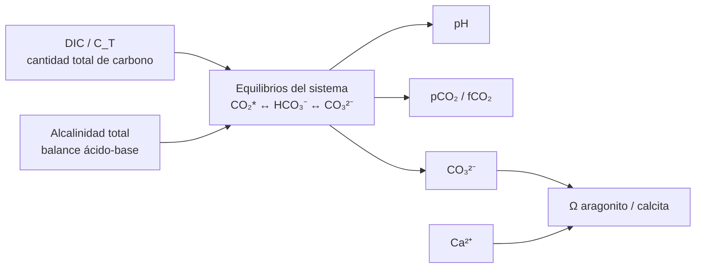

# Sistema carbonato

## Qué es y qué mide

El sistema carbonato describe el conjunto de equilibrios entre el CO₂ disuelto —habitualmente agrupando el CO₂ acuoso y el H₂CO₃ como **CO₂***—, bicarbonato y carbonato en el agua marina. Se relaciona con el pH, la alcalinidad total, el carbono inorgánico disuelto, la presión parcial o fugacidad de CO₂ y el estado de saturación respecto a minerales de carbonato cálcico.

El **carbono inorgánico disuelto**, DIC o `C_T`, representa la suma del carbono presente principalmente como CO₂*, bicarbonato y carbonato:

```text
C_T = [CO₂*] + [HCO₃⁻] + [CO₃²⁻]
```

El DIC describe cuánto carbono inorgánico contiene el agua; el pH y los equilibrios ácido-base determinan cómo se distribuye entre sus distintas especies. Cantidad total y especiación no son la misma propiedad.

Las magnitudes principales del sistema son:

- **pH:** Estado ácido-base en las condiciones y el momento de la medición
- **Alcalinidad total (TA):** Balance de aceptores y donantes de protones que expresa la capacidad ácido-base definida para la muestra
- **DIC o `C_T`:** Cantidad total de carbono inorgánico disuelto
- **pCO₂ o fCO₂:** Estado del CO₂ del agua y su relación con el intercambio gaseoso, expresado como presión parcial o fugacidad
- **Bicarbonato y carbonato:** Especies que participan en los equilibrios y pueden calcularse o medirse mediante métodos apropiados
- **Estado de saturación (Ω):** Condición termodinámica respecto a una fase mineral concreta

## Qué aporta y por qué importa

El sistema carbonato permite interpretar conjuntamente pH, alcalinidad, DIC y CO₂, en lugar de tratarlos como cifras independientes. Condiciona:

- La distribución entre CO₂*, bicarbonato y carbonato
- La disponibilidad relativa de carbonato para la calcificación
- La interpretación de las variaciones diarias de pH
- El efecto del CO₂ ambiental, la fotosíntesis y la respiración
- La relación entre consumo calcificante, alcalinidad y DIC
- La posible sobresaturación respecto a aragonito o calcita

La relación general puede representarse como:



## Inventario y especiación

La cantidad total de carbono inorgánico y su distribución entre CO₂*, bicarbonato y carbonato son propiedades diferentes. Dos muestras pueden contener cantidades semejantes de DIC y presentar distribuciones distintas entre especies si difieren en alcalinidad, pH, temperatura o salinidad.

Por ello, un cambio de pH no implica necesariamente un cambio equivalente en la cantidad total de carbono inorgánico. Añadir CO₂ puede aumentar el DIC y reducir el pH; eliminar CO₂ puede reducir el DIC y elevarlo; añadir un alcalinizante modifica principalmente la alcalinidad y redistribuye el sistema según su composición y las reacciones posteriores.

## Niveles orientativos

No existe un único estado del sistema carbonato que pueda evaluarse sin conocer la salinidad, la temperatura, los organismos y el régimen de intercambio gaseoso. En un acuario de arrecife se interpretan habitualmente pH y alcalinidad junto con la tendencia de consumo, mientras que DIC, pCO₂, fCO₂ y Ω suelen requerir instrumentación o cálculos específicos.

Los rangos de cada magnitud deben consultarse en sus fichas correspondientes:

- [pH](ph.md)
- [Alcalinidad](alcalinidad.md)
- [Calcio](calcio.md)
- [Magnesio](magnesio.md)
- [Temperatura](temperatura.md)
- [Salinidad](salinidad.md)

## Cambios característicos del sistema

Las siguientes relaciones son idealizadas y sirven como marco diagnóstico, no como balance completo de un acuario real:

| Proceso | DIC | Alcalinidad | Efecto habitual sobre pH |
| --- | ---: | ---: | --- |
| Entrada de CO₂ | Aumenta | Aproximadamente sin cambio | Disminuye |
| Salida de CO₂ | Disminuye | Aproximadamente sin cambio | Aumenta |
| Fotosíntesis | Disminuye | Pequeño o dependiente del metabolismo de nutrientes | Aumenta |
| Respiración | Aumenta | Pequeño o dependiente del metabolismo de nutrientes | Disminuye |
| Precipitación de CaCO₃ | Disminuye aproximadamente 1 mol por mol precipitado | Disminuye aproximadamente 2 equivalentes por mol | Tiende a reducir la capacidad carbonatada |
| Disolución de CaCO₃ | Aumenta aproximadamente 1 mol por mol disuelto | Aumenta aproximadamente 2 equivalentes por mol | Efecto inverso |
| Nitrificación | Efecto dependiente del conjunto de reacciones | Disminuye | Puede contribuir a disminuirlo |

A primera aproximación, el intercambio entre fotosíntesis y respiración modifica principalmente DIC y pH sin alterar sustancialmente la alcalinidad por el simple intercambio de CO₂. La asimilación y transformación de nutrientes pueden introducir cambios adicionales de alcalinidad.

La alcalinidad es especialmente útil como variable diagnóstica porque el intercambio simple de CO₂ cambia principalmente DIC y pH, mientras que la calcificación, la disolución y determinados procesos del nitrógeno afectan también a la alcalinidad. Por eso, «el pH bajó pero la alcalinidad no» describe una situación potencialmente distinta de «el pH y la alcalinidad están descendiendo».

## Calcificación, precipitación y estado de saturación

En la idealización de precipitación de carbonato cálcico, cada mol de CaCO₃ formado reduce aproximadamente el DIC en 1 mol y la alcalinidad total en 2 equivalentes. La disolución produce el cambio contrario.

Para una fase mineral concreta, el estado de saturación puede expresarse como:

```text
Ω = [Ca²⁺] × [CO₃²⁻] / Ksp*
```

De forma general:

- **Ω > 1:** Sobresaturación termodinámica respecto a la fase indicada
- **Ω = 1:** Saturación
- **Ω < 1:** Subsaturación

Ω describe una condición termodinámica relativa a una fase mineral concreta, no una velocidad de precipitación ni una garantía de calcificación. Que la precipitación ocurra realmente depende también de cinética, nucleación, superficies, inhibidores y biología.

Debe especificarse la fase mineral: `Ω_arag` y `Ω_calc` no son idénticos porque aragonito y calcita tienen productos de solubilidad diferentes. En un arrecife, el aragonito suele ser especialmente relevante, pero no debe sustituirse una fase por otra sin indicarlo.

El calcio participa directamente en el estado de saturación junto con el carbonato. El magnesio modifica la química de precipitación y la estabilidad o cinética de los minerales carbonatados, pero no debe interpretarse como equivalente al calcio dentro de Ω.

Una combinación que aumente la concentración de carbonato y el estado de sobresaturación —por ejemplo, pH y alcalinidad elevados en presencia de calcio suficiente— puede aumentar la propensión a la precipitación abiótica. Su ocurrencia real depende también de la cinética, las superficies, la temperatura, el magnesio y otras condiciones.

## Fuentes y comportamiento

El sistema puede cambiar por:

- Intercambio de CO₂ con la atmósfera
- Fotosíntesis y respiración
- Nitrificación y descomposición
- Calcificación y disolución
- Cambios de agua
- Adiciones de bicarbonato, carbonato, hidróxido, CO₂ u otros sistemas de suplementación, cuyos efectos sobre TA, DIC y pH dependen de su composición y de las reacciones posteriores
- Variaciones de temperatura, salinidad y presión

Una adición de alcalinidad no implica necesariamente añadir inicialmente la misma cantidad de carbono inorgánico. Por ejemplo, un aporte de hidróxido aumenta la alcalinidad y posteriormente puede incorporar CO₂ del sistema al DIC mediante reequilibrio.

El pH de una muestra puede cambiar por redistribución de especies sin que el inventario total de DIC cambie de la misma manera. Del mismo modo, un pH estable no demuestra que el CO₂, la alcalinidad y el DIC estén constantes.

La presión forma parte de las condiciones termodinámicas de los cálculos. En acuarios domésticos someros, la variación hidrostática suele ser pequeña, mientras que la presión atmosférica puede ser relevante en cálculos de intercambio y saturación gaseosa.

La salinidad afecta a las constantes, las actividades, el calcio, el borato y los productos de solubilidad. Los cálculos del sistema carbonato no deben reutilizarse tras un cambio significativo de salinidad sin actualizar esa condición.

El pCO₂ del aire que intercambia con el agua establece una condición de contorno importante. En un espacio cerrado, un pCO₂ ambiental elevado puede mantener un pH inferior aun con una alcalinidad normal.

## Qué pasa si está bajo o alto

El sistema carbonato no tiene un único estado «alto» o «bajo». Puede haber, por ejemplo, pH bajo con alcalinidad normal por acumulación de CO₂, o pH alto con alcalinidad elevada y riesgo de precipitación.

La interpretación debe identificar qué magnitud ha cambiado y separar:

- Cambios de inventario de carbono
- Cambios de distribución entre especies
- Cambios de intercambio gaseoso
- Cambios de consumo, producción o precipitación
- Cambios de alcalinidad por metabolismo o transformaciones químicas

## Cómo se mide y calcula

- Medición directa de pH con electrodo calibrado y escala documentada
- Titulación de alcalinidad
- Medición instrumental o análisis de laboratorio de DIC o `C_T`
- Medición o estimación de CO₂, pCO₂ o fCO₂ mediante métodos apropiados, distinguiendo concentración disuelta de presión parcial o fugacidad
- Cálculo de especiación y saturación mediante modelos como CO2SYS, con datos de entrada adecuados

El sistema puede resolverse mediante un par apropiado de magnitudes independientes —por ejemplo TA y DIC, TA y pH u otras combinaciones admitidas— junto con temperatura, salinidad, presión y las constantes químicas correspondientes. No todos los pares son igual de independientes ni tienen la misma incertidumbre.

Los cálculos deben respetar la escala de pH utilizada —total, seawater, free u otra— y no tratar lecturas de escalas distintas como directamente intercambiables.

## Limitaciones de la medición

El sistema carbonato se calcula o interpreta a partir de varias magnitudes que deben ser compatibles en escala, temperatura, salinidad, unidad, presión y momento de muestreo. Una combinación de datos incorrectos puede producir un resultado aparentemente preciso pero químicamente incoherente.

La alcalinidad total no es simplemente bicarbonato más dos veces carbonato. En agua de mar incluye contribuciones de otras especies ácido-base, como borato, y términos adicionales. En cálculos de alta precisión, fosfato, silicato y otras contribuciones pueden formar parte de las entradas o correcciones del modelo.

Los cálculos de especiación no sustituyen la calidad de las mediciones de entrada. CO2SYS no corrige datos defectuosos ni resuelve por sí solo problemas de escala, unidades, calibración o muestreo.

Un cambio de temperatura puede modificar el pH y la especiación al alterar las constantes de equilibrio incluso sin añadir o retirar carbono o alcalinidad. Si además cambia el intercambio gaseoso, también puede modificarse el inventario de DIC.

El estado de saturación tampoco demuestra por sí solo que un organismo calcifique, crezca o se encuentre sano.

## Mecanismos de regulación

El sistema carbonato puede modificarse mediante el control del intercambio de CO₂, la estabilidad de la alcalinidad, cambios de agua, métodos equilibrados de aporte de calcio y alcalinidad y la reducción de causas de precipitación o consumo excesivo.

Los efectos de los suplementos dependen de su composición. Bicarbonato, carbonato, hidróxido, reactores de calcio, CO₂ y agua de cal no son operaciones químicamente equivalentes aunque puedan influir sobre las mismas variables finales.

La regulación concreta de cada magnitud pertenece a sus fichas respectivas. No debe corregirse el pH de forma aislada sin comprobar alcalinidad, CO₂, temperatura, salinidad y tendencia.

## Interpretación y respuesta

Antes de intervenir conviene registrar pH y alcalinidad con métodos comparables y relacionarlos con temperatura, salinidad, horario, ventilación, actividad fotosintética, respiración y consumo calcificante.

La combinación pH-alcalinidad resulta más informativa que cualquiera por separado porque permite distinguir, al menos parcialmente, cambios dominados por CO₂ de cambios que afectan a la reserva alcalina. Una muestra aireada con aire interior y otra con aire exterior pueden aportar una prueba diagnóstica conceptual sobre la influencia relativa del CO₂ ambiental si temperatura, alcalinidad y procedimiento están controlados.

## Cómo evaluar el sistema carbonato

- Medir pH y alcalinidad con métodos y escalas documentados
- Conocer temperatura y salinidad en el momento de las mediciones
- Realizar las mediciones en momentos comparables
- Registrar el consumo de alcalinidad cuando sea relevante
- Calcular DIC, pCO₂ o fCO₂ solo a partir de entradas compatibles
- Especificar si Ω corresponde a aragonito o calcita
- Acompañar todo resultado calculado de sus entradas, constantes y condiciones
- Interpretar los cambios respecto a respiración, fotosíntesis, ventilación, calcificación, disolución y dosificación

## Qué no es el sistema carbonato

El sistema carbonato:

- No es únicamente el pH
- No es únicamente la alcalinidad o KH
- No es una receta para mantener una alcalinidad elevada
- No implica que una Ω mayor produzca automáticamente más calcificación
- No permite estimar CO₂ de forma fiable a partir de datos incompatibles
- No demuestra estabilidad a partir de una única medición
- No sustituye las fichas propietarias de pH, alcalinidad, calcio, magnesio o salinidad

## Errores comunes

- Interpretar un pH bajo como prueba de alcalinidad baja
- Añadir un buffer para corregir un problema dominado por CO₂
- Confundir DIC con CO₂ disuelto
- Interpretar la alcalinidad como concentración de bicarbonato
- Calcular Ω sin temperatura, salinidad o calcio apropiados
- Usar dos magnitudes medidas en momentos diferentes para resolver el sistema
- Mezclar escalas de pH
- Considerar Ω > 1 como demostración de precipitación
- Tratar CO2SYS como si corrigiera datos defectuosos

## Qué no demuestra una lectura aislada

Un pH o una alcalinidad dentro de un rango orientativo no demuestran por sí solos que el sistema carbonato sea estable, que exista suficiente carbonato para un organismo concreto o que no haya riesgo de precipitación.

Una medición aislada tampoco permite separar de forma fiable un cambio de DIC, una redistribución de especies, una variación de alcalinidad o una modificación del intercambio gaseoso.

## Terminología

| Expresión | Qué representa |
| --- | --- |
| CO₂* | Agrupación habitual de CO₂ acuoso y H₂CO₃ |
| DIC o `C_T` | Carbono inorgánico disuelto total: CO₂*, HCO₃⁻ y CO₃²⁻ |
| Alcalinidad total (TA) | Balance ácido-base definido para la muestra, con contribuciones del sistema carbonato y otras especies |
| pCO₂ | Presión parcial de CO₂ |
| fCO₂ | Fugacidad de CO₂, relacionada con su comportamiento termodinámico real |
| Especiación | Distribución del DIC entre CO₂*, bicarbonato y carbonato |
| Ω | Estado de saturación respecto a una fase mineral concreta |
| Ω_arag | Estado de saturación respecto a aragonito |
| Ω_calc | Estado de saturación respecto a calcita |

## Fuentes

- [Dickson, Sabine y Christian: Guide to Best Practices for Ocean CO₂ Measurements](https://doi.org/10.3334/CDIAC/otg.CO2_guide), Definiciones, escalas y métodos del sistema carbonato marino
- [NOAA OCADS](https://www.ncei.noaa.gov/products/ocean-carbon-acidification-data-system), Datos y métodos oceanográficos de pH, CO₂, alcalinidad y carbono inorgánico disuelto
- [Zeebe y Wolf-Gladrow: CO₂ in Seawater](https://shop.elsevier.com/books/co2-in-seawater-equilibrium-kinetics-isotopes/zeebe/978-0-444-50946-8), Referencia académica sobre equilibrio, alcalinidad, escalas de pH y química del CO₂ en agua de mar
- [ReefCalcs: Calculadora de CO₂, pH y alcalinidad](https://reefcalcs.com/calculators/co2-ph/), Herramienta práctica de interpretación para acuarios
