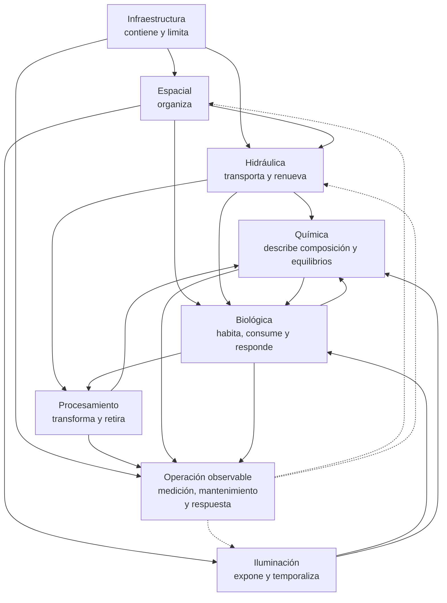

# Dimensiones arquitectónicas del acuario marino

Esta sección reúne las dimensiones utilizadas para entender y diseñar Veril. Cada una ofrece una perspectiva funcional de un mismo sistema: explica qué aspecto se observa, por qué importa y cómo se concreta en el acuario.

Las dimensiones no son fichas de hardware, listas de organismos ni procedimientos de mantenimiento. La configuración concreta, los productos, los organismos, las actuaciones pendientes y las operaciones se documentan en sus secciones correspondientes.

## Dimensiones

- [Dimensión de infraestructura](01_infraestructura.md): Envolvente física, display, zona técnica, acceso y seguridad
- [Dimensión espacial](02_espacial.md): Organización funcional del aquascape dentro del display
- [Dimensión hidráulica](03_hidraulica.md): Movimiento, renovación, transporte y distribución del agua
- [Dimensión de iluminación](04_iluminacion.md): Espectro, intensidad, fotoperiodo, transiciones y luz lunar
- [Dimensión química](05_quimica.md): Composición, equilibrios, transformaciones, medición y estabilidad del agua
- [Dimensión biológica](06_biologica.md): Comunidades microbianas, microfauna, algas, corales, peces e invertebrados
- [Dimensión de procesamiento](07_procesamiento.md): Método Berlín, superficie biológica, circulación, skimmer y exportación

## Las siete dimensiones de Veril

| Dimensión | Pregunta principal | Aplicación general en Veril |
| --- | --- | --- |
| [Infraestructura](01_infraestructura.md) | ¿En qué envolvente ocurre el sistema? | AIO lateral de pequeño volumen |
| [Espacial](02_espacial.md) | ¿Cómo se organiza el interior del display? | Aquascape funcional con estructura, espacio negativo, gradientes y acceso |
| [Hidráulica](03_hidraulica.md) | ¿Cómo se mueve y se renueva el agua? | Renovación efectiva y distribución real, separando retorno y circulación interna |
| [Iluminación](04_iluminacion.md) | ¿Qué régimen de luz reciben las zonas y los organismos? | LED de amplio espectro, zonificación por PPFD y régimen temporal medido |
| [Biológica](06_biologica.md) | ¿Qué comunidades y organismos se pretende mantener? | Configuración mixta de arrecife |
| [Química](05_quimica.md) | ¿Qué composición y equilibrios presenta el agua? | Interpretación relacional, tendencial y orientada a estabilidad |
| [Procesamiento](07_procesamiento.md) | ¿Cómo se transforma, retiene y retira la materia? | Método Berlín como arquitectura de referencia |

Estas dimensiones no son siete sistemas alternativos. Son siete preguntas sobre una única configuración de Veril y se condicionan entre sí: la infraestructura limita el espacio disponible, el espacio afecta al flujo y a la luz, la biología consume y responde, y la química y el procesamiento reflejan cómo funciona el conjunto.

El diagrama muestra relaciones funcionales, no una cadena lineal ni una jerarquía de importancia. La operación aparece como una capa transversal porque permite observar, medir, mantener y modificar el sistema, pero no constituye una dimensión adicional.

La documentación concreta se desarrolla en la [configuración de Veril](../../02_configuracion/README.md), las fichas de hardware, parámetros y organismos, las [actuaciones pendientes](../../03_pendientes/README.md) y las [operaciones](../../04_operaciones/README.md). Esta sección conserva el marco general sin repetir el detalle específico de cada elemento.
