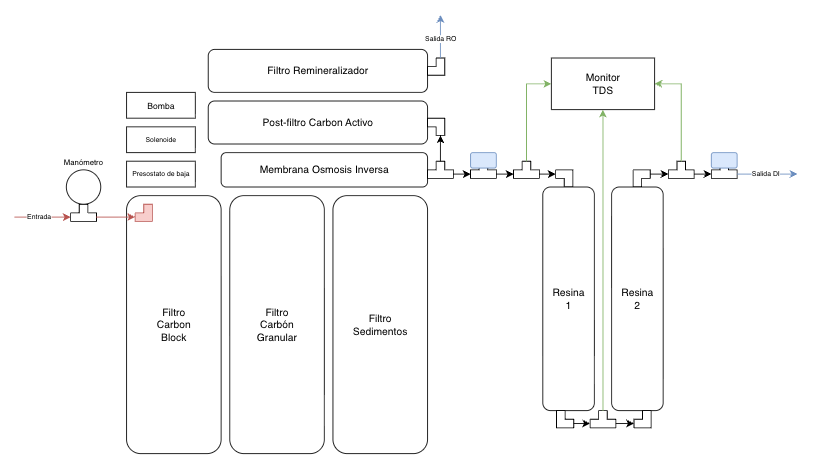

# Sistema DI del RO/DI

## Estado documental

Este conjunto forma parte del sistema RO/DI adquirido para Veril. Se documentan aquí las piezas comunicadas por el usuario para construir la etapa de desionización posterior al RO6CB. La recepción, el inventario físico, la carga de resina, el montaje y la aceptación mediante mediciones siguen pendientes.

Las carcasas no incluyen, según la información disponible, una resina desionizadora identificada. La resina recomendada se documenta por separado y aún debe comprarse o confirmarse como parte del pedido. Por tanto, este conjunto no demuestra todavía que exista una etapa DI completa ni que produzca agua utilizable para el acuario.

## Composición comunicada

- [Carcasas T33](carcasas-t33.md): Dos carcasas transparentes con conexiones rápidas de 1/4 pulgadas, destinadas a alojar medios filtrantes
- [Resina XEPTA RODI](resina-xepta-rodi.md): Medio DI recomendado para completar las carcasas, todavía no documentado como recibido ni cargado
- [Monitor TDS HM Digital TRM-1](monitor-tds-hm-digital-trm-1.md): Medición en tres puntos del circuito RO/DI
- [Kit de tubo y conexiones HUAZIZ](tubo-conexiones-huaziz.md): Diez metros de tubo blanco de 1/4 pulgadas y conexiones rápidas
- [Manómetro The Water Filter Men](manometro-the-water-filter-men.md): Indicador de presión con conexión para tubo de 1/4 pulgadas

## Configuración adoptada para el diseño

La unidad RO adquirida es la variante **RO6CB con bomba de refuerzo**. No se documenta una segunda bomba independiente. El sistema DI se diseñará con dos carcasas T33 en serie y resina XEPTA RODI de lecho mixto, usando la primera como lecho principal y la segunda como lecho de pulido y seguridad.

El permeado se dividirá después de la membrana RO y antes del postfiltro de carbón y del remineralizador. Una rama conservará el recorrido doméstico del RO6CB para agua de consumo; la otra evitará el depósito, el postfiltro y el remineralizador y alimentará el DI. No se utilizará para Veril el agua que haya pasado por el remineralizador.



*Esquema de la separación entre la salida RO para consumo y la rama DI, con monitorización TDS antes, entre y después de las dos carcasas de resina.*

## Orden hidráulico previsto

```text
Red fría → Manómetro → RO6CB con bomba → Membrana RO
                                      ├── Rechazo → Desagüe
                                      └── Permeado → Derivación con llaves
                                                   ├── Ruta RO consumo
                                                   │   → Depósito/postfiltro/remineralizador
                                                   │   → Grifo de cocina
                                                   └── Ruta DI
                                                       → Llave de entrada DI
                                                       → TDS 1
                                                       → T33 1: resina principal
                                                       → TDS 2
                                                       → T33 2: pulido final
                                                       → TDS 3
                                                       → Llave de llenado
                                                       → Cubo GRAF del ATO o recipiente limpio
```

El esquema representa la configuración adquirida para el DI. La llave con capuchón azul del esquema corresponde al aislamiento de entrada de la rama DI y las dos carcasas T33 ya vienen dispuestas en la orientación prevista. Al recibir el conjunto se comprobarán las flechas, las conexiones y la estanqueidad, pero no se prevé invertir las carcasas. El monitor TRM-1 permite observar tres puntos, pero no convierte por sí mismo el agua en desionizada.

## Llaves, derivaciones y purga

La derivación debe quedar situada en el permeado del RO, antes de cualquier elemento que remineralice el agua. La ruta DI tendrá su llave de aislamiento justo al inicio, después de la derivación y antes de TDS 1. Así se podrá cerrar todo el DI para cambiar resina, revisar conexiones o evitar que una fuga afecte a las carcasas sin interrumpir la rama RO de consumo. La ruta de consumo quedará aislada mediante la válvula que aporte el RO6CB o, si no existe una válvula adecuada en ese punto, mediante otra llave que habrá que adquirir.

La salida de la segunda carcasa DI terminará en una llave de llenado con un tramo de tubo dedicado. Esa llave permitirá llenar el cubo GRAF del ATO y otros recipientes sin desmontar el circuito. La ficha del cubo se encuentra en [GRAF de 15 l](../dd-h2ocean-compact-ato/graf-barril-agroalimentario-15l.md).

El RO6CB conservará su propia válvula de lavado o purga de membrana, que se utilizará conforme a su manual. No se añadirá una segunda purga independiente al circuito. Cualquier descarga del lavado y el rechazo terminará en el desagüe manteniendo la protección contra retorno correspondiente.

Con las tres válvulas actualmente declaradas en el kit HUAZIZ, la asignación prevista será: aislamiento de la rama DI al inicio, llenado final y aislamiento de la rama RO de consumo si el RO6CB no aporta una válvula adecuada. Si el RO6CB ya permite aislar la rama de consumo, la tercera válvula podrá reservarse para el punto que se determine durante el montaje. No es prioritario instalar una válvula entre las dos carcasas DI.

## Uso de las dos ramas

La rama RO de consumo quedará reservada para el grifo doméstico y mantendrá los elementos finales previstos por el fabricante. La rama DI se utilizará para el cubo del ATO, el agua de reposición y la preparación de agua salada. El agua DI no se enviará al grifo de consumo ni se mezclará con la salida remineralizada.

## Interpretación de las tres lecturas

- TDS 1: Permeado del RO antes de la primera carcasa DI
- TDS 2: Agua entre la primera y la segunda carcasa DI
- TDS 3: Agua final después de las dos carcasas

Si TDS 2 aumenta y TDS 3 permanece en cero, la primera carcasa está agotándose y la segunda todavía protege la salida. En ese momento se sustituirá la primera carga o se reorganizarán las carcasas con resina nueva en la posición final. Si TDS 3 aumenta, se dejará de utilizar el agua para Veril hasta revisar el circuito, la resina y las sondas.

## Criterios pendientes de aceptación

- Confirmar que se han recibido dos carcasas T33 y que no presentan daños ni fugas
- Confirmar la recepción y la referencia de la resina XEPTA RODI
- Confirmar que todas las conexiones son compatibles con tubo de 1/4 pulgadas
- Comprobar que las flechas y la orientación preinstalada de cada vaso coinciden con el recorrido previsto
- Instalar el manómetro inicialmente en la alimentación del RO, antes de la bomba, para observar la presión de red
- Instalar una llave de aislamiento al inicio de la rama DI, antes de TDS 1
- Instalar la llave de llenado y el tubo dedicado después de la segunda carcasa DI
- Comprobar que la rama de consumo conserva el depósito, el postfiltro y el remineralizador del RO6CB
- Comprobar que la rama DI no atraviesa el depósito, el postfiltro ni el remineralizador
- Confirmar el funcionamiento de la purga o lavado que incorpora el RO6CB
- Configurar el monitor en los tres puntos y comprobar qué línea corresponde a cada lectura
- Enjuagar la resina y desechar el agua inicial según sus instrucciones específicas
- Registrar TDS o conductividad antes del DI, entre carcasas y a la salida
- Aceptar el agua para Veril solo con una medición de salida coherente y estable

## Relación con el RO6CB

El agua de entrada al DI debe tomarse del permeado del RO6CB antes de su postfiltro remineralizador. La ficha del equipo RO y su aplicación concreta se encuentran en [Equipo de ósmosis inversa RO6CB](../ro6cb/ro6cb.md) y [Aplicación del RO6CB en Veril](../ro6cb/aplicacion-veril.md).

## Fuentes

- [Carcasas T33 Frefgikty en Amazon](https://www.amazon.es/dp/B0CJYFRFN3)
- [Monitor HM Digital TRM-1 en Amazon](https://www.amazon.es/dp/B00GKLD5QY)
- [Manómetro The Water Filter Men en Amazon](https://www.amazon.es/dp/B00BZTFI5M)
- Información del kit HUAZIZ facilitada por el usuario; no se ha facilitado un ASIN o URL inequívoco
