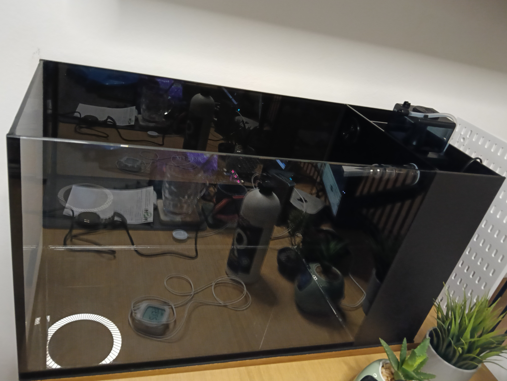
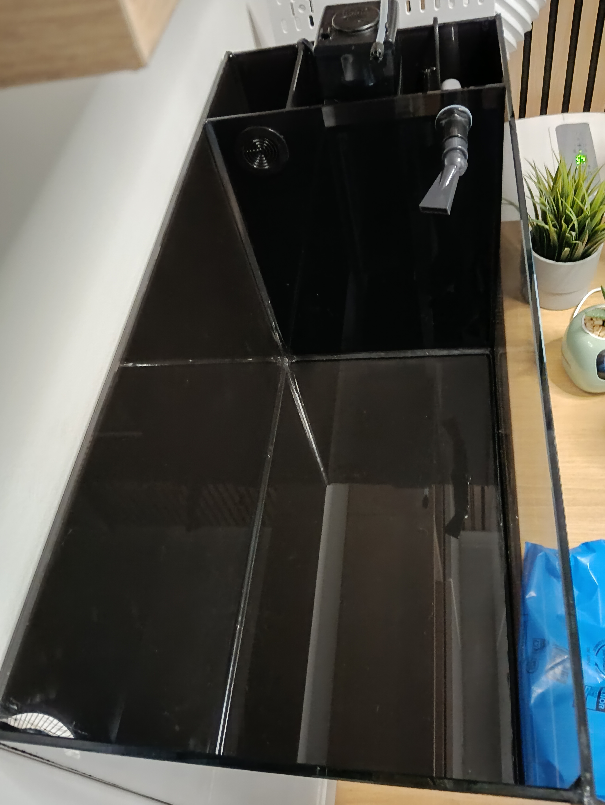
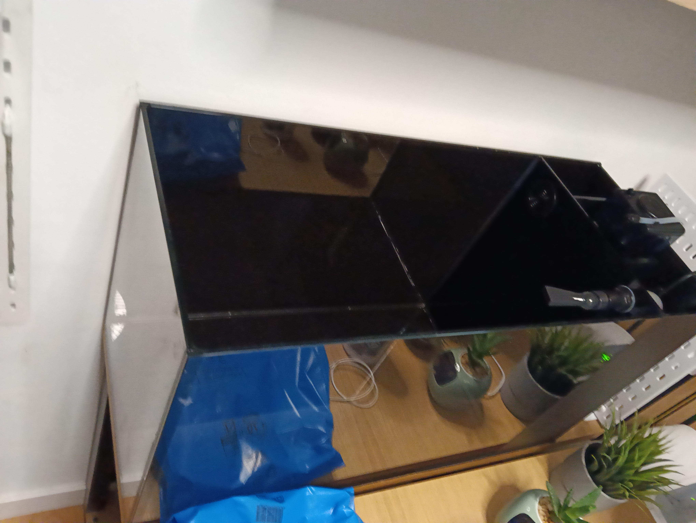

# Urna de Veril

Urna marina artesanal de tipo AIO y disposición longitudinal tipo península, fabricada por **Elite Reef Kanarias S.L.** El compartimento técnico ocupa el lateral derecho y el display el resto de la urna.

## Especificación

- Medida exterior: **75 × 32 × 40 cm**
- Display interior observado en planta: **594 × 308 mm**
- Compartimento técnico interior observado en planta: **139 × 296 mm**, dividido en Entrada, Skimmer y Retorno
- Altura exterior: **400 mm**
- Laterales, frontal y trasera: Vidrio ultraclaro de **6 mm**
- Base: Vidrio de **10 mm**
- Silicona: **Negra**
- Acabado: Vinilado negro con textura en el AIO, la base y la parte trasera
- Separador técnico: **Lacobel negro de 5 mm** con dos perforaciones circulares
- Entrada a la cámara Entrada: Perforación de **50 mm de diámetro**, a **17 mm del borde superior** y a **30 mm de la pared trasera**
- Separadores internos: Vidrio de aproximadamente **137 × 340 × 6 mm**, ambos iguales
- Apoyo: EVA BIBODU continua de **5 mm**
- Volumen geométrico bruto: **≈96 l**
- Filtración mecánica: No prevista

## Documentos

- [Fabricación](fabricacion.md): Piezas, medidas, separador, perforaciones, apoyo y vinilado
- [Técnica](tecnica.md): Cámaras, recorrido hidráulico, equipo y niveles
- [Display](display.md): Espacio visible, aquascape, circulación y mantenimiento
- [Espuma de apoyo](espuma.md): EVA BIBODU bajo la base
- [ATO](../dd-h2ocean-compact-ato/dd-h2ocean-compact-ato.md): Reposición automática de la cámara de retorno
- [Depósito del ATO](../dd-h2ocean-compact-ato/graf-barril-agroalimentario-15l.md): Barril GRAF agroalimentario de 15 l

## Distribución

```text
┌────────────────────────────────────────────────────────────┬───────────────┐
│                                                            │               │
│                         DISPLAY                            │ COMPARTIMENTO │
│                      594 × 308                            │    TÉCNICO    │
│                                                            │    139 × 296   │
└────────────────────────────────────────────────────────────┴───────────────┘
```

La zona técnica se divide en tres cámaras: **Entrada** (**139 × 86 mm**), **Skimmer** (**139 × 133 mm**) y **Retorno** (**139 × 77 mm**). Entrada comunica con Skimmer mediante un paso inferior de aproximadamente **50 mm** y Skimmer con Retorno mediante un paso superior de aproximadamente **50 mm**. Retorno aloja la bomba, el ATO y los sensores.

## Fotografías de referencia

Estas imágenes documentan visualmente la urna y el compartimento técnico. Las medidas y la configuración se describen en las fichas de fabricación, display y técnica.

### Vista general de la urna vacía



### Vista superior del compartimento técnico



### Vista lateral del compartimento técnico



La dimensión exterior nominal es de **750 × 320 mm**. Debido al espesor variable de la silicona, la medida en la parte superior puede ser aproximadamente **1–2 mm menor** que en la base en el sentido de los 320 mm.

Para las piezas colocadas entre paredes se considera un margen aproximado de **1 mm de silicona por cada lado**. Por ello, el ancho nominal de los separadores internos se calcula como **139 − 1 − 1 = 137 mm**.

## Pendientes

- Confirmar la orientación y protección del Lacobel
- Confirmar la aceptación de la EVA como apoyo
- Ajustar los niveles de trabajo y comprobar el comportamiento durante el llenado, la circulación y un corte eléctrico

## Referencias

- [Elite Reef Kanarias](https://www.elitereefkanarias.es/)
- [Ficha de la espuma EVA](espuma.md)
