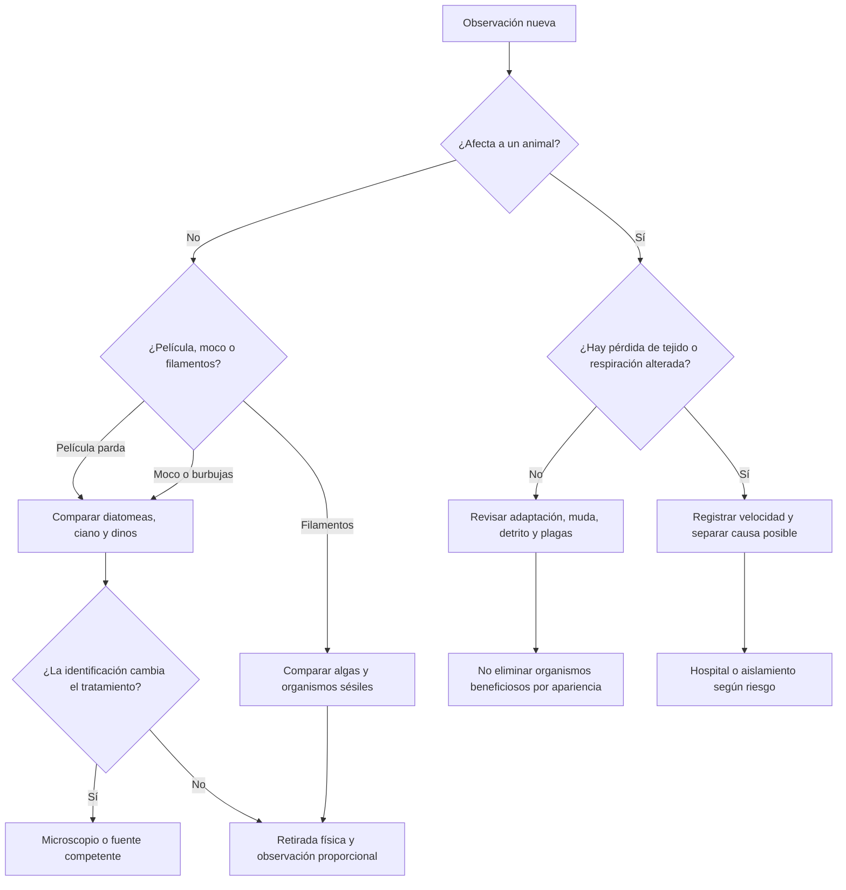

# Árbol de diagnóstico

Ante una película marrón conviene comprobar si se desprende como polvo, si forma una matriz viscosa, si produce burbujas, si se concentra en arena y si disminuye durante la oscuridad. Estos datos solo separan posibilidades: *Ostreopsis*, *Amphidinium*, *Prorocentrum* y otros grupos pueden ser bentónicos y requieren una identificación más precisa si se plantea una intervención específica.

Nunca se debe apagar por completo la circulación, llevar nitrato o fosfato deliberadamente a cero, ni cambiar varias variables a la vez para forzar una lectura visual.

