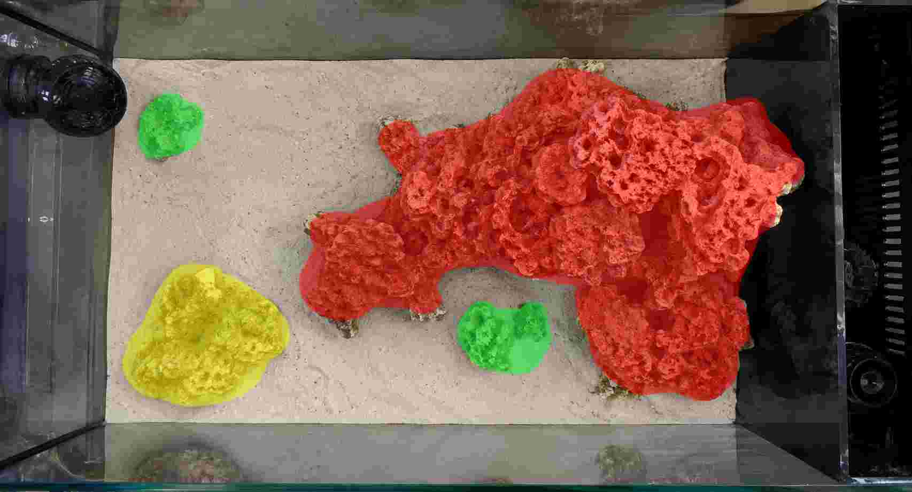

# Veril: espacial

> La [dimensión espacial](../../01_verilpedia/01_dimensiones/02_espacial.md) define la organización funcional del display. Esta ficha concreta conjuntamente la estructura rocosa y el sustrato de Veril, porque ambos forman una única composición espacial.

## Criterio de composición

La composición combinará estructura rocosa, espacio negativo y sustrato libre para crear masas, refugios, superficies de crecimiento, una playa y un canal reconocibles. La geometría final podrá adaptarse a las piezas disponibles y a la superficie real del display, siempre que conserve estas relaciones funcionales y visuales.

## Estado de la decisión

**Adoptado:** La aplicación espacial de Veril utiliza la composición instalada en la [operación del 5 de septiembre de 2026](../../04_operaciones/2026/09/2026-09-05-montaje-y-primer-llenado/README.md), con masa principal posterior derecha, terraza, paso central, islas, futura playa y espacio negativo funcional.

**Previsto:** La profundidad del sustrato y la distribución de las superficies se ajustarán sobre la composición instalada, sin utilizar la arena como apoyo estructural.

**Pendiente:** Aún deben comprobarse la estabilidad final, los apoyos, la accesibilidad, la profundidad real del sustrato y la conservación de las rutas, playas, canales y espacios negativos.

La formación rocosa tendrá su mayor altura y complejidad en la zona posterior derecha, junto al compartimento técnico, y descenderá y se fragmentará hacia el centro y la izquierda. Se organizará mediante:

- Una masa principal posterior derecha
- Una masa secundaria separada desde la zona abierta
- Islas independientes de menor volumen en la zona frontal o lateral
- Una playa y un canal visualmente reconocibles
- Espacios abiertos entre las masas

La composición no deberá convertirse en una montaña compacta ni en un conjunto de piezas dispersas sin relación visual.




### Registro visual de la composición instalada

Las fotografías de la [operación de montaje](../../04_operaciones/2026/09/2026-09-05-montaje-y-primer-llenado/hardscape.md) muestran la estructura colocada dentro de la urna y con agua. Se interpretan como registro visual del estado instalado, no como una medición fotogramétrica ni como una prueba completa de estabilidad o circulación.

En el estado documentado se distinguen:

- Una masa principal conectada en la zona central y derecha
- Una terraza horizontal central con un paso inferior
- Una elevación posterior derecha que concentra el punto más alto
- Una masa o isla independiente en la zona frontal izquierda
- Una playa y espacios negativos alrededor de las masas

Las fotografías deben interpretarse junto con las medidas registradas más abajo y con la ficha específica de la composición final. La fijación ya realizada no sustituye la comprobación de la placa protectora, la arena, la posición definitiva de las bombas ni el acceso de mantenimiento.

Las vistas conceptuales anteriores son una representación aproximada de las masas y los vacíos, no un modelo tridimensional ni un plano de fabricación de las piezas.

Las imágenes son diagramas de la idea general y no deben calcarse. La capa de color ayuda a leer la estructura:

- **Rojo:** Masa principal, con la mayor altura y volumen
- **Amarillo:** Masa secundaria separada, que equilibra el volumen principal desde la zona abierta
- **Verde:** Islas separadas, de menor volumen y distribuidas en el espacio frontal o lateral

Los colores no representan especies, materiales, piezas concretas ni límites exactos. Esta ficha no fija medidas ni porcentajes.

## Geometría funcional

La estructura incorporará, según las piezas disponibles:

- Un refugio profundo
- Un paso atravesable
- Grietas comunicadas
- Voladizos y espacios inferiores
- Superficies horizontales e inclinadas
- Zonas expuestas y protegidas

La masa principal concentrará la mayor altura y descenderá hacia el centro mediante terrazas, volúmenes escalonados o una transición equivalente. No formará una pared maciza contra el cristal y deberá conservar profundidad visual, superficies diferenciadas y una relación clara con la zona abierta.

La masa secundaria quedará separada de la principal. Las islas serán fragmentos independientes, de menor presencia y distribuidos principalmente en la zona frontal o lateral.

La zona frontal conservará una playa amplia. El canal diagonal partirá del frontal centro-izquierdo y se dirigirá visualmente hacia la zona posterior. El canal no se definirá mediante una hilera continua de piedras, y las islas mantendrán sustrato libre a su alrededor.

La relación visual buscada será:

```text
sustrato → canal → hueco → fondo
```

## Placa protectora del fondo

La placa adquirida es una **Poliver Basterglass de Polimark**, referencia **PL200210**, transparente y lisa, con formato nominal de **250 × 500 mm** y espesor de **2 mm**. El fabricante la describe como una lámina de material poliestirénico transparente para ventanas, paneles y protecciones; no se identifica como una placa específica para acuarios.

La placa se utilizará como capa separadora y de reparto bajo la composición rocosa, siempre que pueda quedar completamente plana y apoyada sobre el vidrio. Antes del montaje se comprobará que no presenta curvaturas, rebabas, aristas cortantes, daños ni partículas atrapadas debajo. La roca no deberá apoyarse en puntos muy concentrados ni formar apoyos inestables sobre una placa deformada.

El espesor real de esta referencia es **2 mm**, no 4 mm. Por ello, la placa aporta una superficie de separación y ayuda a repartir apoyos, pero no debe considerarse por sí sola una garantía estructural frente a golpes, rodamientos o cargas puntuales. La estabilidad dependerá de la geometría de las bases, la distribución de la roca y las uniones.

## Márgenes de separación y altura

El display tiene unas dimensiones interiores observadas de **594 × 308 mm**. La altura exterior de la urna es de **400 mm** y el fondo de vidrio tiene **10 mm**; por ello, la altura disponible desde la cara superior del fondo hasta el borde se estima en aproximadamente **390 mm**, pendiente de confirmación con una medición interior directa.

La estructura rocosa no se apoyará contra los cristales. Se utilizarán los siguientes objetivos de diseño:

| Zona | Mínimo operativo | Objetivo preferido |
| --- | ---: | ---: |
| Cristal trasero | 40 mm | 50 mm continuos para el corredor posterior |
| Laterales | 30 mm | 40 mm |
| Cristal frontal | 40 mm | 40–50 mm para permitir el paso del limpiacristales |
| Separador y zona técnica | Sin contacto ni obstrucción | Mantener libres las entradas, el rebosadero, el retorno y los accesos |

Los márgenes se medirán desde el punto más próximo de la roca, no desde el centro de la masa. En las puntas, salientes y futuras zonas de crecimiento podrá ser necesario dejar más espacio. No se aceptará reducir el margen trasero por formar una pared continua ni cerrar el corredor con fragmentos pequeños.

La altura de la estructura se medirá desde la cara superior del fondo de vidrio, no desde la superficie de la arena. Como referencia para la configuración mixta de Veril se adoptan estos rangos:

| Elemento | Altura objetivo desde el fondo |
| --- | ---: |
| Masa principal posterior derecha | 220–240 mm |
| Masa secundaria | 160–200 mm |
| Islas | 70–130 mm |
| Límite excepcional de la estructura | Aproximadamente 260 mm |

Con una capa general de arena de **20–30 mm**, la masa principal quedará aproximadamente **190–220 mm por encima del sustrato** y conservará unos **150–170 mm hasta la superficie** en su punto más alto. La masa principal descenderá hacia el centro y la izquierda; no se buscará una altura uniforme ni una estructura que alcance el borde superior.

Estos valores son objetivos de diseño y no una regla universal de colocación de corales. Se han elegido para dejar reserva para el crecimiento, el movimiento del agua, la observación y el mantenimiento. La altura final se revisará cuando se conozca la comunidad concreta y se realice la prueba con las piezas disponibles.

## Volumen de agua del display

El volumen del display se estima separando la columna de agua de la arena y del margen libre superior. El cálculo utiliza las dimensiones interiores observadas y mantiene como aproximación la altura disponible desde la cara superior del fondo hasta el borde.

| Variable | Valor |
| --- | ---: |
| Largo interior | 594 mm |
| Ancho interior | 308 mm |
| Altura desde el fondo de vidrio hasta el borde | 390 mm |
| Capa de arena prevista | 20 mm |
| Margen superior sin agua | 20 mm |
| Altura de columna de agua calculada | 350 mm |
| Volumen de agua antes de colocar la roca | 64,03 L |

La operación es:

```text
Altura de agua = 390 − 20 − 20 = 350 mm
Volumen bruto de agua del display = 594 × 308 × 350 / 1.000.000 = 64,03 L
```

Los **7,25 kg de roca** no permiten deducir por sí solos el volumen exterior desplazado, porque intervienen la porosidad, la densidad aparente, los huecos y el aire retenido. Para planificar se adopta provisionalmente un desplazamiento aproximado de **4–5 L**, lo que deja:

```text
Volumen neto estimado del display = 64,03 − 4/5 = aproximadamente 59–60 L
```

Este rango es una estimación de trabajo. El valor que se utilizará para dosificar será el volumen operativo medido durante el llenado, sumando el agua efectiva de las cámaras Entrada, Skimmer y Retorno. El volumen del display no debe confundirse con el volumen total del sistema.

La forma más fiable de cerrar el dato será registrar los litros realmente incorporados al sistema mediante recipientes graduados, con la roca, la arena y el nivel operativo definitivos. La reducción de 1–2 mm del ancho en la parte superior queda dentro de la incertidumbre de esta estimación y no cambia materialmente el resultado.

### Medidas de referencia de la composición instalada

En la composición montada sobre la plantilla del display se han marcado los márgenes y se han tomado alturas aproximadas desde la cara superior del fondo:

| Elemento | Medida registrada |
| --- | ---: |
| Separación frontal mínima | 40 mm |
| Separación trasera mínima | 40 mm |
| Separación lateral mínima | 30 mm |
| Base superior | 210 mm |
| Terraza media, extremo izquierdo | 150 mm |
| Terraza media, extremo derecho | 100 mm |
| Pata izquierda | 100 mm |
| Isla independiente | 80 mm |

La capa prevista de arena es de aproximadamente **20 mm**. Por tanto, la altura visible de la base superior será de unos **190 mm sobre el sustrato**, y las de la terraza media, la pata izquierda y la isla serán aproximadamente de **130–80 mm**, **80 mm** y **60 mm**, respectivamente, según la posición final de la arena.

Estas medidas de referencia sitúan el punto más alto ligeramente por debajo del rango preferido de 220–240 mm, con una reserva superior amplia. La composición instalada es **compatible con los criterios espaciales observados**. La aceptación operativa queda condicionada a comprobar los márgenes sobre la urna real, la estabilidad sin arena, la base de 2 mm de Basterglass y la circulación con las bombas en funcionamiento.

## Sustrato integrado en la composición

El sustrato disponible es **Aquaforest AF Bio Sand**, con **7,5 kg** y granulometría de referencia de **1–2 mm**. La información de composición, activación, preparación, límites y riesgos está documentada en la [ficha de AF Bio Sand](../../01_verilpedia/05_productos/01_af-bio-sand/af-bio-sand.md).

La intención es mantener una profundidad general de **2–3 cm**. El formato de **7,5 kg** debería ser suficiente para la capa general y para una zona localizada algo más profunda. La profundidad final podrá adaptarse a la superficie libre que quede después de disponer la estructura. Puede contemplarse una zona localizada de **4–5 cm** si la configuración lo permite y resulta compatible con el procesamiento, el movimiento del agua y los organismos que finalmente se incorporen.

El sustrato no se utilizará como apoyo estructural de la roca. Deberá conservar la forma de la playa y del canal, mantenerse fuera de la zona técnica y evitar nubes persistentes, desplazamientos o acumulaciones que alteren la composición.

La playa conservará una superficie predominantemente libre y no se llenará con material innecesario. La superficie del sustrato deberá permanecer accesible para observación y mantenimiento.

## Auditoría de errores de aquascaping

El vídeo [Aquascaping Regret Is Real! Don’t Do What We Did...Avoid These Top Aquascaping Mistakes](https://www.youtube.com/watch?v=A_k6EDHvrWc), publicado por BRStv el 31 de marzo de 2020, reúne 23 errores y advertencias basados en la experiencia del canal. Se utiliza como fuente de criterios de revisión, no como validación independiente de cada recomendación.

| Criterio extraído del vídeo | Estado en Veril |
| --- | --- |
| Diseñar la circulación junto con la roca y evitar zonas muertas | Cubierto como objetivo en la ficha hidráulica; pendiente de prueba con la estructura real |
| No formar una pared continua contra el cristal trasero | Cubierto en la composición instalada; se han marcado 40 mm de separación frontal y trasera |
| No construir demasiado alto pensando solo en el primer día | Parcial; la composición desciende hacia el centro, pero falta fijar una altura máxima respecto a la comunidad futura |
| Reservar separación respecto a los cristales para limpiar y permitir el crecimiento | Cubierto como criterio; pendiente de comprobar con las herramientas de limpieza y las piezas reales |
| Reservar islas para organismos expansivos | Cubierto mediante las islas independientes y la regla de situar organismos expansivos fuera de la masa principal |
| Diseñar refugios y rutas según los animales previstos | Cubierto como criterio general; la validación final depende de la comunidad que se confirme |
| Conservar espacio negativo, pasos y zonas de nado | Cubierto explícitamente mediante playa, canal, huecos e islas |
| Usar una composición visual equilibrada, incluida la regla de los tercios | Parcial; las vistas conceptuales tienen un foco desplazado a la derecha, pero no se ha comprobado la composición con las piezas reales |
| Revisar la composición desde varias vistas antes de fijarla | Pendiente; se hará con fotografías o vídeo frontal, superior y lateral |
| Elegir la roca según su forma, porosidad, función y estructura buscada | Cubierto como criterio de selección; la roca disponible sigue sin marca ni composición identificadas |
| Evitar rellenar todas las uniones con fragmentos pequeños sin función | Debe aplicarse durante el montaje; los fragmentos se reservarán para ocultar uniones solo cuando no creen depósitos ni dificulten el mantenimiento |
| No confiar únicamente en apilar las piezas | Cubierto: las uniones de las rocas se han fijado con AF Stone Fix |
| Considerar el color futuro de morteros, adhesivos y roca | Pendiente de comprobar con la roca violeta; se usará la mínima cantidad visible y se ocultarán las uniones cuando sea posible |
| Esperar el curado suficiente de los adhesivos antes de manipular la estructura | Cubierto como requisito operativo |
| Usar bases planas y estables para evitar rodamientos y repartir apoyos | Cubierto mediante la placa protectora y la selección de apoyos; debe comprobarse que la placa quede plana y sin partículas debajo |
| Considerar la apariencia de la roca emergiendo del sustrato | Cubierto: la roca se apoyará primero y el sustrato se añadirá después |
| No confundir la coloración de la roca con madurez biológica | Cubierto: la roca violeta se considera inicialmente inerte |
| Colocar la roca antes que el sustrato | Cubierto y adoptado |
| Tener la roca disponible y asumir el tiempo de maduración en la planificación | Cubierto: la roca y el sustrato ya están disponibles |
| Distinguir entre montaje en seco y montaje bajo el agua al decidir cuándo madurar la roca | Pendiente de ejecución; el montaje inicial se hará con la estructura accesible |
| Compensar una composición muy minimalista con superficie biológica adicional | No se considera necesario por ahora: Veril dispone de 7,25 kg de roca, sustrato y superficies técnicas; se revisará si la composición final utiliza mucha menos roca |
| Dejar margen para añadir piezas o superficies después | Cubierto parcialmente: las islas y el espacio negativo dejan reserva |
| Conservar piezas de reserva para poder elegir | Pendiente de la prueba real; no se descartarán piezas útiles hasta terminar la composición |

### Resultado de la auditoría

La composición instalada **no presenta en las fotografías un incumplimiento evidente** de los criterios revisados. Sí conserva riesgos abiertos que no pueden resolverse solo mediante imágenes:

- La masa principal debe quedar separada del cristal trasero y permitir limpieza y renovación del agua
- La altura máxima debe dejar margen para el crecimiento de los corales y no bloquear el espacio superior
- Los huecos, el canal, las islas y el corredor deben demostrar circulación real, no solo una apariencia de apertura
- Las uniones y apoyos deben resistir manipulación, llenado, mantenimiento y posibles movimientos del sustrato
- La composición debe fotografiarse desde frente, arriba y laterales antes de aplicar las uniones definitivas

La aceptación final se realizará con la roca real, la placa colocada, el sustrato previsto y el retorno funcionando. Hasta entonces, la ficha describe una configuración instalada compatible con los criterios, pero no una validación completa de estabilidad e hidráulica.

## Material de fijación adquirido

La fijación de las uniones se ha realizado con materiales ya disponibles, seleccionados según la función de cada contacto:

- [**AF Stone Fix**](../../01_verilpedia/05_productos/03_af-stone-fix/af-stone-fix.md), 1.500 g, utilizado para las uniones minerales estructurales
- [**Cianoacrilato Cofan en gel de alta viscosidad**](../../01_verilpedia/05_productos/04_cofan-cianocrilato-gel/cofan-cianocrilato-gel.md), dos botes de 50 g, para estabilización puntual o fijaciones auxiliares compatibles
- [**D-D Aquascape Construction Epoxy Coralline Algae**](../../01_verilpedia/05_productos/05_dd-aquascape-construction-epoxy/dd-aquascape-construction-epoxy.md), para uniones o acabados que requieran un epoxi específico de aquascaping

La elección del producto no sustituye la comprobación de la geometría. Las uniones críticas deberán quedar estables antes del curado y se respetarán los tiempos, la preparación de superficies y las condiciones de uso indicadas en las etiquetas de los productos adquiridos.

## Material y selección de piezas

La roca registrada inicialmente pesa **7,25 kg** y se considera inicialmente inerte. Se han adquirido piezas adicionales para las islas y para fragmentar durante la composición, por lo que el peso total y la selección final quedan pendientes del inventario fotográfico. La marca y composición mineral concreta de la roca no están identificadas; presenta una coloración violeta que simula visualmente una superficie con coralina.

La selección de las piezas dependerá de:

- Estabilidad y seguridad del apoyo
- Porosidad y volumen real
- Posibilidad de formar la composición prevista
- Ausencia de puntos de presión peligrosos sobre el vidrio
- Posibilidad de inspección, fijación y retirada

La relación entre superficie inicialmente inerte, colonización y maduración pertenece a la [dimensión de procesamiento](../../01_verilpedia/01_dimensiones/07_procesamiento.md) y a la documentación de [biología](06_biologia.md). El sustrato y la roca se evaluarán como soportes y superficies concretas, no como una garantía automática de capacidad biológica.

## Estabilidad, acceso y mantenimiento

Los apoyos principales repartirán la carga y no dependerán de que el sustrato permanezca bajo ellos. Las piezas estructurales se fijarán entre sí cuando sea necesario y no crearán puntos de presión peligrosos sobre el vidrio.

La composición deberá ser estable y accesible desde las vistas principales, no solo desde el frente. También deberá permitir retirar o modificar piezas sin desmontar toda la estructura cuando la unión y la estabilidad lo permitan.

Antes de llenar el sistema se comprobará:

- Estabilidad de cada masa y de sus uniones
- Ausencia de desplazamientos durante la manipulación prevista
- Separación suficiente respecto a los cristales para su limpieza
- Conservación de entradas, retornos, sensores y accesos
- Ausencia de apoyos puntuales o contacto peligroso con el vidrio
- Profundidad y distribución del sustrato compatibles con la composición
- Playa, canal y espacios negativos reconocibles
- Acceso suficiente a las zonas previsibles de acumulación

La [dimensión de infraestructura](../../01_verilpedia/01_dimensiones/01_infraestructura.md) establece los límites de la urna y del compartimento técnico. La [hidráulica](03_hidraulica.md) comprobará las rutas de flujo alrededor y debajo de las masas y la respuesta del sustrato. La [iluminación](04_iluminacion.md) comprobará la cobertura y los gradientes sobre las superficies. La [biología](06_biologia.md) documentará la colonización, la ocupación y el crecimiento.

## Evolución prevista

La composición se considera una organización espacial transitoria. La colonización y el crecimiento podrán modificar sombras, rugosidad, rutas hidráulicas y acceso. La evolución será aceptable mientras conserve:

- Estructura estable
- Playa, canal y espacio negativo funcionales
- Superficies y refugios accesibles en el grado necesario
- Rutas de flujo y elementos técnicos despejados
- Sustrato localizable y mantenible
- Reserva de espacio para el crecimiento previsible

Una modificación que altere estas condiciones se revisará conjuntamente con las fichas de hidráulica, iluminación, biología o infraestructura que correspondan.

## Fuentes de diseño

- [Display de la urna](../../01_verilpedia/04_hardware/urna/display.md)
- [Técnica de la urna](../../01_verilpedia/04_hardware/urna/tecnica.md)
- [Aquaforest: guía de productos y sustrato regular](https://aquaforest.eu/wp-content/uploads/2024/09/AF_Products-Guide_EN_WEB_241120.pdf)
- [BRStv: errores comunes de aquascaping](https://www.youtube.com/watch?v=A_k6EDHvrWc)
