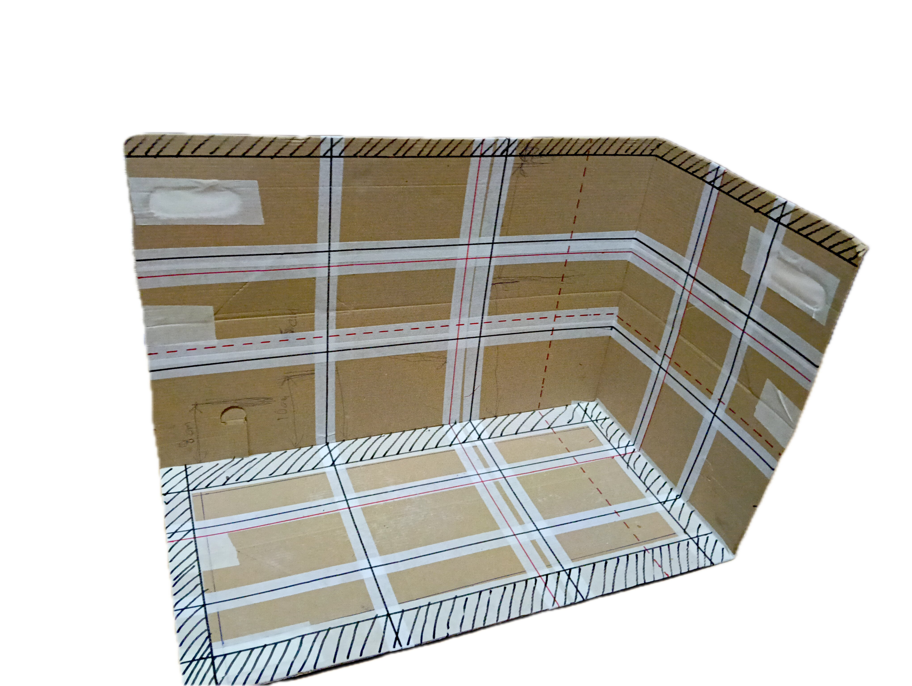
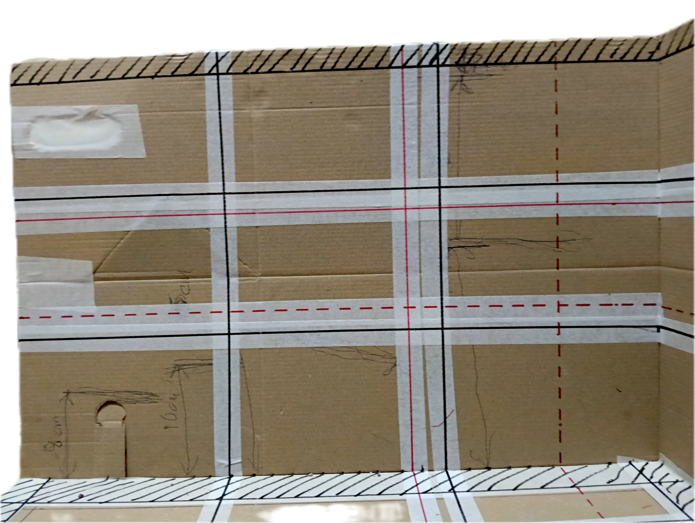
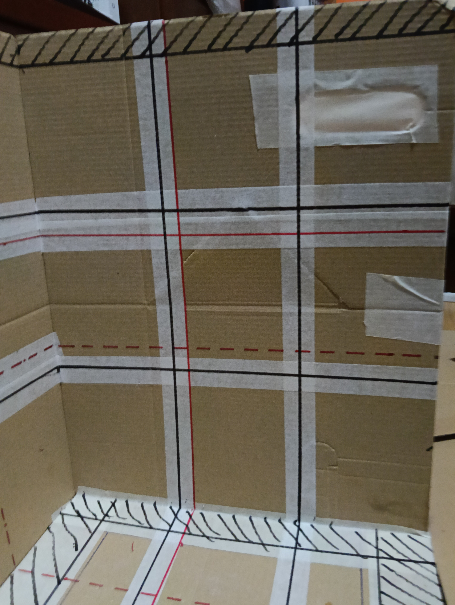
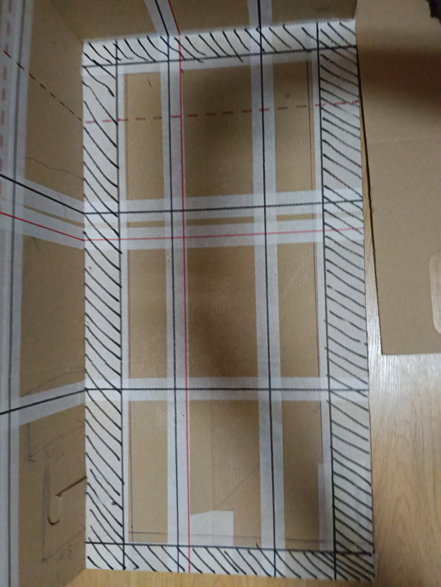

# Plantilla de referencia del display

La plantilla de cartón reproduce las medidas interiores reales del display de Veril y sirve para probar el hardscape en seco. Las marcas no representan piezas de roca: son límites espaciales y referencias geométricas para evaluar la composición desde arriba y desde las paredes.

## Leyenda de las marcas

| Marca | Significado | Aplicación |
| --- | --- | --- |
| Rayado de la parte inferior | Zona de seguridad que debe quedar libre | Mantener aproximadamente 40 mm libres en los lados frontal y trasero y 30 mm en los laterales |
| Rayado superior | Margen sin agua | Reservar aproximadamente 20 mm desde la superficie prevista del agua hasta el borde superior |
| Líneas negras | División de dos tercios en cada pared | Utilizar como referencia visual principal para colocar masas, vacíos, terrazas y puntos focales |
| Líneas rojas continuas | División de proporción áurea en cada pared | Utilizar como referencia compositiva secundaria para puntos focales y cambios de altura |
| Líneas rojas discontinuas | Proporción áurea secundaria dentro del área menor de la división áurea principal | Utilizar para localizar puntos focales menores, microislas o transiciones |

## Medidas de las referencias

Las posiciones se expresan desde el borde izquierdo, frontal o inferior de cada dimensión. En las paredes de 594 mm se aplican las posiciones longitudinales, en las paredes de 308 mm las posiciones de profundidad y en la altura de las paredes las posiciones verticales. Las cifras están redondeadas al milímetro para facilitar su uso con la plantilla.

Las líneas de dos tercios y de proporción áurea se calculan sobre la dimensión completa de cada pared. No se descuenta la zona de seguridad de la base ni el margen superior sin agua para obtener esas posiciones.

| Referencia | Dimensión de 594 mm | Dimensión de 308 mm | Altura interior de 390 mm |
| --- | ---: | ---: | ---: |
| Medida interior total | 594 mm | 308 mm | 390 mm |
| Zona de seguridad | Desde 30 mm hasta 564 mm; ancho útil 534 mm | Desde 40 mm hasta 268 mm; fondo útil 228 mm | No se aplica como reducción a las proporciones verticales |
| Líneas negras de dos tercios | 198 mm y 396 mm | 103 mm y 205 mm | 130 mm y 260 mm |
| Líneas rojas continuas de proporción áurea | 227 mm y 367 mm | 118 mm y 190 mm | 149 mm y 241 mm |
| Líneas rojas discontinuas, área menor izquierda o frontal | 87 mm y 140 mm | 45 mm y 72 mm | 57 mm y 92 mm |
| Líneas rojas discontinuas, área menor derecha o trasera | 454 mm y 508 mm | 236 mm y 263 mm | 298 mm y 333 mm |

La zona de seguridad deja un rectángulo interior de **534 × 228 mm** para la huella máxima de las rocas. La medida se toma hasta el saliente más exterior de cada pieza y no incluye una tolerancia adicional para el movimiento de la arena.

En altura, la plantilla representa **400 mm de altura exterior**, de los cuales **10 mm corresponden al cristal inferior**. La altura interior útil de las paredes es, por tanto, de **390 mm**. El rayado superior ocupa los últimos **20 mm interiores**, por lo que la superficie de agua prevista queda aproximadamente a **370 mm sobre la cara superior del cristal inferior**. Con una capa de arena de unos 20 mm, la columna de agua libre sobre la arena será aproximadamente de **350 mm**, antes de considerar menisco, desplazamiento de las rocas y tolerancias constructivas.

Las posiciones áureas se han calculado con φ ≈ 1,618. En cada dimensión, las líneas principales se sitúan aproximadamente al **38,2 % y 61,8 %** de la longitud total. Las líneas discontinuas dividen de nuevo los segmentos menores mediante la misma proporción. Si una medición física de la plantilla difiere algún milímetro por el cartón o por la unión de las paredes, se tomará como válida la posición real marcada y no una reconstrucción teórica.

## Criterios de lectura

La zona rayada inferior es un límite de seguridad y no debe confundirse con el espacio que ocuparán las rocas o la arena. Las separaciones se miden hasta la parte más saliente de la roca, no hasta su centro ni hasta una línea visual aproximada.

La zona rayada superior representa el margen operativo sin agua. En la configuración prevista equivale a unos 20 mm de margen superior dentro de los 390 mm interiores, con una superficie de agua situada aproximadamente a 370 mm sobre la cara superior del cristal inferior. Las referencias compositivas verticales siguen calculándose sobre los 390 mm completos, incluido ese margen sin agua.

Las referencias de dos tercios y de proporción áurea son guías de composición, no restricciones rígidas. La estabilidad, la circulación, el acceso para mantenimiento, la iluminación y el espacio de crecimiento de los corales tienen prioridad cuando entren en conflicto con una línea de referencia.

## Fotografías de la plantilla

### Vista general

### Vista frontal

### Vista lateral

### Vista superior

La plantilla se utilizará junto con el [inventario de rocas](../rocas/README.md), la [ficha espacial de Veril](../../01_dimensiones/02_espacial.md) y el [registro visual del hardscape](../README.md). Las medidas de la plantilla son la referencia exacta para la posición en planta; las marcas de seguridad se mantendrán también después de añadir la arena de 20 mm.
