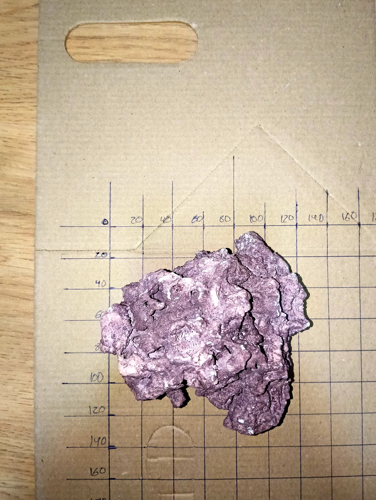
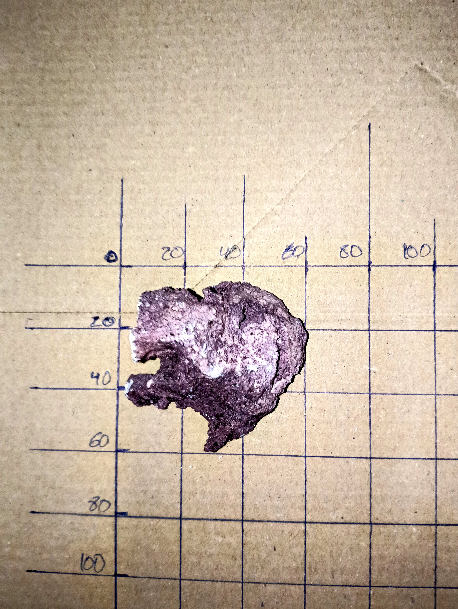
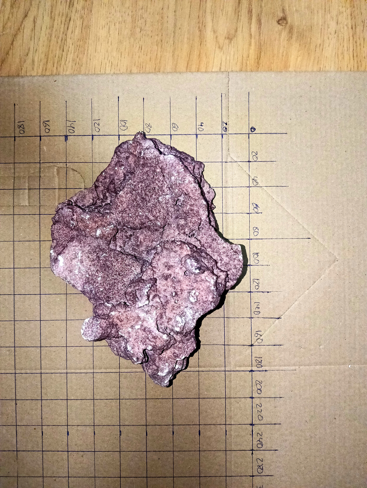
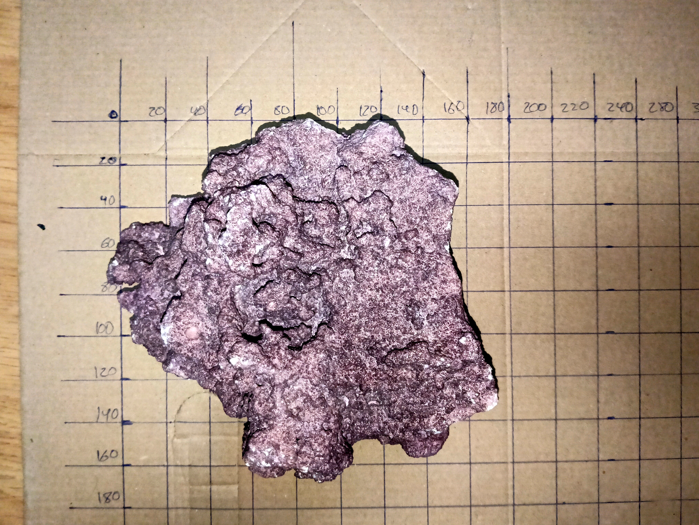
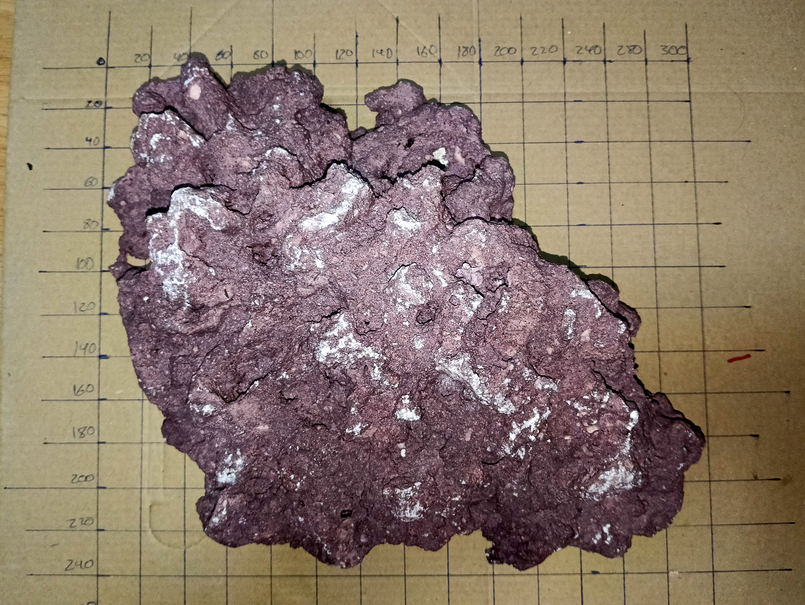
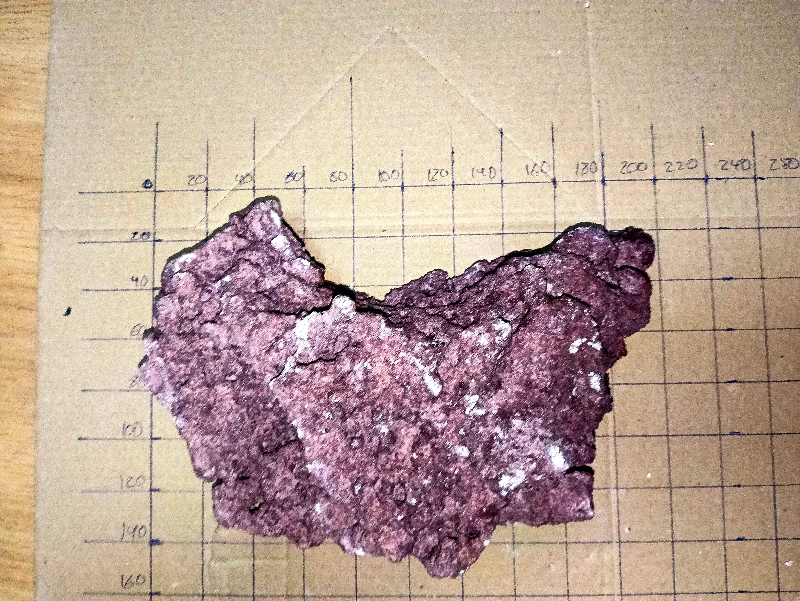
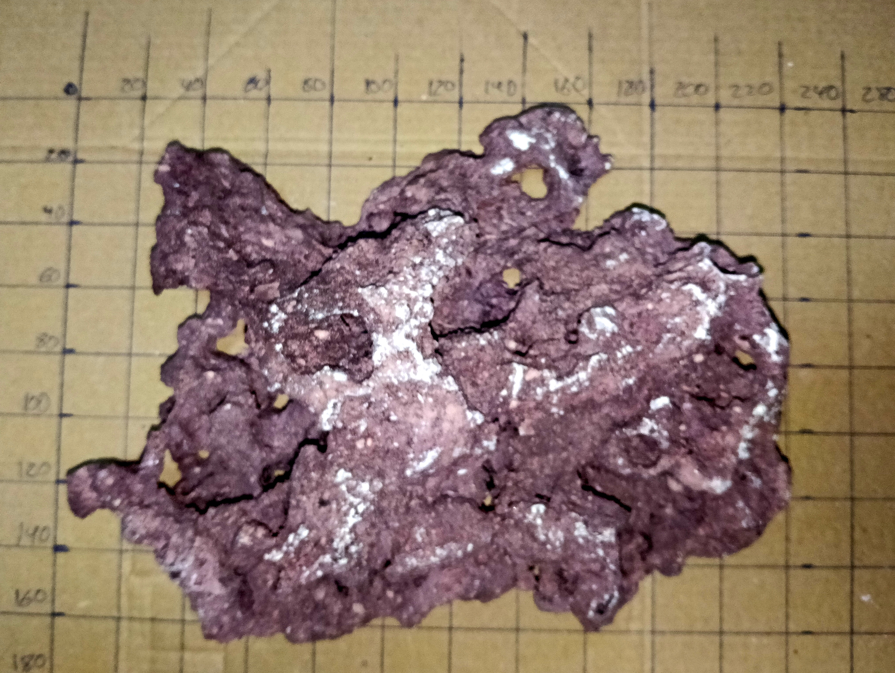
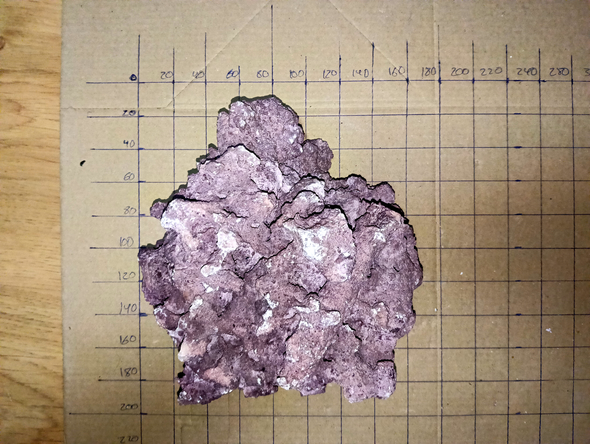
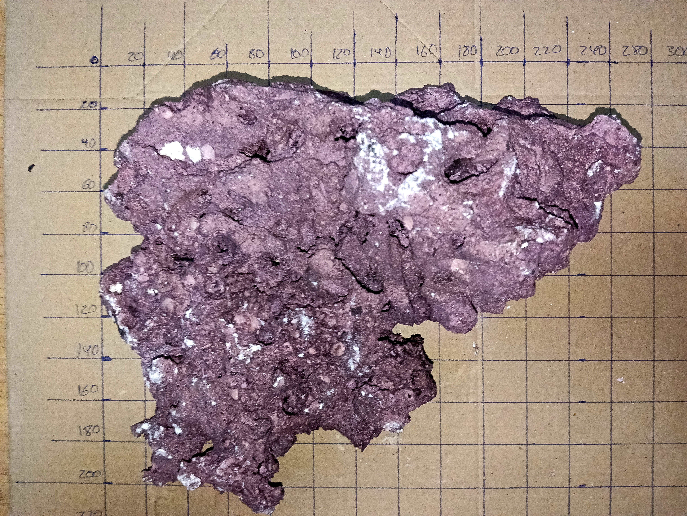
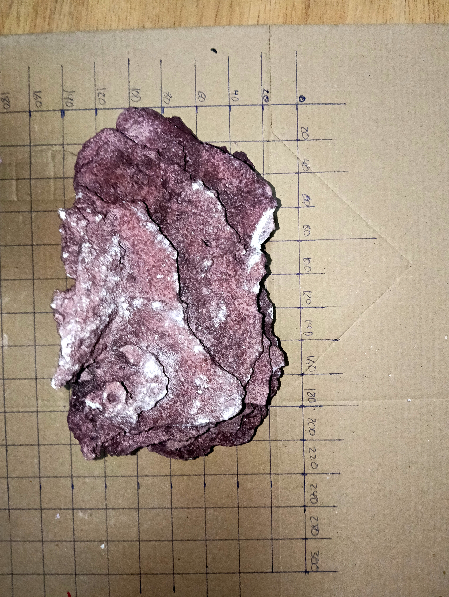

# Inventario descriptivo de rocas

## Identificación del material

Las rocas de este inventario corresponden a la gama **D-D Marco Coralline Rock**, en una mezcla de variantes Coralline, según la identificación del producto aportada para Veril. No se ha confirmado que todas las piezas sean ReefSaver: el conjunto puede incluir piezas con características de ReefSaver, Foundation, Hybrid o Premium Shelf. Es roca seca natural de carbonato cálcico, procedente de estructuras arrecifales antiguas formadas en tierra, con color púrpura producido mediante un proceso declarado sin pintura.

La variante ReefSaver es la opción generalista de la gama, mientras que Foundation, Hybrid y Premium Shelf aportan respectivamente caras estables, formas mixtas con placas y formaciones naturales en repisa. La documentación general sobre composición, propiedades, variantes, límites y fuentes se encuentra en la [ficha de D-D Marco Coralline Rock](../../../01_verilpedia/05_productos/11_dd-marco-coralline-rock/dd-marco-coralline-rock.md).

La identificación de la gama no permite inferir la resistencia, porosidad conectada o volumen exacto de cada pieza. Por eso se mantienen las estimaciones fotográficas individuales, las caras de apoyo y las pruebas físicas de estabilidad.

## Composición del surtido

El conjunto puede mezclar variantes ReefSaver, Foundation, Hybrid y Premium Shelf, además de piezas pequeñas o lascas. No se asigna una variante concreta a cada roca porque no consta el etiquetado individual de origen.

La selección y el diseño se basan en las propiedades observables de cada unidad: forma, cara de apoyo, textura, volumen, estabilidad y comportamiento en el flujo.

## Alcance del inventario

Las medidas representan una envolvente aproximada de largo × ancho × altura, no una medida de corte ni un volumen sólido exacto. El volumen indicado es un **volumen aparente de trabajo** para estimar el espacio que podría desplazar cada pieza dentro del agua.

La porosidad, los huecos, la orientación y el aire retenido pueden modificar ese volumen de forma apreciable. Las cifras deben contrastarse mediante desplazamiento de agua o mediante el registro de los litros incorporados al sistema. Las estimaciones tienen una incertidumbre aproximada de **±20 mm en planta**, **±10–20 mm en altura** y mayor en el volumen.

Las vistas inferior y lateral A de la roca 01 presentan una zona incompleta que no debe interpretarse como geometría de la pieza. Esas vistas no deben utilizarse para valorar detalles finos de porosidad o forma.

## Resumen

| Pieza | Referencia | Envolvente aproximada | Volumen aparente de trabajo | Rasgo principal | Función candidata |
| --- | --- | ---: | ---: | --- | --- |
| Roca 01 |  | 160 × 130 × 100 mm | 0,9–1,4 L | Masa irregular con un pico lateral | Base o transición elevada |
| Roca 02 |  | 70 × 60 × 60 mm | 0,1–0,2 L | Pieza pequeña compacta | Fragmento, apoyo o microisla |
| Roca 03 |  | 220 × 150 × 70 mm | 1,2–1,8 L | Placa ancha y relativamente plana | Terraza o techo |
| Roca 04 |  | 140 × 160 × 100 mm | 0,9–1,4 L | Pieza triangular con relieve | Base secundaria o volumen de transición |
| Roca 05 |  | 210 × 160 × 90 mm | 1,4–2,1 L | Losa ancha con superficies utilizables | Plataforma y separación |
| Roca 06 |  | 220 × 180 × 110 mm | 2,0–3,0 L | Masa grande y voluminosa | Base de la masa principal |
| Roca 07 |  | 220 × 160 × 80 mm | 1,4–2,1 L | Bloque ancho, plano y bajo | Base o terraza baja |
| Roca 08 |  | 240 × 180 × 120 mm | 2,4–3,6 L | Gran masa irregular con relieve | Masa principal o fragmentación |
| Roca 09 |  | 230 × 130 × 70 mm | 1,1–1,7 L | Placa alargada y estratificada | Puente, terraza o plataforma |
| Roca 10 |  | 220 × 170 × 100 mm | 1,8–2,7 L | Pieza ancha con relieve superior | Terraza, techo o masa secundaria |

## Orientación de las piezas

Muchas piezas tienen una cara relativamente plana o estratificada y otra cara más rugosa, convexa o cargada de relieves. En el montaje se utilizará esta nomenclatura:

- **Cara de apoyo**: La cara más plana o estable, orientada hacia la placa inferior, la arena o un apoyo estructural
- **Cara expuesta**: La cara más texturada o con mayor relieve, orientada hacia el espacio visible y disponible para corales
- **Orientación invertida**: Giro de la pieza que puede ser válido para ganar altura o crear un voladizo, pero que exige comprobar estabilidad y puntos de carga

La asignación siguiente es una hipótesis de trabajo basada en las vistas del inventario. No implica que toda la cara sea perfectamente plana ni que pueda apoyarse sin calzos o fijación.

| Pieza | Cara de apoyo candidata | Cara que conviene dejar expuesta | Uso de la orientación |
| --- | --- | --- | --- |
| Roca 01 | Cara inferior más ancha y relativamente irregular | Cara con el pico lateral y los relieves más visibles | Usarla normalmente con el pico hacia arriba o hacia el exterior, sin convertirlo en único punto de apoyo |
| Roca 02 | Cara más concentrada y corta | Cara con los salientes y huecos más abiertos | Integrarla como fragmento; la orientación puede variar según el hueco que se quiera completar |
| Roca 03 | Cara inferior de la placa, preferiblemente sobre dos apoyos | Cara superior ancha, estratificada y texturada | Usarla como terraza o techo con la superficie amplia hacia arriba y los bordes libres |
| Roca 04 | Cara más ancha de la pieza triangular | Cara elevada y con mayor relieve | Colocarla como transición; evitar que la punta soporte cargas principales |
| Roca 05 | Cara más plana de la losa | Cara superior extensa con depresiones y relieve | Dejar la losa hacia arriba para crear una plataforma, sin pegarla completamente al fondo |
| Roca 06 | Cara inferior más continua y ancha | Cara superior y laterales con mayor rugosidad | Reservarla preferentemente para la base de la masa, dejando los huecos laterales abiertos al flujo |
| Roca 07 | Cara inferior más estable, aunque no completamente plana | Cara con relieve superior y bordes irregulares | Usarla como base baja; no tratarla como plataforma nivelada sin comprobarla en seco |
| Roca 08 | Cara que ofrezca más continuidad de apoyo después de probar varios giros | Cara de mayor relieve y volumen visible | Si se usa completa, orientar la masa más abierta hacia los corredores; valorar fragmentarla si bloquea demasiado |
| Roca 09 | Una de las caras largas de la estratificación, apoyada en dos zonas | Cara de placa y estratos más visibles | Ideal para puente o techo; mantener los apoyos separados y evitar el apoyo puntual |
| Roca 10 | Cara más amplia y estable de la pieza | Cara superior con relieve y huecos | Usarla como terraza irregular o techo, comprobando que no cierre el espacio negativo |

En futuras propuestas de aquascape, cada indicación de montaje deberá especificar la pieza y su orientación, por ejemplo: **Roca 09, cara estratificada expuesta y cara larga de apoyo sobre dos puntos**. La decisión definitiva se tomará después de colocar la pieza en seco, comprobar que no bascula y verificar que la orientación conserva los márgenes de 40 mm frontal y trasero y 30 mm laterales.

## Descripción por pieza

### Roca 01

Pieza de tamaño medio, con una huella irregular y un punto de mayor altura desplazado hacia un lateral. Presenta varias superficies y relieves que pueden servir para apoyar piezas encima o crear una transición de altura.

- Envolvente aproximada: **160 × 130 × 100 mm**
- Volumen aparente estimado: **0,9–1,4 L**
- Base: Irregular, requiere probar la orientación inferior
- Superficie útil: Variada, con un pico que puede funcionar como punto focal
- Uso preferente: Base de una transición o soporte de una elevación menor
- Riesgo: Puede quedar inestable si se apoya sobre el pico en lugar de sobre su zona más ancha

### Roca 02

Es la pieza más pequeña del inventario. Tiene una forma compacta, con salientes verticales y un relieve suficiente para funcionar como fragmento estructural o elemento aislado.

- Envolvente aproximada: **70 × 60 × 60 mm**
- Volumen aparente estimado: **0,1–0,2 L**
- Base: Relativamente concentrada
- Superficie útil: Pequeña, pero con textura y huecos
- Uso preferente: Fragmento de ajuste, apoyo auxiliar o microisla baja
- Riesgo: Por su tamaño puede desplazarse durante el mantenimiento si no se integra o fija

### Roca 03

Pieza ancha y relativamente plana, con una silueta alargada y una cara superior aprovechable. Es una de las mejores candidatas para formar una terraza o un techo sobre apoyos separados.

- Envolvente aproximada: **220 × 150 × 70 mm**
- Volumen aparente estimado: **1,2–1,8 L**
- Base: Amplia en una de sus orientaciones
- Superficie útil: Grande y principalmente horizontal
- Uso preferente: Terraza media, cubierta del arco o plataforma para corales
- Riesgo: Si se apoya completamente sobre el fondo puede cerrar la circulación; conviene sostenerla sobre apoyos estables

### Roca 04

Pieza irregular y triangular, con una zona más elevada y otra más ancha que puede servir de base. Tiene una escala intermedia y puede aportar volumen sin extenderse tanto longitudinalmente como las losas grandes.

- Envolvente aproximada: **140 × 160 × 100 mm**
- Volumen aparente estimado: **0,9–1,4 L**
- Base: Debe seleccionarse mediante prueba de giro
- Superficie útil: Relieve medio y varias caras expuestas
- Uso preferente: Base secundaria, pata o transición entre una plataforma y la roca inferior
- Riesgo: Algunas orientaciones concentran el apoyo en un extremo

### Roca 05

Pieza ancha y baja, con una superficie superior extensa y una forma que recuerda a una losa de arrecife. Puede aportar una plataforma visualmente natural y es útil para separar niveles de coral.

- Envolvente aproximada: **210 × 160 × 90 mm**
- Volumen aparente estimado: **1,4–2,1 L**
- Base: Relativamente extensa en la orientación plana
- Superficie útil: Amplia, con textura y pequeñas depresiones
- Uso preferente: Plataforma, terraza baja o techo de una zona de refugio
- Riesgo: Su anchura puede consumir mucho espacio frontal si se orienta transversalmente

### Roca 06

Masa grande, ancha y voluminosa, con una forma compacta y múltiples relieves. Tiene capacidad para constituir una base importante de la composición principal, pero también puede consumir rápidamente espacio y volumen útil.

- Envolvente aproximada: **220 × 180 × 110 mm**
- Volumen aparente estimado: **2,0–3,0 L**
- Base: Amplia, aunque debe comprobarse la continuidad del apoyo
- Superficie útil: Elevada y diversa
- Uso preferente: Base de la masa central o pieza principal de una estructura
- Riesgo: Puede crear una gran zona de sombra y reducir el paso inferior si se coloca demasiado baja

### Roca 07

Bloque ancho y relativamente plano, de altura moderada. Tiene una silueta adecuada para construir una base baja o para recibir otra pieza sin elevar excesivamente la composición.

- Envolvente aproximada: **220 × 160 × 80 mm**
- Volumen aparente estimado: **1,4–2,1 L**
- Base: Ancha y estable en la orientación mostrada
- Superficie útil: Principalmente horizontal y de relieve medio
- Uso preferente: Base baja, terraza o soporte de una losa
- Riesgo: La cara inferior puede cerrar una zona de flujo si se apoya completamente sobre la placa

### Roca 08

Una de las piezas de mayor tamaño. Su forma es irregular, con una gran superficie y relieves que pueden crear volumen, pero también con riesgo de convertirse en una masa demasiado compacta para el display.

- Envolvente aproximada: **240 × 180 × 120 mm**
- Volumen aparente estimado: **2,4–3,6 L**
- Base: Debe comprobarse con especial atención por su tamaño y peso
- Superficie útil: Muy elevada, con varias caras y huecos
- Uso preferente: Masa principal, pieza posterior o fragmentación para obtener varias bases
- Riesgo: Puede reducir demasiado la playa, el corredor o el espacio negativo si se utiliza completa

### Roca 09

Pieza alargada y estratificada, con una silueta de placa y una altura relativamente baja. Es especialmente interesante para crear un puente, una terraza o un voladizo sobre dos apoyos.

- Envolvente aproximada: **230 × 130 × 70 mm**
- Volumen aparente estimado: **1,1–1,7 L**
- Base: Alargada, con una orientación más estable que otras
- Superficie útil: Amplia y relativamente plana
- Uso preferente: Puente central, techo del arco o terraza descendente
- Riesgo: Puede bascular si los apoyos quedan demasiado próximos a un solo extremo

### Roca 10

Pieza ancha con relieve superior y una silueta irregular. Combina una base de tamaño considerable con una cara superior que puede sostener corales o completar una terraza.

- Envolvente aproximada: **220 × 170 × 100 mm**
- Volumen aparente estimado: **1,8–2,7 L**
- Base: Amplia en la posición más plana
- Superficie útil: Alta, con zonas horizontales y bordes irregulares
- Uso preferente: Terraza, techo o masa secundaria
- Riesgo: Puede resultar demasiado dominante junto a otra pieza grande de forma similar

## Observaciones de selección

Las rocas no se asignan todavía de forma definitiva a la composición. Como criterio inicial:

- Las rocas 03, 05, 09 y 10 son las más interesantes para terrazas, puentes y techos
- Las rocas 06 y 08 tienen capacidad para formar bases principales, pero deben evaluarse por su impacto sobre el volumen y el flujo
- Las rocas 01 y 04 son útiles para transiciones, patas y apoyos intermedios
- La roca 02 es adecuada para ajustes, fragmentos o una microisla baja
- La fragmentación se decidirá solo después de probar las piezas completas y marcar los planos de rotura
- Ninguna pieza se considerará descartable hasta comprobar su base, su orientación y su función dentro del conjunto

El inventario se utilizará junto con la [ficha espacial de Veril](../../01_dimensiones/02_espacial.md), la [ficha hidráulica](../../01_dimensiones/03_hidraulica.md) y la [documentación visual](../README.md). La selección final deberá comprobar estabilidad, acceso, márgenes, circulación, luz disponible y espacio de crecimiento para los organismos previstos.
