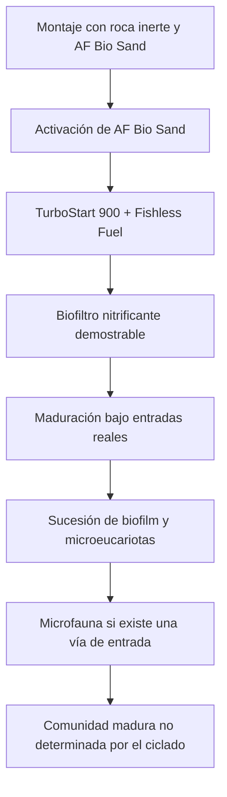

# Proyección microbiológica del ciclado de Veril

## Función del documento

Este documento proyecta qué grupos microbiológicos y funcionales pueden establecerse durante el ciclado y la maduración inicial de Veril a partir de la receta adoptada:

- AF Bio Sand activado
- FritzZyme TurboStart 900 Saltwater
- Fritz Fishless Fuel
- Agua RO/DI preparada con Aquaforest Reef Salt
- Roca inicialmente inerte y superficies instaladas en el sistema

La proyección se basa en la función declarada de los productos y en la sucesión esperable de un sistema cerrado. No es un inventario del microbioma, una identificación taxonómica ni un criterio adicional de cierre del ciclado.

## Qué se introduce deliberadamente

| Entrada | Aportación esperada | Grado de conocimiento |
| --- | --- | --- |
| AF Bio Sand | Sustrato de carbonato cálcico, superficie y preparados con cepas nitrificantes aisladas y un nutriente asociado | Función declarada; composición y concentración por lote no publicadas completamente |
| TurboStart 900 | Inoculante líquido de bacterias nitrificantes marinas | Función declarada; Fritz identifica públicamente grupos oxidantes de amonio y nitrito, pero no se caracteriza aquí el contenido del lote adquirido |
| Fishless Fuel | Fuente controlada de nitrógeno amoniacal para sostener y probar la función nitrificante | Composición y concentración declaradas en la ficha del producto |
| Reef Salt | Matriz salina para el agua del sistema | No aporta una inoculación deliberada |
| Roca inerte | Superficie disponible para colonización posterior | No se considera una fuente inicial de biodiversidad equivalente a roca viva |

Aquaforest describe AF Bio Sand como un sustrato cuyos frascos contienen cepas de bacterias nitrificantes aisladas en laboratorio y un nutriente que facilita su desarrollo. Fritz describe TurboStart 900 como un inoculante concentrado de bacterias nitrificantes vivas. La receta contiene, por tanto, dos aportaciones microbiológicas deliberadas, aunque no se conoce el grado de solapamiento entre ellas.

## Proyección por fases

### Durante el arranque y el ciclado

Se espera que aumenten los grupos capaces de utilizar el nitrógeno amoniacal y el nitrito como sustratos energéticos. La respuesta más importante no será observar una especie concreta, sino comprobar que el sistema transforma cargas conocidas dentro de los límites definidos en el [plan de ciclado](plan.md).

La proyección funcional inicial es:

| Grupo o función | Procedencia probable | Función esperada | Confianza de la proyección |
| --- | --- | --- | --- |
| Oxidantes de amonio | TurboStart y AF Bio Sand | Amonio o amoníaco a nitrito | Alta a nivel funcional |
| Oxidantes de nitrito | TurboStart y AF Bio Sand | Nitrito a nitrato | Alta a nivel funcional |
| Heterótrofos del biofilm | Superficies, agua y entradas ambientales | Transformación de materia orgánica disponible | Probable, composición incierta |
| Microorganismos asociados al sustrato | AF Bio Sand, agua y superficies | Desarrollo inicial del biofilm | Probable, sin composición cuantificable |

Fritz identifica en su documentación los grupos *Nitrosomonas* y *Nitrosococcus* para la oxidación de amonio, y *Nitrobacter* y *Nitrococcus* para la oxidación de nitrito. En esta documentación se consideran grupos declarados por el fabricante y no una caracterización independiente del contenido del envase ni del microbioma final de Veril.

No se documentará que AF Bio Sand contiene géneros o especies concretos que Aquaforest no identifique públicamente. Su contribución se describirá como una aportación nitrificante asociada al producto, con composición y carga no cuantificadas.

### Durante la maduración inicial

Cuando deje de utilizarse Fishless Fuel y la materia proceda de organismos, alimentación, detritos y entradas ambientales, cambiarán los recursos disponibles. La comunidad dejará de estar seleccionada principalmente por una carga controlada de nitrógeno amoniacal y comenzará a responder a una mezcla más amplia de materia y microhábitats.

Podrían establecerse o aumentar:

- Heterótrofos con funciones diversas dentro del biofilm
- Otros oxidantes de amonio y nitrito, incluidas arqueas y bacterias no identificadas en la receta
- Comunidades asociadas a gradientes de oxígeno dentro del sustrato, los poros y las superficies protegidas
- Protistas, ciliados, flagelados y otros microeucariotas
- Diatomeas y otros organismos fotosintéticos del biofilm

La aparición de estos grupos no será uniforme ni seguirá necesariamente una secuencia fija. Dependerá de la carga, la luz, el flujo, el sustrato, los nutrientes, la temperatura, la limpieza y las vías de entrada biológica.

## Grupos no esperados por la receta inicial

Con roca inerte, AF Bio Sand, TurboStart, Fishless Fuel y agua preparada no se debe asumir una aportación significativa de:

- Copépodos
- Anfípodos
- Ostrácodos
- Pequeños poliquetos y otros meioinvertebrados
- Esponjas, gusanos tubícolas y otros organismos criptobentónicos
- Una comunidad diversa de microfauna bentónica

Estos organismos podrían aparecer posteriormente por introducciones asociadas a roca viva, corales, sustratos, agua, cultivos o herramientas. Su ausencia durante el ciclado no indicará un fallo del biofiltro.

## Posible biodiversificación mediante roca viva

La incorporación posterior de una pequeña cantidad de roca viva madura, si se adopta, debe tratarse como una decisión de biodiversificación durante la maduración y no como una parte necesaria del ciclado.

Podría introducir:

- Bacterias y arqueas asociadas a biofilms maduros
- Protistas y otros microeucariotas
- Copépodos, anfípodos, nematodos y otros meioinvertebrados
- Pequeños poliquetos, filtradores y organismos criptobentónicos

La roca viva también puede introducir organismos indeseados, parásitos, algas o comunidades incompatibles con el sistema. Su posible utilización deberá documentarse en un plan propio de maduración, con criterios de origen, cuarentena, observación y aceptación.

## Lo que puede observarse y lo que no

### Observaciones útiles

- Evolución de amonio, nitrito y nitrato durante las cargas
- Cambios en la turbidez, el biofilm y la deposición
- Aparición de diatomeas, cianobacterias u otras coberturas
- Presencia visible de microfauna en observaciones nocturnas o sobre superficies protegidas
- Respuesta del sistema a entradas progresivas durante la maduración

### Inferencias que no deben hacerse

- Agua clara no demuestra diversidad microbiana
- Nitrato detectable no identifica qué organismos han actuado
- Ausencia de nitrito no demuestra que exista una comunidad madura
- La presencia de un copépodo no demuestra una microfauna estable
- La ausencia visual de microfauna no demuestra que no exista
- La etiqueta del producto no demuestra la composición final de la comunidad

La identificación exacta de la comunidad requeriría análisis específicos de muestras, como secuenciación molecular, y no forma parte del ciclado ordinario de Veril.

## Relación con las fases de Veril

El [ciclado](plan.md) valida principalmente la capacidad nitrificante frente a una carga conocida.

La [maduración](../04_maduracion/plan.md) observará la colonización, la sucesión biológica, la evolución de la microfauna y la respuesta a entradas más próximas a la operación real.

La [ficha biológica de Veril](../02_veril/06_biologia.md) conserva las decisiones sobre la comunidad prevista y no debe utilizar esta proyección como sustituto de fichas individuales de organismos.

## Límites de la proyección

Esta proyección no permite establecer:

- La composición exacta del microbioma
- La abundancia relativa de cada grupo
- La presencia o ausencia de una especie concreta
- La velocidad real de sucesión en Veril
- La capacidad de desnitrificación de las superficies
- La madurez ecológica del sistema
- La ausencia de organismos indeseados

Su función es proporcionar una expectativa razonable para interpretar la evolución del sistema sin convertirla en una lista de organismos garantizados.

## Fuentes consultadas

- [Aquaforest: AF Bio Sand](https://aquaforest.eu/en/products/seawater/aquascaping/af-bio-sand/)
- [Aquaforest: Products Guide](https://aquaforest.eu/wp-content/uploads/2024/09/AF_Products-Guide_EN_WEB_241120.pdf)
- [Fritz Aquatics: Preferences of nitrifiers](https://fritzaquatics.com/preferences-of-nitrifiers)
- [Fritz Aquatics: TurboStart 900 Saltwater](https://fritzaquatics.com/products/fritzzyme-turbostart-900-saltwater%C2%A0)
- [Ficha local de AF Bio Sand](../01_fichas/05_productos/af-bio-sand.md)
- [Ficha local de TurboStart 900](../01_fichas/05_productos/fritzzyme-turbostart-900.md)
- [Ficha local de Fishless Fuel](../01_fichas/05_productos/fritz-fishless-fuel.md)
