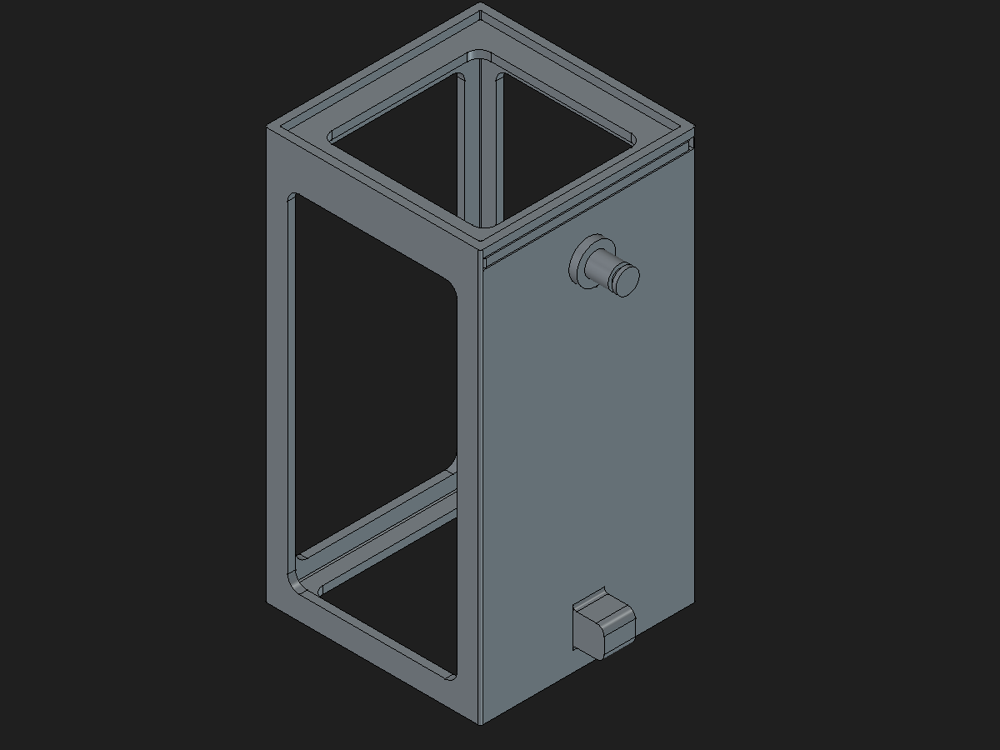

# Cestas independientes para BactoFlex Mini

Este paquete contiene el diseño paramétrico candidato de una cesta y su tapa
para alojar un bloque de BactoFlex Mini de **50 × 50 × 100 mm**. El plan
vigente describe dos módulos independientes, cada uno con una cesta y una
tapa iguales. El diseño se considera cerrado por ahora como propuesta CAD;
eso no significa que esté impreso, instalado o validado en el acuario.

## Fuente de diseño vigente

- [`bactoflex-50x50x100.FCStd`](bactoflex-50x50x100.FCStd): modelo paramétrico
editable de una cesta y una tapa. La geometría principal de cesta y tapa se
recalcula sin errores en el documento inspeccionado.
- [`plan-de-modulos-50x50x100.md`](plan-de-modulos-50x50x100.md): decisiones
  del diseño, finalidad y comprobaciones pendientes.

*Vista del CAD para identificar la geometría; no representa una impresión ni
acredita encaje o funcionamiento.*

La cesta del modelo mide aproximadamente **55,33 × 105,33 × 55,33 mm** por
fuera; las dimensiones interiores nominales se parametrizan para el bloque de
50 × 100 × 50 mm. Para el montaje se prevén dos impresiones del mismo juego
cesta+tapa, una por bloque.

## Estado de validación

La interfaz de ventosa se modeló provisionalmente alrededor de un tetón de
Ø6 × 8 mm y una holgura diametral de 0,3 mm. La anchura, profundidad y
posición de la ranura de retención incluyen hipótesis editables del modelo;
no son cotas verificadas de la ventosa EHEIM 7271100. El encaje con la ventosa
real, la impresión, la retirada de soportes, la apertura de la tapa, la
estabilidad y el flujo permanecen sin validar físicamente.

La otra versión del diseño y sus archivos se conservan por separado en
[`version-107x57x105/`](../version-107x57x105/README.md). Sus archivos de
fabricación no son derivados de este modelo y no deben usarse para fabricar
los dos módulos.

## Licencia

El paquete comparte la licencia MIT ubicada en
[`../LICENSE`](../LICENSE), que se conserva sin cambios.
