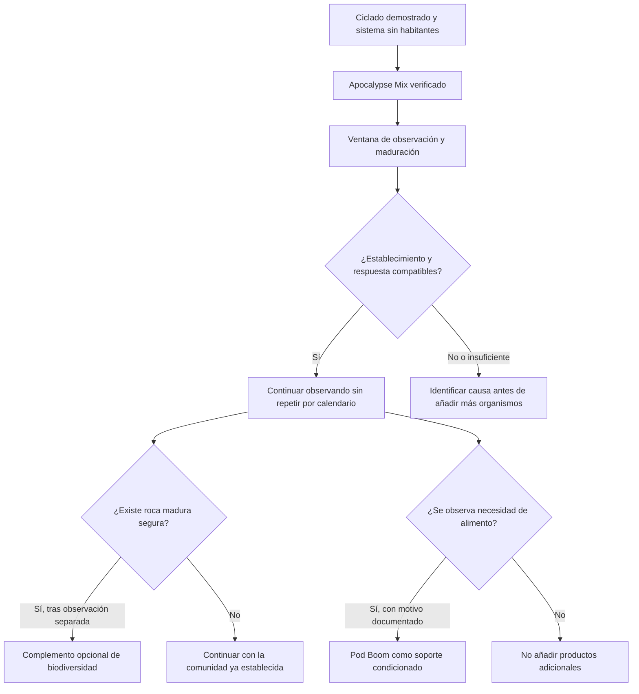

# Plan de incorporación de microfauna en Veril

## Alcance

Este documento define la decisión, las condiciones y el seguimiento de una posible incorporación de microfauna durante la maduración de Veril. No sustituye a las [fichas generales de biología](../01_fichas/02_biologia/README.md), que describen los organismos y sus funciones, ni a [Biología de Veril](../02_veril/06_biologia.md), que resume el papel esperado de la microfauna en el sistema.

## Objetivo

Evaluar si una comunidad identificable de microfauna puede establecerse y desempeñar funciones compatibles con el sistema. La incorporación no se utilizará para acelerar artificialmente el ciclado, demostrar por sí sola la madurez ni sustituir el procesamiento, el mantenimiento o la alimentación de otros organismos.

## Estado de la decisión

**Previsto:** Se estudiará primero una incorporación de copépodos vivos de identidad y procedencia verificables durante la maduración, antes de introducir habitantes que ejerzan una presión de depredación relevante. La opción inicial proyectada es un cultivo mixto tipo **Apocalypse Mix**, siempre que la composición y las condiciones del lote puedan verificarse. La referencia comercial consultada es [Power Aquaculture Apocalypse Mix](https://www.power-aquaculture.es/product/copepodos-bentonicos-apocalypse-mix/).

**Condicionado:** *Apocyclops panamensis*, *Tisbe biminiensis* y *Tisbe battagliai* se consideran grupos funcionalmente complementarios en la proyección inicial: el primero puede utilizar la interfaz bentónica y la columna de agua, mientras que los dos últimos se asocian principalmente a superficies, biofilm y refugios. La composición exacta del producto, la identidad a nivel de especie y la concentración declarada deberán confirmarse para el lote que se reciba.

**Complemento opcional:** Podrá evaluarse una pequeña cantidad de roca viva o madura de procedencia controlada. Su función sería aportar biodiversidad asociada que no suele estar presente en cultivos comerciales de copépodos, como anfípodos, ostrácodos, poliquetos, esponjas, microalgas y otros organismos criptobentónicos. Su incorporación tendrá un riesgo de organismos acompañantes y no se realizará directamente desde una fuente desconocida.

**Soporte alimentario condicionado:** Podrá utilizarse un fitoplancton vivo específico para copépodos, como [Power Aquaculture Fito Mix Pod Boom](https://www.power-aquaculture.es/product/fito-mix-pod-boom/), si la observación demuestra que el biofilm y las partículas disponibles no sostienen la población introducida. El producto se documenta aquí como recurso de mantenimiento proyectado, no como una nueva fuente de biodiversidad.

**Alternativa:** Si Apocalypse Mix no está disponible o no supera la verificación del lote, podrá estudiarse Nuclear Mix como primera incorporación. Un cultivo identificado de *Tisbe* podrá utilizarse como opción más conservadora cuando no exista una mezcla adecuada. Estas alternativas no forman parte de la secuencia prevista mientras la primera opción esté disponible y sea compatible.

**Módulos no previstos inicialmente:** Zoo Mix, rotíferos vivos y Roti Boom quedan fuera de la estrategia inicial. Podrán reconsiderarse en una fase posterior si aparece una finalidad concreta relacionada con zooplancton, filtradores o alimentación viva, pero no se añadirán solo para aumentar el número de productos.

**Criterio de selección:** En igualdad de condiciones se preferirá la opción que proporcione mayor biodiversidad funcional y capacidad de establecimiento, no necesariamente la que anuncie más especies. La disponibilidad gratuita de un material colonizado no reduce este criterio; solo será preferente si su procedencia, estado sanitario y posibilidad de observación son aceptables.

**Posterior:** Los anfípodos y otros microinvertebrados podrán evaluarse después, de forma identificada y separada cuando sea necesario. *Stomatella*, pequeñas ofiuras, ostrácodos o poliquetos solo se conservarán o favorecerán cuando puedan identificarse y resulten compatibles.

**No previsto como base:** Los paquetes de biodiversidad sin composición verificable, los isópodos no identificados, las mezclas de organismos desconocidos y los cultivos destinados principalmente a alimentar peces especialistas no se considerarán una incorporación residencial por defecto.

## Condiciones previas

No se incorporará microfauna hasta que se cumplan conjuntamente estas condiciones:

- El ciclado haya demostrado capacidad nitrificante
- NH3/NH4 y NO2 se mantengan en los límites de aceptación definidos
- Salinidad, temperatura, pH y alcalinidad presenten una tendencia interpretable
- Existan biofilm y superficies colonizables disponibles
- Retorno, circulación, oxigenación, skimmer y ATO funcionen de forma fiable
- No haya mortalidad, descomposición ni tratamientos incompatibles
- La presión de depredación prevista sea compatible con el establecimiento
- Se haya decidido cómo inspeccionar y manejar la entrada desde el punto de vista sanitario

En el caso de la primera mezcla, se prevé que no haya peces, corales ni otros habitantes macroscópicos en el sistema. Esta condición reduce la depredación inicial, pero no elimina la necesidad de disponer de biofilm, oxígeno, refugios y una fuente de alimento compatible.

## Proyección de incorporación y establecimiento

La siguiente secuencia es una proyección operativa, no una predicción exacta de supervivencia, densidad ni composición final. La respuesta dependerá del lote, el transporte, la aclimatación, la disponibilidad de alimento, la estructura espacial y las condiciones reales del sistema.

### Aportación esperada de cada entrada

| Entrada | Aportación esperada | Límite de la proyección |
| --- | --- | --- |
| Apocalypse Mix | Diversidad inicial de copépodos con ocupación potencial de superficies, interfaces y columna de agua | No garantiza que las tres poblaciones sobrevivan, se reproduzcan o permanezcan detectables |
| Roca viva o madura | Organismos asociados a biofilm, superficies y refugios que no suelen incluirse en cultivos definidos | Su composición es parcialmente desconocida y puede incluir plagas, patógenos, materia en descomposición u organismos incompatibles |
| Fito Mix Pod Boom | Alimento potencial para la colonia de copépodos; el proveedor declara una mezcla de *Tetraselmis suecica*, *Isochrysis galbana* y *Phaeodactylum tricornutum* | No constituye una inoculación de microfauna y su uso puede alterar la carga de nutrientes; no se dosificará sin una necesidad observable |

La ausencia de peces durante la maduración permite que los copépodos estén menos expuestos a depredación. No implica que la población vaya a establecerse: una comunidad sin alimento, superficies adecuadas o refugios puede disminuir aunque no haya habitantes macroscópicos.

No se combinarán varias mezclas comerciales en una única incorporación inicial. La estrategia prevista utiliza Apocalypse Mix como única inoculación comercial, seguida de una ventana de observación. La roca madura, si se acepta, se incorporará como entrada separada. El fitoplancton se mantendrá como intervención independiente: solo se añadirá si existe una razón documentada y no para compensar automáticamente la ausencia de observaciones.

## Procedimiento previsto

Antes de aceptar el cultivo o material se registrarán su identidad, procedencia, fecha, salinidad, temperatura, estado visible, composición declarada y posibles organismos acompañantes. No se incorporará material cuya composición no pueda evaluarse razonablemente.

La aclimatación se realizará de acuerdo con la diferencia entre el agua de origen y la del sistema. La introducción se hará preferentemente al final del periodo de luz, con la circulación y la oxigenación activas y evitando una limpieza inmediata de las superficies receptoras.

La distribución inicial podrá incluir roca, sustrato y zonas técnicas protegidas cuando sean accesibles, compatibles con la seguridad hidráulica y no dificulten la inspección. No se pausarán skimmer, filtración mecánica, circulación ni otros equipos por rutina; cualquier ajuste temporal deberá tener un motivo registrado y una duración definida.

Después de la incorporación se mantendrá una ventana de observación sin nuevas cargas. Se podrán realizar observaciones nocturnas, porque la ausencia de organismos durante el periodo diurno no demuestra que no se hayan establecido.

## Seguimiento y criterios de decisión

Se registrarán la respuesta del sistema, la disponibilidad de biofilm y alimento, la presencia observable en distintas zonas, la depredación, los cambios de detritos, la mortalidad y cualquier efecto sobre el mantenimiento. No se repetirán inoculaciones por calendario ni se interpretará una observación aislada como prueba de establecimiento.

La incorporación se considerará compatible cuando no produzca deterioro del sistema y existan indicios repetidos de presencia o actividad en superficies adecuadas. La ausencia de observación directa no será suficiente para declarar fracaso si existen refugios no inspeccionables.

Se detendrá el módulo ante amonio o nitrito fuera de límite, deterioro sostenido de la química, mala oxigenación, mortalidad, contaminación o efectos incompatibles con la comunidad. La respuesta será identificar la causa y aplicar la intervención necesaria, no añadir más organismos para compensarla.

## Alimentación y carga

No se establecerá una alimentación específica mientras no se observe una necesidad real. La disponibilidad de biofilm y partículas se evaluará junto con la carga general del sistema. Si se utiliza Fito Mix Pod Boom u otro fitoplancton, se documentarán el producto, el lote, la fecha, la dosis, el motivo y la respuesta observada. La pauta comercial no se transferirá automáticamente al sistema: la concentración, el volumen operativo y la evolución de nitrato y fosfato deberán formar parte de la decisión.

La microfauna no se contabilizará como exportación. Sus efectos se interpretarán como consumo, transformación y redistribución de materia dentro de la comunidad; la retirada efectiva seguirá dependiendo de los mecanismos y rutinas documentados en las fichas correspondientes.

## Registro mínimo

Para cada incorporación se anotarán:

- Fecha y hora
- Organismo o mezcla y nivel de identificación
- Proveedor, procedencia, lote o referencia disponible
- Salinidad, temperatura y estado del material de origen
- Método de aclimatación e introducción
- Zonas de distribución y ajustes temporales de equipos
- Observaciones diurnas y nocturnas
- Parámetros del sistema y respuesta posterior
- Decisión siguiente y condición que la activa

## Referencias internas

- [Copépodos marinos](../01_fichas/02_biologia/microorganismos/microfauna/copepodos-marinos.md)
- [Microinvertebrados marinos](../01_fichas/02_biologia/microorganismos/microfauna/microinvertebrados-marinos.md)
- [Biología de Veril](../02_veril/06_biologia.md)
- [Plan general de maduración](plan.md)

## Fuentes de la proyección

- [Power Aquaculture Apocalypse Mix](https://www.power-aquaculture.es/product/copepodos-bentonicos-apocalypse-mix/), descripción comercial del cultivo y de su composición declarada
- [Power Aquaculture Nuclear Mix](https://www.power-aquaculture.es/product/nuevo-nuclear-mix/), descripción comercial del cultivo y de su composición declarada
- [Power Aquaculture Fito Mix Pod Boom](https://www.power-aquaculture.es/product/fito-mix-pod-boom/), descripción comercial del fitoplancton destinado a alimentar colonias de copépodos
- [Power Aquaculture Fito Mix Roti Boom](https://www.power-aquaculture.es/product/fito-mix-roti-boom/), referencia de una alternativa futura no prevista inicialmente para alimentar o enriquecer rotíferos

Estas páginas documentan las afirmaciones del proveedor utilizadas para construir la proyección. No sustituyen la verificación del producto recibido: la identidad, la concentración, la fecha de cosecha, la salinidad de transporte y el estado del lote deberán registrarse cuando se evalúe una incorporación real. En el caso del fitoplancton, también deberán comprobarse la conservación en frío, la fecha de caducidad o duración indicada y la respuesta química del sistema.
