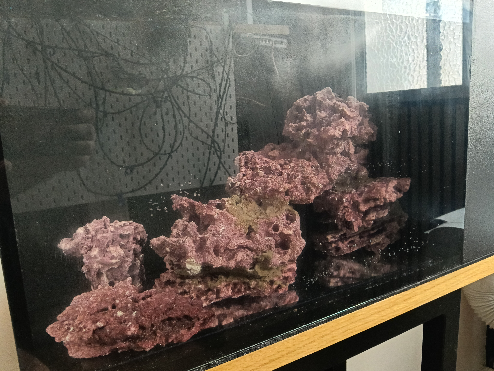
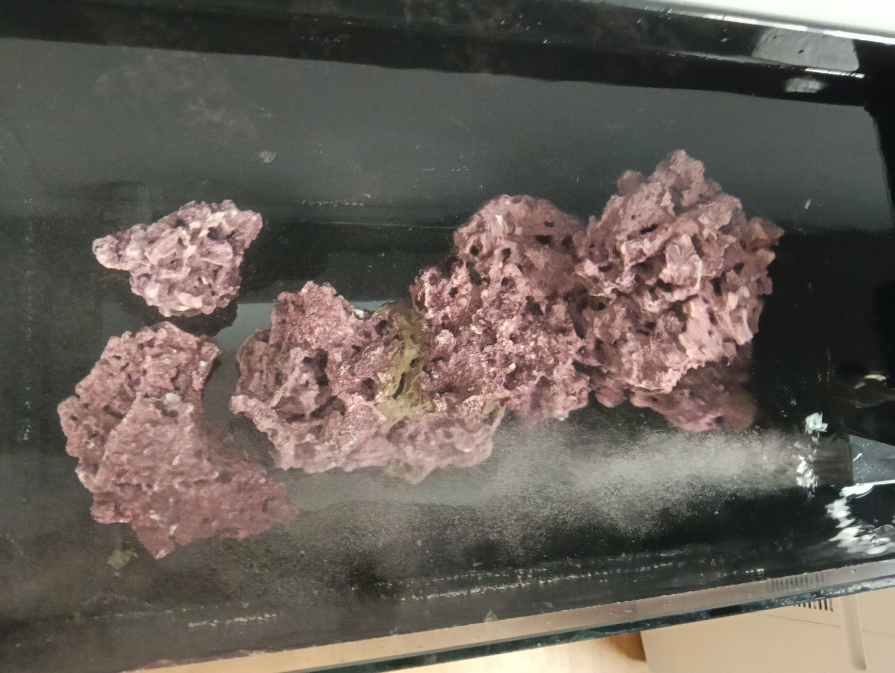
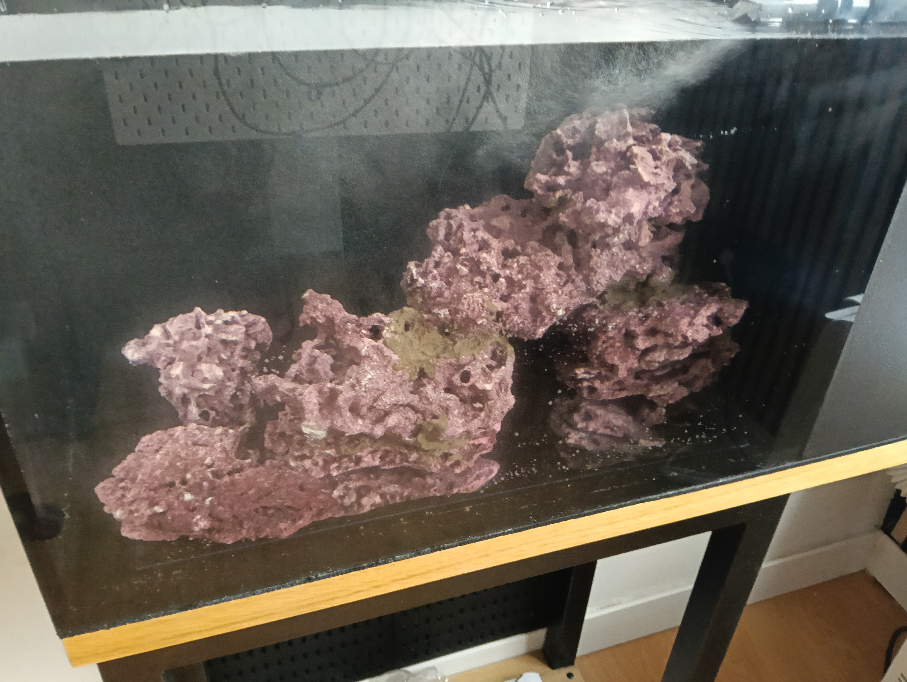
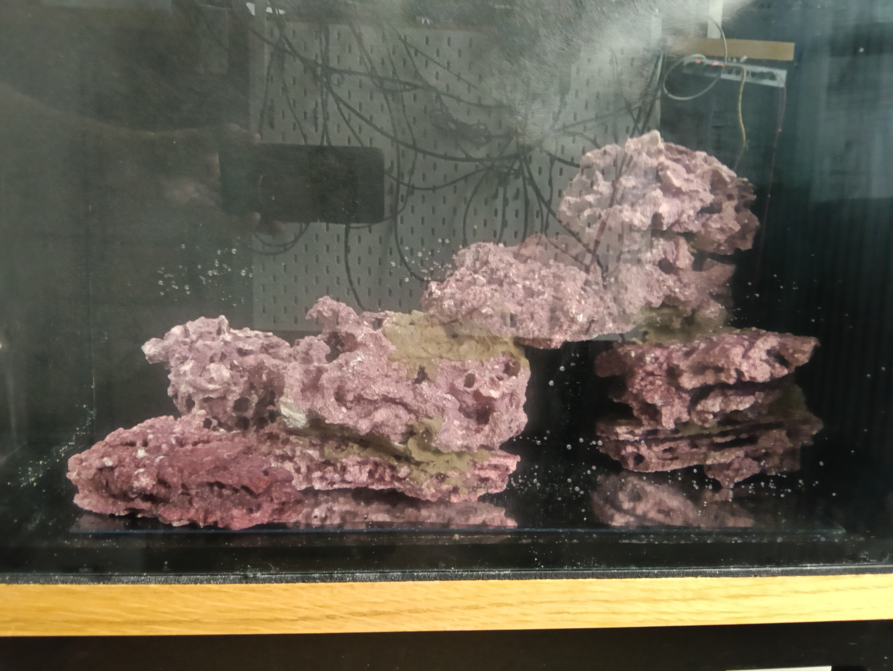

# Registro detallado del hardscape instalado

## Estado de la configuración

Este registro amplía la [operación de montaje y primer llenado](README.md). Documenta la composición rocosa instalada dentro de la urna de Veril el **5 de septiembre de 2026**. Las fotografías muestran el montaje real con agua, antes de aplicar una fijación adhesiva definitiva y antes de instalar la cama de arena.

La configuración vigente se organiza alrededor de una masa principal escalonada, con el punto más alto en la zona posterior derecha, una terraza y un paso central, una base baja en el frente y dos islas independientes. La disposición deja espacio negativo delante y alrededor de la estructura y conserva un corredor de circulación entre las masas.

La composición se considera instalada a efectos de documentación visual. La aceptación mecánica e hidráulica definitiva queda condicionada a las comprobaciones indicadas al final de esta ficha.

## Disposición observada

| Zona | Piezas identificadas | Función espacial observada |
| --- | --- | --- |
| Base izquierda | Roca 10 y Roca 07 | Apoyo bajo y arranque de la estructura principal |
| Paso y terraza central | Roca 09 y Roca 04 | Formación del hueco central y superficie elevada de transición |
| Base derecha | Roca 03 | Apoyo de la masa alta y continuidad de la estructura |
| Masa alta posterior derecha | Roca 08 sobre la zona derecha del arco | Punto de mayor altura y volumen visual |
| Isla frontal | Piezas separadas de la masa principal | Zona independiente para corales expansivos, pendiente de asignación definitiva |
| Isla posterior | Pieza separada junto a la trasera | Zona independiente para GSP u otro organismo expansivo, pendiente de asignación definitiva |

La identificación de las rocas se basa en la correspondencia visual con el inventario fotográfico y debe confirmarse si se desmontan o se cambia la orientación de alguna pieza. Las islas se mantienen físicamente separadas para limitar la expansión de organismos y conservar el espacio negativo alrededor de sus bases.

## Lectura frontal

La vista frontal muestra una progresión desde una base baja en el lado izquierdo hacia una terraza central y una masa más alta en el lado derecho. El conjunto no forma una pared continua contra el cristal: la estructura queda dividida visualmente por el paso central, las islas y los huecos entre las capas.

El elemento dominante es la masa posterior derecha. La terraza central y el paso inferior introducen una escala intermedia y evitan que la altura máxima se lea como una columna aislada. La base frontal proporciona profundidad y una zona de transición hacia la futura playa de arena.

La superficie superior de las piezas presenta porosidad, fracturas y estratificaciones visibles. Estas texturas deberán conservarse siempre que no creen apoyos inestables, bandejas profundas de detritos o bloqueos del flujo.

## Relación con urna, sustrato y equipos

La plantilla de referencia representa un display interior de aproximadamente **594 × 308 mm**. Los márgenes de seguridad adoptados para la disposición deberán comprobarse sobre la posición real de cada pieza, especialmente en los puntos más próximos a los cristales frontal, trasero y laterales.

La cama prevista es de **Aquaforest AF Bio Sand**, con una profundidad general aproximada de **2–3 cm**. La roca no deberá utilizar el sustrato como apoyo estructural. Antes de extender la arena se comprobará que las bases descansan sobre la placa prevista, permanecen estables y no dependen de que la arena rellene huecos.

La salida del retorno y la bomba de movimiento deberán mantener libres el paso central, el corredor posterior y las zonas de acceso. La orientación final del flujo se validará con la Sicce Micra Plus 600 y la bomba de circulación prevista, observando la acumulación de partículas en la base del arco, las repisas derechas y detrás de la masa alta.

## Estado mecánico e hidráulico

En las fotografías del montaje inicial, la estructura se mantiene por encaje, apoyo y gravedad antes de aplicar el adhesivo. Durante esta misma operación del 5 de septiembre, las uniones se fijaron posteriormente con **AF Stone Fix**. La ausencia de movimiento durante la observación inicial y la aplicación del adhesivo no sustituyen una prueba de estabilidad frente a una manipulación accidental, vibración o mantenimiento.

El agua se introdujo antes de cerrar la documentación de la composición. La elevación posterior del nivel permitió mantener la bomba de retorno completamente sumergida y hacer funcionar el retorno de forma estable, sin vórtice, aspiración de aire ni microburbujas anómalas durante la comprobación registrada. El nivel de trabajo y el volumen operativo aún no deben considerarse definitivos.

La presencia de agua permite valorar la lectura real del montaje, pero no demuestra por sí sola que el flujo sea suficiente en todos los huecos. La prueba hidráulica deberá hacerse con las bombas en su régimen previsto y después de incorporar la arena, porque la granulometría, el nivel y la orientación de la salida pueden modificar los depósitos.

## Función prevista por zonas

- **Masa alta posterior derecha:** Superficies de mayor luz relativa y transición vertical para corales compatibles con la iluminación medida
- **Terraza central:** Superficies intermedias para organismos de luz y flujo moderados, dejando espacio de expansión
- **Paso inferior:** Refugio y ruta de circulación para pequeños peces, gambas y microfauna
- **Base frontal:** Transición visual hacia la playa, sin convertir la roca en un borde continuo contra el cristal
- **Isla frontal:** Área aislada para una colonia expansiva como zoanthus, si la selección final lo confirma
- **Isla posterior:** Área aislada para GSP u otro organismo expansivo, evitando puentes de roca hacia la masa principal
- **Repisas laterales:** Posibles puntos de colocación de LPS u otros organismos adecuados, siempre que se mantenga distancia de crecimiento y no se formen bandejas ciegas

Estas funciones son criterios de diseño y no asignaciones biológicas definitivas. La ubicación de cada organismo dependerá de su identificación, crecimiento, iluminación, flujo y compatibilidad real.

## Fotografías

### Vista frontal oblicua

### Vista cenital

### Vista frontal

### Vista frontal lateral

## Comprobaciones pendientes

- [x] Instalar la estructura dentro de la urna y documentarla desde varias vistas
- [x] Mantener separadas las islas de la masa principal
- [ ] Confirmar la identidad de cada pieza después del montaje definitivo
- [ ] Medir los márgenes reales respecto a los cristales y al compartimento técnico
- [ ] Comprobar que las bases descansan de forma estable sin depender de la arena
- [ ] Verificar la estabilidad frente a una manipulación ligera y a la vibración de las bombas
- [ ] Instalar la cama de arena sin utilizarla como elemento estructural
- [ ] Comprobar que la arena no invade el paso ni entierra las bases de forma inestable
- [ ] Probar la circulación con la Sicce Micra Plus 600 y la bomba de movimiento en el régimen previsto
- [ ] Observar depósitos de arena y detritos bajo el paso, en las repisas y detrás de la masa derecha
- [ ] Confirmar que la salida del retorno no erosiona la playa ni crea una zona muerta persistente
- [ ] Verificar el acceso al compartimento técnico y la retirada de piezas que requieran mantenimiento
- [ ] Medir la iluminación antes de asignar corales a las superficies altas o sombreadas
- [ ] Confirmar el curado del AF Stone Fix y registrar cualquier refuerzo necesario

## Criterio de aceptación

La composición se aceptará como configuración operativa cuando permanezca estable sin que la arena actúe como apoyo, conserve los márgenes de seguridad, permita el acceso al equipo, mantenga rutas de circulación alrededor y bajo la estructura y no genere acumulaciones persistentes de detritos que no puedan retirarse.

La fijación con AF Stone Fix aumenta la seguridad de las uniones, pero no corrige una base mal apoyada, un margen insuficiente, una repisa inaccesible ni un problema de circulación. La composición podrá modificarse si las pruebas reales muestran un riesgo que no sea compatible con el mantenimiento del acuario.
