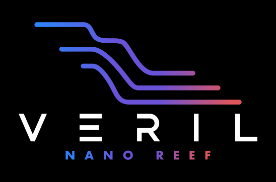

# Documentación de Veril

  

Repositorio de documentación técnica del acuario marino Veril. El contenido está organizado para separar el diseño físico, el arranque biológico, el hardware y las fichas generales reutilizables.

## Descripción de Veril

Veril es un acuario marino de pequeño volumen, construido como una urna AIO artesanal tipo península, con un display aproximado de **60 × 32 × 40 cm** y un compartimento técnico lateral integrado. Su configuración vigente combina un aquascape asimétrico de roca inerte y sustrato, retorno y circulación independientes, iluminación suspendida y agua preparada mediante ósmosis inversa y sal.

Este repositorio reúne la configuración vigente de Veril, sus fichas de hardware y productos, los planes de ciclado y maduración y la documentación de operación y comprobaciones. Las decisiones, pendientes y límites conocidos deben conservarse aquí como referencia única del proyecto.

Los prefijos numéricos indican el orden recomendado de lectura, pero no establecen dependencias estrictas ni sustituyen los enlaces entre documentos.

## Proveedor de referencia

El proveedor de referencia de Veril es [Elite Reef Kanarias](https://www.elitereefkanarias.es/). Sus canales públicos de referencia son la [web oficial](https://www.elitereefkanarias.es/) y su [perfil de Instagram](https://www.instagram.com/elitereefkanarias/).

Agradezco a Elite Reef Kanarias el asesoramiento y el apoyo prestados durante la definición y el desarrollo de Veril.

## Índice

- [Fichas](01_fichas/00_README.md): marco general, dimensiones, biología, parámetros, hardware, productos y procesos
- [Implementación de Veril](02_veril/00_README.md): decisiones concretas de espacio, sustrato, flujo, iluminación y biología
- [Ciclado](03_ciclado/README.md): evidencia, decisiones y plan de arranque
- [Maduración](04_maduracion/README.md): evolución biológica posterior al ciclado
- [Operación](05_operacion/README.md): procedimientos recurrentes de mantenimiento, seguimiento y respuesta

## Repositorio privado opcional

El directorio `privado/` es un submódulo independiente para documentación comercial y personal. No forma parte del contenido público necesario para utilizar este repositorio y requiere permisos propios para clonarse o actualizarse.
