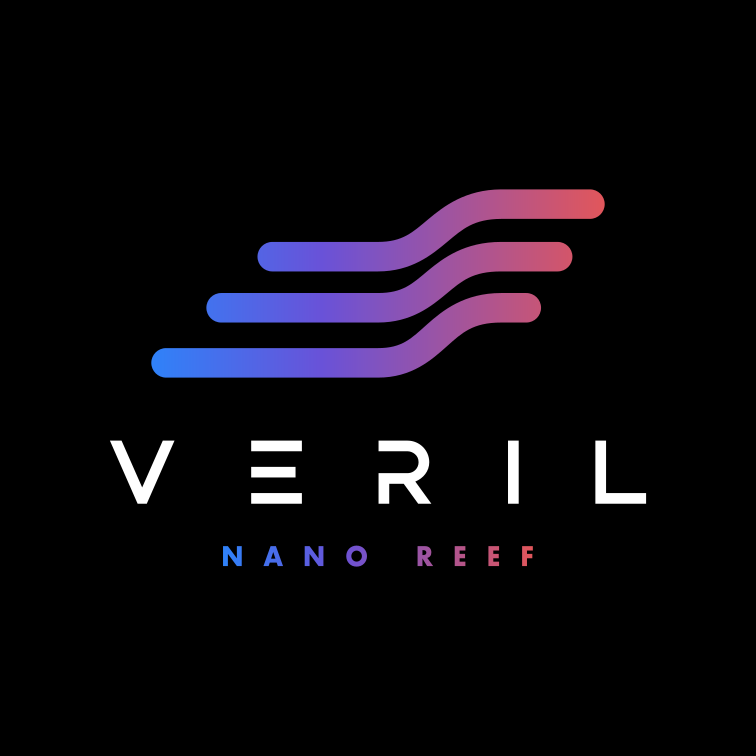
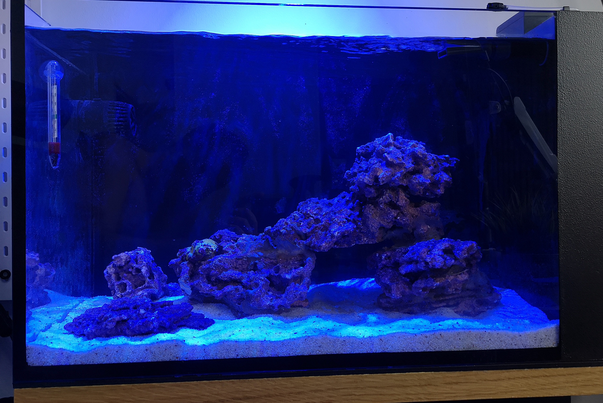

# Documentación de Veril

  

Veril es un **nano reef de arrecife mixto de aproximadamente 75 litros**, pensado para mantener peces, corales e invertebrados en una urna AIO. Como referencia práctica, se estiman **unos 60 litros en el display** y **75 litros en el sistema completo**, incluido el compartimento técnico. Son cifras aproximadas para describir la escala del acuario, no mediciones exactas del volumen neto.

  

Esta documentación reúne, en un único lugar, lo que voy aprendiendo, las decisiones que tomo o me vienen impuestas y, sobre todo, los motivos que hay detrás de ellas. También recoge las actuaciones que realizo, sus consecuencias, las formas de cuidar y mantener el acuario, las dificultades que a menudo no se explican al principio y las distintas fases por las que irá pasando el sistema. En conjunto, pretende ser un registro de lo que necesito aprender para mantenerlo de forma responsable.

La hago pública por si la experiencia puede resultar útil a alguien y para poder ofrecer contexto cuando necesite pedir ayuda. Soy totalmente novato, así que lo que aparece aquí puede contener errores, interpretaciones incompletas o decisiones que no sean las más adecuadas. No pretendo ocultar los problemas ni presentar el proceso como más sencillo o más bonito de lo que es. Cualquier información interesante debería tomarse como punto de partida y contrastarse con fuentes fiables, documentación del fabricante y la situación real del acuario.

La inteligencia artificial se ha utilizado de forma extensa tanto para investigar y contrastar información como para redactar, organizar y revisar esta documentación. Todo el contenido ha pasado por una revisión editorial y de contenido humana por mi parte, y la responsabilidad de lo que se publica es mía. Esta revisión no garantiza que no haya errores, por lo que siguen siendo necesarios el criterio propio y el contraste con fuentes competentes.

Para que todo quede claramente diferenciado, la documentación separa el conocimiento general de referencia, la configuración vigente de Veril, las actuaciones que todavía están pendientes y las operaciones que ya se han ejecutado. Los prefijos numéricos orientan la lectura y cada apartado enlaza con la información más concreta cuando es necesario.

## Estado

Retrato orientativo formado con la última información disponible para cada aspecto. Las mediciones no son simultáneas y pueden haber cambiado.
La última [ronda de mediciones Salifert](04_operaciones/2026/11/2026-11-20.md#mediciones-tras-el-cambio) se tomó tras el cambio de agua del **20 de noviembre de 2026**.

| Aspecto | Estado conocido |
| --- | --- |
| Sistema | Acuario marino AIO; **75 L** para el sistema y **60 L** para el display. |
| Skimmer | **Sice Shark Skimmer 300**. |
| Bombas | **Jebao DC-650**. **Mantis Tourbon 60** |
| Reposición | **D-D Compact ATO Gen 2**; Barril de 15 L con **RODI**. |
| Fauna y microfauna | [Ofelia (`liv-0004`), microofiura; Stroll (`liv-0005`), caracol; y esponjas de la roca viva (`liv-0008`)](02_configuracion/03_biologia/04_unidades-incorporadas/README.md). Los grupos de *Tisbe* sp. (`liv-0006`) y *Tigriopus* sp. (`liv-0007`) se inocularon el 20/11/2026. |
| Luz | **AI Prime 16HD Reef**, con [perfil inicial de maduración](02_configuracion/01_dimensiones/04_iluminacion.md#perfil-inicial-de-maduración) activo desde el **20/11/2026**. Horario **12:00–17:00** (Canarias), rampas de **30 min** y predominio azul. [Mapa PAR y plan por etapas](03_pendientes/maduracion/05_plan-iluminacion.md). |
| Filtración | Roca **D-D Marco Coraline Rock**. Arena **AF Bio Sand**. Biobolas **Mantis Bio-Filter Sphere**. |
| Roca viva | [Incorporada el 19/11/2026](04_operaciones/2026/11/2026-11-19.md#incorporación-de-roca-viva), con esponja. |
| Estado | **Maduración** tras el cierre del ciclado el **18/11/2026**. |
| Temperatura del agua | **26,1 °C**, lectura comunicada el 20 de noviembre. |
| Salinidad | Objetivo operativo **1,025 de densidad relativa**, valor medido tras el [cambio de agua del 20 de noviembre](04_operaciones/2026/11/2026-11-20.md#cambio-de-agua). |
| NH₃ (Salifert) | **0**. |
| Nitrito (NO₂) | **0**. |
| Nitrato (NO₃) | **25**. |
| Alcalinidad (KH) | **7 dKH**. |
| Calcio (Ca) | **390 mg/L**. |
| Magnesio (Mg) | **1260 mg/L**. |
| pH | **8**. |
| Último cambio de agua | **12 L** con Aquaforest Reef Salt, lote **4502148**, y reposición de nivel con RO/DI el **20/11/2026**. |

Tres días después de la segunda carga, el 10 de noviembre, se registraron amonio **0** y nitrito **0,1–0**. Ambos marcaron **0** en la [ronda de cierre del 18 de noviembre](04_operaciones/2026/11/2026-11-18.md).

Los valores de química y el estado de los equipos se amplían en [Operaciones](04_operaciones/README.md), [Configuración](02_configuracion/README.md) y el [seguimiento del ciclado](03_pendientes/ciclado/README.md).

## Índice

- [Verilpedia](01_verilpedia/README.md): conocimiento general y reutilizable
- [Configuración](02_configuracion/README.md): estado vigente y decisiones de diseño de Veril
- [Pendientes](03_pendientes/README.md): actuaciones todavía no ejecutadas, incluidos el plan de maduración y los procedimientos recurrentes, junto con el historial del ciclado
- [Operaciones](04_operaciones/README.md): actuaciones ejecutadas, ordenadas por fecha y documentadas con sus resultados
- [Multimedia](05_multimedia/README.md): recursos visuales con su contexto y límites de interpretación
