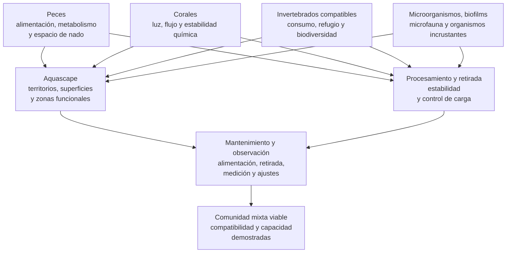

# Dimensión biológica

## Qué es

Esta dimensión biológica se concreta actualmente en una configuración mixta de arrecife: un sistema cerrado diseñado para mantener comunidades microbianas, microfauna, algas, corales, peces e invertebrados compatibles. No se limita a sostener animales móviles: también debe proporcionar superficies, luz, circulación, química y estabilidad adecuadas para organismos sésiles y comunidades asociadas a las superficies.

La expresión «de arrecife» describe el tipo de comunidad y de condiciones que se pretende mantener, no una reproducción completa de un arrecife natural. El sistema sigue dependiendo de mecanismos de procesamiento, retirada y mantenimiento capaces de sostener las entradas de materia, los consumos y las relaciones entre sus habitantes.

Una «configuración mixta» es un acuario marino de arrecife diseñado para mantener conjuntamente peces, corales e invertebrados compatibles. En esta documentación, el término describe la composición y los objetivos de la comunidad, no una arquitectura de filtración, y no se emplea como traducción estricta de *mixed reef*. Tampoco equivale por sí sola a un método de procesamiento ni implica mantener simultáneamente todos los tipos de coral.

La configuración mixta no es una lista de especies. Es una condición de diseño que obliga a que el espacio, la luz, la circulación, la alimentación, la retirada de materia y la estabilidad sean compatibles con más de un grupo funcional de organismos.

La tesis de esta dimensión es:

> La comunidad no se añade a un sistema ya definido; sus necesidades deben participar en el diseño y en la evaluación de todo el sistema.

Para Veril se adopta la configuración mixta de arrecife porque el objetivo de comunidad combina peces, corales e invertebrados compatibles, junto con las comunidades microbianas y bentónicas que sostienen el sistema. Esta línea se aplicará mediante selección progresiva, evaluación de compatibilidad y observación de la comunidad completa; las especies y decisiones concretas se documentan fuera de esta ficha.

Dentro del modelo integrado, esta dimensión define la comunidad y las compatibilidades que deben demostrarse. Las demás dimensiones describen las condiciones que la comunidad necesita desde sus propios niveles.

## Principio de funcionamiento

Una dimensión biológica reúne comunidades y organismos con necesidades parcialmente coincidentes y parcialmente distintas. La configuración mixta vigente organiza la convivencia de peces, corales e invertebrados, mientras que las comunidades microbianas, la microfauna y los organismos incrustantes forman capas biológicas asociadas que deben considerarse sin convertir esta ficha en un catálogo de especies.

La configuración debe mantener un equilibrio entre cuatro relaciones:

1. La comunidad introduce materia, consume recursos y ocupa espacios diferentes
2. Las demás dimensiones proporcionan las condiciones espaciales, hidráulicas, lumínicas, químicas y de infraestructura disponibles
3. El procesamiento transforma y retira parte de la materia introducida
4. La observación y el mantenimiento comprueban si la comunidad sigue siendo compatible con esas condiciones

El diagrama no representa una secuencia de introducción ni garantiza la compatibilidad de ningún animal concreto. Representa las dependencias que deben comprobarse antes y después de cada incorporación.

## Escalas biológicas

Esta dimensión considera varias escalas de vida que se solapan dentro del sistema. Aquí se describe la función general de cada una y su relación con la configuración; la identificación, las necesidades concretas y las fichas de organismos se documentan en la [biología del acuario marino](../biologia/README.md).

### Comunidades microbianas y biofilms

Las bacterias, arqueas y otros microorganismos colonizan superficies, partículas y capas de biofilm. Forman una base biológica para transformaciones, competencia por recursos y relaciones tróficas posteriores. Su presencia no demuestra por sí sola una capacidad de procesamiento concreta ni una comunidad madura.

La dimensión biológica los considera como una capa funcional distribuida por el sistema. La composición y las funciones de los grupos relacionados con el ciclo del nitrógeno se desarrollan en las fichas de [bacterias y microorganismos](../biologia/README.md#bacterias-y-microorganismos); su papel en la transformación de materia pertenece a la [dimensión de procesamiento](dimension-procesamiento.md), y su establecimiento temporal a los documentos de [ciclado](../../ciclado/plan.md) y [maduración](../../maduracion/plan.md).

### Microfauna y organismos crípticos

La microfauna y otros organismos de pequeño tamaño ocupan biofilms, roca, sustrato, huecos y zonas protegidas. Conectan las capas microbianas y particuladas con los organismos de mayor tamaño mediante consumo, transformación y transferencia de materia, además de aportar biodiversidad y actividad en zonas que no utilizan los animales móviles.

En esta dimensión solo se evalúan su función general, el espacio que ocupan y su compatibilidad con la comunidad. Los grupos concretos se documentan en las fichas de [microfauna marina](../biologia/README.md#microfauna-marina), sin asumir que su presencia, abundancia o permanencia sean uniformes.

### Algas, organismos incrustantes y simbiontes

Las algas, los organismos incrustantes y los simbiontes forman asociaciones con las superficies y con otros organismos. Pueden contribuir a la producción primaria, al consumo de recursos, a la competencia por espacio o a la nutrición de sus hospedadores, según el grupo y las condiciones.

Su función debe considerarse al distribuir superficies y al evaluar la evolución de la comunidad, pero no se repiten aquí sus requisitos de luz, flujo o química. Las fichas de [algas coralinas](../biologia/algas-coralinas.md) y de los organismos hospedadores desarrollan esos detalles.

### Organismos macroscópicos

Los peces, corales e invertebrados macroscópicos hacen visible la configuración mixta y concentran buena parte de las restricciones de espacio, comportamiento, alimentación y compatibilidad. En esta ficha se consideran como grupos funcionales; la selección, identificación y mantenimiento de cada organismo corresponden a sus fichas biológicas específicas.

## Grupos funcionales de la configuración

Los grupos macroscópicos y las condiciones de diseño que definen la configuración mixta deben coexistir con las capas microbianas, la microfauna, las algas y los organismos asociados a las superficies.

### Peces

Los peces aportan comportamiento, movimiento, consumo y una entrada continua de materia mediante alimentación y excreción. Las especies y sus requisitos se documentan en las [fichas biológicas](../biologia/README.md). En esta dimensión, su presencia afecta a:

- Carga orgánica y capacidad de procesamiento y retirada
- Espacio de nado y territorios
- Refugios y zonas de descanso
- Riesgo de depredación o mordisqueo de corales e invertebrados
- Competencia por el alimento y modificación de su disponibilidad para otros organismos
- Acceso necesario para observar, alimentar o retirar animales

La configuración mixta no determina qué peces son adecuados. Cada especie debe evaluarse por tamaño adulto, comportamiento, dieta, compatibilidad y volumen disponible.

### Corales

Los corales introducen requisitos de luz, flujo, espacio de crecimiento y estabilidad química. Sus fichas específicas desarrollan la identificación y las necesidades de cada organismo. La configuración biológica solo determina que esas necesidades deben poder satisfacerse simultáneamente con las del resto de la comunidad.

La distribución de luz, flujo, espacio y química pertenece a sus dimensiones correspondientes. Aquí se evalúa su compatibilidad con los organismos previstos, no sus magnitudes ni su diseño.

### Invertebrados compatibles

Los invertebrados pueden participar en el consumo de algas, biofilm, detritos o partículas y aportar biodiversidad. Las fichas biológicas concretas desarrollan sus requisitos. También pueden requerir sustratos, refugios, alimento o condiciones que no coincidan con los de peces y corales.

En el hobby, «equipo de limpieza» designa un conjunto de invertebrados seleccionados por su consumo de algas, biofilm, partículas o detritos. No constituye un sistema de retirada autónomo: sus integrantes incorporan o redistribuyen materia y siguen dependiendo de alimento disponible, compatibilidad y condiciones adecuadas.

Su incorporación debe comprobar:

- Compatibilidad con los peces y corales presentes
- Disponibilidad de alimento y superficies adecuadas
- Riesgo de depredación, desplazamiento o daño físico
- Capacidad de observación y retirada
- Efecto de su alimentación y metabolismo sobre la carga y el mantenimiento

### Espacio y compatibilidad

La dimensión espacial define la estructura, el sustrato, los refugios y el espacio negativo. Desde la dimensión biológica solo se comprueba que esa organización proporcione espacio de nado, territorios, superficies de crecimiento y refugios compatibles con los organismos previstos.

El crecimiento, la conducta y la necesidad de acceso pueden convertir una estructura inicialmente compatible en una limitación para la comunidad. La evaluación concreta del aquascape pertenece a la [dimensión espacial](dimension-espacial.md) y, para Veril, a la ficha [espacial](../../veril/espacial.md).

## Consecuencias sobre entradas y demanda

La comunidad introduce materia y demanda recursos. Esta dimensión define qué necesidades biológicas deben considerarse; la [dimensión de procesamiento](dimension-procesamiento.md) y la [dimensión química](dimension-quimica.md) explican cómo se transforma, se retira o se observa la carga resultante.

### Alimentación

La alimentación debe cubrir las necesidades de los organismos sin generar una entrada incompatible con la capacidad demostrada del sistema. Los peces, corales e invertebrados pueden tener estrategias y frecuencias diferentes; sus requisitos concretos se documentan en las fichas de cada organismo.

La pauta se ajustará a:

- Estado corporal, crecimiento y comportamiento alimentario
- Competencia por el alimento entre organismos
- Materia que queda sin consumir y respuesta observable de la comunidad
- Capacidad demostrada del sistema para asumir la entrada añadida

### Retirada física

La configuración biológica no define cómo se retiran los sólidos. Solo establece que los restos de alimento y la materia producida por la comunidad no deben superar la capacidad de procesamiento y mantenimiento. La retirada pertenece a la [dimensión de procesamiento](dimension-procesamiento.md) y a los planes operativos.

### Estabilidad química

Los organismos calcificadores, los peces y la alimentación pueden modificar la demanda química del sistema. La dimensión biológica solo identifica esa relación; la composición, la medición y la regulación pertenecen a la [dimensión química](dimension-quimica.md) y a las fichas de parámetros.

Los objetivos concretos, las mediciones y las dosis deben permanecer en la documentación de parámetros y en los procedimientos operativos correspondientes.

## Complementos y condiciones asociadas

La configuración mixta puede coexistir con distintos complementos y condiciones de gestión, pero ninguno define por sí solo que el acuario sea mixto. En esta dimensión solo interesa qué relación tienen con la comunidad:

- La filtración mecánica y los medios pertenecen a la [dimensión de procesamiento](dimension-procesamiento.md)
- Los refugios, el sustrato y las zonas protegidas pertenecen a la [dimensión espacial](dimension-espacial.md)
- La dosificación, la reposición y la interpretación de parámetros pertenecen a la [dimensión química](dimension-quimica.md) y a las fichas de parámetros
- La cuarentena, la aclimatación y las ventanas de observación pertenecen a los procedimientos de incorporación y a los planes de [ciclado](../../ciclado/plan.md) y [maduración](../../maduracion/plan.md)

## Variantes habituales

### Arrecife con peces y corales de baja exigencia

Prioriza una comunidad de corales tolerantes y una carga de peces compatible con una demanda moderada de luz, flujo y estabilidad. La clasificación depende de los organismos concretos, no del nombre de la variante.

### Configuración con gradientes de exigencia coralina

Combina corales con requisitos diferentes de luz, flujo, espacio o química. Aumenta la necesidad de crear zonas diferenciadas y de impedir que el crecimiento o la agresión de un coral afecten a otros.

### Configuración con baja carga de peces

Reduce la entrada orgánica asociada a peces, pero no elimina las necesidades de los corales ni demuestra una capacidad de retirada sobrante.

### Configuración con carga de peces relevante

Aumenta la entrada de materia y la demanda sobre los mecanismos de procesamiento y mantenimiento. Requiere comprobar espacio de nado, alimentación, retirada de sólidos y respuesta de nutrientes antes de ampliar la comunidad.

### Configuración mixta con invertebrados funcionales

Incluye invertebrados que consumen algas, biofilm, detritos o partículas. Su función no debe sobreestimarse: no sustituyen la retirada física ni garantizan el control de nutrientes.

## Compromisos inevitables

Una configuración mixta rara vez permite optimizar simultáneamente todas las necesidades de todos los organismos. Por ello, la optimización local de un grupo no debe confundirse con la optimización global del sistema.

En consecuencia, la configuración mixta debe entenderse como la búsqueda de una compatibilidad suficiente y mantenible, no como la maximización independiente de cada variable. Una decisión favorable para un grupo debe evaluarse por su efecto sobre la comunidad completa y sobre el mantenimiento que el sistema puede sostener.

## Fortalezas, debilidades y críticas

### Fortalezas conocidas

- Permite reunir peces, corales e invertebrados en una misma comunidad cuando sus necesidades son compatibles
- Exige considerar conjuntamente espacio, luz, flujo, alimentación y retirada de materia
- Ofrece una comunidad con funciones y comportamientos diversos
- Permite combinar funciones ecológicas, comportamientos y estrategias de alimentación diferentes dentro de una misma comunidad
- Hace visibles los compromisos entre necesidades de animales diferentes

### Debilidades conocidas

- La compatibilidad no puede deducirse de que dos organismos sean habituales en acuarios de arrecife
- Una mayor carga de peces puede aumentar las entradas de materia y nutrientes mientras determinados corales requieren márgenes estrechos de estabilidad, reduciendo el margen operativo del conjunto
- La luz o el flujo adecuados para unos corales pueden resultar inadecuados para otros animales o para el sustrato
- El crecimiento de los corales puede modificar territorios, corredores y relaciones de agresión
- Una urna pequeña ofrece menos espacio de nado, refugios y separación entre organismos
- La alimentación necesaria para un grupo puede aumentar la carga que debe procesar el sistema
- La configuración puede volverse difícil de observar o mantener si se introducen animales antes de comprobar la capacidad del sistema

### Críticas habituales de sus detractores

- **Compromiso excesivo**: Se critica que intentar satisfacer peces y corales simultáneamente obliga a aceptar condiciones intermedias que no optimizan ningún grupo
- **Incompatibilidad encubierta**: Se señala que la etiqueta «mixto» puede utilizarse para agrupar animales incompatibles bajo una descripción demasiado general
- **Carga y retirada**: Se advierte que una población de peces activa puede generar más materia de la que los mecanismos disponibles pueden retirar de forma estable
- **Competencia por el espacio**: Se critica que los peces, los corales y los invertebrados compiten por refugios, territorios, superficie y alimento
- **Falsa flexibilidad**: Se cuestiona que una configuración mixta parezca admitir cualquier combinación cuando en realidad depende de restricciones concretas de tamaño, conducta, luz, flujo y dieta

Estas críticas se refieren a los compromisos de la configuración, no demuestran que toda comunidad mixta sea inviable ni sustituyen la evaluación de animales concretos.

### Opiniones extendidas en la acuariofilia

Las siguientes formulaciones representan percepciones frecuentes, no criterios suficientes de compatibilidad ni resultados experimentales.

| Opinión extendida | Qué expresa | Lectura técnica |
| --- | --- | --- |
| «Mixto es meter peces y corales» | La definición mínima por composición | Es necesario, pero no suficiente: también deben comprobarse invertebrados, compatibilidad, espacio y capacidad |
| «Si es reef, cualquier pez compatible» | La idea de que el entorno de arrecife admite una comunidad amplia | La compatibilidad depende de cada especie, tamaño adulto, dieta y conducta |
| «Los peces son el problema de los nutrientes» | La asociación entre peces y carga orgánica | Los peces son una fuente importante, pero también influyen alimentación, detritos, corales, invertebrados y retirada de materia |
| «Un arrecife mixto debe tener todos los tipos de coral» | La confusión entre comunidad mixta y mezcla de corales blandos, LPS y SPS | La configuración mixta se refiere a peces, corales e invertebrados; no exige una colección completa de tipos de coral |
| «La etiqueta mixto demuestra compatibilidad» | La utilización de una categoría como sustituto del análisis | La etiqueta solo describe el objetivo general de la comunidad |
| «Más animales hacen el sistema más completo» | La valoración de diversidad por cantidad | La diversidad útil depende del espacio, los recursos, la conducta y la capacidad de mantenimiento |

## Perspectivas propias de la dimensión biológica

Los siguientes puntos son una lectura funcional de la dimensión biológica y de su configuración mixta actual, elaborada para esta documentación. No constituyen una síntesis directa de fuentes externas ni una lista de resultados experimentales.

### Compatibilidad como restricción de diseño

En una configuración mixta, la compatibilidad no es una comprobación final después de adquirir los organismos. Es una restricción que afecta al espacio disponible, a la alimentación y a la posibilidad de observar o retirar individuos, además de relacionarse con las demás dimensiones documentadas.

### Capacidad compartida

La comunidad comparte agua, superficies, oxígeno, espacio técnico y mecanismos de control y retirada. Una incorporación puede ser compatible con otra desde el punto de vista de la depredación y, aun así, superar la capacidad de procesamiento, alimentación o mantenimiento del sistema.

La capacidad compartida no depende únicamente del volumen del acuario, sino también de la accesibilidad para el mantenimiento, la distribución del espacio, la circulación, la observación y la capacidad real de respuesta del cuidador.

Una comunidad más diversa puede aportar comportamientos, funciones y relaciones ecológicas diferentes, pero también aumenta el número de necesidades que deben observarse. La configuración mixta debe buscar una diversidad mantenible, no el máximo número de grupos.

### Crecimiento y transiciones

Los corales no son elementos estáticos. Su crecimiento modifica el espacio, el flujo, la luz y las distancias entre organismos. Por ello, una combinación inicialmente compatible puede dejar de serlo si el sistema no conserva espacio y acceso suficientes.

La compatibilidad debe evaluarse considerando el tamaño adulto y la trayectoria previsible de crecimiento, no únicamente el estado actual del sistema.

Cada incorporación modifica la carga, la competencia, el consumo y la respuesta del sistema. La comunidad debe ampliarse por etapas, registrando qué cambia y evitando atribuir al sistema una capacidad que todavía no se haya demostrado.

## Ventajas y compromisos frente a otras configuraciones

La comparación se limita a objetivos de comunidad y no confunde una configuración biológica con una arquitectura de filtración.

| Configuración de referencia | Ventaja relativa de la configuración mixta | Compromiso de la configuración mixta |
| --- | --- | --- |
| Fish-only | Añade la dimensión de corales e invertebrados y permite una comunidad de arrecife más diversa | Exige luz, estabilidad química, circulación y control de compatibilidad adicionales |
| Sistema centrado en corales | Añade peces con comportamiento, movimiento y funciones de alimentación | Aumenta la carga orgánica, el espacio de nado necesario y los riesgos de depredación o mordisqueo |
| Arrecife centrado en un solo grupo de coral | Integra peces e invertebrados alrededor de la comunidad coralina elegida | Añade necesidades de espacio, alimentación, compatibilidad y retirada de materia que el sistema centrado en corales puede no priorizar |
| Comunidad de invertebrados sin peces | Incorpora peces y su comportamiento a la comunidad | Reduce el margen disponible para organismos sensibles y aumenta la demanda de alimentación y retirada de materia |

La configuración mixta es adecuada cuando se acepta gestionar estos compromisos. No es superior a las demás configuraciones en términos absolutos.

## Aplicación en un sistema pequeño

En un sistema de bajo volumen, la configuración mixta debe aplicarse con un margen operativo reducido. Una misma entrada absoluta de alimento representa una fracción mayor del sistema, y un animal territorial ocupa proporcionalmente una parte mayor del espacio disponible. La [dimensión de infraestructura](dimension-infraestructura.md), la [espacial](dimension-espacial.md) y la [química](dimension-quimica.md) desarrollan los límites de volumen, espacio y estabilidad; aquí se evalúa su consecuencia sobre la comunidad.

El bajo volumen no convierte automáticamente a todos los animales pequeños en adecuados. El tamaño adulto, el comportamiento, el espacio de nado, la disponibilidad de refugios y la carga que introduce cada incorporación siguen siendo determinantes.

### Prioridades específicas

En estas condiciones, la configuración debe priorizar:

- Evaluar el espacio de nado real y no solo el volumen nominal
- Mantener refugios y territorios que puedan observarse
- Comprobar que las zonas de luz y flujo previstas sean compatibles con los organismos seleccionados, según las dimensiones de [iluminación](dimension-iluminacion.md) e [hidráulica](dimension-hidraulica.md)
- Ajustar la alimentación para evitar residuos persistentes y competencia excesiva
- Conservar acceso para observar, alimentar y retirar animales o detritos
- Introducir organismos de forma gradual, reversible y suficientemente espaciada

### Compromisos de diseño

En un sistema pequeño, la diversidad debe estar limitada por la capacidad de mantener relaciones compatibles, no por el número máximo de animales que físicamente pueden introducirse. Añadir un organismo puede reducir el espacio de otro, modificar la conducta de la comunidad, aumentar la alimentación necesaria o dificultar la observación.

La comunidad debe diseñarse para que sus miembros puedan compartir el sistema durante su desarrollo previsible. Una combinación que solo funciona mientras los animales son juveniles, los corales ocupan poco espacio o la alimentación es mínima no constituye una configuración estable.

La reducción de volumen tampoco debe compensarse acumulando animales, roca o medios adicionales. Si una comunidad requiere más separación, refugio, alimentación o margen de respuesta del que el sistema ofrece, debe reducirse la combinación prevista o elegirse otra composición.

### Evaluación operativa

La respuesta de un sistema pequeño debe observarse con mayor frecuencia porque los cambios de alimentación, comportamiento, crecimiento, evaporación o acumulación de detritos pueden tener efectos proporcionalmente mayores. Deben registrarse especialmente:

- Cambios de conducta o persecuciones
- Competencia por alimento o refugios
- Crecimiento que cierre corredores o invada otros organismos
- Residuos que permanezcan después de la alimentación
- Cambios de el sustrato o aparición de zonas inaccesibles
- Dificultad para observar, alimentar o retirar un animal

El diseño físico de la urna, la estructura espacial, la circulación y la iluminación debe documentarse en sus fichas específicas. Esta ficha define la consecuencia de que esos elementos deban servir simultáneamente a peces, corales e invertebrados.

Cada incorporación debe aumentar la comunidad solo después de comprobar la respuesta del sistema a la carga existente y confirmar que sigue siendo posible observar, alimentar y mantener a todos sus habitantes.

## Qué no es esta dimensión ni su configuración mixta

La dimensión biológica y su configuración mixta:

- No es un método de filtración
- No es una garantía de compatibilidad
- No es una lista de especies
- No exige mantener todos los tipos de coral
- No sustituye la cuarentena, la aclimatación ni la observación
- No demuestra que el volumen admita una carga concreta
- No permite introducir un pez porque se comercialice como compatible con arrecife
- No convierte a los invertebrados en un sistema de limpieza autosuficiente
- No sustituye al procesamiento, la retirada de materia ni a la evaluación de la capacidad del sistema

## Errores comunes al aplicarla

- Confundir «mixto» con una autorización para reunir cualquier pez, coral o invertebrado
- Elegir primero los animales y comprobar después si caben, son compatibles o pueden mantenerse
- Usar el volumen nominal como único criterio de carga
- Ignorar el tamaño adulto, la conducta territorial o la dieta
- Aumentar la alimentación para sostener peces sin comprobar la capacidad de retirada del sistema
- Aumentar la luz o el flujo para los corales sin observar la respuesta de los peces, el sustrato y otros organismos
- Introducir varios grupos a la vez sin poder atribuir los cambios a una incorporación concreta
- Dejar que el crecimiento de los corales cierre corredores, invada territorios o bloquee el mantenimiento
- Suponer que una comunidad diversa necesita automáticamente más animales
- Interpretar agua clara, ausencia de algas o un parámetro aislado como demostración de compatibilidad

## Función durante el ciclado, la maduración y las transiciones

La configuración mixta no define el ciclado, pero sí determina qué capacidad debe demostrarse antes de introducir animales. El ciclado y la maduración pertenecen a sus planes específicos.

### Ciclado y maduración

Antes de introducir peces, corales o invertebrados deben comprobarse la capacidad de procesamiento y las condiciones químicas básicas del sistema. La maduración posterior debe permitir que evolucionen las superficies, la microfauna y la respuesta de la comunidad a las incorporaciones.

La aparición de un valor favorable o el transcurso de un número de semanas no demuestra que la comunidad mixta pueda introducirse completa.

### Incorporaciones

Cada incorporación debe considerar:

- Qué función o necesidad añade
- Qué carga y consumo introduce
- Qué animales pueden verse afectados
- Qué espacio y refugio requiere
- Qué observaciones demostrarán una respuesta aceptable
- Qué medida se tomaría si la combinación no funciona

### Cambios de población

La retirada de un pez, coral o invertebrado también puede modificar la carga, la competencia, la depredación y el consumo. Las transiciones deben registrarse como cambios de configuración y no tratarse únicamente como sustituciones de inventario.

## Cómo evaluar la configuración en funcionamiento

Una configuración mixta funciona cuando la comunidad completa puede mantenerse dentro de sus límites observados, no cuando cada animal parece sano de forma aislada durante un periodo breve.

### Compatibilidad

Debe comprobarse:

- Ausencia de persecución, depredación o mordisqueo persistente
- Acceso de cada animal a alimento y refugio
- Ausencia de desplazamiento o daño repetido de corales
- Territorios y corredores suficientes
- Posibilidad de observar y retirar individuos

### Espacio, luz y flujo

Debe observarse:

- Movimiento y ocupación de los peces
- Respuesta de los tejidos de los corales
- Estabilidad de el sustrato
- Ausencia de zonas inaccesibles con detritos
- Conservación de espacios libres para crecimiento

### Carga y retirada

Debe conocerse:

- Qué alimentación entra realmente
- Qué respuesta muestran los organismos después de alimentarse
- Si quedan restos que generen competencia o alteren la conducta
- Qué carga adicional introduce cada incorporación
- Si la comunidad sigue siendo compatible con la capacidad observada del sistema

La localización, el transporte y la retirada de sólidos pertenecen a la [dimensión de procesamiento](dimension-procesamiento.md); la interpretación de nitrato, fosfato y otros parámetros pertenece a la [dimensión química](dimension-quimica.md).

### Relación con la estabilidad

La respuesta de temperatura, salinidad, pH, alcalinidad, calcio, magnesio, nitrato y fosfato debe interpretarse según la comunidad mantenida, pero la medición y regulación de esas variables pertenecen a la [dimensión química](dimension-quimica.md). En esta dimensión interesa relacionar sus tendencias con alimentación, crecimiento, mortalidad e incorporaciones.

## Indicadores que pueden inducir a error

No demuestran por sí solos que la configuración mixta funcione correctamente:

- Agua cristalina
- Ausencia de algas
- Un pez que come durante una observación puntual
- Un coral abierto durante unas horas
- Ausencia de agresión visible durante el primer día
- Nitrato o fosfato bajos sin contexto de alimentación y consumo
- Un número de animales que parece pequeño por su tamaño actual
- Una etiqueta comercial de compatibilidad con arrecife
- El transcurso de varias semanas sin una incorporación problemática

La evaluación debe combinar observación repetida, mediciones, respuesta a la alimentación y evolución del aquascape.

## Resumen funcional

| Aspecto | Función o criterio |
| --- | --- |
| Tipo de documento | Dimensión biológica, no método de filtración ni catálogo de especies |
| Variante adoptada | Configuración mixta de arrecife |
| Escalas consideradas | Microorganismos, biofilms, microfauna, algas, organismos asociados, peces, corales e invertebrados |
| Configuración vigente | Configuración mixta de arrecife |
| Comunidad objetivo | Peces, corales e invertebrados compatibles junto con las comunidades asociadas |
| Criterio principal | Respuesta observable de la comunidad completa |
| Restricción principal | Compatibilidad ecológica y capacidad compartida |
| Espacio | Nado, territorios, refugios y superficies de crecimiento |
| Luz y flujo | Zonas diferenciadas compatibles con la comunidad |
| Alimentación | Necesidades cubiertas sin superar la capacidad de retirada demostrada |
| Mantenimiento | Observación de la comunidad y ajustes progresivos |
| Incorporación | Gradual, comprobable y reversible |
| Objetivo principal | Conservar una comunidad diversa dentro de límites compatibles y observables |
| Límite principal | La etiqueta mixta no demuestra compatibilidad |
| Unidad de evaluación | Comunidad completa dentro de sus condiciones observadas |

## Apéndice: uso y ambigüedad del término

### Origen de la distinción

«Configuración mixta» no es una arquitectura ni un método de procesamiento. Es una forma de describir el objetivo de mantener conjuntamente distintos grupos de organismos en un acuario marino de arrecife.

En la literatura y en el uso internacional del hobby aparece con frecuencia la expresión *mixed reef*. En español también se utilizan «arrecife mixto» y «acuario de arrecife mixto». Estas expresiones pueden referirse a la combinación de distintos tipos de coral —blandos, LPS y SPS— y no necesariamente a la convivencia de peces y corales.

### Uso en esta documentación

Para evitar esa ambigüedad, esta documentación utiliza «configuración mixta» para describir la convivencia de peces, corales e invertebrados compatibles. «Arrecife mixto» puede emplearse como descripción informal, pero no sustituye a la definición anterior.

### Estado actual del uso

El término sigue siendo útil como resumen de una intención de diseño, pero es demasiado amplio para decidir especies, cantidades o condiciones de mantenimiento. Su valor documental depende de acompañarlo de los animales previstos, las restricciones del sistema, los mecanismos de procesamiento y mantenimiento y los criterios observables de evaluación.

## Fuentes y límites de la evidencia

- [Wade Lehmann, «Coral Reef Aquarium Husbandry and Health»](https://doi.org/10.1002/9781119569831.ch6): Capítulo utilizado para el marco general de mantenimiento de corales en sistemas cerrados. No establece una receta universal de configuración mixta
- [«Improving Coral Grow-Out Through an Integrated Aquaculture Approach»](https://pmc.ncbi.nlm.nih.gov/articles/PMC12009681/): Estudio experimental sobre co-mantenimiento de peces y corales en acuicultura. Muestra que los efectos de los peces sobre los corales varían según la especie y que el enriquecimiento de nutrientes depende del tratamiento del agua; no demuestra que toda combinación pez-coral sea compatible
- [Rachel C. Neil et al., «Size matters: Microherbivores make a big impact in coral aquaculture»](https://doi.org/10.1016/j.aquaculture.2023.740402): Estudio sobre gasterópodos, cangrejos ermitaños y erizos como control de organismos de ensuciamiento en cultivos de coral. Respalda que algunos herbívoros pueden modificar algas y biofilm, pero también que el efecto depende del organismo, del tamaño del coral y de la posible perturbación; no valida un «equipo de limpieza» universal
- [C. H. Stevens et al., «Stress and welfare in ornamental fishes»](https://doi.org/10.1111/jfb.13377): Revisión sobre estrés, confinamiento, entorno físico y bienestar de peces ornamentales. Respalda la necesidad de evaluar las condiciones y el comportamiento por especie, pero no ofrece densidades válidas para todos los peces de arrecife

Estas fuentes respaldan aspectos concretos del marco, pero no constituyen una norma única para todas las configuraciones mixtas. La definición de «configuración mixta» y sus criterios de compatibilidad son una síntesis documental de esta documentación; no se presentan como una categoría científica formal. Las decisiones sobre especies, cantidades, alimentación y parámetros deben sustentarse en fuentes específicas de cada organismo y en observaciones del sistema.
