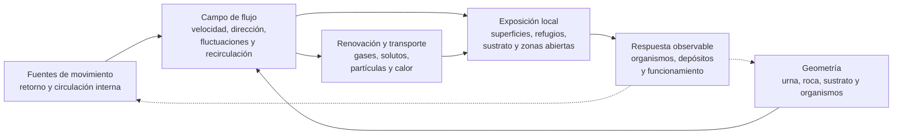

# Dimensión hidráulica

## Qué es

La dimensión hidráulica describe cómo se mueve, se distribuye y se renueva el agua dentro de un acuario marino de arrecife. Incluye el retorno, la circulación interna, el intercambio superficial, la turbulencia, los gradientes, el transporte de materia y la formación de zonas de acumulación o baja renovación.

No es una cifra única de litros por hora ni una lista de bombas. Un mismo caudal nominal puede producir condiciones muy diferentes según la geometría del display, la posición de las entradas y salidas, la rugosidad de las superficies, el nivel de agua, el crecimiento de los organismos y la resistencia del circuito.

La aplicación concreta de esta dimensión en Veril se documenta en [hidráulica](../../veril/hidraulica.md). La [dimensión de procesamiento](dimension-procesamiento.md) define las funciones que la circulación cumple dentro del método Berlín, mientras que la [dimensión de infraestructura](dimension-infraestructura.md) define los límites de retorno, niveles y seguridad de la urna.

La tesis de esta dimensión es:

> La hidráulica debe evaluarse por la renovación y distribución efectiva del agua en las zonas funcionales, no por el caudal nominal de los equipos instalados.

Para Veril se adopta una línea de diseño basada en separar el retorno de la circulación interna y comprobar la renovación efectiva de cada zona. Esta referencia responde a la necesidad de evaluar un display compacto y espacialmente irregular sin reducir su comportamiento a una suma de caudales; se aplicará mediante el análisis del campo de flujo, el tiempo de residencia, el transporte y las pruebas de funcionamiento documentadas en [hidráulica](../../veril/hidraulica.md).

Dentro del modelo integrado, esta dimensión describe el transporte y la renovación que conectan infraestructura, espacio, biología y procesamiento. No define la geometría, la comunidad ni la composición química.

## Principio de funcionamiento

La circulación organiza varios procesos relacionados:

1. El transporte de oxígeno, compuestos disueltos, partículas y calor
2. El intercambio entre la columna de agua y las superficies de organismos, roca y sustrato
3. La renovación de zonas expuestas, protegidas y parcialmente cerradas
4. La suspensión, deposición y transporte de detritos hacia zonas de retirada
5. La distribución de alimento y señales químicas dentro del display
6. La disipación de gradientes locales de temperatura, gases y solutos

El diagrama representa relaciones funcionales. No implica que una dirección de flujo, una cifra de caudal o una apariencia superficial demuestren por sí solas que la hidráulica sea adecuada.

## Componentes fundamentales

### Impulsión, retorno y entradas

La impulsión establece diferencias de presión y movimiento que deben convertirse en renovación útil dentro del sistema. El retorno conecta la zona técnica con el display, pero su caudal nominal no describe por sí solo el flujo que llega a las superficies.

El caudal de retorno y la circulación interna no deben sumarse como si describieran una única capacidad hidráulica. El retorno determina principalmente el intercambio entre el display y la zona técnica, mientras que las bombas de movimiento condicionan principalmente la distribución y renovación dentro del display. Un retorno elevado puede atravesar rápidamente la zona técnica y seguir dejando áreas poco renovadas en el display; una circulación interna intensa puede mover eficazmente el display sin aumentar en la misma proporción el agua que atraviesa los mecanismos situados en la zona técnica.

El caudal efectivo del retorno debe distinguirse del caudal nominal de la bomba. La altura de impulsión, las tuberías, los codos, las boquillas, las reducciones, la suciedad y otras pérdidas hidráulicas modifican el caudal realmente entregado.

Las entradas deben permanecer protegidas frente a obstrucciones y situarse de forma que no aspiren sustrato, aire o detritos de manera persistente. Las salidas deben poder inspeccionarse, limpiarse y orientarse sin perder la seguridad del sistema.

### Circulación interna

La circulación interna distribuye el movimiento más allá del chorro inicial. Puede producir componentes direccionales y fluctuantes, regiones de recirculación y distintos grados de turbulencia; además, los equipos pueden imponer variaciones pulsadas u oscilantes en el tiempo.

La circulación efectiva debe comprobarse en el volumen completo, incluyendo:

- La superficie del agua
- Las caras expuestas de la estructura
- Los pasos, grietas y espacios inferiores
- Las zonas situadas detrás o entre las masas
- Las superficies de sustrato
- Las cámaras y entradas que formen parte del recorrido

### Intercambio superficial y oxigenación

El movimiento superficial aumenta la renovación de la interfaz aire-agua y puede favorecer el intercambio de gases, incluidos oxígeno y dióxido de carbono. Una agitación superficial visible suele asociarse a una mayor renovación de la interfaz aire-agua, pero no permite por sí sola deducir la concentración de oxígeno disuelto del sistema. Su efecto neto depende del gradiente existente entre agua y atmósfera, de la temperatura, la salinidad, la carga respiratoria y otros mecanismos de aireación.

La circulación debe proporcionar una renovación superficial compatible con el intercambio gaseoso previsto, evitando tanto una interfaz insuficientemente renovada como una agitación que produzca salpicaduras, pérdida de agua, ruido o inestabilidad del sustrato.

### Gradientes y zonas de flujo

Una distribución hidráulica funcional no exige que todas las zonas reciban el mismo movimiento. Puede conservar gradientes de exposición, protección y velocidad siempre que las zonas de menor flujo sigan siendo accesibles, renovadas y compatibles con sus habitantes.

El flujo junto a una superficie no equivale necesariamente al caudal total del sistema. La orientación, la rugosidad, la forma de la colonia y la interacción entre corrientes modifican la capa límite y el transporte local.

Dos organismos situados a una velocidad ambiental semejante pueden experimentar condiciones de intercambio diferentes debido a su tamaño, morfología, orientación y rugosidad. Por ello, la velocidad del agua medida cerca de una colonia tampoco constituye por sí sola una medida completa de la exposición hidráulica de sus tejidos.

## Transporte y acumulación

La hidráulica no transforma ni retira la materia por sí misma. Puede mantener partículas en suspensión, transportarlas hacia una ruta de retirada o favorecer su deposición en zonas desde las que deban extraerse.

Las zonas de acumulación previsibles deben poder localizarse. Un depósito de detritos detrás de la roca, bajo una estructura o en una cámara puede indicar una combinación de geometría, campo de flujo y accesibilidad que necesita revisión.

La retirada concreta de sólidos, el funcionamiento del skimmer, la filtración mecánica y los cambios de agua pertenecen a la [dimensión de procesamiento](dimension-procesamiento.md). Esta dimensión solo define cómo el movimiento del agua condiciona el transporte hacia esas funciones.

## Efectos sobre organismos y superficies

El movimiento del agua puede modificar el intercambio de gases y solutos en la superficie de organismos, la llegada de partículas, la retirada local de metabolitos, la extensión de tejidos y la deposición de sedimentos. La respuesta depende de la especie, la morfología, el estado del organismo y su aclimatación.

En organismos fotosintéticos, el flujo puede interactuar con la exposición lumínica y con la disponibilidad local de gases y solutos. La [dimensión de iluminación](dimension-iluminacion.md) define el régimen de luz; esta dimensión define si la zona recibe una renovación hidráulica compatible con esa exposición.

En organismos que dependan de alimentación particulada, la circulación condiciona la llegada, permanencia y dispersión del alimento. La alimentación concreta y la respuesta del organismo se documentan en la [dimensión biológica](dimension-biologica.md) y en las fichas de los organismos.

El flujo también afecta al sustrato. Un movimiento excesivo puede desplazarlo o crear nubes persistentes; uno insuficiente puede favorecer la deposición en determinadas zonas. La selección y distribución del sustrato pertenecen a la [dimensión espacial](dimension-espacial.md) y a la ficha [espacial de Veril](../../veril/espacial.md); aquí se evalúa su respuesta hidráulica.

## Elementos compatibles, pero no obligatorios

### Control de velocidad y programación

La regulación permite modificar la intensidad, la dirección o la periodicidad del movimiento. No convierte cualquier programación en adecuada y añade estados que deben registrarse para poder interpretar la respuesta.

### Pulsos y oscilación

Los pulsos u oscilaciones pueden cambiar la dirección y la exposición de las superficies. Su valor depende del patrón real producido por el equipo y de la respuesta del sistema, no del nombre comercial del modo de funcionamiento.

### Difusores, boquillas y deflectores

Pueden ampliar, dividir o cambiar la dirección de una descarga. También pueden reducir el caudal útil, crear pérdidas de carga, dificultar la limpieza o generar zonas de sombra hidráulica.

### Sensores y trazadores

La observación de partículas, colorantes adecuados o movimiento superficial puede ayudar a localizar rutas y depósitos. Estos recursos son indicativos y no sustituyen una evaluación prolongada ni una medición apropiada para la pregunta concreta.

## Variantes habituales

### Flujo predominantemente direccional

Concentra la energía en rutas identificables. Puede facilitar la orientación y el transporte, pero aumenta el riesgo de chorros localizados, sombras detrás de la estructura y zonas que quedan fuera de la ruta principal.

### Flujo turbulento o distribuido

Reparte el movimiento mediante múltiples interacciones y cambios de dirección. Puede renovar más superficies, aunque es más difícil de describir mediante una única cifra y puede generar puntos de alta velocidad.

### Flujo pulsado u oscilante

Alterna la intensidad o la dirección a lo largo del tiempo. Puede reducir la exposición permanente a un único chorro, pero exige evaluar los estados intermedios y los efectos sobre el sustrato y los tejidos.

### Flujo con zonas protegidas

Conserva áreas de menor velocidad junto a rutas de renovación. Puede ser útil para refugios u organismos de menor tolerancia al movimiento, pero una zona protegida no debe convertirse en un depósito permanente sin intercambio.

## Fortalezas, debilidades y críticas

### Fortalezas conocidas

- Permite distribuir oxígeno, solutos, partículas y calor por el sistema
- Puede reducir la acumulación localizada cuando transporta la materia hacia rutas de retirada bien conectadas
- Permite crear gradientes compatibles con organismos y superficies diferentes
- Puede mejorar el intercambio local junto a tejidos y superficies activas
- Permite adaptar el movimiento a los cambios de geometría y crecimiento

### Debilidades conocidas

- El caudal nominal no permite deducir la distribución real dentro del display
- La geometría puede crear sombras hidráulicas y bolsas de baja renovación
- Un aumento de movimiento puede desplazar el sustrato o dañar tejidos sin resolver otras zonas
- La regulación y los cambios de dirección dificultan atribuir una respuesta a una sola causa
- Las bombas, entradas y salidas introducen puntos de fallo, obstrucción, ruido y calor
- La circulación no sustituye a la retirada física, al skimmer ni al mantenimiento

### Críticas habituales de sus detractores

- **Obsesión por el caudal**: Se critica que los sistemas se comparen por litros por hora sin observar la distribución real
- **Complejidad innecesaria**: Se cuestiona que las programaciones, pulsos y múltiples bombas añadan más variables que capacidad de interpretación
- **Reproducción artificial del arrecife**: Se señala que un patrón programado no reproduce automáticamente las condiciones de un entorno natural
- **Más movimiento como solución universal**: Se advierte que aumentar la velocidad puede desplazar el sustrato, estresar tejidos o esconder el problema de una mala geometría
- **Indicadores visuales insuficientes**: Se recuerda que ondulaciones superficiales o partículas en movimiento no demuestran renovación adecuada en todas las zonas

### Opiniones extendidas

| Opinión extendida | Qué expresa | Lectura técnica |
| --- | --- | --- |
| «Más flujo siempre es mejor» | La asociación entre movimiento intenso y mayor calidad del sistema | El movimiento debe ser suficiente, distribuido y compatible con superficies, sustrato y organismos |
| «El caudal de la bomba define el flujo» | La equivalencia entre especificación nominal y condición real | El patrón depende del circuito, la geometría, la posición, la profundidad y la interacción entre corrientes |
| «Si la superficie se mueve, todo el acuario tiene buen flujo» | El uso de una señal visible como representación del volumen completo | La superficie puede moverse mientras existen bolsas de baja renovación detrás, debajo o dentro de la estructura |
| «Las zonas de flujo bajo están siempre mal» | La confusión entre protección y estancamiento | Una zona protegida puede ser funcional si conserva intercambio y puede mantenerse |
| «El flujo elimina los detritos» | La atribución de una función de retirada automática al movimiento | La circulación transporta o redistribuye materia; su retirada requiere una ruta y una intervención o mecanismo específico |
| «Un modo de bomba reproduce el arrecife natural» | La interpretación literal de una programación comercial | El modo solo describe una señal de control; la condición resultante debe observarse en el sistema concreto |

## Perspectivas propias de la dimensión hidráulica

Los siguientes puntos son una lectura funcional de esta dimensión elaborada para esta documentación, no una síntesis directa de fuentes externas ni una lista de resultados experimentales.

### La zona de baja velocidad como condición, no como fallo

Una zona de baja velocidad puede formar parte de un diseño funcional si recibe renovación suficiente, permite observar y retirar materia y se relaciona con organismos compatibles. El problema no es el flujo bajo en abstracto, sino la falta de intercambio y control.

### La estabilidad interpretativa

La circulación debe modificarse de forma que pueda relacionarse con la respuesta observada. Cambiar simultáneamente bombas, orientación, geometría, población y alimentación reduce la capacidad de distinguir una mejora real de una redistribución temporal de materia.

## Ventajas y compromisos frente a otras dimensiones

| Dimensión relacionada | Aporte de la hidráulica | Compromiso o límite |
| --- | --- | --- |
| Procesamiento | Transporta oxígeno, materia y detritos entre superficies y mecanismos de retirada | No transforma ni exporta por sí sola la materia |
| Espacial | Conecta estructura, espacios negativos, refugios y superficies | La geometría puede limitar o fragmentar las rutas de renovación |
| Infraestructura | Integra retorno, niveles y seguridad del movimiento de agua | Un fallo en entradas, salidas o retorno puede afectar a todo el sistema |
| Iluminación | Modifica el intercambio local y la exposición efectiva de superficies | El flujo no corrige un espectro, PPFD o fotoperiodo incompatibles |
| Comunidad | Permite adaptar zonas de movimiento a organismos con necesidades distintas | Una comunidad diversa aumenta la complejidad de compatibilidad y observación |

## Aplicación en un sistema pequeño

En un sistema pequeño, unos pocos centímetros pueden separar una zona de alta velocidad de otra protegida. La proporción entre la estructura, las bombas y el volumen libre hace que la geometría tenga una influencia especialmente visible sobre el patrón hidráulico.

### Prioridades específicas

- Comprobar la renovación detrás, debajo y entre las masas, no solo el movimiento de la superficie
- Evitar que la circulación desplace el sustrato o altere la playa y el canal
- Mantener las entradas y salidas accesibles para inspección y limpieza
- Relacionar cada zona de bajo flujo con una ruta de renovación y un uso previsto
- Observar el sistema con el aquascape y la población en sus estados previsibles
- Registrar la configuración de bombas y el nivel de agua durante las pruebas

### Compromisos de escala

Una bomba sobredimensionada para el espacio libre puede crear un chorro intenso sin renovar las zonas protegidas. Añadir más equipos puede reducir el espacio, aumentar el calor y el ruido y hacer más difícil interpretar el patrón resultante.

El crecimiento puede cerrar corredores, aumentar la rugosidad, crear sombras hidráulicas y cambiar la deposición. La aceptación debe considerar la trayectoria previsible y no solo el montaje inicial.

## Qué no es esta dimensión

La dimensión hidráulica:

- No es una cifra única de litros por hora
- No es una marca, un modelo de bomba ni un modo de programación
- No garantiza oxigenación suficiente solo por mover la superficie
- No convierte todo el display en una zona uniformemente renovada
- No sustituye al procesamiento biológico, al skimmer ni a la retirada física
- No determina por sí sola la compatibilidad de un organismo
- No demuestra que un coral esté bien por presentar movimiento de tejido
- No elimina la necesidad de observar el sustrato, los detritos y las zonas protegidas

## Errores comunes al aplicarla

- Dimensionar el sistema únicamente por el caudal máximo anunciado
- Orientar la descarga hacia la estructura sin comprobar qué ocurre detrás y debajo
- Aumentar la velocidad para resolver una acumulación causada por mala accesibilidad
- Considerar una zona renovada solo porque contiene un hueco visible
- Ignorar el desplazamiento del sustrato durante el ajuste de las bombas
- Colocar organismos según la distancia a la bomba y no según el flujo que reciben en su superficie
- Cambiar la geometría y la programación de las bombas al mismo tiempo
- No comprobar el comportamiento después del crecimiento o de una modificación del aquascape
- Interpretar partículas en movimiento como prueba de que toda la materia llegará a un punto de retirada

## Función durante el ciclado, la maduración y las transiciones

Durante el ciclado y la maduración, la circulación debe proporcionar a las superficies que se pretenda colonizar unas condiciones de renovación y transporte compatibles con los procesos que se espera que desarrollen. El patrón inicial deberá comprobarse de nuevo cuando se añadan roca, sustrato, equipos u organismos.

Durante las transiciones se registrarán los cambios que puedan modificar el campo de flujo o su interpretación:

- Posición, orientación o potencia de las bombas
- Nivel de agua y configuración del retorno
- Geometría del aquascape
- Granulometría o distribución del sustrato
- Población y crecimiento de organismos
- Alimentación y carga de partículas

La circulación concreta durante el ciclado y la maduración se coordina con los planes operativos correspondientes y no se define mediante esta ficha como un calendario universal. La [dimensión de infraestructura](dimension-infraestructura.md) establece los límites de niveles y seguridad; la [espacial](dimension-espacial.md) y la [biológica](dimension-biologica.md) documentan los cambios que pueden alterar la geometría o la respuesta.

## Cómo evaluar la dimensión en funcionamiento

### Renovación y distribución

- Existe movimiento observable en la superficie, las rutas abiertas y las zonas inferiores previstas
- Las zonas protegidas conservan intercambio suficiente y no presentan tiempos de residencia o acumulaciones de detritos incompatibles con su función
- El patrón se comprueba con la geometría real, no solo con el display vacío
- Las entradas y salidas permanecen accesibles y sin obstrucciones

### Sustrato y detritos

- El sustrato permanece dentro de la distribución prevista
- No existen nubes persistentes durante el funcionamiento normal
- Las acumulaciones previsibles pueden localizarse y relacionarse con una ruta de transporte
- Las zonas de depósito no bloquean las rutas de entrada, salida o renovación

La retirada y el mantenimiento de las acumulaciones pertenecen a la [dimensión de procesamiento](dimension-procesamiento.md) y a la aplicación espacial concreta.

### Organismos y superficies

- Los tejidos no reciben un chorro incompatible o una exposición permanentemente forzada
- La llegada y retirada de partículas son compatibles con los organismos previstos
- El crecimiento no ha cerrado rutas funcionales ni creado sombras hidráulicas permanentes
- Los cambios de comportamiento o tejido pueden relacionarse con una configuración documentada

### Seguridad y estabilidad

- El retorno se reinicia sin aspiración persistente de aire
- La parada de las bombas produce el comportamiento hidráulico previsto
- El movimiento no genera salpicaduras, vibraciones o inestabilidad del sustrato incompatibles con el sistema

Los niveles de parada, el riesgo de desbordamiento, la accesibilidad de equipos y la seguridad de la urna pertenecen a la [dimensión de infraestructura](dimension-infraestructura.md) y a la ficha de [hidráulica de Veril](../../veril/hidraulica.md).

## Indicadores que pueden inducir a error

No demuestran por sí solos que la dimensión hidráulica esté bien resuelta:

- El caudal nominal indicado en una ficha de bomba
- El movimiento de la superficie visto desde el frente
- La ausencia de detritos durante una observación breve
- La presencia de partículas en suspensión
- La extensión de los pólipos en un momento concreto
- El silencio del equipo sin comprobar la renovación
- La ausencia de desplazamiento del sustrato cuando existen zonas no observadas
- El funcionamiento correcto con el acuario vacío de roca u organismos

La aceptación debe basarse en la distribución real, la estabilidad del patrón, la respuesta de las superficies y la capacidad de mantener las zonas de acumulación.

## Resumen funcional

| Aspecto | Función o criterio |
| --- | --- |
| Tipo de dimensión | Régimen de movimiento, renovación y transporte del agua |
| Variante adoptada | Renovación efectiva con retorno y circulación interna diferenciados |
| Soporte principal | Impulsión, retorno, geometría, superficie y rutas de renovación |
| Variables principales | Dirección, velocidad, fluctuaciones, turbulencia, niveles y distribución |
| Procesos relacionados | Intercambio gaseoso, transporte de solutos, partículas, calor y detritos |
| Unidad de evaluación | Zona funcional y superficie que recibe el flujo |
| Criterio principal | Renovación distribuida, estable y compatible con el sistema |
| Restricción principal | Geometría, espacio libre, sustrato, crecimiento y accesibilidad |
| Complementos | Regulación, pulsos, oscilación, difusores y trazadores |
| Riesgo principal | Confundir caudal nominal o movimiento superficial con renovación efectiva |
| Unidad de aceptación | Patrón hidráulico reproducible y respuesta observable del conjunto |

## Apéndice: términos hidráulicos

### Caudal

Volumen de agua que atraviesa una sección por unidad de tiempo. El caudal nominal de un equipo no equivale necesariamente al caudal útil que llega a una zona concreta.

### Caudal efectivo

Caudal que realmente atraviesa una sección o llega a una zona después de considerar la altura de impulsión, las tuberías, los codos, las boquillas, las reducciones, la suciedad y otras pérdidas hidráulicas. Puede ser muy inferior al caudal nominal indicado para la bomba.

### Velocidad

Desplazamiento del agua en una zona o dirección determinada. Puede variar mucho dentro de un mismo display y no debe confundirse con el caudal total del circuito.

### Turbulencia

Estado del flujo caracterizado por fluctuaciones de velocidad y movimiento vortical en distintas escalas. En un acuario puede manifestarse como fluctuaciones locales de velocidad y dirección producidas por la interacción entre chorros, obstáculos y superficies. No debe utilizarse simplemente como sinónimo de flujo irregular, pulsado o multidireccional.

### Capa límite difusiva

Zona próxima a una superficie donde el transporte de gases y solutos puede estar limitado por difusión. Su espesor y comportamiento cambian con la velocidad, la rugosidad, la forma del organismo y la turbulencia local.

### Renovación

Sustitución o mezcla efectiva del agua de una zona con agua procedente de otras partes del sistema. Una cavidad puede tener movimiento visible y, aun así, una renovación insuficiente.

Una masa de agua puede presentar movimiento continuo dentro de una cavidad o detrás de una roca y, aun así, intercambiarse muy lentamente con el resto del sistema.

### Zona de baja renovación

Área en la que el intercambio de agua es reducido respecto al resto del display. Puede ser funcional si se mantiene controlada, accesible y compatible con los organismos, pero no debe convertirse en una acumulación permanente.

### Tiempo de residencia

Tiempo característico durante el que una masa de agua permanece en una zona antes de intercambiarse de forma significativa con el resto del sistema. No debe interpretarse como una constante simple en un display complejo, pero ayuda a distinguir movimiento local de renovación efectiva. Una recirculación interna puede producir velocidad visible sin reducir necesariamente el tiempo de residencia de una cavidad.

## Fuentes y límites de la evidencia

- [Flow enhances photosynthesis in marine benthic autotrophs by increasing the efflux of oxygen from the organism to the water](https://pmc.ncbi.nlm.nih.gov/articles/PMC2823876/): Estudio sobre la relación entre flujo, capa límite e intercambio de oxígeno en organismos bentónicos marinos. No define una velocidad universal para acuarios domésticos
- [Ciliary vortex flows and oxygen dynamics in the coral boundary layer](https://pmc.ncbi.nlm.nih.gov/articles/PMC7200650/): Estudio sobre dinámica de oxígeno en la capa límite de un coral y su relación con la velocidad del flujo. No permite extrapolar un valor de flujo a todos los corales
- [Effect of water motion on coral photosynthesis and calcification](https://www.sciencedirect.com/science/article/pii/0022098188901906): Estudio experimental sobre movimiento del agua, fotosíntesis y calcificación en corales. Sus condiciones no deben trasladarse directamente como requisitos de montaje
- [Effects of water flow and ocean acidification on oxygen and pH gradients in coral boundary layer](https://pmc.ncbi.nlm.nih.gov/articles/PMC11148076/): Estudio que compara flujos bajos y moderados en varias especies y mide gradientes de oxígeno y pH en la capa límite. Refuerza la variabilidad entre especies y no define una velocidad universal
- [Sedimentation processes in a coral reef embayment](https://www.sciencedirect.com/science/article/pii/S0025322709001339): Estudio sobre deposición, resuspensión y transporte de sedimentos en un entorno arrecifal. Aporta contexto para la dinámica de partículas, pero no establece reglas de mantenimiento para acuarios domésticos

La evidencia disponible respalda que el movimiento del agua puede modificar el intercambio gaseoso, el transporte de solutos y partículas, la fotosíntesis, la calcificación, el crecimiento y las condiciones de las capas límite en organismos marinos. Las referencias experimentales citadas sustentan principalmente los efectos del flujo sobre el transporte de masa, las capas límite y la fisiología bentónica. Las recomendaciones sobre localización y retirada de detritos son una aplicación funcional al mantenimiento del acuario y no establecen una velocidad crítica universal de resuspensión o deposición. Esta evidencia no permite definir un caudal, una velocidad, una frecuencia de pulsos ni una programación universal. La aplicación concreta debe basarse en la geometría, la configuración de equipos, la observación de las zonas funcionales y la respuesta prolongada de los organismos.
