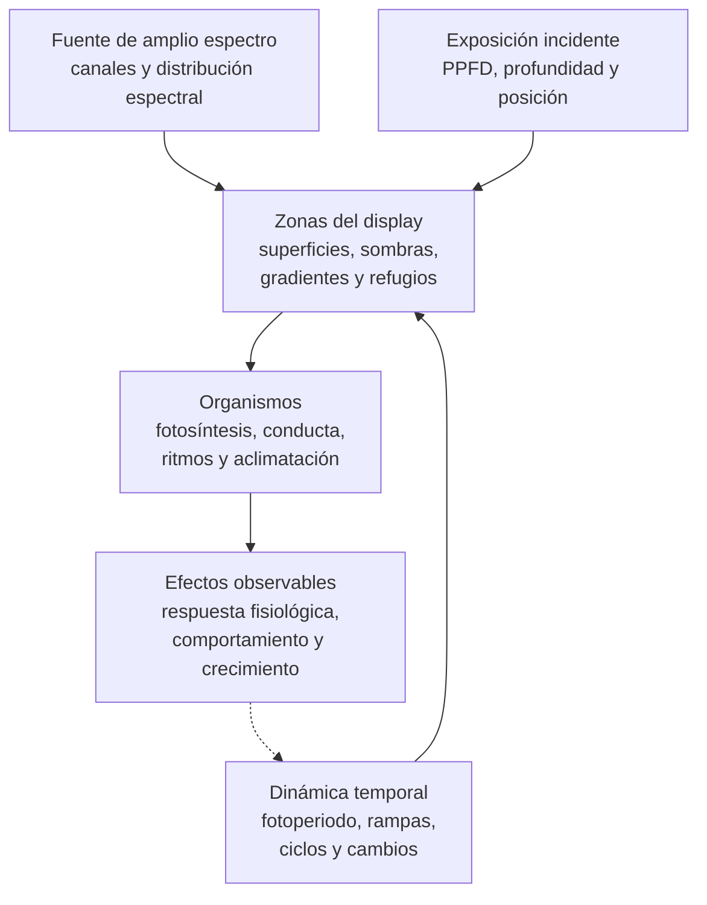

# Dimensión de iluminación

## Qué es

La dimensión de iluminación describe cómo la luz organiza las condiciones visuales, fisiológicas y temporales de un acuario marino de arrecife. Incluye la composición espectral, la intensidad, la distribución espacial, el fotoperiodo, las transiciones, los cambios programados y la posible influencia de la luz lunar.

Esta ficha parte de una luminaria LED de amplio espectro capaz de combinar diferentes componentes espectrales y regular su intensidad. No define una marca, una potencia, una programación concreta ni una medición específica de un sistema.

La iluminación no debe evaluarse como una cifra única. Una misma intensidad puede producir resultados distintos según el espectro, la profundidad, la orientación, la transparencia del agua, la geometría del aquascape, la especie y el estado de aclimatación del organismo.

La tesis de esta dimensión es:

> La iluminación debe evaluarse como un régimen de espectro, intensidad y tiempo, ajustado a organismos concretos y aplicado mediante cambios compatibles con su aclimatación.

## Principio de funcionamiento

La luz disponible para los organismos depende de varios elementos que actúan conjuntamente:

1. La composición espectral de la fuente
2. La cantidad de fotones que alcanza cada zona
3. La duración y distribución diaria de la exposición
4. La velocidad con la que cambian las condiciones
5. La posición, orientación y superficie que recibe la luz
6. La capacidad del organismo para aclimatarse y responder

El diagrama representa relaciones funcionales. No implica que una medición de PPFD dentro del intervalo PAR (400–700 nm), una apariencia cromática o una programación concreta demuestren por sí solas que la iluminación sea adecuada.

## Elementos fundamentales

### Espectro

El espectro describe la distribución relativa de la radiación emitida en distintas longitudes de onda. Una luminaria de amplio espectro puede combinar componentes azules, violetas, verdes, amarillos, rojos y otras bandas dentro de su rango de funcionamiento.

El espectro puede afectar:

- La absorción de luz por los pigmentos del coral y sus simbiontes
- La apariencia visual de los organismos y de sus pigmentos fluorescentes
- La periodicidad de algunos procesos fotosintéticos
- La percepción visual y la conducta de peces e invertebrados
- La penetración relativa de la luz a través del agua y sobre las superficies

El espectro de una luminaria no debe describirse únicamente por su temperatura de color ni por el aspecto visual que produce. Dos configuraciones con apariencia semejante pueden distribuir de forma distinta la energía entre sus bandas.

Los límites entre bandas son aproximados y se utilizan únicamente con fines descriptivos. Los efectos fotobiológicos reales se distribuyen de forma continua a lo largo del espectro y dependen de la absorción de los pigmentos, la dosis y el organismo. Como orientación funcional, las bandas pueden interpretarse así:

| Banda aproximada | Efectos potenciales | Habitantes afectados o relacionados | Precauciones |
| --- | --- | --- | --- |
| UV-A cercano y violeta visible, aproximadamente 365–420 nm | Puede influir en pigmentos fotoprotectores, fluorescencia y respuesta al estrés lumínico | Corales y otros organismos fotosintéticos con pigmentos sensibles; también percepción visual de algunos peces e invertebrados | No debe suponerse que una fuente LED de arrecife emita de forma relevante por debajo de 365 nm salvo que su especificación espectral lo documente; entre 400 y 420 nm la radiación sí entra en el PAR convencional |
| Azul y azul verdoso, aproximadamente 420–500 nm | Participa de forma importante en la absorción fotosintética de muchos simbiontes y atraviesa relativamente bien el agua | Corales fotosintéticos, anémonas, gorgonias fotosintéticas y algas; también organismos cuya coloración o conducta responde a esta banda | Un aspecto azul intenso no demuestra que la cantidad total de luz sea adecuada |
| Verde y amarillo, aproximadamente 500–600 nm | Contribuye al régimen espectral y a la percepción visual; su aprovechamiento depende de los pigmentos y simbiontes | Organismos fotosintéticos y habitantes cuya visión depende de la distribución espectral | No debe considerarse inútil ni suficiente por sí solo; su efecto depende de la mezcla completa |
| Rojo, aproximadamente 600–700 nm | Contribuye a la fotosíntesis cuando alcanza los pigmentos adecuados, pero se atenúa con mayor rapidez en el agua que las bandas azules y su peso relativo suele ser menor en ambientes arrecifales profundos | Organismos fotosintéticos, algas y habitantes sensibles a la percepción cromática | Su proporción debe interpretarse dentro de la mezcla espectral y de la profundidad efectiva |
| Radiación por encima de 700 nm | Puede participar en efectos fotobiológicos o térmicos específicos según la longitud de onda y la fuente, pero queda fuera del PAR convencional | No constituye por sí sola una base para asignar necesidades de organismos de arrecife | No debe utilizarse como sustituto de la cuantificación de PPFD dentro del intervalo PAR (400–700 nm) |

Estas bandas no funcionan de forma aislada. La respuesta real depende de la dosis lumínica total, la distribución espectral, la profundidad, la especie, sus simbiontes y su estado de aclimatación.

### Fuente LED y consecuencias

Una fuente LED permite controlar de forma relativamente independiente distintos canales espectrales y modificar rápidamente la intensidad programada. Estas capacidades son útiles para ajustar el régimen de iluminación, pero también introducen consecuencias que deben comprobarse en el sistema real:

- La regulación de canales puede alterar simultáneamente la intensidad total, la proporción espectral y la apariencia visual
- La respuesta rápida de los LED permite cambios muy rápidos de intensidad que pueden diferir de las transiciones graduales observadas en ambientes naturales
- La emisión direccional y la óptica de los módulos pueden crear puntos calientes de PPFD y sombras marcadas entre piezas o colonias
- El *shimmer* y la variación superficial pueden modificar la exposición instantánea y la percepción visual sin cambiar necesariamente el PPFD medio registrado
- Un único punto estático puede no representar adecuadamente una superficie tridimensional expuesta a luz dinámica
- La disipación térmica se concentra en la luminaria y sus componentes, aunque una fuente LED no elimina por completo la transferencia de calor al sistema
- Un canal violeta o azul no demuestra por sí solo que exista una emisión ultravioleta relevante; la banda efectiva debe conocerse o medirse según la fuente
- La intensidad y el espectro pueden cambiar con la altura, las lentes, la difusión, la suciedad, el envejecimiento y el estado de la luminaria

Por ello, una programación LED debe evaluarse por su salida efectiva sobre las superficies y no solo por los porcentajes mostrados en la aplicación de control.

### Intensidad, PAR y PPFD

La intensidad de la exposición lumínica puede describirse mediante distintas magnitudes. En el contexto de organismos fotosintéticos, PAR designa convencionalmente el intervalo de radiación fotosintéticamente activa comprendido entre 400 y 700 nm.

La cantidad de fotones de ese intervalo que alcanza una superficie por unidad de tiempo se expresa habitualmente mediante el **PPFD** (*Photosynthetic Photon Flux Density*), en µmol fotones m⁻² s⁻¹.

En acuariofilia, el término «PAR» se utiliza frecuentemente de manera informal para referirse al valor de PPFD proporcionado por un medidor PAR. Esta documentación distingue ambos conceptos cuando la precisión terminológica resulta relevante.

Algunos autores utilizan el término **PUR** (*Photosynthetically Usable Radiation*) para referirse a la fracción del espectro potencialmente aprovechable por determinados pigmentos. Su valor depende del organismo y no puede deducirse únicamente a partir de una medida de PPFD.

El PPFD es útil para comparar zonas y registrar exposición, pero no describe por sí solo:

- La composición espectral completa
- La distribución temporal de la luz
- La dirección de la radiación
- La variación sobre una superficie tridimensional
- El historial de aclimatación del organismo

Una cifra de PPFD debe interpretarse junto con el organismo, la posición, el espectro, el fotoperiodo y la estabilidad de la medición. La comparabilidad depende también de la respuesta espectral y la calibración del sensor utilizado.

### Categorías operativas para zonificar la exposición lumínica

Los siguientes grupos son categorías operativas para organizar zonas del display. No son requisitos taxonómicos ni sustituyen el rango documentado de cada organismo.

| Grupo operativo | PPFD orientativo durante el periodo principal | Organismos o situaciones que puede incluir | Criterio de uso |
| --- | --- | --- | --- |
| Sin iluminación fotosintética intencionada o PPFD residual | 0–20 µmol fotones m⁻² s⁻¹ | Organismos no fotosintéticos y zonas de refugio; algunos organismos pueden tolerar más luz ambiental | La ausencia de PPFD intencionado no elimina otras necesidades de flujo, alimentación o observación |
| Bajo | Aproximadamente 20–80 µmol fotones m⁻² s⁻¹ | Organismos fotosintéticos de sombra, superficies inferiores o especies con baja demanda lumínica documentada | Debe comprobarse que la exposición no limite la fotosíntesis a medio plazo |
| Intermedio | Aproximadamente 80–150 µmol fotones m⁻² s⁻¹ | Muchos corales y organismos fotosintéticos de demanda intermedia, según especie y aclimatación | Requiere observar crecimiento, pigmentación y respuesta del tejido |
| Alto | Aproximadamente 150–300 µmol fotones m⁻² s⁻¹ | Corales y organismos fotosintéticos de demanda alta cuando su ficha lo respalda | Debe introducirse de forma progresiva si el organismo procede de menor exposición |
| Muy alto | Más de 300 µmol fotones m⁻² s⁻¹ | Solo organismos explícitamente compatibles con exposiciones elevadas y correctamente aclimatados | No debe utilizarse como objetivo general ni como prueba de mayor calidad del sistema |

Los límites entre grupos son deliberadamente aproximados. Son categorías prácticas de zonificación, no umbrales fisiológicos universales ni rangos taxonómicos. La misma cifra puede ser adecuada para un organismo y excesiva o insuficiente para otro. Las gorgonias, anémonas, corales blandos, LPS, SPS y otros grupos no deben clasificarse únicamente por su nombre común: la necesidad depende de la especie, la colonia, los simbiontes, el origen y la historia lumínica.

Los organismos no fotosintéticos no se asignan automáticamente a un grupo de PPFD bajo. Su criterio principal puede ser la alimentación, el flujo, la calidad del agua y la ausencia de exposición innecesaria, aunque puedan tolerar o recibir luz residual.

### Distribución espacial

La luz no se distribuye uniformemente por todo el display. La altura, la distancia a la fuente, la orientación de las superficies, la rugosidad, las sombras y la transparencia del agua crean zonas diferenciadas.

La relación entre luz, roca, sustrato, sombras y espacios abiertos pertenece también a la [dimensión espacial](dimension-espacial.md). Esta dimensión define cómo interpretar la iluminación de esas zonas, no cómo construir el aquascape concreto.

### Fotoperiodo

El fotoperiodo es la secuencia diaria de exposición y oscuridad. Puede incluir una fase de aumento, un periodo principal, una fase de reducción y un periodo oscuro.

Su función no consiste simplemente en maximizar las horas de luz. Debe coordinar:

- Demanda fotosintética
- Ritmos diarios de los organismos
- Conducta de peces e invertebrados
- Observación y mantenimiento
- Acumulación de calor y consumo energético
- Tiempo suficiente de oscuridad

Una exposición más prolongada no compensa automáticamente una intensidad insuficiente ni mejora necesariamente la respuesta de todos los organismos.

### Dosis diaria de luz

La **DLI** (*Daily Light Integral*) integra el PPFD recibido a lo largo del periodo de 24 horas y suele expresarse en mol de fotones m⁻² d⁻¹. Permite describir la dosis diaria acumulada, además de la intensidad instantánea.

El mismo PPFD máximo puede producir DLI diferentes si cambia el fotoperiodo. Del mismo modo, una dosis diaria similar puede obtenerse con combinaciones distintas de intensidad y duración. La DLI resulta especialmente útil para comparar regímenes con diferentes fotoperiodos o intensidades máximas. Dos sistemas con DLI similar pueden producir respuestas diferentes si difieren en espectro, distribución o forma de administrar la dosis a lo largo del día. La DLI no sustituye al espectro, la distribución espacial, la aclimatación ni la observación del organismo.

Como referencia operativa:

$$
\mathrm{DLI} = \frac{\int_0^{86400} \mathrm{PPFD}(t)\,dt}{10^6}
$$

Para un PPFD constante durante `h` horas:

$$
\mathrm{DLI} = \mathrm{PPFD} \times h \times 0{,}0036
$$

### Transiciones y cambios

Las transiciones son los cambios entre niveles de iluminación o entre periodos de luz y oscuridad. Pueden ser graduales o abruptas, programadas o consecuencia de una intervención.

La velocidad del cambio importa especialmente cuando:

- Se instala una luminaria nueva
- Se modifica la altura o la orientación
- Se incrementa la intensidad
- Se cambia de forma sustancial el espectro
- Se traslada un organismo a otra zona
- Se altera la geometría del aquascape

La aclimatación debe considerarse una propiedad del organismo y de su historial, no una consecuencia garantizada por el uso de rampas.

Conviene distinguir dos tipos de transición:

- Las rampas diarias de amanecer y atardecer, que distribuyen el cambio de luz dentro de un mismo ciclo de 24 horas
- Las rampas de aclimatación, que modifican progresivamente la exposición durante varios días o semanas al introducir una fuente, trasladar organismos o cambiar el régimen

Una rampa diaria de 60 minutos no sustituye necesariamente a una aclimatación progresiva durante días o semanas.

## Efectos sobre organismos fotosintéticos

### Fotosíntesis y limitación por luz

Los corales fotosintéticos y otros organismos con simbiontes utilizan la luz como parte de su metabolismo fotosintético. Una exposición insuficiente puede limitar la producción asociada a la fotosíntesis, pero la respuesta depende de la especie, los simbiontes, el estado fisiológico, la nutrición y la historia lumínica.

La respuesta no es lineal: después de alcanzar la saturación fotosintética, aumentar el PPFD no incrementa proporcionalmente la fotosíntesis y puede aparecer fotoinhibición.

La necesidad de luz no debe expresarse como una cifra universal válida para todos los corales. Las necesidades se documentarán para cada organismo y se relacionarán con las zonas medidas del sistema concreto.

### Exceso de luz y fotoinhibición

Una intensidad excesiva para el estado de aclimatación o para la capacidad fisiológica del organismo puede producir fotoinhibición, estrés, pérdida de pigmentación o blanqueamiento en determinadas condiciones.

La presencia de coloración intensa, fluorescencia o extensión de pólipos no demuestra por sí sola que la exposición sea óptima. La evaluación debe combinar respuesta fisiológica, comportamiento, crecimiento y estabilidad a lo largo del tiempo.

### Fotoaclimatación

Los organismos pueden modificar su respuesta a la luz mediante cambios fisiológicos, morfológicos o de pigmentación. La aclimatación puede requerir tiempo y no elimina el riesgo de un cambio demasiado rápido o de una exposición persistentemente incompatible.

La luz adecuada para un organismo ya aclimatado no debe utilizarse automáticamente como punto de partida para otro organismo o para una colonia trasladada desde condiciones distintas.

### Espectro y pigmentos

Los distintos componentes espectrales pueden ser absorbidos de forma diferente por los pigmentos del coral y sus simbiontes. El espectro también puede modificar la expresión o la percepción de pigmentos fluorescentes y fotoprotectores.

La fluorescencia visible es un resultado visual, no una medida directa de fotosíntesis, salud o crecimiento. La selección espectral debe atender a la respuesta del organismo y a la calidad de observación sin confundir ambas funciones.

## Efectos sobre peces e invertebrados no fotosintéticos

La iluminación también afecta a organismos que no dependen directamente de la fotosíntesis. Puede modificar:

- Alternancia entre actividad y reposo
- Uso de refugios y espacios abiertos
- Alimentación y respuesta a estímulos
- Orientación, vigilancia y conducta territorial
- Exposición al cuidador y a otros animales
- Ritmos diarios y respuesta a la oscuridad

La respuesta depende de la especie, la profundidad natural, la conducta, la presencia de refugios y la intensidad relativa de las zonas disponibles. Una iluminación adecuada para un coral no es automáticamente adecuada para todos los peces o invertebrados del mismo display.

La [dimensión de comunidad](dimension-comunidad.md) establece la compatibilidad de la iluminación con la comunidad prevista. Las fichas de organismos concretos deben definir sus necesidades particulares.

## Luz lunar y ciclos nocturnos

La luz lunar natural es mucho menos intensa que la iluminación diurna y cambia según la fase lunar, la hora y las condiciones ambientales. En algunas especies de coral, especialmente corales con reproducción sincronizada, los ciclos lunares y la luz nocturna pueden actuar como señales temporales.

La evidencia experimental indica que la fase lunar, el momento de la luz nocturna y la oscuridad posterior pueden influir en la expresión de ritmos biológicos y en la sincronización del desove de determinadas especies. Estos resultados no demuestran que todo coral de acuario necesite una luz lunar artificial.

Una luz nocturna artificial demasiado intensa, prolongada o constante puede alterar la señal natural de oscuridad y producir contaminación lumínica dentro del sistema. La oscuridad completa es una opción válida y evita introducir una señal nocturna artificial cuando no existe un objetivo específico que la justifique.

La luz lunar debe considerarse una herramienta opcional de señal temporal o de observación nocturna, no un sustituto de la iluminación diurna ni un requisito general de bienestar.

## Elementos compatibles, pero no obligatorios

### Canales regulables

La regulación independiente de canales permite modificar la mezcla espectral y la intensidad relativa. No demuestra que cualquier combinación resultante sea adecuada para los organismos.

### Rampas de encendido y apagado

Las rampas pueden representar transiciones graduales y facilitar una programación temporal. No sustituyen a la aclimatación ni corrigen una intensidad final o un espectro incompatibles.

### Luz lunar regulable

Una fuente nocturna regulable puede utilizarse para observación o para estudiar señales temporales en especies concretas. Debe poder reducirse o apagarse y no debe mantenerse por defecto a una intensidad que elimine la oscuridad funcional.

### Sombreado y difusión

El sombreado, la difusión o la modificación de la posición pueden reducir contrastes o crear zonas protegidas. Deben evaluarse sin bloquear la ventilación, elevar excesivamente la temperatura o eliminar la cobertura necesaria.

## Variantes habituales

### Régimen espectral amplio y equilibrado

Combina varias bandas dentro de un rango amplio y busca una representación visual y funcional diversa. Requiere comprobar la intensidad real y la respuesta de los organismos, porque «amplio espectro» no define una distribución única.

### Régimen dominado por bandas azules

Prioriza las bandas azules y violetas por su penetración relativa, la apariencia de fluorescencia o determinados objetivos de cultivo. Puede producir una lectura visual sesgada y no debe evaluarse solo por el color que percibe el cuidador.

### Régimen con cambios diarios programados

Distribuye la intensidad y el espectro en fases a lo largo del día. Puede representar amanecer, periodo principal y atardecer, pero añade parámetros que deben mantenerse estables y evaluarse en conjunto.

### Régimen con señal lunar

Añade una exposición nocturna débil y variable. Su función potencial es temporal o de observación, no sustituir el periodo oscuro ni demostrar por sí misma una mejora de la comunidad.

### Régimen con aclimatación progresiva

Introduce cambios de intensidad, altura, espectro o fotoperiodo de forma gradual. Es especialmente relevante al cambiar la fuente o trasladar organismos, aunque la velocidad adecuada depende de la situación y no de una cifra universal.

## Fortalezas, debilidades y críticas

### Fortalezas conocidas

- Permite crear zonas diferenciadas para organismos con necesidades lumínicas distintas
- Una luminaria LED regulable de amplio espectro permite ajustar por separado, dentro de sus límites, objetivos fisiológicos y visuales
- La regulación permite adaptar la exposición a la geometría y a la evolución del sistema
- La medición de PPFD dentro del intervalo PAR (400–700 nm) permite comparar zonas y registrar cambios
- La programación temporal puede coordinar exposición, oscuridad, observación y mantenimiento

### Debilidades conocidas

- El PPFD no describe por sí solo la distribución espectral, la dirección ni la dinámica temporal de la iluminación
- Una luminaria de amplio espectro no garantiza una distribución uniforme ni adecuada en todo el display
- La respuesta a la luz depende de especie, simbiontes, aclimatación, nutrición y estado del organismo
- Las sombras y los gradientes pueden cambiar con el crecimiento y la modificación del aquascape
- Los cambios de intensidad o espectro pueden producir respuestas tardías y difíciles de atribuir a una sola causa
- La luz lunar artificial puede introducir una señal nocturna no deseada si se utiliza con demasiada intensidad o duración

### Críticas habituales de sus detractores

- **Exceso de control**: Se critica que la regulación de canales y horarios produzca una complejidad difícil de mantener o interpretar
- **Dependencia de una cifra**: Se cuestiona que el PPFD se utilice como sustituto de la historia lumínica, el espectro y la respuesta del organismo
- **Estética sobre fisiología**: Se advierte que la fluorescencia o el color visual pueden priorizarse frente a crecimiento y estabilidad
- **Simulación lunar innecesaria**: Se considera que la luz nocturna artificial puede ser una complicación sin beneficio demostrado para la mayoría de acuarios domésticos
- **Uniformidad artificial**: Se critica que intentar iluminar todas las superficies por igual elimine gradientes y refugios útiles

### Opiniones extendidas

| Opinión extendida | Qué expresa | Lectura técnica |
| --- | --- | --- |
| «Más PPFD siempre es mejor» | La asociación entre mayor intensidad y mayor calidad de iluminación | El PPFD debe relacionarse con el organismo, el espectro, la DLI y la aclimatación; superar la saturación puede aumentar el estrés o la fotoinhibición |
| «Si el coral se abre, la luz es correcta» | El uso de una señal conductual inmediata como prueba de adecuación | La extensión de pólipos es solo un indicador entre otros y no demuestra por sí sola fotosíntesis, crecimiento o estabilidad |
| «Más blanco es más natural» | La identificación de apariencia visual con semejanza ambiental | El color percibido no describe por sí solo la distribución espectral ni la dosis que reciben las superficies |
| «El azul solo sirve para ver fluorescencia» | La reducción de una banda a su efecto estético | Las bandas azules pueden participar en la absorción fotosintética y deben evaluarse dentro del espectro completo |
| «Un medidor PAR lo dice todo» | La confianza en una cifra puntual como descripción completa | Un medidor registra PPFD dentro del intervalo PAR, pero no resume espectro, dirección, distribución temporal ni respuesta del organismo |
| «La luz lunar es necesaria para los corales» | La extrapolación de señales reproductivas a una necesidad general | La luz lunar artificial es opcional y no sustituye un periodo oscuro funcional |

## Perspectivas propias de la dimensión de iluminación

Los siguientes puntos son una lectura funcional de esta dimensión elaborada para esta documentación, no una síntesis directa de fuentes externas ni una lista de resultados experimentales.

### El mapa de luz como capacidad de diseño

Conocer las zonas de exposición permite asignar organismos, conservar refugios y anticipar cambios. La medición no convierte una zona en adecuada para cualquier especie, pero permite comparar la condición real con la necesidad documentada.

### La oscuridad como parte de la iluminación

El periodo sin iluminación no es simplemente la ausencia de un ajuste. Forma parte del régimen temporal y puede afectar a conducta, descanso, ritmos y señales reproductivas.

### La estabilidad como criterio de interpretación

Una programación estable facilita relacionar los cambios observados con la luz. Las modificaciones simultáneas de espectro, intensidad, fotoperiodo, población y mantenimiento reducen la capacidad de interpretar la respuesta.

## Comparación entre regímenes de iluminación

La comparación se limita a la organización de la luz y no determina qué régimen debe utilizar una comunidad concreta.

| Régimen | Ventaja relativa | Compromiso |
| --- | --- | --- |
| Amplio espectro regulable | Permite combinar bandas, intensidad y objetivos visuales | Añade parámetros y no garantiza una distribución adecuada por sí solo |
| Régimen espectral estrecho o dominado por pocas bandas | Simplifica el objetivo espectral y puede favorecer una lectura visual concreta | Reduce la flexibilidad para organismos y objetivos diferentes |
| Fotoperiodo uniforme | Facilita la programación y la interpretación temporal | No representa transiciones ni cambios graduales |
| Ciclo con rampas | Permite transiciones y fases diferenciadas | Puede complicar la atribución de efectos y no sustituye a la aclimatación |
| Con luz lunar | Puede aportar una señal temporal o facilitar observación nocturna | Puede reducir la oscuridad funcional y no es necesaria para todos los organismos |

## Aplicación en un sistema pequeño

En un sistema pequeño, la distancia entre la fuente y las superficies puede variar mucho dentro de pocos centímetros. La geometría de la roca y la posición de los organismos tienen por ello un efecto proporcionalmente importante sobre la exposición.

### Prioridades específicas

- Medir la distribución real antes de asignar zonas a corales fotosintéticos
- Medir varias alturas y orientaciones, no solo el fondo o la superficie horizontal
- Registrar la altura de la luminaria y cualquier difusor o lente utilizado junto con el mapa de PPFD
- Relacionar cada organismo con una zona compatible y no con una cifra aislada
- Conservar sombras y zonas de menor exposición cuando la comunidad las necesite
- Evitar cambios simultáneos que impidan interpretar la respuesta
- Mantener accesible la fuente para ajustar altura, posición o mantenimiento
- Reservar un periodo oscuro funcional

### Compromisos de escala

Una sola fuente puede producir diferencias marcadas entre superficies altas, laterales, inferiores y protegidas. Intentar corregir toda diferencia mediante más intensidad puede aumentar la exposición de las zonas ya iluminadas sin resolver las sombras estructurales.

El crecimiento puede acercar organismos a la fuente, crear sombra sobre otros o cambiar la orientación de las superficies. La planificación debe considerar esa trayectoria y no solo el mapa inicial.

## Qué no es esta dimensión

La iluminación:

- No es una cifra única de PPFD
- No se define por el color visual, la fluorescencia ni una señal aislada
- No sustituye a la aclimatación ni al seguimiento del organismo
- No determina por sí sola la compatibilidad de una comunidad
- No necesita luz lunar artificial para que exista un periodo nocturno
- No compensa por sí sola una geometría, circulación o química inadecuadas

## Errores comunes al aplicarla

- Utilizar el PPFD como única descripción de la iluminación
- Interpretar los porcentajes de los canales LED como una medida directa de PPFD o de espectro completo
- Cambiar intensidad, espectro y fotoperiodo al mismo tiempo
- Colocar todos los corales bajo la misma exposición por comodidad
- Aumentar la intensidad para compensar sombras creadas por el aquascape
- Trasladar un organismo a otra zona sin considerar su aclimatación
- No registrar la altura, la posición o el estado de la fuente al comparar mediciones
- Evaluar la respuesta inmediatamente después de un cambio y no durante un periodo suficiente
- Ignorar la oscuridad funcional y los ritmos de los habitantes

## Función durante el ciclado, la maduración y las transiciones

La iluminación no debe utilizarse para acelerar el ciclado. Durante la maduración, la intensidad y el fotoperiodo deben introducirse de acuerdo con el estado del sistema y con el plan operativo correspondiente.

Durante las transiciones deben registrarse los cambios de:

- Fuente o luminaria
- Altura y orientación
- Espectro
- Intensidad
- Fotoperiodo
- Señal lunar
- Geometría o posición de los organismos

Una modificación de la iluminación debe considerarse junto con el estado de aclimatación y no como un simple cambio de programación.

## Cómo evaluar la dimensión en funcionamiento

### Medición física

- Existe un mapa de PPFD realizado bajo condiciones documentadas
- Se conocen los puntos o zonas medidos
- Las mediciones pueden repetirse o compararse con una referencia documentada
- La posición de la fuente y de las superficies está registrada
- El fotoperiodo y la intensidad de los canales están registrados
- La altura de la luminaria y cualquier difusor o lente están registrados
- El estado de las bombas y de la superficie del agua durante la medición está registrado

### Respuesta de organismos fotosintéticos

- La respuesta se observa durante un periodo suficiente
- No se interpreta una única señal aislada como demostración de éxito
- El crecimiento, la pigmentación, la extensión y el estado del tejido se relacionan con el historial de cambios
- La distribución de los organismos coincide con las zonas de exposición previstas

### Respuesta de peces e invertebrados

- Se observan periodos de actividad, descanso, refugio y alimentación
- La iluminación no elimina el uso de refugios necesarios
- La conducta cambia de forma interpretable después de una modificación
- El periodo oscuro se conserva de manera suficiente

### Régimen temporal

- El fotoperiodo se ejecuta según la programación documentada
- Las transiciones son reproducibles
- Las señales lunares, si existen, tienen intensidad y duración registradas
- Los cambios recientes pueden relacionarse con la respuesta observada

## Indicadores que pueden inducir a error

No demuestran por sí solos que la dimensión de iluminación esté bien resuelta:

- Un valor de PPFD elevado en un único punto
- Una apariencia azul o fluorescente atractiva
- La extensión de pólipos durante una observación breve
- La ausencia inmediata de blanqueamiento tras un cambio
- Una programación compleja con muchos canales
- La uniformidad de la luz en una fotografía

La aceptación debe basarse en mediciones repetibles, régimen temporal conocido y respuesta observable de los organismos.

## Resumen funcional

| Aspecto | Función o criterio |
| --- | --- |
| Tipo de dimensión | Régimen de iluminación de amplio espectro para un acuario marino de arrecife |
| Fuente de referencia | Luminaria LED de amplio espectro con canales regulables |
| Variables principales | Espectro, PPFD, DLI, distribución, fotoperiodo y transiciones |
| Unidad de evaluación | Organismo y zona de exposición dentro del régimen completo |
| Criterio principal | Exposición compatible, aclimatación y respuesta observable |
| Restricción principal | Diferencias entre especies, zonas y estados fisiológicos |
| Complementos | Regulación de canales, rampas, sombreado y luz lunar opcional |
| Riesgo principal | Confundir una cifra, un color o una programación con adecuación fisiológica |
| Unidad de aceptación | Régimen reproducible y respuesta documentada del conjunto |

## Apéndice: términos de iluminación

### PAR

PAR es el intervalo convencional de radiación fotosintéticamente activa, normalmente 400–700 nm. La cantidad de fotones dentro de ese intervalo que alcanza una superficie se expresa habitualmente como PPFD, en µmol fotones m⁻² s⁻¹. El PPFD es una medida útil de exposición, pero no resume el espectro, la dirección, el tiempo ni la historia del organismo.

### Espectro amplio

«Amplio espectro» describe una fuente que combina varias bandas de emisión. No significa que todas las bandas tengan la misma intensidad ni que exista una receta universal de proporciones.

### Fotoperiodo

El fotoperiodo es la secuencia diaria de luz y oscuridad, incluidas sus fases de transición cuando existen.

### DLI

La DLI (*Daily Light Integral*) es la cantidad total de fotones fotosintéticamente activos recibidos por una superficie durante un día. Integra la variación del PPFD a lo largo del tiempo y suele expresarse en mol de fotones m⁻² d⁻¹.

Es una forma complementaria de describir la dosis diaria, no una sustitución del espectro, la distribución, el fotoperiodo detallado ni la respuesta del organismo.

### PUR

PUR (*Photosynthetically Usable Radiation*) describe la fracción del espectro potencialmente aprovechable por determinados pigmentos y organismos. No es una magnitud universal independiente del organismo y no puede deducirse únicamente a partir de una medida de PPFD.

### Luz lunar

La luz lunar es la exposición nocturna débil y variable asociada al ciclo lunar natural. Una fuente artificial azul constante no reproduce por sí sola ese ciclo ni demuestra que el organismo necesite iluminación nocturna.

## Fuentes y límites de la evidencia

### Revisiones y síntesis

- [The engine of the reef: photobiology of the coral–algal symbiosis](https://pmc.ncbi.nlm.nih.gov/articles/PMC4141621/): Revisión sobre fotobiología, fotoaclimatación, escalas temporales y factores que modulan la simbiosis coral-alga
- [Impacts of light limitation on corals and crustose coralline algae](https://pmc.ncbi.nlm.nih.gov/articles/PMC5599546/): Revisión sobre limitación por luz, PAR, DLI y adaptación en corales y algas coralinas

### Estudios experimentales y protocolos

- [Influence of the Quantity and Quality of Light on Photosynthetic Periodicity of Coral Endosymbiotic Algae](https://pmc.ncbi.nlm.nih.gov/articles/PMC3422335/): Estudio experimental sobre el efecto de la cantidad y la calidad espectral de la luz en la periodicidad fotosintética de dinoflagelados simbiontes y de *Stylophora pistillata*. No establece un espectro universal para todos los corales
- [Photo-acclimation dynamics of the coral *Stylophora pistillata* to low and extremely low light](https://www.sciencedirect.com/science/article/pii/S0022098101003094): Estudio sobre respuestas de fotoaclimatación a distintos niveles de luz. Respalda que la historia lumínica importa, pero no permite deducir una curva universal de aclimatación
- [Fluorescent pigments in corals are photoprotective](https://www.nature.com/articles/35048564): Trabajo experimental sobre pigmentos fluorescentes y fotoprotección. No permite utilizar la fluorescencia visible como indicador aislado de salud o fotosíntesis
- [Effects of Light Dynamics on Coral Spawning Synchrony](https://doi.org/10.1086/BBLv220n3p161): Estudio experimental que separa componentes de la dinámica lumínica y su relación con la sincronización del desove de *Acropora humilis*. Su contexto reproductivo no equivale al mantenimiento ordinario de un acuario doméstico
- [Lunar Phase Modulates Circadian Gene Expression Cycles in the Broadcast Spawning Coral *Acropora millepora*](https://doi.org/10.1086/BBLv230n2p130): Estudio experimental sobre fase lunar, luz nocturna y expresión génica circadiana. Se refiere a una especie y a procesos concretos, no a una necesidad universal de luz lunar
- [Moonrise timing is key for synchronized spawning in coral *Dipsastraea speciosa*](https://doi.org/10.1073/pnas.2101985118): Estudio experimental sobre el momento del ascenso lunar y el desove sincronizado. No demuestra que la iluminación lunar artificial mejore la salud general de los corales
- [Inducing broadcast coral spawning ex situ: Closed system mesocosm design and husbandry protocol](https://doi.org/10.1002/ece3.3538): Protocolo experimental de reproducción ex situ que trata fotoperiodo, luz lunar y contaminación lumínica en contextos de desove. No debe trasladarse directamente a la rutina de un arrecife doméstico

La evidencia disponible respalda que el espectro, la intensidad, el tiempo y los cambios lumínicos pueden producir respuestas diferenciadas en organismos fotosintéticos y otros habitantes. No permite definir una programación universal, un valor de PPFD válido para todos los corales ni una necesidad general de luz lunar. La aplicación concreta debe basarse en las necesidades documentadas de cada organismo, mediciones del sistema y observación prolongada.
