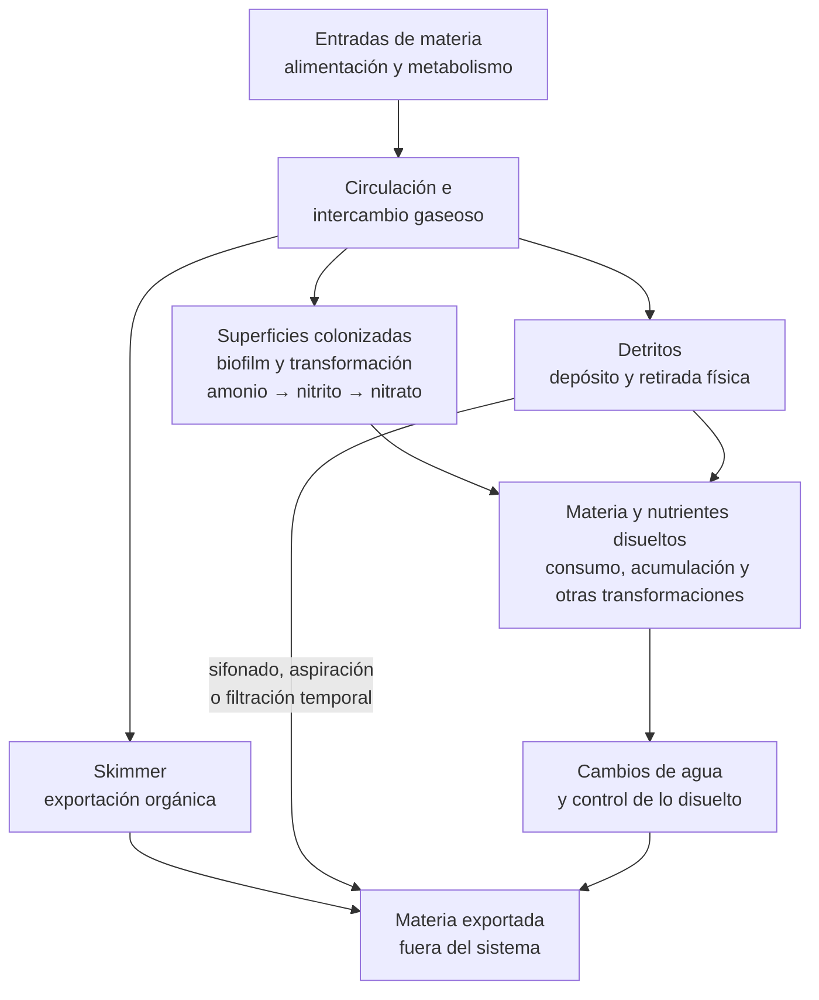

# Dimensión de procesamiento

## Qué es

Esta dimensión de procesamiento se basa en el método Berlín y organiza el procesamiento biológico, la circulación y la exportación en acuarios marinos de arrecife. Su núcleo funcional se sostiene en tres elementos interdependientes:

La [dimensión hidráulica](dimension-hidraulica.md) desarrolla específicamente cómo se distribuye y se evalúa el movimiento del agua. Esta ficha solo define la función que la circulación cumple dentro del procesamiento y la exportación del Berlín.

1. Una comunidad biológica establecida sobre la roca y las demás superficies sumergidas
2. Una circulación y una oxigenación suficientes para sostener los procesos biológicos y transportar materia
3. Un skimmer de proteínas como mecanismo continuo y característico de exportación de materia orgánica

A estos elementos se suman las tareas de mantenimiento que cierran el balance del sistema: retirada de detritos, cambios de agua, control de la carga biológica y seguimiento de los parámetros relevantes.

Históricamente, la arquitectura se desarrolló alrededor de la roca viva, que aportaba simultáneamente estructura, superficie biológica y comunidades ya establecidas de microorganismos y pequeños organismos bentónicos. No solo ofrecía una superficie: también introducía biodiversidad que, en aquella época, resultaba difícil o imposible reproducir artificialmente. En un montaje moderno puede emplearse roca seca, artificial o inicialmente inerte, pero esto proporciona una superficie colonizable, no una comunidad madura equivalente a la de una roca viva.

El método no fija una cantidad universal de roca por litro, una cifra universal de circulación, un calendario de mantenimiento, una marca de productos ni un protocolo de ciclado. Es una forma de distribuir las funciones de procesamiento y exportación dentro del arrecife.

El método Berlín no debe identificarse únicamente por la presencia de determinados componentes, sino por la arquitectura funcional que estos forman en conjunto y por las funciones que efectivamente cumplen.

Para Veril se adopta el método Berlín como arquitectura de procesamiento de referencia porque organiza el sistema alrededor de superficies colonizadas, circulación, intercambio gaseoso y exportación orgánica mediante skimmer y mantenimiento. La aplicación no se comprobará por la etiqueta ni por el número de componentes, sino por la transformación, retención, retirada y exportación de materia que el sistema demuestre.

Dentro del modelo integrado, esta dimensión describe cómo se transforma, retiene y retira la materia. La biología aporta las entradas; la hidráulica las transporta; la química permite interpretar el resultado; y la infraestructura y el espacio delimitan dónde ocurre.

En términos funcionales, un sistema Berlín puede entenderse como una arquitectura destinada a mantener equilibrados los flujos de entrada, transformación y exportación de materia.

## Principio de funcionamiento

Todo acuario de arrecife recibe continuamente materia y energía. La alimentación y los propios organismos introducen o generan compuestos orgánicos, amonio, partículas, dióxido de carbono, nitrógeno y fósforo.

El sistema debe resolver funciones diferentes:

1. Transformar compuestos potencialmente tóxicos, especialmente el nitrógeno amoniacal
2. Transportar oxígeno, nutrientes, calor y residuos entre las distintas partes del acuario
3. Retirar materia antes o después de su transformación para evitar una acumulación indefinida
4. Coordinar la transformación y la exportación con las condiciones fisicoquímicas documentadas en la [dimensión química](dimension-quimica.md)

El Berlín distribuye estas funciones entre las superficies colonizadas, la circulación, el intercambio gaseoso, el skimmer y las intervenciones de mantenimiento. Las condiciones de la comunidad, del agua y de la infraestructura se documentan en sus dimensiones respectivas.

La distinción fundamental es que procesar materia no significa exportarla del sistema. Las bacterias pueden transformar amonio en nitrito y posteriormente en nitrato, pero el nitrógeno continúa dentro del acuario. Del mismo modo, la descomposición de una partícula orgánica no supone su eliminación: sus componentes pasan a otras formas químicas o biológicas.

La estabilidad a largo plazo depende del equilibrio entre entradas, transformación, consumo, almacenamiento y exportación.

Puede resumirse así:

> La biología transforma; la circulación conecta los procesos; el skimmer y el mantenimiento exportan



El diagrama representa funciones relacionadas, no una secuencia única ni una proporción fija de equipamiento. La circulación conecta las entradas con las superficies activas y los mecanismos de exportación; la transformación biológica puede cambiar la forma química de la materia sin sacarla del sistema.

## Componentes fundamentales

### Superficie biológica colonizada

El procesamiento biológico del Berlín no reside en un aparato concreto. Se distribuye entre las superficies sumergidas del sistema y las comunidades que las colonizan, aunque no todos los organismos ni todos los procesos que ocurren sobre ellas forman parte de la nitrificación. Las superficies relevantes incluyen roca, sustrato, paredes, tuberías y, cuando existen, medios biológicos adicionales.

La roca tiene una importancia especial porque combina varias funciones, documentadas también en las dimensiones [biológica](dimension-biologica.md) y [espacial](dimension-espacial.md):

- Proporciona una superficie colonizable
- Estructura el aquascape
- Crea refugios y microhábitats
- Modifica localmente el flujo
- Sirve de soporte para corales, algas y otros organismos

Sobre estas superficies se desarrollan biofilms y otras comunidades colonizadoras. La composición y evolución de esas comunidades pertenecen a la [dimensión biológica](dimension-biologica.md); aquí interesa su función como soporte de transformación.

Uno de sus procesos más importantes es la nitrificación:

```text
amonio → nitrito → nitrato
```

Este proceso protege a los habitantes frente a la acumulación de nitrógeno amoniacal, pero no constituye por sí mismo una exportación de nitrógeno. En determinadas zonas y bajo condiciones adecuadas pueden producirse procesos adicionales de transformación. Su magnitud no debe suponerse únicamente porque una roca sea porosa o exista abundante biomedia; la capacidad demostrada se evalúa mediante el ciclado, la maduración y el seguimiento del sistema.

La capacidad biológica real depende de la comunidad que se haya establecido y de las condiciones en las que trabaja. Por ello, superficie disponible, superficie colonizada y capacidad biológica efectiva no son conceptos equivalentes.

Una superficie inaccesible, cubierta de detrito, sin flujo o todavía no colonizada no equivale a un biofiltro funcional. Una gran cantidad de material tampoco demuestra automáticamente una mayor capacidad de procesamiento.

### Circulación como conexión funcional

La circulación conecta físicamente las distintas funciones del sistema. El retorno y las bombas de movimiento transportan:

- Oxígeno
- Dióxido de carbono
- Nutrientes
- Materia orgánica disuelta y particulada
- Calor
- Productos del metabolismo

También permiten que el agua alcance las superficies colonizadas y ayudan a impedir que determinadas zonas se conviertan en depósitos permanentes de sedimento.

La circulación adecuada no puede definirse únicamente mediante una cifra de litros por hora. La [dimensión hidráulica](dimension-hidraulica.md) documenta el campo de flujo, la renovación, el transporte y el intercambio superficial; esta dimensión solo evalúa si esas funciones conectan las superficies activas y los mecanismos de exportación.

### Skimmer de proteínas

El skimmer de proteínas es el elemento de exportación continua más característico del método Berlín. Mediante fraccionamiento de espuma genera una gran interfaz entre aire y agua. Determinados compuestos con afinidad por esa interfaz se concentran sobre las burbujas, ascienden con la espuma y terminan acumulándose en la copa.

Cuando se retira el skimmate, una fracción de esa materia abandona físicamente el sistema. Esta característica permite intervenir antes de que toda la materia orgánica sea completamente mineralizada. El posible efecto del skimmer sobre el intercambio gaseoso se interpreta en la [dimensión hidráulica](dimension-hidraulica.md).

No debe interpretarse como un dispositivo universal de limpieza. Un skimmer:

- No captura todos los sólidos
- No retira todos los compuestos orgánicos
- No elimina directamente todo el nitrógeno o fósforo
- No sustituye al biofiltro
- No evita la acumulación de detritos
- No elimina la necesidad de mantenimiento

Su rendimiento depende, entre otros factores, de:

- Diseño del equipo
- Profundidad de trabajo
- Estabilidad del nivel de agua
- Caudal de aire y agua
- Salinidad y temperatura
- Carga orgánica
- Ajuste
- Limpieza

El tamaño nominal del skimmer es una característica del equipo y no una garantía de rendimiento en cualquier instalación. La cantidad o el color del skimmate tampoco constituyen por sí solos una medida de la calidad del agua.

Durante el ciclado, el uso del skimmer y de otros mecanismos de exportación debe seguir el plan operativo y las instrucciones del producto utilizado. Esta dimensión solo distingue qué función de procesamiento queda activa o temporalmente limitada; la secuencia concreta pertenece al [plan de ciclado](../../ciclado/plan.md) y al [plan de maduración](../../maduracion/plan.md).

## Exportación y mantenimiento

### Detritos y mantenimiento físico

No toda la materia permanece disuelta ni llega al skimmer. Parte termina depositándose entre las rocas, sobre el sustrato, en cámaras técnicas o en zonas de bajo flujo. Allí puede continuar degradándose y devolver compuestos disueltos al agua.

Incluso un Berlín sin filtración mecánica permanente necesita una estrategia para los sólidos. Puede consistir en:

- Mantener determinadas partículas en circulación
- Crear zonas de depósito accesibles
- Sifonar selectivamente
- Aspirar cámaras técnicas
- Emplear temporalmente filtración mecánica
- Retirar manualmente las acumulaciones

La ausencia de un filtro mecánico permanente no significa ausencia de gestión mecánica de residuos.

### Cambios de agua

Los cambios de agua constituyen una forma sencilla de exportación y corrección. Permiten retirar una fracción de los compuestos presentes y, utilizando agua correctamente preparada, reponer simultáneamente componentes consumidos.

Su frecuencia y volumen deben responder a la carga, el consumo y la evolución medida del sistema, no a una propiedad intrínseca del método Berlín. No sustituyen todos los demás mecanismos de control, pero son especialmente útiles en sistemas pequeños.

## Elementos compatibles, pero no obligatorios

El Berlín admite complementos mientras sus funciones estén claramente identificadas. La presencia de uno de estos elementos no define por sí sola el método ni convierte automáticamente el sistema en otra arquitectura.

### Filtración mecánica

Calcetines, perlón, esponjas o rollers pueden concentrar partículas y facilitar su retirada. Su eficacia depende de que la materia atrapada se retire efectivamente.

Si un medio mecánico permanece cargado demasiado tiempo, parte de los sólidos retenidos continuará degradándose dentro del propio filtro. La cuestión relevante no es si un Berlín debe tener filtración mecánica, sino qué sólidos se quieren retirar, dónde se concentrarán y con qué frecuencia saldrán del sistema.

### Sustrato

La sustrato es compatible con el Berlín. Puede proporcionar sustrato para determinados organismos, superficie colonizable, hábitat para microfauna y una función paisajística.

Una capa fina de sustrato no debe confundirse con una cama profunda diseñada específicamente para desnitrificación. Los sistemas DSB o diseños equivalentes introducen requisitos propios de profundidad, granulometría, flujo, estabilidad, fauna y funcionamiento biológico, por lo que constituyen una decisión adicional.

La presencia de sustrato tampoco convierte automáticamente el sistema en un método Jaubert.

### Medios biológicos adicionales

Cerámicas, bloques porosos y otros medios pueden ampliar la superficie disponible para colonización cuando existe una necesidad concreta.

Antes de incorporar un medio adicional conviene definir:

1. Qué problema pretende resolver
2. Dónde recibirá flujo
3. Cómo se evitará la acumulación de detritos
4. Cómo se mantendrá y limpiará
5. Qué indicador permitirá evaluar si aporta valor y qué ocurrirá si se retira

Más superficie no significa automáticamente más capacidad útil, más biodiversidad ni mayor estabilidad. Un medio biológico debe tratarse como un componente funcional, no como una reserva abstracta de filtración.

### Refugio de macroalgas

Un refugio puede añadir otra vía de procesamiento y exportación de nutrientes. Las macroalgas incorporan nitrógeno, fósforo y otros elementos a su biomasa durante el crecimiento. La exportación efectiva se produce cuando parte de esa biomasa se cosecha y retira del sistema.

El refugio también puede proporcionar hábitat protegido para determinados organismos de la microfauna. Su funcionamiento depende de disponer de:

- Iluminación adecuada
- Nutrientes disponibles
- Circulación
- Espacio
- Crecimiento efectivo
- Cosecha periódica

Un refugio que no produce biomasa significativa tampoco realiza una exportación significativa. No forma parte del núcleo del Berlín y su presencia no convierte automáticamente el sistema en TRITON.

### Filtración química y otros complementos

Carbón activo, adsorbentes de fosfato, reactores, UV, ozono y otros sistemas pueden incorporarse para resolver necesidades concretas. Su presencia no define el método.

Cada complemento debe documentarse por su función real, sus condiciones de uso, sus límites y el problema que pretende resolver.

## Variantes habituales

### Berlín clásico

Mantiene como elementos centrales la roca viva, la circulación intensa y el skimmer, acompañados del mantenimiento y los cambios de agua necesarios.

### Berlín moderno con roca seca o artificial

Conserva la misma arquitectura funcional, pero parte de superficies inicialmente poco colonizadas. El ciclado y la maduración adquieren especial importancia porque la estructura física puede existir mucho antes que la comunidad biológica que deberá ocuparla.

### Berlín sin filtración mecánica permanente

Gestiona los sólidos mediante circulación, sedimentación controlada, sifonado, aspiración y otras intervenciones periódicas. Es viable siempre que los detritos puedan localizarse y retirarse.

### Berlín con filtración mecánica

Añade un mecanismo continuo o temporal para capturar partículas. Sigue siendo compatible con el Berlín mientras actúe como complemento y se mantenga adecuadamente.

### Berlín con medios biológicos adicionales

Añade superficie colonizable para resolver una necesidad documentada. El medio debe recibir un flujo adecuado, permanecer accesible y mantenerse sin convertirse en un depósito de detritos.

### Berlín con refugio de macroalgas

Añade consumo y exportación de nutrientes mediante el crecimiento y la cosecha de biomasa. Requiere iluminación, circulación, espacio y una pauta de poda definidos.

### Berlín híbrido

Mantiene el núcleo funcional del Berlín e incorpora mecanismos adicionales de procesamiento, exportación o control químico cuya función puede identificarse y evaluarse de forma independiente del núcleo Berlín. El término híbrido resulta útil cuando interesa dejar claro que determinadas funciones proceden de componentes adicionales y no del método Berlín propiamente dicho.

## Fortalezas, debilidades y críticas

Ninguna arquitectura de mantenimiento es superior en todos los acuarios. Las ventajas y debilidades del Berlín dependen del volumen, la carga, los organismos, el espacio técnico, la disponibilidad de roca colonizada y la constancia del mantenimiento.

### Fortalezas conocidas

- Separa con claridad el procesamiento biológico, el transporte y la exportación
- Puede sostener acuarios de arrecife con una comunidad amplia de corales e invertebrados cuando la capacidad del sistema se demuestra y la carga se mantiene dentro de sus límites
- Permite exportar parte de la materia orgánica antes de su mineralización completa mediante el skimmer
- No necesita una cama profunda, un plenum ni un refugio para conservar su núcleo funcional
- Deja la elección de filtración mecánica, química, refugios y medios adicionales abierta a necesidades concretas
- Hace posible localizar y evaluar las funciones del sistema sin atribuir toda la estabilidad a un único aparato
- Admite roca viva, roca cultivada, roca artificial y roca seca como puntos de partida distintos, siempre que se reconozcan sus diferencias biológicas
- Se puede ampliar mediante complementos sin perder la arquitectura principal, siempre que se documente qué función aporta cada uno

### Debilidades conocidas

- La forma histórica dependía de roca viva de calidad, cuya biodiversidad no se reproduce automáticamente con roca seca o biomedia inerte
- La nitrificación protege frente al amonio, pero no garantiza por sí sola la exportación de nitrato ni de fósforo
- La roca, el aquascape, las tuberías y las cámaras técnicas pueden ocultar o acumular detritos si el flujo y el acceso son insuficientes
- El skimmer requiere espacio, energía, ajuste, limpieza y un nivel de agua estable, y su rendimiento cambia con la carga orgánica
- El skimmer no cubre por sí solo todos los nutrientes ni los compuestos que permanecen disueltos, por lo que el sistema necesita una estrategia complementaria
- La estabilidad depende de la circulación, la oxigenación, la reposición de evaporación y la continuidad de varios equipos
- En sistemas pequeños, los cambios de volumen, nivel, salinidad y carga se producen con menos margen de reacción
- El nombre «Berlín» se usa con significados distintos, por lo que una etiqueta no basta para conocer la configuración real

### Críticas habituales de sus detractores

Las críticas deben distinguirse de los fallos de aplicación. Algunas cuestionan el enfoque histórico; otras cuestionan la forma en que se ha simplificado o comercializado. Las opiniones extendidas entre acuaristas son relevantes como parte de la recepción del método, pero se presentan aquí como críticas generalizadas y no como resultados experimentales concluyentes.

- **Dependencia de la roca viva**: Se critica que la roca viva puede introducir organismos no deseados, enfermedades, contaminantes o una biodiversidad difícil de controlar. La crítica pierde fuerza cuando se habla de roca cultivada o de una fuente verificada, pero la sustitución por roca seca también elimina parte de la ventaja ecológica original
- **Coste ambiental de la roca natural**: Se cuestionan la extracción, el transporte y la presión sobre hábitats naturales cuando la roca procede directamente del arrecife. Este argumento pertenece a la evaluación de la procedencia y no demuestra por sí solo que toda roca viva tenga el mismo impacto
- **Exportación incompleta**: Se señala que el Berlín puede convertir amonio en nitrato sin resolver por sí mismo el destino final del nitrógeno. Esta crítica es válida cuando se confunde biofiltración con exportación o se omiten los cambios de agua, el consumo biológico y otras vías de retirada
- **Dependencia del skimmer**: Sus detractores consideran que el skimmer añade coste, ruido, consumo y mantenimiento, y que puede retirar parte de la materia orgánica, bacterias o alimento que algunos sistemas desean conservar. El efecto depende del ajuste, la carga y el objetivo nutricional; no justifica tratarlo como universalmente perjudicial o imprescindible
- **Riesgo de sobreexportación**: El skimming intenso combinado con una carga reducida u otros mecanismos de exportación puede llevar a una disponibilidad de nutrientes inferior a la adecuada para la comunidad mantenida. No es una consecuencia necesaria ni exclusiva del Berlín, sino un desequilibrio entre entradas, consumo y exportación
- **Acumulación oculta**: Se critica que el rechazo de la filtración mecánica permanente puede convertirse en una acumulación de sólidos detrás de la roca o en el sump si se interpreta como permiso para no retirar detritos
- **Coste y complejidad real**: Aunque la receta se describe a veces como sencilla, un arrecife Berlín moderno puede requerir sump, skimmer, bombas, iluminación intensa, reposición automática, control de temperatura y dosificación. La sencillez biológica no equivale necesariamente a bajo coste o bajo mantenimiento
- **Naturalidad discutible**: Frente a sistemas con refugios, camas de sustrato o cultivo de macroalgas, se critica que el Berlín prioriza la exportación técnica y la accesibilidad sobre la reproducción de una red trófica completa. Se trata principalmente de una diferencia de objetivos y de filosofía de diseño, no de un criterio objetivo de eficacia

Estas críticas no invalidan el método, pero obligan a declarar qué se espera de él, qué se exporta realmente y qué trabajo manual o técnico acompaña a la arquitectura.

### Opiniones extendidas en la acuariofilia

Las siguientes formulaciones aparecen de forma recurrente en la conversación entre acuaristas. Se documentan como percepciones generalizadas del hobby, no como una encuesta ni como conclusiones experimentales.

| Opinión extendida | Qué expresa | Lectura técnica |
| --- | --- | --- |
| «El Berlín es roca viva, skimmer y fondo desnudo» | El resumen histórico más reconocible de la arquitectura | Es una simplificación útil para describir una variante clásica, pero el método no exige fondo desnudo ni una cantidad fija de roca |
| «El Berlín es antiguo u obsoleto» | La percepción de que otras escuelas y sistemas propietarios han sustituido su enfoque original | Es históricamente antiguo, pero su núcleo funcional sigue presente en muchos sistemas modernos y puede combinarse con herramientas actuales; la antigüedad no demuestra su ineficacia |
| «El Berlín es el método natural» | La asociación entre roca viva, microfauna y procesos distribuidos | Tiene una dimensión más cercana a un ecosistema que un filtro cerrado, pero también depende de equipos, exportación y mantenimiento técnicos |
| «La roca viva siempre es mejor» o «la roca seca nunca equivale a ella» | El debate sobre biodiversidad importada, control de procedencia y madurez ecológica | La roca viva puede aportar una comunidad inicial más compleja, mientras que la roca seca ofrece otras ventajas de control y bioseguridad; puede convertirse en una superficie funcional mediante colonización, pero no es equivalente al inicio |
| «El Berlín es sencillo y casi autosuficiente» | La imagen de una arquitectura con pocos medios biológicos dedicados | Puede ser conceptualmente sencilla, pero no elimina la necesidad de controlar la carga, retirar detritos, exportar nutrientes y mantener los equipos |
| «El Berlín exige mucha roca» | La persistencia de reglas de carga basadas en peso o volumen | La cantidad necesaria no puede fijarse sin considerar porosidad, accesibilidad, flujo, colonización y carga real |

Estas opiniones ayudan a entender cómo se ha recibido y transmitido el método, pero no deben utilizarse como sustituto de una descripción de funciones, condiciones y resultados observables.

### Perspectivas propias del Berlín

Los siguientes puntos son una lectura funcional del método elaborada para esta documentación, no una síntesis directa de fuentes externas ni una lista de resultados experimentales.

#### Resiliencia del biofiltro distribuido

La distribución de la biología por la roca y las demás superficies colonizadas evita que toda la capacidad dependa de un único compartimento de biomedia. La pérdida o alteración de una superficie no equivale necesariamente a la pérdida completa del biofiltro.

Esta resiliencia no se extiende automáticamente a toda la arquitectura. La circulación y la oxigenación siguen siendo dependencias comunes de las superficies activas, y el skimmer concentra una parte característica de la exportación orgánica. Si falla el skimmer, la transformación biológica puede continuar, pero cambia el balance de exportación. Si falla la circulación o el intercambio gaseoso, se ven afectadas simultáneamente la llegada de oxígeno a las superficies y la retirada de materia.

La fortaleza propia del Berlín es, por tanto, una distribución de la función biológica, no la independencia frente a todos los fallos del sistema. Esta distribución reduce algunos puntos únicos de fallo biológico, pero no elimina dependencias sistémicas compartidas como la circulación, la oxigenación o la estabilidad térmica.

#### Biodiversidad frente a control

La roca viva histórica aportaba una comunidad biológica ya establecida además de una matriz colonizable. La roca seca o artificial conserva principalmente la estructura física y obliga a desarrollar la comunidad mediante colonización y maduración.

Esta diferencia crea una tensión específica del Berlín moderno: la roca viva puede ofrecer mayor biodiversidad inicial, mientras que la roca seca o artificial puede facilitar el control de procedencia, la bioseguridad y la composición inicial. Ninguna opción conserva simultáneamente todas las ventajas de la otra.

La decisión no debe expresarse como «roca viva buena» frente a «roca seca mala», sino como una elección sobre qué parte de la biodiversidad del método se importa, qué parte se desarrolla después y qué riesgos se aceptan.

#### Estrategia de nutrientes

El Berlín organiza el balance de nutrientes alrededor de dos ideas relacionadas pero diferentes: retirar parte de la materia orgánica antes de su mineralización mediante el skimmer y transformar el nitrógeno amoniacal mediante la comunidad de superficies colonizadas.

No incorpora por sí mismo un sumidero específico para todo el nitrato o el fosfato que permanezca disuelto. Por eso, dentro de esta arquitectura, el control de nutrientes depende de combinar exportación orgánica, retirada de sólidos, cambios de agua, consumo biológico u otros complementos identificados.

La misma orientación que permite limitar la mineralización temprana puede producir una disponibilidad insuficiente si la carga es baja y se acumulan demasiados mecanismos de exportación. El objetivo no es maximizar la retirada, sino mantener el balance compatible con la comunidad mantenida.

#### Transiciones y variantes híbridas

En el Berlín, cambiar el soporte biológico o añadir un mecanismo de exportación puede modificar la función real de la arquitectura. Sustituir roca viva por roca seca cambia la biodiversidad inicial; retirar una biomedia puede reducir una superficie colonizada; añadir un refugio, un DSB o un sistema de dosificación puede introducir una vía de procesamiento o control que ya no pertenece al núcleo Berlín.

Una transición debe documentar qué función desaparece, cuál aparece, cómo se comprueba el efecto y si la etiqueta «Berlín» sigue describiendo el núcleo o debe hablarse de un sistema híbrido. La clasificación no depende del número de componentes, sino de la distribución efectiva de funciones.

### Ventajas y compromisos frente a otras arquitecturas

La comparación siguiente es funcional y no constituye una prueba experimental de superioridad. Un sistema puede combinar varias filas.

| Arquitectura de referencia | Ventaja relativa del Berlín | Compromiso del Berlín |
| --- | --- | --- |
| Filtro biológico de goteo o wet-dry | Menor dependencia de un compartimento dedicado de biomedia y mayor énfasis en la exportación temprana de materia orgánica | No proporciona por sí solo una vía especializada de desnitrificación y sigue necesitando gestionar el nitrato |
| Jaubert o DSB | No depende de una cama profunda, un plenum, una granulometría concreta ni de mantener los gradientes de oxígeno característicos de una cama profunda diseñada para esos procesos | Tiene menos procesamiento de nitrato ligado específicamente al sustrato y depende más de exportación, consumo y mantenimiento externos |
| Refugio de macroalgas o Algal Turf Scrubber | Puede funcionar sin una superficie algal dedicada, iluminación específica ni cosecha de biomasa | No obtiene automáticamente las vías de consumo y exportación algal; el refugio tampoco aporta su hábitat protegido y el ATS tampoco aporta su asimilación concentrada sin crecimiento y cosecha efectivos |
| Zeolita, dosificación de carbono o sistema propietario | Utiliza una arquitectura más abierta, con menos dependencia de un protocolo comercial cerrado | Ofrece menos control dirigido sobre determinados nutrientes si no se añaden mecanismos específicos |
| Sistema natural o sin skimmer | Proporciona una vía de exportación orgánica y de intercambio gaseoso más directa y evaluable | Requiere aceptar el coste, el ajuste y el mantenimiento del skimmer y no conserva necesariamente toda la materia que otros sistemas dejan disponible |

La elección razonable depende de qué función se quiera priorizar. El Berlín es especialmente fuerte cuando se busca una arquitectura modular, oxigenada y orientada a la exportación orgánica, y menos apropiado cuando se pretende que una única cama de sustrato, refugio o aparato resuelva por sí solo el balance completo de nutrientes.

## Comportamiento del Berlín en sistemas pequeños

En un Berlín de bajo volumen los principios son los mismos, pero el margen operativo es menor. Una misma entrada absoluta de materia o una misma acumulación de sólidos representa una fracción mayor del sistema. La [dimensión de infraestructura](dimension-infraestructura.md) y la [química](dimension-quimica.md) documentan las consecuencias sobre volumen, niveles y composición; aquí interesa cómo afectan a la capacidad de procesamiento y exportación.

El tamaño reducido tampoco obliga a multiplicar los sistemas de filtración. Suele favorecer una arquitectura sencilla, con funciones visibles y accesibles, porque cada componente adicional ocupa una parte relevante del espacio técnico y añade otra tarea de ajuste o mantenimiento.

### Prioridades específicas

En un Berlín compacto conviene priorizar, en este orden funcional:

- Dimensionar la carga de materia y la alimentación a la capacidad real de procesamiento
- Mantener conectadas las superficies activas y los mecanismos de exportación mediante la circulación documentada en la [dimensión hidráulica](dimension-hidraulica.md)
- Mantener una exportación orgánica evaluable y una estrategia para los sólidos
- Trabajar con el nivel de operación que requiere el skimmer, conforme a la infraestructura y la hidráulica del sistema
- Localizar y retirar detritos antes de que la biología los transforme en materia disuelta
- Conservar acceso físico a bombas, cámaras técnicas y superficies donde se acumulen sólidos
- Introducir la carga biológica gradualmente y observar la respuesta del sistema

### Compromisos de diseño

En un volumen pequeño, aumentar la cantidad de roca o de biomedia no resuelve automáticamente una capacidad insuficiente. Puede reducir el espacio libre, dificultar el transporte, ocultar detritos y hacer más difícil limpiar o inspeccionar el sistema. La superficie útil debe estar colonizada, conectada hidráulicamente y ser accesible según las dimensiones correspondientes.

El skimmer debe valorarse por su comportamiento real y por su compatibilidad con el nivel disponible, no solo por su capacidad nominal. En equipos sobredimensionados o con poca carga puede ser difícil mantener una extracción estable; en equipos insuficientes, la limitación se manifestará en la exportación orgánica y no se corregirá llenando el sistema de biomedia.

La ventaja de un Berlín compacto no es disponer de menos funciones, sino poder reconocerlas y mantenerlas con una arquitectura contenida. Si una función depende de un complemento adicional, como un refugio, una cama profunda o un medio biológico, debe documentarse como tal y evaluarse sin atribuir su efecto al núcleo Berlín.

## Qué no es el método Berlín

El Berlín:

- No es un método de ciclado
- No es un calendario de introducción de animales
- No exige una cantidad universal de roca por litro
- No exige una cifra universal de circulación
- No exige un refugio
- No exige una cama profunda de sustrato
- No exige filtración mecánica permanente
- No implica ausencia de mantenimiento
- No garantiza desnitrificación por utilizar roca porosa
- No convierte una gran cantidad de biomedia en capacidad biológica demostrada
- No permite deducir madurez a partir del tiempo transcurrido
- No equivale a TRITON, Jaubert, DSB, ZEOvit o Miracle Mud

Sobre todo, el Berlín describe cómo se organiza el sistema; no demuestra por sí mismo que ese sistema tenga capacidad suficiente o esté maduro.

## Errores comunes al aplicarlo

- Confiar en que la biología se encargará por sí sola de la carga y dejar que los detritos se acumulen sin una estrategia de retirada
- Sobredimensionar el skimmer o añadir medios biológicos adicionales sin haber definido antes qué función concreta deben cumplir
- Interpretar un único indicador favorable, como agua clara, nitrato bajo o ausencia de algas, como prueba de madurez o de funcionamiento correcto
- Dejar que un elemento mecánico o biológico se sature por falta de limpieza y se convierta en un foco de materia orgánica
- Atribuir al Berlín funciones que en realidad dependen de un complemento específico, como una cama profunda, un refugio o un medio biológico, sin documentar esa decisión por separado
- Confundir procesamiento con exportación: que la biología transforme el nitrógeno no significa que haya salido del sistema

## Función del Berlín durante el ciclado y la maduración

El método Berlín y el ciclado responden a preguntas diferentes. El Berlín define las funciones de procesamiento y exportación; el [plan de ciclado](../../ciclado/plan.md) y el [plan de maduración](../../maduracion/plan.md) comprueban cómo se desarrolla y responde la capacidad biológica del sistema.

Durante esas fases deben quedar identificadas las superficies que actuarán como soporte de transformación, los mecanismos de exportación activos y los cambios que puedan alterar su función. La evolución de biofilms, comunidades y microfauna pertenece a la [dimensión biológica](dimension-biologica.md), mientras que la composición resultante se interpreta en la [dimensión química](dimension-quimica.md).

La roca seca o artificial puede convertirse en un soporte nitrificante antes de alcanzar la complejidad biológica de una roca viva madura. Por ello, la capacidad de transformación y la madurez ecológica deben evaluarse por separado y no deducirse del tiempo transcurrido ni de un indicador aislado.

## Cómo evaluar un Berlín en funcionamiento

Una instalación Berlín no debería evaluarse por la cantidad de equipamiento instalado, sino por su comportamiento.

### Capacidad de procesamiento biológico

Debe comprobarse que:

- El sistema procesa la carga nitrogenada prevista
- No aparecen acumulaciones persistentes de amonio o nitrito
- Las incorporaciones de carga se realizan gradualmente
- La respuesta ante cambios de alimentación es conocida

La interpretación de los parámetros y de la respuesta de los organismos se documenta en las dimensiones [química](dimension-quimica.md) y [biológica](dimension-biologica.md).

### Hidráulica e intercambio gaseoso

Debe comprobarse, en coordinación con la [dimensión hidráulica](dimension-hidraulica.md):

- Llegada del agua a las superficies activas y a los mecanismos de exportación
- Transporte de sólidos hacia zonas de retirada accesibles
- Intercambio suficiente para sostener las funciones de procesamiento previstas

### Exportación

Debe conocerse:

- Dónde terminan los sólidos
- Cómo se retiran
- Cómo responde el skimmer a diferentes cargas
- Qué papel tienen los cambios de agua
- Qué otros mecanismos de exportación existen, si los hay

### Estabilidad

La [dimensión química](dimension-quimica.md) define las tendencias y mediciones de composición que permiten interpretar el procesamiento. La [dimensión de infraestructura](dimension-infraestructura.md) define los límites de volumen, nivel y acceso que condicionan la continuidad de los mecanismos.

## Indicadores que pueden inducir a error

Algunos signos son útiles, pero no deben interpretarse aisladamente. No demuestran por sí solos el correcto funcionamiento o la madurez de un Berlín:

- Agua cristalina
- Ausencia de algas
- Presencia de nitrato
- Skimmate oscuro
- Aparición de coralina
- Una cifra aislada de pH o alcalinidad
- Una determinada cantidad de roca
- Una cámara llena de biomedia
- Un número concreto de semanas desde el montaje

La evaluación debe basarse en tendencias y en la respuesta del sistema, no en indicadores aislados.

## Resumen funcional

| Aspecto | Función o criterio |
| --- | --- |
| Principio | Procesamiento biológico distribuido, transporte y exportación sostenida |
| Variante adoptada | Método Berlín como arquitectura de referencia |
| Soporte biológico | Roca y demás superficies colonizadas |
| Proceso nitrogenado principal | Nitrificación del nitrógeno amoniacal |
| Exportación característica | Skimmer de proteínas |
| Exportación complementaria | Cambios de agua y retirada de detritos |
| Conexión hidráulica | Superficies activas y mecanismos de exportación conectados por las condiciones definidas en la [dimensión hidráulica](dimension-hidraulica.md) |
| Filtración mecánica | Compatible, pero no obligatoria |
| Sustrato | Compatible, pero no equivalente a un DSB o sistema Jaubert |
| Biomedia adicional | Opcional y dependiente de una necesidad concreta |
| Refugio | Complemento opcional que solo exporta biomasa cuando crece y se cosecha |
| Roca seca o artificial | Compatible, pero requiere colonización y maduración |
| Unidad de evaluación | Funciones cumplidas, no equipamiento instalado |
| Error conceptual principal | Confundir transformación biológica con exportación |
| Riesgo operativo principal | Permitir acumulación de materia porque la biología la procesará |
| Criterio de funcionamiento | Transformación, retención y exportación demostradas bajo las condiciones requeridas por las dimensiones relacionadas |

## Contexto histórico

El origen y la evolución del método Berlín se documentan en la [historia del método Berlín](../historia/metodo-berlin.md). Esta dimensión se centra en las funciones actuales de procesamiento y exportación que definen la variante adoptada para Veril.

## Fuentes y límites de la evidencia

- [Quality Marine, «Revisited: Protein Skimming»](https://www.qualitymarine.com/news/revisited-protein-skimming-foam-fractionation/): Explicación técnica y divulgativa de la fraccionación de espuma y de sus límites como mecanismo de retirada
- [An experimental comparison of sediment-based biological filtration designs for recirculating aquarium systems](https://www.sciencedirect.com/science/article/pii/S004484860500325X): Estudio experimental que describe y compara configuraciones de filtración biológica, incluida una configuración Berlín

Estas fuentes respaldan aspectos concretos del procesamiento y la fraccionación de espuma, pero no establecen una receta universal ni sustituyen la evaluación de la variante adoptada en Veril.
