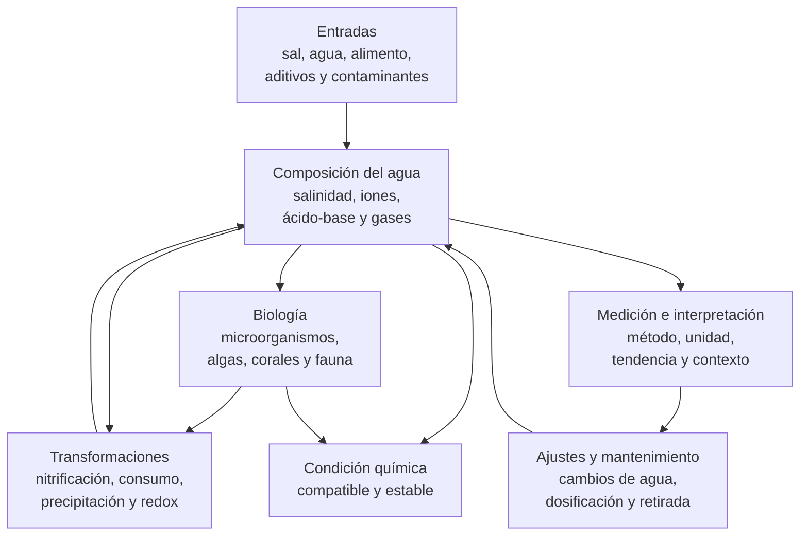

# Dimensión química

## Qué es

La dimensión química describe la composición del agua, sus equilibrios, sus transformaciones y su estabilidad dentro de un acuario marino de arrecife. Incluye la salinidad, el equilibrio ácido-base, los iones mayoritarios, los nutrientes, los gases disueltos, los compuestos nitrogenados y la presencia potencial de contaminantes.

No es una lista de valores objetivo ni un protocolo de dosificación. Una cifra química solo tiene significado cuando se conoce la unidad, el método de medición, la tendencia temporal, la temperatura, la salinidad y la relación con los organismos y procesos del sistema.

Las fichas de [parámetros del acuario marino](../parametros/README.md) documentan qué mide cada variable, sus relaciones y sus límites de interpretación. Esta dimensión explica cómo se integran esas variables en una arquitectura química coherente y cómo se comprueba su estabilidad sin repetir el detalle de cada parámetro.

La aplicación concreta de esta dimensión en Veril se documenta en la [ficha de biología y parámetros de Veril](../../veril/biologia.md) y en los documentos operativos correspondientes.

La tesis de esta dimensión es:

> La química del acuario no se define por valores aislados, sino por la composición, las relaciones, las tendencias y la capacidad del sistema para mantenerlas dentro de condiciones compatibles.

Para Veril se adopta una línea química relacional y orientada a la estabilidad: las mediciones se interpretarán junto con sus unidades, métodos, tendencias, entradas, consumos y procesos, sin convertir esta dimensión en una tabla rígida de objetivos o en un protocolo automático de dosificación. Esta línea permite evaluar el sistema compacto y mixto a partir de composición observada, coherencia entre variables y respuesta ante cambios; su aplicación concreta se documenta en [biología y parámetros de Veril](../../veril/biologia.md) y en los registros operativos.

Dentro del modelo integrado, esta dimensión describe la composición y los equilibrios del agua a lo largo del tiempo. La biología, la hidráulica, el procesamiento, la infraestructura y el espacio aportan las entradas, condiciones y cambios que deben interpretarse.

## Principio de funcionamiento

La química de un acuario es un sistema dinámico. Las entradas, el consumo biológico, las transformaciones, los intercambios con la atmósfera, la precipitación, los cambios de agua y las dosificaciones modifican simultáneamente varias variables.

El diagrama representa relaciones funcionales, no una secuencia automática ni una recomendación de intervención. Una medición puede revelar un cambio, pero no determina por sí sola su causa ni el ajuste adecuado.

## Componentes fundamentales

### Salinidad y matriz iónica

La salinidad caracteriza el contenido salino global del agua y condiciona la concentración relativa de muchos iones y el equilibrio osmótico de los organismos. La evaporación, el agua añadida, los cambios de agua y la preparación de la sal pueden modificarla sin que cambie necesariamente la carga biológica.

La [ficha de salinidad](../parametros/salinidad.md) desarrolla las unidades, los instrumentos y los límites de interpretación. En esta dimensión, la salinidad funciona como condición de referencia para interpretar el resto de la composición del agua: una dilución o concentración física del agua modifica simultáneamente las concentraciones de muchos componentes, incluidos calcio, magnesio y alcalinidad; en sustancias no conservativas como los nutrientes, ese efecto puede coexistir con transformaciones y consumos biológicos.

### Sistema ácido-base

El sistema carbonato relaciona el dióxido de carbono disuelto, el bicarbonato y el carbonato con el pH, el carbono inorgánico disuelto (DIC o CT), la alcalinidad y el intercambio de CO₂ con la atmósfera. Estas magnitudes están relacionadas, pero no son intercambiables ni describen por separado todo el estado ácido-base del agua. El pH describe el estado ácido-base en las condiciones y el momento de la medición; la alcalinidad expresa una capacidad de neutralización dentro de una definición química específica; ninguno de los dos sustituye al otro.

La relación con el aire, la respiración, la fotosíntesis, la nitrificación, la temperatura y las adiciones puede producir oscilaciones diarias o cambios sostenidos. La [ficha de pH](../parametros/ph.md) y la [ficha de alcalinidad](../parametros/alcalinidad.md) desarrollan las variables por separado; esta dimensión exige interpretarlas juntas cuando se evalúa el equilibrio ácido-base.

La forma química importa además de la concentración total: CO₂, bicarbonato y carbonato; NH₃ y NH₄⁺; o un metal libre y un metal complejado no tienen necesariamente la misma disponibilidad, movilidad o efecto biológico. La especiación depende del pH, la temperatura, la salinidad, los ligandos y otras condiciones del agua.

### Calcio, magnesio, alcalinidad y calcificación

Calcio, magnesio y alcalinidad forman parte de la disponibilidad química necesaria para organismos calcificadores y de los equilibrios de precipitación. Su consumo, aporte o pérdida no debe interpretarse como una serie de depósitos independientes.

El estado termodinámico respecto a la precipitación o disolución de carbonato cálcico se describe además mediante el estado de saturación respecto a sus fases minerales, habitualmente expresado como Ω para aragonito o calcita. Este estado se relaciona con la concentración de calcio y carbonato y, por tanto, con el sistema carbonato, la salinidad y la temperatura.

La concentración de cada ion depende también de la salinidad, la preparación del agua, los cambios de agua, la precipitación y el consumo real. Los detalles de la [ficha de alcalinidad](../parametros/alcalinidad.md) y del resto de [fichas de parámetros](../parametros/README.md) deben preceder a cualquier decisión de dosificación.

### Compuestos nitrogenados y fosforados

El amonio, el nitrito y el nitrato representan estados distintos del nitrógeno y no deben tratarse como una única variable. El fosfato participa en el metabolismo y puede acumularse o quedar limitado según las entradas, los consumidores y los procesos de retirada.

La [ficha de amonio](../parametros/amonio.md), la [ficha de nitrito](../parametros/nitrito.md), la [ficha de nitrato](../parametros/nitrato.md) y la [ficha de fosfato](../parametros/fosfato.md) describen cada compuesto. La dimensión química los integra como señales de entradas, transformaciones y disponibilidad de nutrientes, no como objetivos que deban forzarse hacia cero o hacia una proporción fija.

### Gases disueltos

El oxígeno disuelto y el dióxido de carbono conectan la química del agua con la atmósfera, la respiración, la fotosíntesis y la circulación. La [ficha de oxígeno disuelto](../parametros/oxigeno.md) desarrolla su medición y sus límites.

La hidráulica favorece el transporte y el intercambio, pero no garantiza por sí sola una concentración química uniforme. La [dimensión hidráulica](dimension-hidraulica.md) explica el movimiento del agua; esta dimensión evalúa la consecuencia química observada en gases, pH y otros solutos sin repetir la hidráulica.

### Elementos minoritarios y sustancias no deseadas

El agua marina contiene elementos minoritarios y puede recibir metales, compuestos orgánicos, residuos de productos, partículas o contaminantes procedentes del ambiente y de los materiales del sistema. Su importancia depende de la concentración, la forma química, la exposición, la persistencia y la sensibilidad de los organismos.

No toda sustancia relevante dispone de una medición doméstica rutinaria. La ausencia de un resultado detectable no demuestra ausencia absoluta, y un valor elevado debe confirmarse antes de atribuirle un efecto. Las fichas de productos, materiales y parámetros específicos deben documentar las evidencias disponibles.

## Relaciones químicas y control

### Entradas

Las entradas químicas pueden proceder de:

- Agua de preparación y reposición
- Sal marina y sus impurezas o variaciones de lote
- Alimento y materia orgánica
- Aditivos, medios y tratamientos
- Sustratos, rocas, adhesivos y otros materiales
- Aire, polvo y contaminantes del entorno

Una entrada no debe evaluarse solo por el compuesto que pretende aportar. También puede modificar pH, alcalinidad, salinidad, fuerza iónica, oxígeno, precipitación o disponibilidad de otros componentes.

### Consumo y transformación

La biología consume y transforma compuestos, pero la desaparición de una señal analítica no demuestra que la materia haya sido retirada del sistema. Puede haberse convertido en otra forma química, incorporado a biomasa, precipitado o quedado temporalmente retenida.

La [dimensión biológica](dimension-biologica.md) describe qué comunidades participan en estas relaciones. La [dimensión de procesamiento](dimension-procesamiento.md) documenta cómo el sistema transforma, retiene o retira materia. Esta ficha mantiene el foco en la composición química resultante y en sus interacciones.

### Cambios de agua y dosificación

Los cambios de agua pueden modificar simultáneamente múltiples variables y diluir o reponer compuestos. La dosificación añade una entrada deliberada, pero no demuestra que exista un consumo que la justifique.

Toda corrección debe distinguir entre:

- Desviación real y error de medición
- Falta de aporte y aumento del consumo
- Consumo biológico y precipitación
- Cambio puntual y tendencia persistente
- Corrección de una causa y compensación de un síntoma

La regulación concreta, las cantidades, los productos y las frecuencias pertenecen a los procedimientos operativos y a las fichas de los productos utilizados.

### Relaciones entre dimensiones

La química no funciona como una capa aislada:

- La dimensión biológica aporta consumos, excreciones, respiración y transformaciones
- La dimensión hidráulica distribuye agua, gases, solutos y partículas, pero no fija por sí sola sus concentraciones
- La dimensión de procesamiento condiciona las entradas y la retirada de materia
- La dimensión de iluminación modifica las condiciones fotosintéticas y parte de los intercambios asociados
- La dimensión espacial organiza zonas donde pueden aparecer gradientes o acumulaciones
- La dimensión de infraestructura determina volumen, evaporación, acceso, seguridad y posibilidad de dosificar o medir

La composición medida en una muestra del display tampoco garantiza una composición uniforme en todo el sistema. La geometría, los depósitos, el intercambio local y la actividad biológica pueden producir gradientes químicos o zonas con distinta disponibilidad de gases y solutos. Esta dimensión interpreta esas diferencias cuando existen datos suficientes; la [dimensión espacial](dimension-espacial.md) y la [dimensión hidráulica](dimension-hidraulica.md) describen las condiciones que las hacen posibles.

## Elementos compatibles, pero no definitorios

### Dosificación automática

Puede aportar regularidad a la reposición de componentes consumidos. También puede introducir una sobredosificación sostenida, un fallo de calibración o una falsa sensación de control. No sustituye la medición del consumo ni la comprobación del efecto.

### Reactores, medios y adsorbentes

Pueden modificar la concentración de nutrientes, compuestos orgánicos, metales u otros componentes. Su función depende del medio, el caudal, la carga y el tiempo de contacto. No constituyen una dimensión química independiente ni deben evaluarse solo por su presencia.

### Controladores y monitorización continua

Permiten registrar tendencias y detectar cambios, especialmente en variables como temperatura, pH, salinidad u oxígeno. La automatización no elimina la necesidad de calibrar, contrastar y revisar la plausibilidad de los datos.

### Aditivos correctores y tampones

Pueden modificar una variable o un conjunto de equilibrios. Deben utilizarse conociendo su composición y el efecto esperado, no para perseguir una cifra aislada ni para corregir repetidamente una desviación cuya causa no se ha identificado.

## Variantes químicas habituales

### Sistema con baja carga de nutrientes

Presenta entradas o concentraciones reducidas de determinados nutrientes, pero la etiqueta no demuestra que la disponibilidad sea adecuada para todos los organismos. Puede existir limitación aunque nitrato o fosfato sean bajos.

### Sistema con carga de nutrientes relevante

Recibe una entrada mayor de materia orgánica o nutrientes y exige interpretar la respuesta conjunta de biología, procesamiento, oxígeno, pH y mantenimiento. Un aumento no implica automáticamente un fallo si se mantiene dentro de condiciones compatibles, pero puede aumentar la demanda sobre los procesos de consumo, transformación y retirada y reducir el margen operativo del sistema.

### Sistema con consumo calcificante significativo

Requiere seguir de forma conjunta alcalinidad, calcio, magnesio, pH, salinidad y consumo real. La dosificación debe responder a una demanda demostrada, no a la simple presencia de un organismo calcificador.

### Sistema con alta variabilidad química

Muestra oscilaciones o cambios frecuentes por evaporación, alimentación, cambios de agua, dosificación, temperatura o fallos de equipo. La prioridad es localizar la fuente de variación antes de aumentar el número de correcciones.

Estas variantes no son categorías excluyentes ni diagnósticos completos. Describen patrones de funcionamiento que deben demostrarse mediante mediciones comparables.

## Fortalezas, debilidades y críticas

### Fortalezas conocidas

- Permite relacionar mediciones aisladas con procesos y tendencias del sistema
- Hace visibles las interacciones entre salinidad, ácido-base, nutrientes, gases e iones mayoritarios
- Permite detectar cambios antes de que la respuesta biológica sea irreversible
- Facilita distinguir una entrada, un consumo, una transformación y una retirada
- Permite evaluar la estabilidad como propiedad temporal y no como una fotografía puntual

### Debilidades conocidas

- Muchas variables requieren instrumentos, calibración y procedimientos diferentes
- Una medición puede ser correcta y, aun así, insuficiente para identificar la causa de un cambio
- Algunas sustancias relevantes no se miden de forma rutinaria en acuarios domésticos
- La química puede cambiar más deprisa en sistemas pequeños que la capacidad de observación o respuesta
- Corregir varias variables simultáneamente dificulta atribuir la respuesta a una causa concreta
- La composición química no demuestra por sí sola que la comunidad, el procesamiento o la hidráulica sean adecuados

### Críticas habituales de sus detractores

- **Falsa precisión**: Se critica que una serie de cifras aparentemente exactas oculte errores de método, calibración o interpretación
- **Obsesión por los parámetros**: Se cuestiona que se corrijan números sin observar animales, entradas, consumo y funcionamiento global
- **Dosificación preventiva**: Se advierte que añadir productos antes de demostrar consumo puede crear desequilibrios o precipitación
- **Reduccionismo químico**: Se señala que la química no puede sustituir la evaluación de espacio, luz, flujo, biología y procesamiento
- **Objetivos universales**: Se critica el uso de rangos o proporciones como recetas válidas para todas las comunidades y sistemas

## Opiniones extendidas

Las siguientes formulaciones representan percepciones frecuentes sobre la química de los acuarios de arrecife, no criterios suficientes ni resultados experimentales por sí mismas.

| Opinión extendida | Qué expresa | Lectura técnica |
| --- | --- | --- |
| «Si un parámetro está bien, el agua está bien» | La reducción del sistema a una cifra | La condición química depende de varias variables, sus relaciones y su tendencia |
| «Más alto siempre es mejor» | La búsqueda de pH, alcalinidad o calcio elevados como objetivo universal | Un valor mayor puede aumentar otros riesgos y no sustituye la estabilidad |
| «Nitrato y fosfato deben ser cero» | La asociación entre nutrientes detectables y contaminación | La disponibilidad adecuada depende de entradas, consumo, organismos y método de medición |
| «Si el test marca cero, no existe el compuesto» | La equivalencia entre no detección y ausencia | El resultado depende del límite de detección, la muestra y el momento de medición |
| «Un cambio de agua corrige cualquier problema» | La atribución de una función universal a la dilución | Puede reponer o diluir compuestos, pero no elimina todas las causas ni estabiliza por sí sola el sistema |
| «Dosificar es mantener estable la química» | La confusión entre añadir y controlar | La estabilidad exige medir, interpretar el consumo y comprobar el efecto |

## Perspectivas propias de la dimensión química

Los siguientes puntos son una lectura funcional de esta dimensión elaborada para esta documentación, no una síntesis directa de fuentes externas ni una lista de resultados experimentales.

### La estabilidad incluye el tiempo

Una serie de valores dentro de un rango no demuestra estabilidad si las mediciones se realizan en momentos diferentes o con métodos inconsistentes. La estabilidad debe describir la variación relevante, la velocidad de cambio y la capacidad de respuesta del sistema.

### La coherencia es más informativa que el valor aislado

Una combinación de datos físicamente o biológicamente incoherente puede indicar un error de medición, una unidad mal interpretada o un proceso que no se ha considerado. Antes de corregir, conviene comprobar si la lectura encaja con salinidad, temperatura, pH, alcalinidad, alimentación y respuesta observable.

### Las variables químicas están acopladas

Las variables químicas no evolucionan como compartimentos independientes. Una misma entrada o proceso puede consumir oxígeno, modificar el pH, alterar la alcalinidad y cambiar la especiación o disponibilidad de otros compuestos. La evaluación debe considerar el conjunto de relaciones que la intervención puede afectar.

### El margen operativo importa tanto como el valor observado

Un sistema puede mostrar valores compatibles y disponer, sin embargo, de poco margen operativo frente a evaporación, sobrealimentación, fallo de dosificación o pérdida de intercambio. Ese margen se demuestra por la respuesta ante variaciones previsibles, no solo por el valor medio.

## Ventajas y compromisos frente a otras dimensiones

La comparación se limita a funciones de referencia y no convierte la química en sustituto de las demás dimensiones.

| Dimensión relacionada | Qué aporta la dimensión química | Qué no puede resolver por sí sola |
| --- | --- | --- |
| Biológica | Describe las condiciones químicas disponibles para organismos y comunidades | No demuestra compatibilidad, bienestar ni madurez biológica |
| Hidráulica | Permite interpretar la consecuencia química del transporte y del intercambio | No determina la distribución real del flujo |
| Procesamiento | Permite seguir entradas, transformaciones y resultados químicos | No retira materia ni sustituye los mecanismos de exportación |
| Iluminación | Ayuda a interpretar cambios asociados a fotosíntesis y fotoperiodo | No define la exposición lumínica ni el espectro |
| Espacial | Permite identificar gradientes o acumulaciones químicas asociadas a zonas | No crea por sí sola una geometría funcional |
| Infraestructura | Define el volumen y las condiciones que amortiguan o amplifican cambios | No garantiza una composición química adecuada |

La dimensión química es útil cuando se integra con las demás. No es una jerarquía sobre ellas ni una certificación global del acuario.

## Aplicación en un sistema pequeño

En un sistema de bajo volumen, una misma cantidad absoluta de agua evaporada, aditivo, alimento o contaminante representa una fracción mayor del conjunto. Las oscilaciones pueden aparecer con rapidez y una misma entrada absoluta produce un cambio proporcionalmente mayor.

La escala reducida no justifica perseguir valores más estrictos mediante intervenciones constantes. Exige conocer el volumen operativo real, medir de forma repetible, mantener entradas previsibles y conservar un margen suficiente para cambios de agua, evaporación, alimentación y fallos.

### Prioridades específicas

- Confirmar el volumen operativo utilizado para interpretar dosis y cambios de agua
- Mantener salinidad, temperatura y evaporación bajo observación conjunta
- Registrar la hora y las condiciones de medición de pH y otros parámetros variables
- Evitar corregir varias variables al mismo tiempo sin una causa identificada
- Ajustar la alimentación y las adiciones a la capacidad demostrada del sistema
- Comprobar que una intervención no modifica de forma indeseada otras variables
- Conservar una respuesta reversible ante errores de medición o sobredosificación

La [dimensión de infraestructura](dimension-infraestructura.md) describe los límites de volumen, retorno, evaporación y acceso. Esta dimensión solo desarrolla cómo esos límites afectan a la estabilidad química.

## Qué no es esta dimensión

La dimensión química:

- No es una tabla de valores universales
- No es un protocolo de dosificación
- No es un método de filtración o exportación
- No es una sustitución de la dimensión biológica
- No es una medición de la hidráulica, la luz o el volumen físico
- No demuestra que los organismos estén sanos porque una cifra sea adecuada
- No convierte un resultado de test en una causa identificada
- No justifica corregir una desviación antes de confirmarla

## Errores comunes al aplicarla

- Corregir una cifra aislada sin confirmar unidad, método, calibración y tendencia
- Confundir pH con alcalinidad o salinidad con gravedad específica sin conocer la escala
- Interpretar nitrato y fosfato como una proporción universal
- Añadir calcio, alcalinidad o magnesio sin medir el consumo real y las relaciones entre ellos
- Utilizar agua de reposición con sales para compensar la evaporación
- Atribuir una caída de pH exclusivamente a la alcalinidad sin considerar CO₂, temperatura, respiración y aireación
- Tratar un resultado indetectable como ausencia absoluta
- Cambiar varias variables a la vez y perder la trazabilidad de la respuesta
- Confiar en un sensor sin calibración ni contraste independiente
- Usar una dosis calculada sobre el volumen nominal cuando el volumen operativo es menor
- Interpretar la química sin relacionarla con alimentación, cambios de agua, crecimiento y mortalidad

## Función durante el ciclado, la maduración y las transiciones

La dimensión química no sustituye a los planes de [ciclado](../../ciclado/plan.md) y [maduración](../../maduracion/plan.md), pero define qué cambios químicos deben poder medirse e interpretarse durante esas fases.

### Ciclado

Durante el ciclado deben seguirse, según el protocolo utilizado, las relaciones entre las formas de amoníaco y amonio relevantes para el método empleado, nitrito, nitrato, pH, alcalinidad, temperatura, salinidad y oxígeno. La desaparición de un compuesto no demuestra por sí sola que la capacidad sea estable ni que el sistema pueda recibir una comunidad completa.

### Maduración

Durante la maduración pueden cambiar las entradas, el consumo, la biomasa, el biofilm, las algas, la microfauna y el comportamiento de los nutrientes. La tendencia química debe interpretarse junto con la evolución biológica y el mantenimiento, sin convertir una fecha o una lectura aislada en una prueba de madurez.

### Transiciones

Una nueva incorporación, un cambio de alimentación, una modificación de luz, una variación de flujo, un cambio de agua o una nueva dosificación puede alterar varias variables. Las transiciones deben registrarse para poder relacionar la respuesta química con el cambio realizado.

## Cómo evaluar la dimensión en funcionamiento

La dimensión química funciona cuando las variables relevantes se miden con métodos adecuados, mantienen relaciones coherentes y permanecen dentro de condiciones compatibles con la comunidad y el funcionamiento observado.

### Calidad de la medición

Debe comprobarse:

- Instrumento o test apropiado para la variable
- Calibración, caducidad y conservación de reactivos
- Unidad y escala utilizadas
- Muestra representativa y procedimiento repetible
- Hora, temperatura y salinidad de la medición
- Contraste de resultados inesperados con un método independiente

### Coherencia entre variables

Debe observarse:

- Calcio, magnesio y alcalinidad interpretados en el contexto de la salinidad medida
- pH interpretable junto con alcalinidad, CO₂, temperatura y aireación
- Amonio y nitrito coherentes con la carga y la evolución del ciclado
- Nutrientes interpretados junto con alimentación, consumo y retirada
- Alcalinidad, calcio y magnesio compatibles con el consumo calcificante observado
- Oxígeno relacionado con temperatura, respiración, circulación e intercambio gaseoso

### Tendencias y respuesta

Debe registrarse:

- Variación diaria o semanal relevante
- Velocidad de cambio, no solo valor inicial y final
- Respuesta después de cambios de agua, alimentación o dosificación
- Diferencia entre el resultado esperado y el resultado medido
- Relación entre cambios químicos y respuesta de organismos o acumulación de materia

## Indicadores que pueden inducir a error

No demuestran por sí solos que la dimensión química sea adecuada:

- Una cifra dentro de un rango orientativo
- Un resultado indetectable
- Un test realizado una sola vez
- Un pH alto sin conocer alcalinidad y CO₂
- Calcio o alcalinidad altos sin consumo demostrado
- Nitrato o fosfato bajos sin conocer entradas y disponibilidad biológica
- Una salinidad correcta medida con un instrumento no calibrado
- Agua visualmente clara
- Ausencia de mortalidad inmediata tras una corrección
- La coincidencia de varios valores obtenidos con el mismo método defectuoso

## Resumen funcional

| Aspecto | Función o criterio |
| --- | --- |
| Tipo de documento | Dimensión química, no tabla de objetivos ni protocolo de dosificación |
| Variante adoptada | Interpretación relacional, tendencial y orientada a estabilidad |
| Núcleo | Composición, equilibrios, transformaciones y estabilidad del agua |
| Variables principales | Salinidad, pH, alcalinidad, iones, nutrientes y gases disueltos |
| Unidad de interpretación | Relación entre valores, tendencias, procesos y respuesta observable |
| Soportes de evaluación | Fichas de parámetros, mediciones repetibles y registros de cambios |
| Complementos | Dosificación, reactores, medios, sensores y cambios de agua |
| Límite principal | Una cifra aislada no demuestra causa, capacidad ni compatibilidad |
| Condición de éxito | Química coherente y estable dentro de condiciones compatibles |
| Aplicación de escala | El bajo volumen reduce la dilución y el margen de respuesta |

## Apéndice: términos y límites de la dimensión

### Química del agua

Conjunto de concentraciones, equilibrios, formas químicas y procesos que determinan el estado del agua. No equivale a una sola medición de calidad.

### pH

Medida logarítmica negativa de la actividad de los iones hidrógeno, definida según la escala de pH utilizada. Describe el estado ácido-base en las condiciones y el momento de la medición, y no sustituye a la alcalinidad.

### Alcalinidad

Magnitud que expresa la capacidad ácido-base del agua de acuerdo con una definición química específica. En agua marina está determinada principalmente por bicarbonato y carbonato, aunque también contribuyen otras especies. No es sinónimo de pH.

### Salinidad

Magnitud que caracteriza el contenido salino global del agua mediante una escala y un método definidos. Su interpretación debe acompañarse de la escala, la temperatura cuando corresponda y el método o instrumento utilizado.

### Carbono inorgánico disuelto

Conjunto del carbono inorgánico presente en el agua, principalmente como dióxido de carbono disuelto, bicarbonato y carbonato. Se expresa como DIC o CT y participa en la interpretación del sistema carbonato junto con pH, alcalinidad, temperatura y salinidad.

### Estado de saturación

Relación entre las condiciones del agua y la solubilidad de una fase mineral concreta, como aragonito o calcita. Se expresa habitualmente como Ω y no equivale a una medida directa de calcio, alcalinidad o pH.

### Nutrientes

Compuestos que pueden ser utilizados por organismos y participar en transformaciones biológicas. En esta documentación se presta especial atención a las formas de nitrógeno y al fosfato.

### Estabilidad

Capacidad de mantener las variables relevantes dentro de condiciones compatibles y de responder de forma previsible a entradas o perturbaciones. No significa ausencia de toda variación.

## Fuentes y límites de la evidencia

- [Dickson, Sabine y Christian, *Guide to Best Practices for Ocean CO₂ Measurements*](https://doi.org/10.3334/CDIAC/otg.CO2_guide): Referencia metodológica para química marina, medición, equilibrio del sistema carbonato y trazabilidad analítica. Su contexto oceánico no establece objetivos universales para acuarios domésticos
- [Zeebe y Wolf-Gladrow, *CO₂ in Seawater: Equilibrium, Kinetics, Isotopes*](https://doi.org/10.1016/S0422-9894%2801%2980001-2): Tratamiento de los equilibrios y la química del dióxido de carbono en agua de mar. Respalda la relación entre CO₂, pH, bicarbonato y carbonato, pero no prescribe una estrategia de mantenimiento doméstico
- [Millero, *Chemical Oceanography*](https://www.routledge.com/Chemical-Oceanography/Millero/p/book/9780849322802): Referencia general sobre salinidad, iones, gases, equilibrios y procesos químicos del agua marina. Su escala y propósito son oceanográficos, no una guía de dosificación para arrecifes domésticos
- [Fichas de parámetros del acuario marino](../parametros/README.md): Desarrollo local de las variables, unidades, relaciones, métodos de medición y límites de interpretación utilizados por esta dimensión

La evidencia química permite describir equilibrios, relaciones y métodos de medición, pero no proporciona una combinación universal de valores para todas las comunidades. Los rangos orientativos deben interpretarse junto con salinidad, temperatura, biología, alimentación, procesamiento, hidráulica, iluminación y tendencia temporal. Las decisiones de Veril, las dosis, los productos y los objetivos operativos deben permanecer en sus documentos propietarios y en los registros de medición.
