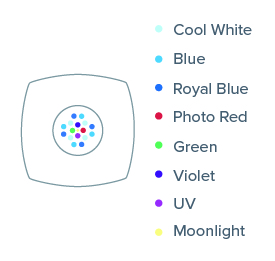
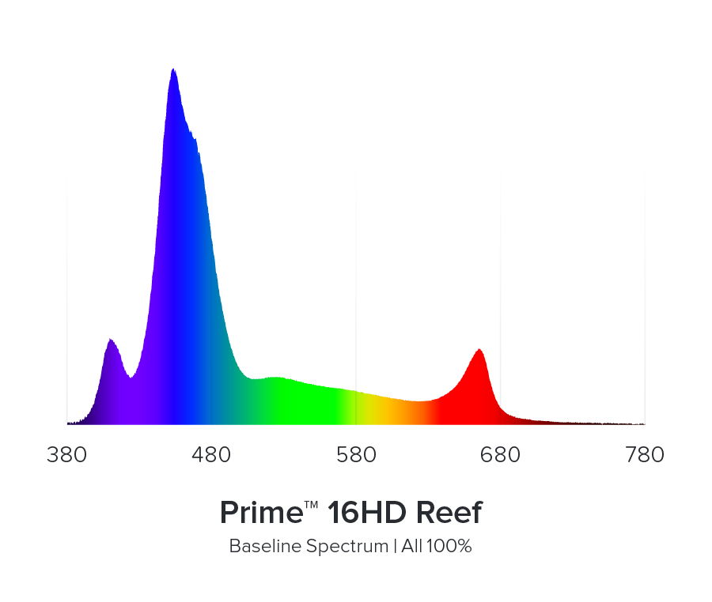

# AI Prime™ 16HD Reef

## Descripción

La **AI Prime™ 16HD Reef** será la luminaria principal del display de Veril. Es una luminaria LED compacta para arrecife, con control inalámbrico, siete grupos de color regulables y un canal lunar independiente. Su formato concentra los emisores en una zona circular central y utiliza lentes TIR con una salida difusa para mezclar los colores antes de que la luz llegue al acuario.

La Prime combina una banda azul-violeta dominante con aportes más pequeños de blanco, verde, amarillo, naranja y rojo. Esta combinación permite trabajar con una apariencia azul de arrecife, conservar una parte amplia del espectro visible y ajustar el aspecto final mediante la aplicación. El sistema HD redistribuye la potencia disponible entre los canales utilizados, de modo que el porcentaje mostrado por la aplicación sirve para programar la luz, pero no equivale directamente a vatios, lúmenes o PAR.

## Ficha técnica

| Campo | Dato |
| --- | --- |
| Producto | AI Prime™ 16HD Reef |
| Fabricante | AquaIllumination® |
| Dimensiones | 12,4 × 12,4 × 3,4 cm |
| Peso | 0,43 kg |
| Consumo publicado | 55 W en la descripción y 59 W a plena potencia en la tabla técnica |
| Alimentación | 100–240 V CA, 50–60 Hz |
| Longitud del cable | 6,1 m |
| Óptica | Lentes TIR, con eficiencia óptica superior al 90 % según AquaIllumination |
| Control | Mobius, myAI y Neptune Fusion mediante Apex y módulo MXM |
| Protección declarada de la fuente | UL, CE y RoHS |

La luminaria incorpora **cuatro LED Cool White, cuatro Blue, cuatro Royal Blue, un Photo Red, un Green, un Violet, un UV y un Moonlight**. El número de emisores no indica por sí solo la proporción de luz de cada color: la corriente, la eficiencia, el control térmico y la redistribución HD determinan la salida real.

## Distribución física y espectro

*Distribución física publicada por AquaIllumination.*

Los emisores están intercalados en un conjunto circular compacto. Los blancos aportan una base visible más amplia; los azules y royal blue forman la parte dominante del aspecto de arrecife; violeta y UV extienden la salida hacia longitudes de onda cortas; verde y rojo completan la mezcla visible; y el Moonlight funciona como canal lunar independiente. La proximidad de los emisores, las lentes TIR y la superficie de salida difusa favorecen que los colores lleguen mezclados a la zona iluminada.

La distribución compacta también concentra el máximo de luz en el eje central cuando la luminaria está baja. Subirla abre la huella y suaviza la diferencia entre centro y bordes, aunque reduce el PAR máximo y puede aumentar la luz que sale de la zona útil. La posición de un LED en el dibujo no permite calcular su potencia ni el PAR que llegará a un coral.

*Espectro base al 100 % publicado por AquaIllumination.*

El mapa cubre aproximadamente de 380 a 780 nm y muestra una salida principalmente azul-violeta. Se aprecia una contribución corta alrededor de 400–410 nm, un máximo principal en torno a 440–450 nm, una cola azul amplia hasta aproximadamente 490 nm, una contribución menor y extendida entre 500 y 630 nm y un pico rojo alrededor de 660 nm. El eje vertical no está graduado: representa intensidad relativa en el gráfico, no irradiancia absoluta, potencia óptica ni PAR.

La forma del gráfico explica el aspecto azul de la luminaria y su capacidad para resaltar fluorescencia, pero no determina por sí sola la intensidad adecuada para un coral ni la uniformidad sobre el acuario. Esas condiciones dependen de la programación, la altura, la profundidad, la orientación, la roca y la óptica.

## Control espectral

Mobius y myAI permiten construir una programación con puntos de control independientes, rampas de amanecer y anochecer, intensidad general, preajustes y escenas temporales. Los canales pueden cambiar durante el día y la intensidad general puede modificar toda la programación sin alterar necesariamente la relación entre colores.

El funcionamiento HD permite tomar capacidad de los canales reducidos y transferirla a los canales que se están utilizando. Por eso un 100 % es un nivel de control y no una unidad de potencia universal; del mismo modo, un valor superior al 100 % en un canal no significa que ese canal consuma ese porcentaje de la potencia total. Cambiar un canal altera el color y puede alterar también el PAR total.

La aplicación ofrece preajustes Signature Series, aclimatación, efecto lunar, Feed Mode, Live Demo, Lights On y Schedule. Feed Mode permite crear una escena temporal con espectro y duración propios; Live Demo sirve para probar canales; Lights On lleva la luminaria al 100 % y Schedule devuelve el horario normal. La aclimatación reduce la intensidad inicial y la aumenta durante el periodo elegido. El ejemplo de 50 % durante 30 días es una referencia de la aplicación, no el ajuste establecido para Veril.

El efecto lunar actúa sobre los puntos del canal Moonlight siguiendo la fase lunar y reduce la intensidad fuera de la luna llena. Se mantendrá desactivado al principio. Si se utiliza, se comprobarán sus horas y su efecto sobre el fotoperiodo.

## Aplicación, conexión y mantenimiento

La puesta en marcha se realiza desde un teléfono o tableta mediante Bluetooth Low Energy. En el alta pueden ser necesarios Bluetooth, ubicación y permisos de Bluetooth para myAI. La Prime debe estar encendida y dentro del alcance; si no aparece, conviene desconectar temporalmente otros dispositivos Bluetooth. En Android, la guía de soporte incluye borrar la caché del sistema Bluetooth y reiniciar el dispositivo. Las funciones descritas para myAI se comprobarán en Mobius si la unidad se entrega con esa plataforma.

La aplicación permite guardar y recuperar horarios, importar preajustes y verificar los ajustes desde `Settings > Troubleshooting > Verify Settings`. También permite volver a sincronizar la hora desde `Settings > Time > Set to Current Time` y regresar a `Schedule`. La Prime se controlará desde la aplicación, mientras que Home Assistant solo supervisará y cortará la alimentación mediante el SONOFF.

Las actualizaciones de firmware se hacen con la luminaria encendida y pueden tardar 15 minutos o más. Durante ellas no se debe cerrar la aplicación ni cortar la alimentación. En una Prime 16HD nueva, el indicador rojo y blanco intermitente señala que hay una actualización pendiente. El botón de restablecimiento está en la parte inferior: con la alimentación desconectada se mantiene pulsado mientras se vuelve a conectar hasta que parpadea en rojo; el parpadeo azul y verde confirma el restablecimiento.

La rejilla del ventilador debe mantenerse limpia. `Fan Shutdown` puede dejar el ventilador funcionando solo cuando lo necesita para mantener la temperatura o hacerlo funcionar continuamente. El estado utilizado se registrará junto con el ruido y la temperatura. La lente de repuesto identificada por AquaIllumination es la **119-00001**; su marca debe quedar hacia el lado del botón y todas las lentes deben quedar completamente asentadas y alineadas después de cualquier sustitución.

## Cobertura y PAR

AquaIllumination anuncia una extensión de **61 × 61 cm** y un pico de **100 µmol·m⁻²·s⁻¹ a 61 cm de profundidad**. En las pruebas de cobertura de una superficie de 61 × 61 cm, una Prime situada a 15,2 cm sobre el agua produjo una media de 107 PAR, con 462 PAR en el centro y 21 PAR en el borde. A 25,4 cm, el centro bajó a 232 PAR y el borde subió a 47 PAR. A 33,0 cm, la media fue de 94 PAR, con 156 PAR en el centro y 63 PAR en el borde.

La misma serie de pruebas encontró que una Prime a 20,3 cm cubría un cubo de 30,5 cm para LPS con el 94 % de los puntos entre 75 y 150 PAR. En un cubo de 45,7 cm, una Prime a 25,4 cm dejó el 83 % de 75 puntos en ese intervalo para LPS, pero no alcanzó el objetivo de SPS para el 70 % del área. En una superficie de 61 cm, una Prime a 33,0 cm situó el 70 % de 108 puntos en el intervalo de LPS y tejidos blandos.

Como referencias de diseño, dos Primes sobre un acuario de 91,4 cm produjeron el 81 % de 150 puntos entre 75 y 150 PAR para LPS, mientras que tres unidades produjeron el 73 % de los puntos entre 200 y 350 PAR para SPS. En un acuario de 121,9 × 61 cm, tres Primes alcanzaron el 92 % de 198 puntos en el intervalo LPS; ocho unidades, distribuidas en dos filas, alcanzaron el 78 % del área en el intervalo SPS. Estos resultados muestran que la cobertura depende tanto de la altura y el espaciamiento como de la potencia.

El display de Veril mide aproximadamente **60 × 32 × 40 cm**. El hardscape se desplazará hacia la derecha, por lo que la Prime quedará ligeramente desplazada hacia la derecha y se colocará en la posición que proporcione la mejor cobertura posible del hardscape, sin tomar como referencia obligatoria el centro geométrico de la urna. El extremo izquierdo y las zonas sombreadas recibirán una comprobación específica. La altura real provisional será de **250 mm entre la cara inferior de la luminaria y el agua**, hasta completar la comprobación de PAR y distribución.

La altura se comprobará físicamente después de instalar el kit, el cable y el shade, y se registrará junto con el mapa de PAR y la distribución observada. BRS utilizó 25,4 cm en una superficie de 45,7 cm y encontró una distribución más abierta que a menor altura; su referencia de 33,0 cm para una superficie de 61 × 61 cm sirve únicamente como contexto de la prueba.

## Montaje en Veril

La luminaria se colgará con el kit de AI desde un mueble **BESTÅ de IKEA** de aproximadamente **20 cm de fondo**. El punto de suspensión estará a **70 cm sobre la mesa** y la cara inferior de la luminaria quedará a **250 mm sobre el agua como referencia de montaje**. El anclaje se colocará hacia la derecha para alinear la zona de mayor cobertura con el hardscape. La altura real se comprobará físicamente después de instalar el conjunto.

Se instalará un **shade fabricado mediante impresión 3D** en el frente de la luminaria para evitar el reflejo directo y el deslumbramiento del usuario. Los laterales y la parte trasera quedarán libres para conservar la ventilación, la dispersión lateral de la luz y el acceso al cableado y a los ajustes. El shade no deberá tocar el ventilador, la carcasa caliente, la rótula ni los cables, ni proyectar sombras sobre la zona iluminada.

Antes de dar por terminado el montaje se comprobarán la capacidad real del panel del BESTÅ, la fijación del anclaje, la nivelación a 250 mm, la alineación lateral, la estabilidad durante el mantenimiento y la ausencia de tensión en el cable de alimentación. La luminaria no es impermeable y el adaptador deberá mantenerse separado del agua.

## Integración y puesta en marcha

La alimentación se realizará mediante un [SONOFF S60ZBTPF](../sonoff-s60zbtpf/sonoff-s60zbtpf.md) independiente. Home Assistant y Zigbee2MQTT supervisarán la alimentación y el consumo; Mobius o myAI controlarán la intensidad, el espectro y el horario.

La instalación se aceptará después de:

1. Registrar la unidad, el adaptador, el cable, el número de serie y el kit recibido
2. Verificar el anclaje al BESTÅ y la capacidad de carga del panel
3. Colgar inicialmente la luminaria a 250 mm sobre el agua, alinearla con el hardscape desplazado hacia la derecha y registrar la altura instalada
4. Instalar el shade frontal dejando abiertos los laterales y la parte trasera
5. Configurar la aplicación, conceder los permisos necesarios y actualizar el firmware si se solicita
6. Registrar la programación inicial, el estado de Fan Shutdown y el consumo eléctrico
7. Comprobar temperatura, ventilador, ruido, salpicaduras, condensación y posibles reflejos
8. Medir PAR en la cumbre, las terrazas, las microislas, la arena, los bordes y las zonas sombreadas
9. Comprobar y registrar la altura real, y ajustar orientación, shade o intensidad a partir del mapa obtenido
10. Guardar la configuración aceptada y relacionarla con la ubicación de los organismos

## Fuentes

- [AquaIllumination: Prime 16HD Reef](https://www.aquaillumination.com/products/prime)
- [AquaIllumination: Distribución física de los LED](https://www.aquaillumination.com/wp-content/uploads/2019/10/Prime-16-HD.jpg)
- [AquaIllumination: Mapa de espectro](https://www.aquaillumination.com/wp-content/uploads/2019/10/prime16HD_reef_spectrum.png)
- [AquaIllumination: Manual de Prime 16](https://support.aquaillumination.com/hc/en-us/articles/4402388563479-Prime-16-Product-Manual)
- [AquaIllumination: Prime Hanging Kit](https://shop.aquaillumination.com/products/prime-hanging-kit)
- [AquaIllumination: Montaje del kit para colgar](https://support.aquaillumination.com/hc/en-us/articles/13231337537303-Prime-Hanging-Kit-Assembly)
- [AquaIllumination: FAQ de AI Light 16/32/64](https://support.aquaillumination.com/hc/en-us/sections/360008131313-AI-Light-16-32-64-FAQ)
- [AquaIllumination: Instalación de lentes de Prime 16HD](https://support.aquaillumination.com/hc/en-us/articles/40562411067927-AI-Lens-Prime-16HD-32HD-64HD-Installation)
- [AquaIllumination: Limpieza y ventilación](https://support.aquaillumination.com/hc/en-us/articles/1500004217901-Prime-Fan-Cleaning-Instructions)
- [AquaIllumination: Actualización del firmware](https://support.aquaillumination.com/hc/en-us/articles/360046798273-Updating-AI-Light-Firmware)
- [AquaIllumination: Conexión y diagnóstico](https://support.aquaillumination.com/hc/en-us/articles/360039936254-How-do-I-connect-to-my-new-16-32-64-HD)
- [AquaIllumination: Feed Mode](https://support.aquaillumination.com/hc/en-us/articles/360046558853-AI-Lights-Configuring-Feed-Mode)
- [AquaIllumination: Programación de una AI Light nueva](https://support.aquaillumination.com/hc/en-us/articles/360011977713-How-should-I-program-my-new-AI-Light)
- [Bulk Reef Supply: Prueba de la Prime HD](https://www.bulkreefsupply.com/content/post/brstv-investigates-aqua-illumination-prime-hd)
- [Bulk Reef Supply: Vídeo de prueba de la Prime 16](https://www.youtube.com/watch?v=QH2nsgrxoRI)
- [ReefCalcs: Tabla PAR de la AI Prime 16HD](https://reefcalcs.com/fixtures/ai-prime-16-hd/)
- [Bay Area Reefers: Mediciones con AI Prime 16HD](https://bareefers.org/forum/threads/frag-tank-sunlight-par-meter-usage.31140/)
- [Reef2Reef: Medición PAR de una AI Prime 16HD](https://www.reef2reef.com/threads/ai-prime-16hd-par.931206/)
- [Reef2Reef: Ajustes y mediciones de la Prime 16HD](https://www.reef2reef.com/threads/ai-prime-16hd-settings-review.1142488/)
- [Reef2Reef: Incidencias comunicadas sobre lentes](https://www.reef2reef.com/threads/2x-ai-prime-16hd-lenses-melting-on-both.1037948/)
- [Canal oficial de AquaIllumination](https://www.youtube.com/@AquaIlluminationUS)
- [Ficha del SONOFF S60ZBTPF](../sonoff-s60zbtpf/sonoff-s60zbtpf.md)
