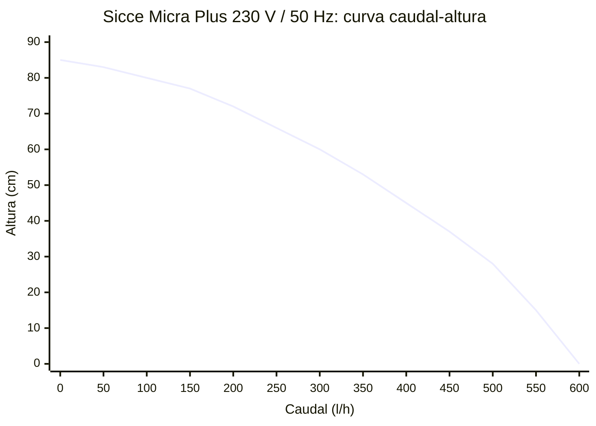

# Sicce Micra Plus 600

## Identificación y función en Veril

La **Sicce Micra Plus 600** será la bomba de retorno del compartimento técnico. Elevará el agua desde la cámara de retorno al display; no será la bomba principal de movimiento del acuario. La circulación interna la realizará la Mantis Tourbon 60.

La alimentación y la supervisión mediante una unidad independiente del [SONOFF S60ZBTPF](../sonoff-s60zbtpf/sonoff-s60zbtpf.md) están documentadas en la [ficha de integración con Home Assistant](home-assistant-zigbee2mqtt.md).

## Especificaciones documentadas

| Parámetro | Valor documentado |
| --- | --- |
| Fabricante | Sicce S.r.l. |
| Modelo | Micra Plus |
| Variante de referencia para Veril | 220–240 V / 50 Hz |
| Tipo | Bomba sumergible compacta de recirculación |
| Motor | Síncrono accionado por imán permanente |
| Caudal máximo declarado | 600 l/h |
| Altura máxima declarada | 0,85 m en el manual; 0,8 m en algunos catálogos de Sicce |
| Potencia declarada | 6,5 W |
| Corriente declarada | 0,035 A |
| Regulación | Regulador mecánico de caudal; distribuidores describen cinco posiciones |
| Filtración incluida | Esponja pequeña intercambiable en la entrada |
| Entrada de agua | Rejilla de aspiración, incluida la aspiración inferior según la documentación de la gama |
| Salida documentada | Tubo flexible de 12 × 16 mm mediante adaptador o tubo rígido de 13 mm |
| Dimensiones publicadas | Aproximadamente 72 × 60 × 61 mm; comprobar el espacio con la unidad recibida |
| Cable | 1,5 m en la variante habitual; existen referencias con cable de 10 m |
| Uso declarado | Agua dulce, agua marina, acuarios, pequeños circuitos de recirculación y fuentes interiores |
| Temperatura máxima documentada | 35 °C |

La ficha del manual local indica **0,85 m**, mientras que el catálogo de Sicce redondea la misma prestación a **0,8 m**. Se conservarán ambas cifras como una diferencia de presentación, no como dos capacidades distintas. El caudal de 600 l/h y la altura máxima son valores de catálogo en condiciones de ensayo y no el caudal que llegará al display con la altura, tubería, codos, regulador, esponja y suciedad de Veril.

## Construcción y accesorios

La bomba utiliza un motor síncrono de imán permanente y un rotor desmontable. El conjunto compacto está pensado para trabajar sumergido. La Micra Plus incorpora:

- Regulación mecánica del flujo
- Esponja de entrada intercambiable
- Rejilla de aspiración que permite trabajar con un nivel de agua bajo, siempre que no quede por debajo de las entradas
- Ventosas y elementos de apoyo para reducir el movimiento de la bomba
- Adaptador para la conexión documentada de tubo
- Cámara frontal o *prechamber* compatible con la conexión de salida

La esponja puede proteger el rotor frente a partículas, pero también puede convertirse en una restricción hidráulica cuando acumula detrito, algas o carbonato. No se interpretará la presencia de la esponja como una garantía de filtración mecánica suficiente para el sistema.

## Rendimiento hidráulico

El manual incluye una curva de características para la variante de 230 V / 50 Hz. La curva muestra aproximadamente el caudal máximo con altura nula y una reducción progresiva al aumentar la altura. No publica una tabla completa de caudal para cada altura ni representa la instalación concreta de Veril.

Como referencia de catálogo:

- **600 l/h:** Caudal máximo declarado a altura nula
- **0,5 m:** El gráfico del fabricante sitúa el caudal aproximadamente en torno a 500 l/h, como lectura orientativa de la curva
- **0,85 m:** Altura máxima declarada, no objetivo de operación

La siguiente representación Mermaid digitaliza de forma aproximada la curva visible en el manual para la variante **Micra Plus 230 V / 50 Hz**. Los puntos se han leído visualmente de la gráfica y no constituyen una tabla de mediciones. No sustituye una medición con la tubería, la altura y la regulación de Veril.



No se utilizará el cálculo de **600 l/h ÷ 96 l = 6,25 renovaciones por hora** para dimensionar el retorno. Ese resultado solo combina el caudal nominal a altura nula con el volumen geométrico y no representa el funcionamiento hidráulico de Veril.

## Punto de trabajo hidráulico real

El caudal de retorno se calculará en el punto de intersección entre la curva de la bomba y la curva de resistencia de la instalación. La curva del fabricante representa la bomba sin la tubería ni el rebosadero de Veril.

La resistencia real se determinará con:

- Diferencia vertical entre el nivel operativo de la cámara de retorno y la cota efectiva de descarga
- Nivel del agua del display cuando el rebosadero está funcionando
- Profundidad de la salida si descarga bajo la superficie del display
- Longitud interior y diámetro real de la tubería
- Adaptadores, codos, cambios de sección, válvulas y uniones
- Regulación mecánica de la Micra Plus
- Pérdida de carga de la esponja y de la rejilla cuando estén sucias
- Pérdida de carga del paso de entrada y del rebosadero de la urna
- Caudal de retorno que el rebosadero puede admitir sin elevar el nivel de forma insegura

Para una estimación inicial se representará la instalación mediante una curva de sistema del tipo:

```text
H_sistema(Q) = H_estática + H_pérdidas(Q)
```

Las pérdidas aumentan con el caudal y dependen de la velocidad del agua y de la geometría del circuito. El caudal operativo será el valor `Q` en el que `H_bomba(Q)` y `H_sistema(Q)` sean iguales. Si la salida queda sumergida, la cota y la presión de descarga se incorporarán a la condición hidráulica en lugar de tratar la altura de la bomba como una cifra aislada.

La altura de salida, el diámetro interior definitivo, la longitud, los accesorios y los niveles mínimo y operativo todavía deben medirse en la urna montada. Hasta disponer de esas medidas, no se publicará una cifra de renovaciones por hora como resultado del diseño.

La Micra Plus no sustituye a la bomba de movimiento. Un retorno demasiado alto puede aumentar el ruido del rebosadero, vaciar la cámara de retorno o elevar el nivel de forma insegura, mientras que uno demasiado bajo puede limitar el intercambio entre display y compartimento técnico.

## Instalación prevista

La bomba se instalará completamente sumergida en la cámara de retorno, sobre una superficie estable y con la aspiración libre. El manual indica mantener aproximadamente 2 cm de agua y no dejar que el nivel quede por debajo de las rejillas de aspiración.

La instalación deberá cumplir:

- Mantener la bomba sumergida durante el funcionamiento
- Evitar que aspire arena, caracoles, algas, trozos de roca o detrito grande
- Mantener accesibles la entrada, la esponja, el rotor y la conexión de salida
- Utilizar el tubo y el adaptador sin forzar la salida de la bomba
- Evitar curvas cerradas, estrangulamientos y tramos innecesariamente largos
- Mantener el cable con un bucle antigoteo por debajo de la toma eléctrica
- Conectar la alimentación a un circuito protegido por diferencial de hasta 30 mA
- Confirmar que el nivel máximo tras un corte no desborda el display ni el compartimento técnico

La regulación se iniciará en una posición baja y se aumentará gradualmente hasta que el retorno sea estable. El ajuste final dependerá del nivel real, el ruido, la capacidad del rebosadero, las microburbujas y la estabilidad de la cámara de retorno.

## Puesta en marcha y validación

1. Limpiar la cámara de retorno y comprobar que no contiene arena ni partículas sueltas
2. Revisar que la bomba, el cable, las ventosas, la esponja y el adaptador no presentan daños
3. Colocar la bomba completamente sumergida y con la aspiración libre
4. Conectar el tubo de retorno y comprobar que no queda doblado ni estrangulado
5. Abrir la regulación en una posición baja
6. Alimentar la bomba mediante su unidad independiente del S60ZBTPF
7. Comprobar que la cámara no se vacía, que el rebosadero admite el caudal y que no se produce retorno peligroso al parar
8. Medir el nivel operativo de la cámara, el nivel estable del display, la cota y la profundidad de la salida, la longitud y el diámetro interior de la tubería y todos los accesorios
9. Medir el tiempo y el volumen transferido con esa resistencia hidráulica real
10. Aumentar la regulación solo si el sistema conserva margen hidráulico y eléctrico
11. Registrar la posición del regulador, los niveles, el ruido, las microburbujas y el caudal medido

La bomba no se considerará validada por su cifra de catálogo. La aceptación exigirá demostrar que el retorno es estable en funcionamiento continuo y que el sistema se recupera después de un corte sin funcionar en seco.

## Mantenimiento

El manual indica limpiar periódicamente la pequeña esponja o hacerlo cuando el flujo disminuya excesivamente. Para el resto del conjunto, la versión inglesa e italiana del manual indica extraer el rotor aproximadamente cada **dos meses** y lavar los componentes con agua templada para retirar depósitos de calcio. Las secciones española y portuguesa expresan un intervalo de **tres meses** para las demás piezas. Se adoptará como criterio operativo revisar antes si cae el caudal y no esperar al intervalo máximo cuando haya agua marina, carbonato o detrito.

Procedimiento:

1. Apagar el S60ZBTPF y desconectar la alimentación antes de introducir las manos en el agua
2. Retirar la bomba o el frontal de la cámara según el acceso disponible
3. Extraer y enjuagar la esponja con agua marina limpia o sustituirla si está deteriorada
4. Retirar el rotor sin forzar el eje ni el alojamiento
5. Enjuagar rotor, eje, cámara y rejillas con agua templada
6. Eliminar el carbonato con un método compatible con el material y enjuagar completamente antes de devolver la bomba al acuario
7. Comprobar que el rotor gira libremente y que las gomas, ventosas y conexiones están asentadas
8. Montar el conjunto, sumergirlo y comprobar el rearranque antes de cerrar el compartimento
9. Registrar la fecha, el estado de la esponja, la suciedad, el ruido y el caudal observado

No se limpiará el conjunto con la bomba conectada. El cable de esta bomba es de tipo Z y no está previsto que el usuario lo repare o sustituya; si queda dañado, se dejará de utilizar el aparato.

## Integración eléctrica y Home Assistant

La Micra Plus se conectará a un S60ZBTPF independiente. Home Assistant supervisará la alimentación y el consumo, pero el enchufe no medirá el nivel de la cámara ni demostrará el caudal.

La potencia se calibrará con la instalación definitiva y se interpretará junto con el nivel de la cámara, el estado del rebosadero y la disponibilidad Zigbee. Las alarmas de consumo cero o anómalo están desarrolladas en la [ficha de integración con Home Assistant](home-assistant-zigbee2mqtt.md).

## Evidencia de uso y reseñas

### Especificaciones del fabricante y documentación técnica

El manual de Sicce confirma el funcionamiento sumergido, el regulador de flujo, las conexiones de 12 × 16 mm y 13 mm, la necesidad de evitar el funcionamiento en seco, la temperatura máxima de 35 °C, la protección diferencial y el mantenimiento del filtro y el rotor. También aporta la curva de caudal y altura para la variante de 230 V / 50 Hz.

El catálogo de Sicce confirma 600 l/h, 6,5 W, 0,8 m de altura máxima en su redondeo, el diseño compacto, la aspiración inferior, la esponja intercambiable y los elementos antivibración. Las piezas de repuesto publicadas identifican el rotor, las ventosas, la esponja, el conector de tubo y la cámara frontal. Estos datos son documentación del fabricante, no mediciones independientes de la unidad de Veril.

### Fichas comerciales

Las tiendas consultadas repiten principalmente las cifras del fabricante y describen la bomba como compacta, regulable y adecuada para agua dulce y marina. Una tienda especializada especifica la regulación mediante una llave de cinco posiciones, la esponja intercambiable y la conexión de 12 × 16 mm o 13 mm. Estas fichas ayudan a identificar el contenido y las variantes comerciales, pero no prueban el caudal real, el ruido ni la durabilidad.

### Reseñas de usuarios

- En Bulk Reef Supply hay varias reseñas antiguas que la describen como muy silenciosa y compacta, incluida una experiencia positiva como bomba de ATO, pero también una reseña que informa de arranque tardío y fallo completo después de aproximadamente cinco meses. Son experiencias individuales y no establecen una tasa de fallos
- En un hilo de ReefTank de 2019, un usuario informa de que la Micra Plus aportó más caudal que la bomba original de un nanoacuario, aunque también menciona un zumbido perceptible. La experiencia depende de la cámara, el apoyo y la transmisión de vibraciones
- En un hilo de ReefTank publicado en 2026, un usuario informa de un zumbido persistente tras ocho meses pese a limpiar la bomba y revisar contactos. El propio intercambio plantea como posibilidades la posición, el tubo o la transmisión mecánica; no permite atribuir la causa al modelo en general
- En Skroutz aparece una valoración agregada de 4,8 sobre 5 con cuatro opiniones, pero una de las reseñas señala que la bomba resulta ruidosa en una caja de acuario. La muestra es pequeña
- En Zboží.cz hay dos opiniones con resultados opuestos: una valora el tamaño y el consumo, pero afirma que no consiguió elevar agua hasta 80 cm y que faltaba un conector; otra valora positivamente el rendimiento y el tamaño. La primera experiencia es compatible con la diferencia entre altura nominal y caudal útil, pero el problema del accesorio no se puede atribuir a todas las unidades

Las reseñas muestran que el ruido, el arranque y la vida útil pueden depender del apoyo, la resonancia de la cámara, la tubería, la limpieza, el desgaste del rotor y la unidad concreta. No se utilizará “silenciosa” como una especificación garantizada.

### Pruebas independientes

No se ha localizado una prueba independiente reproducible que publique, para esta variante y con condiciones completas, un mapa de caudal, consumo real, ruido, temperatura, vibración y duración. Las cifras de 600 l/h, 6,5 W y 0,8–0,85 m proceden del fabricante y de distribuidores que reproducen su documentación.

## Criterios de aceptación en Veril

La unidad se considerará adecuada cuando:

- Arranque de forma consistente después de varios cortes controlados
- Mantenga la cámara de retorno dentro de sus niveles mínimo y operativo
- No se acerque al límite de funcionamiento en seco durante la evaporación prevista
- Entregue un caudal medido compatible con el rebosadero y el intercambio requerido
- No produzca vibración o zumbido que se transmita a la urna o al mueble
- Mantenga la salida y la esponja accesibles para limpieza
- No genere microburbujas persistentes ni salpicaduras
- Active las alarmas del S60ZBTPF cuando el consumo o la disponibilidad sean anómalos

La prueba se repetirá después de la primera limpieza y después de cualquier cambio de tubo, altura, regulación o apoyo.

## Limitaciones

- El caudal nominal no equivale al caudal real del retorno
- La curva publicada no sustituye la medición con la instalación definitiva
- La altura máxima no implica que la bomba entregue un caudal útil a esa altura
- La esponja puede reducir el caudal al obstruirse
- La bomba no debe funcionar en seco ni con líquidos corrosivos o abrasivos
- El S60ZBTPF no detecta por sí solo una cámara vacía, un tubo obstruido o un caudal insuficiente
- Las reseñas disponibles son escasas, heterogéneas y no controladas
- El ruido y la durabilidad de la unidad de Veril siguen pendientes de prueba propia

## Fuentes

- [Manual oficial Sicce Micra y Micra Plus](https://us.sicce.com/media/wysiwyg/ISTRUZIONI/82600-H_SICCE_Micra_Instruction.pdf)
- [Manual local de la Sicce Micra Plus](sicce-micra-instruction.pdf)
- [Catálogo técnico Sicce Easy Line](https://us.sicce.com/media/wysiwyg/UTSD207-A_EN-DE_catalogo2018_ISSUU.pdf)
- [Piezas de repuesto y datos técnicos Sicce](https://us.sicce.com/media/wysiwyg/UTSD210_EN-DE_spare_parts_preview.pdf)
- [Sicce: gama Easy Line](https://us.sicce.com/en/products/multifunction-pumps/easy-line.html?___from_store=fr)
- [Reef Supplies Canada: Micra Plus 600](https://www.reefsupplies.ca/products/sicce-micraplus-158gph-2-8ft-head)
- [Bulk Reef Supply: reseñas de Micra Plus](https://www.bulkreefsupply.com/review/product/listAjax/id/2692/)
- [ReefTank: Sicce Micra Plus](https://www.reddit.com/r/ReefTank/comments/1rvumue/siche_micra_plus/)
- [ReefTank: Smart socket y Micra Plus](https://www.reddit.com/r/ReefTank/comments/e1ryle)
- [Skroutz: reseñas de Sicce Micra Plus](https://www.skroutz.de/s/24689329/Sicce-Micra-Plus-Aquarien-Umwaelzpumpe-6-5W-Mit-Kabel-1-5m-600-L-H.html)
- [Zboží.cz: reseñas de Sicce Micra Plus](https://www.zbozi.cz/vyrobek/sicce-micra-plus-600-l-h/vsechny-recenze/)
- [Ficha de integración con Home Assistant](home-assistant-zigbee2mqtt.md)
- [Técnica de la urna](../urna/tecnica.md)
