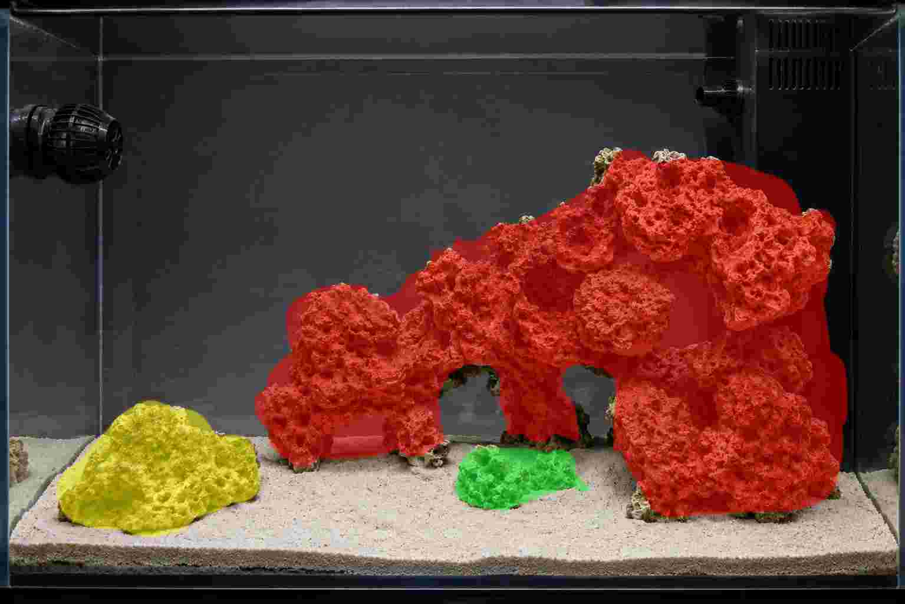

# Veril: espacial

> La [dimensión espacial](../fichas/dimensiones/dimension-espacial.md) define la organización funcional del display. Esta ficha concreta conjuntamente la estructura rocosa y el sustrato de Veril, porque ambos forman una única composición espacial.

## Criterio de composición

La composición combinará estructura rocosa, espacio negativo y sustrato libre para crear masas, refugios, superficies de crecimiento, una playa y un canal reconocibles. La geometría final podrá adaptarse a las piezas disponibles y a la superficie real del display, siempre que conserve estas relaciones funcionales y visuales.

## Estado de la decisión

**Adoptado:** La aplicación espacial de Veril reunirá roca y sustrato en una composición con masa principal posterior derecha, masa secundaria, islas, playa, canal y espacio negativo funcional.

**Previsto:** La geometría, la profundidad del sustrato y la distribución de las superficies se ajustarán conjuntamente después de disponer las piezas reales.

**Pendiente:** Aún deben comprobarse la estabilidad final, los apoyos, la accesibilidad, la profundidad real del sustrato y la conservación de las rutas, playas, canales y espacios negativos.

La formación rocosa tendrá su mayor altura y complejidad en la zona posterior derecha, junto al compartimento técnico, y descenderá y se fragmentará hacia el centro y la izquierda. Se organizará mediante:

- Una masa principal posterior derecha
- Una masa secundaria separada desde la zona abierta
- Islas independientes de menor volumen en la zona frontal o lateral
- Una playa y un canal visualmente reconocibles
- Espacios abiertos entre las masas

La composición no deberá convertirse en una montaña compacta ni en un conjunto de piezas dispersas sin relación visual.




Las imágenes son diagramas de la idea general y no deben calcarse. La capa de color ayuda a leer la estructura:

- **Rojo:** Masa principal, con la mayor altura y volumen
- **Amarillo:** Masa secundaria separada, que equilibra el volumen principal desde la zona abierta
- **Verde:** Islas separadas, de menor volumen y distribuidas en el espacio frontal o lateral

Los colores no representan especies, materiales, piezas concretas ni límites exactos. Esta ficha no fija medidas ni porcentajes.

## Geometría funcional

La estructura incorporará, según las piezas disponibles:

- Un refugio profundo
- Un paso atravesable
- Grietas comunicadas
- Voladizos y espacios inferiores
- Superficies horizontales e inclinadas
- Zonas expuestas y protegidas

La masa principal concentrará la mayor altura y descenderá hacia el centro mediante terrazas, volúmenes escalonados o una transición equivalente. No formará una pared maciza contra el cristal y deberá conservar profundidad visual, superficies diferenciadas y una relación clara con la zona abierta.

La masa secundaria quedará separada de la principal. Las islas serán fragmentos independientes, de menor presencia y distribuidos principalmente en la zona frontal o lateral.

La zona frontal conservará una playa amplia. El canal diagonal partirá del frontal centro-izquierdo y se dirigirá visualmente hacia la zona posterior. El canal no se definirá mediante una hilera continua de piedras, y las islas mantendrán sustrato libre a su alrededor.

La relación visual buscada será:

```text
sustrato → canal → hueco → fondo
```

## Sustrato integrado en la composición

El sustrato previsto es **Aquaforest AF Bio Sand**, con granulometría de referencia de **1–2 mm**. La información de composición, activación, preparación, límites y riesgos está documentada en la [ficha de AF Bio Sand](../fichas/productos/af-bio-sand.md).

La intención es mantener una profundidad general de **2–3 cm**. El formato de **7,5 kg** debería ser suficiente para la capa general y para una zona localizada algo más profunda. La profundidad final podrá adaptarse a la superficie libre que quede después de disponer la estructura. Puede contemplarse una zona localizada de **4–5 cm** si la configuración lo permite y resulta compatible con el procesamiento, el movimiento del agua y los organismos que finalmente se incorporen.

El sustrato no se utilizará como apoyo estructural de la roca. Deberá conservar la forma de la playa y del canal, mantenerse fuera de la zona técnica y evitar nubes persistentes, desplazamientos o acumulaciones que alteren la composición.

La playa conservará una superficie predominantemente libre y no se llenará con material innecesario. La superficie del sustrato deberá permanecer accesible para observación y mantenimiento.

## Material y selección de piezas

La roca será suministrada por el proveedor y se considera inerte. Su marca y composición mineral concreta no están identificadas; presenta una coloración violeta que simula visualmente una superficie con coralina.

La selección de las piezas dependerá de:

- Estabilidad y seguridad del apoyo
- Porosidad y volumen real
- Posibilidad de formar la composición prevista
- Ausencia de puntos de presión peligrosos sobre el vidrio
- Posibilidad de inspección, fijación y retirada

La relación entre superficie inicialmente inerte, colonización y maduración pertenece a la [dimensión de procesamiento](../fichas/dimensiones/dimension-procesamiento.md) y a la documentación de [biología](biologia.md). El sustrato y la roca se evaluarán como soportes y superficies concretas, no como una garantía automática de capacidad biológica.

## Estabilidad, acceso y mantenimiento

Los apoyos principales repartirán la carga y no dependerán de que el sustrato permanezca bajo ellos. Las piezas estructurales se fijarán entre sí cuando sea necesario y no crearán puntos de presión peligrosos sobre el vidrio.

La composición deberá ser estable y accesible desde las vistas principales, no solo desde el frente. También deberá permitir retirar o modificar piezas sin desmontar toda la estructura cuando la unión y la estabilidad lo permitan.

Antes de llenar el sistema se comprobará:

- Estabilidad de cada masa y de sus uniones
- Ausencia de desplazamientos durante la manipulación prevista
- Separación suficiente respecto a los cristales para su limpieza
- Conservación de entradas, retornos, sensores y accesos
- Ausencia de apoyos puntuales o contacto peligroso con el vidrio
- Profundidad y distribución del sustrato compatibles con la composición
- Playa, canal y espacios negativos reconocibles
- Acceso suficiente a las zonas previsibles de acumulación

La [dimensión de infraestructura](../fichas/dimensiones/dimension-infraestructura.md) establece los límites de la urna y del compartimento técnico. La [hidráulica](hidraulica.md) comprobará las rutas de flujo alrededor y debajo de las masas y la respuesta del sustrato. La [iluminación](iluminacion.md) comprobará la cobertura y los gradientes sobre las superficies. La [biología](biologia.md) documentará la colonización, la ocupación y el crecimiento.

## Evolución prevista

La composición se considera una organización espacial transitoria. La colonización y el crecimiento podrán modificar sombras, rugosidad, rutas hidráulicas y acceso. La evolución será aceptable mientras conserve:

- Estructura estable
- Playa, canal y espacio negativo funcionales
- Superficies y refugios accesibles en el grado necesario
- Rutas de flujo y elementos técnicos despejados
- Sustrato localizable y mantenible
- Reserva de espacio para el crecimiento previsible

Una modificación que altere estas condiciones se revisará conjuntamente con las fichas de hidráulica, iluminación, biología o infraestructura que correspondan.

## Fuentes de diseño

- [Display de la urna](../fichas/hardware/urna/display.md)
- [Técnica de la urna](../fichas/hardware/urna/tecnica.md)
- [Aquaforest: guía de productos y sustrato regular](https://aquaforest.eu/wp-content/uploads/2024/09/AF_Products-Guide_EN_WEB_241120.pdf)
